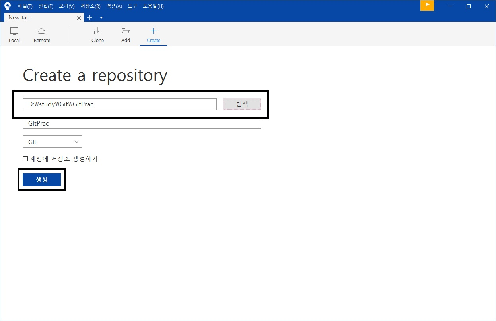
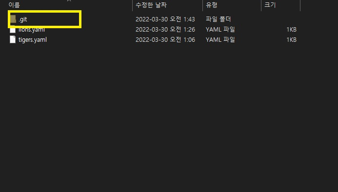

프로젝트 생성 & git관리 시작
===
- 적당한 위치에 원하는 이름의 폴더 생성 후 vscode로 열기
- 해당 폴더를 git이 관리하도록 하는 명령
  ```
  $ git init
  ```
- 해당 위치에 .git이라는 숨김폴더가 생성됨
- 생성된 폴더에서 에서 깃의 모든 관리를 함(실수로라도 절대 삭제하면 안됨)
- vscode로 열람중인 위치에 아래의 파일들을 생성
  - tigers.yaml
    ```yaml
    team: Tigers

    manager: John

    members:
    - Linda
    - William
    - David
    ```
  - lions.yaml
    ```yaml
    team: Lions

    manager: Mary

    members:
    - Thomas
    - Karen
    - Margaret
- 위 파일들을 생성 후 입력 아래의 명령 입력
  ```
  $ git status
  ```
  현재 폴더의 상황을 깃의 관점으로 보여 줌

소스 트리로 위의 내용 해보기
---
- 해당 폴더의 .git 삭제
- 소스트리를 열고 Create 클릭 후 깃을 생성할 폴더 선택후 생성
  
  
- 해당 폴더 위치에서 .git폴더 생성 확인