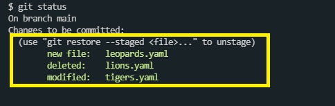

프로젝트의 변경사항들을 버전에 담기
---
- 파일 하나 담기
  ```
  $ git add tigers.yaml
  ```
- 모든 파일 담기
  ```
  $ git add .
  ```
- 파일 묻기(커밋, 새로운 버전으로 만듦)
  ```
  $ git commit
  ```
  commit시 vim으로 진입 -> 맨 윗줄에 FIST COMMIT입력 -> 저장 후 종료(:wq)
  
- 커밋 후 git status입력

  

  위와 같이 현재 깃의 관리파일들이 모두 사라진 것을 볼 수 있다.

- vim없이 바로 커밋 하기
  ```
  $ git commit -m "FIRST COMMIT"
  ```

다음 변경사항들 만들고 타임캡슐에 묻기
---
- 변경사항
  - lions.yaml 파일 삭제
  - tigers.yaml의 manager를 Donald로 변경
  - leopards.yaml 파일 추가
  
  - git status로 상태 확인
    <p></p>
    lion이 삭제되고, tiger가 수정되고, leopard가 추가된 것을 볼 수 있다.
- 변경사항 커밋 전체 저장
  ```
  $ git add .
  ```
- git status로 확인
  <p></p></p>
- 커밋 하기
  ```
  $ git commit -m "Replace Lions with Leopards"
  ```
- commit history 확인
  ```
  $ git log
  ```
  <p></p></p>
- sourcetree로도 확인이 가능하다
  <p></p></p>
- add와 commit을 한번에 진행하기
  ```
  $ git commit -am "메시지"
  ```
  ※ 단, 새로 추가된 파일 이 없을 경우 가능

다음 강의를 위한 준비
---
다음의 세 커밋들을 추가하세요.

- 첫 번째 추가 커밋
  - Tigers의 members에 George 추가
  - 커밋 메시지: Add George to Tigers
- 두 번째 추가 커밋
  - cheetas.yaml 추가
    ```
    team: Cheetas

    manager: Laura

    members:
    - Ryan
    - Anna
    - Justin
    ```
  - 커밋 메시지: Add team Cheetas

- 세 번째 추가 커밋
  - cheetas.yaml 삭제
  - Leopards의 manager를 Nora로 수정
  - panthers.yaml 추가
    ```
    team: Panthers

    manager: Sebastian

    members:
    - Violet
    - Stella
    - Anthony
    ```
  - 커밋 메시지: Replace Cheetas with Panthers

- sourceTree에서 현재 상태 확인
  