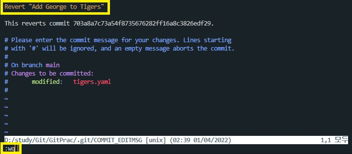

Git에서 과거로 돌아가는 두가지 방식
---
- reset : 원하는 시점으로 돌아간 뒤 이후 내역들을 지웁니다.
- revert : 되돌리기 원하는 시점의 커밋을 거꾸로 실행합니다.

※ 아래의 실습을 하기 전 .git파일 백업 해두기

reset 사용하기
---
- ```git log```를 사용하여 커밋 내역 확인
- 돌아가려는 커밋의 해시코드를 복사 후 명령어를 실행
  <p></p>

  ```
  $ git reset --hard "복사한 해시코드"
  ```
  입력
- 현재 커밋의 상태가 바뀌고 penthers.yaml파일이 사라진 것을 볼 수 있다.
  <p></p>
- First Commit상태로 돌아가기
- 백업 해둔 .git폴더를 현재 .git폴더에 덮어쓰고 ```git log```, 소스트리, ```git status```로 확인해보자
- .git폴더를 복구한 후 ```git reset --hard```만 입력을 하면 현재(복구한 .git폴더) 가장 최근 커밋상태(Replace Cheetas with Panthers)로 돌아가고 파일들이 복구된 것을 볼 수 있다.
  <p></p>
  ※ lions.yaml은 "Replace Cheetas with Panthers" 상태에선 없는 파일이고, "First Commit"에 돌아가면서 생긴 파일이기 때문에 삭제해줘도 상관 없다.

revert 사용하기
---
- reset은 되돌리기 이지만, revert는 해당 커밋을 취소하는 것이다.
- ```git log```로 커밋 해시코드 확인하기
  <p></p>
- revert명령어 입력
  ```
  git revert "해시코드"
  ```
- revert 입력 시 아래와 같은 ```git commit```을 할때와 같이 vim으로 진입을 하게 되는데 그냥 wq로 저장해서 나가주면 된다.
  <p></p>
- 이제 tigers.yaml을 확인해 보면 추가했던 George가 사라진 것을 볼 수 있다.
- 그리고 ```git log```를 해보면 새로운 커밋이 추가된 것을 볼 수 있다
  <p></p>
- 이제 "Replace Lions with Leopards"를 revert해보자 그러면 아래와 같은 에러가 발생한다.
  <p></p>
- 해당 커밋에선 tigers를 수정하고 leopard를 추가하고 lion을 삭제했는데, "Replace Cheetas with Panthers"에서 leopard파일을 수정한 내역이 있기 때문에 충돌이 발생한다.
- 그래서 위의 내용은 현재 revert는 계속되고 있고, leopards.yaml파일을 add(추가)를 하거나 rm(삭제)를 하고 "--continue"를 해야한다.
- leopards.yaml파일을 삭제하고 계속 진행해보자
  ```
  git rm leopards.yaml
  ```
  입력 후에 
  ```
  git revert --continue
  ```
  입력 하면 다시 vim상태가 되는데 wq를 입력하고 빠져나오자.
- ```git log```로 변경사항을 확인 해보자
- 다시 reset을 사용해서 revert하기 전인 "Replace Cheetas with Panthers"상태로 돌아가자.

커밋되지 않고 revert하기
---
- 리버트 후 다른 수정사항 까지 한번에 커밋할 경우 쓰임
  ```
  git revert --no--commit "해시코드"
  ```
- 다시 돌아올 경우
  ```
  git reset --hard
  ```
  입력해주면 다시 원상태로 돌아온다.
