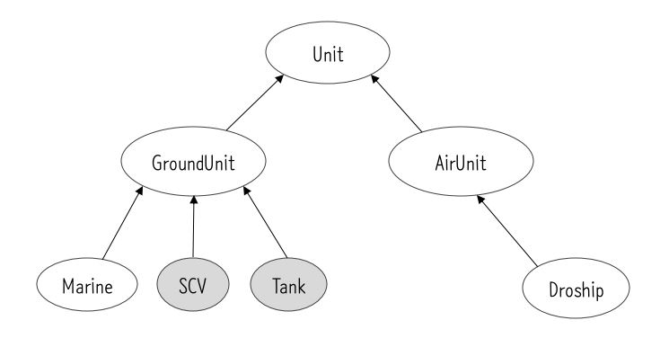

추상클래스(abstract class)
===
추상클래스란?
---
- 클래스를 설계도에 비유한다면, 추상클래스는 미완성 설계도이다.
- 미완성 메서드(추상메서드)를 포함하고 있다는 의미
- 추상클래스로 인스턴스는 생성할 수 없다.
- 상속을 통해 자손클래스에 의새허만 완성될 수 있따.
- 클래스명 앞에 abstract키워드를 붙임

```java
abstract class 클래스명 {
    code...
}
```
>추상메서드를 포함하고 있다는 것을 제외하고는 일반 클래스와 전혀 다르지 않다. 추상클래스에도 생성자가 있으며, 멤버변수와 메서드도 가질 수 있다.
>
>추상메서드를 포함하고 있지 않은 클래스에도 키워드 'abstract'를 붙여서 추상클래스로 지정할 수 있다. 추상메서드가 없는 완성된 클래스라 할지라도 추상클래스로 지정되면 인스턴스를 생성할 수 없다.

###### <br>
추상메서드(abstract method)
---
- 선언부만 작성하고 구현부는 작성하지 않은 메서드
- 주석을 덧붙여 어떤 기능을 수행할 목적으로 작성되었는지 알려주고, 실제 내용은 상속받은 클래스에서 구현.
- 추상메서드 역시 'abstract'키워드를 메서드명 앞에 붙여 주고, 추상메서드는 구현부가 없으므로 괄호{}대신 세미콜론';'을 적어준다.

```java
// 주석을 통해 어떤 기능을 수행할 목적으로 작성하였는지 설명
abstract 리턴타입 method();
```
>추상클래스로부터 상속받은 자손클래스는 오버라이딩을 통해 조상클래스의 추상메서드를 모두 구현해야 한다. 만일 조상으로부터 상속받은 추상메서드 중 하나라도 구현하지 않는다면, 동일하게 추상메서드로 지정해야 한다.

###### <br>
추상클래스의 작성
---
- 여러 클래스에 공통적으로 사용될 수 있는 클래스를 바로 작성
- 기존의 클래스의 공통적인 부분을 뽑아서 추상클래스로 만들어 상속

```
추상화 : 클래스간의 공통점을 찾아내서 공통의 조상으로 만드는 작업
구체화 : 상속을 통해 클래스를 구현, 확장하는 작업
```
```java
abstract class Player {
    boolean pause;
    int currentPos;

    Player() {
        pause = false;
        currentPos = 0;
    }
    /* 지정된 위치(pos)에서 재생을 시작하는 기능이 수행하도록 작성 */
    abstract void play(int pos);
    
    /* 재생을 즉시 멈추는 기능 */
    abstract void stop();

    void play() {
        paly(currentPos);       // 추상메서드 사용.
    }

    void pause() {
        if(pause) {             // pause가 true일 떄 (정지상태)에서 pause가 호출되면,
            pause = false;      // pause의 상태를 false로 바꾸고
            play(currentPos);   // 현재의 위치에서 play를 한다.
        } else {                // pause의 상태를 true로 바꾸고
            stop();             // play를 멈춘다.
        }
    }
}

class CDPlayer extends Player {
    void play(int currentPos) {
        /*조상의 추상메서드를 구현 */
    }
    
    void stop() {
        /* 추상메서드 구현 */
    }

    // CDPlayer클래스에 추가로 정의된 멤버
    int currentTrack
    
    void nextTrack() {
        currentTrack++;
        ...
    }

    void preTrack() {
        currentTrack--;
    }

    ... 
}
```
조상 클래스의 추상 메서드를 CDPlayer클래스의 기능에 맞게 완성해주고, CDPlayer만의 새로운 기능들을 추가하였다.

사실 Player클래스의 play(int pos)와 stop()을 추상메서드로 하는 대신, 아무 내용도 없는 일반 메서드로 작성할 수도 있었다. 그래도 굳이 abstract를 붙여서 추상 메서드로 선언하는 이유는 자손 클래스에서 추상메서드를 반드시 구현하도록  강요하기 위해서이다.

#### <br>
인터페이스(interface)
===
인터페이스란?
---
- 일종의 추상클래스
- 일반 메서드 또는 멤버변수를 구성원으로 가질 수 없다.
- 오직 추상메서드와 상수만을 멤버로 가질 수 있다.

###### <br>
인터페이스의 작성
---
인터페이스를 작성하는 것은 클래스와 동일하지만, class키워드 대신 interface를 사용한다.
```java
interface Name {
    public static final name = value;
    public abstract name(String value, int value); 
}
```
    - 모든 멤버변수는 public static final 이어야 하며, 이를 생략할 수 있다.
    - 모든 메서드는 public abstract 이어야 하며, 이를 생략할 수 있다.
        ※ 단, static메서드와 디폴트 메서드는 예외(JDK1.8부터)

###### <br>
인터페이스 상속
---
- 인터페이스는 인터페이스로부터만 상속받을 수 있다.
- 클래스와 달리 다중상속이 가능하다.
>인터페이스는 Object클래스와 같은 최고 조상이 없다.

```java
interface Movable() {
    void move(int x, int y);
}

interface Attackable() {
    void attack(Unit u);
}

interface Fightable extends Moveable, Attackable { }
```

###### <br>
인터페이스의 구현
---
- 인터페이스 자체로 인스턴스 생성 불가.
- class에 상속시 extends키워드가 아닌 implements 사용
```java
class 클래스명 implements 인터페이스명 {
    // 인터페이스에 정의된 추상메서드 구현
}

class Fighter implements Fighteable {
    public void move(int x, int y) { /* 내용 생략 */ }
    public void attack(Unit u) { /* 내용 생략 */ }
}
```
>만일 구현하는 인터페이스의 메서드 중 일부만 구현한다면, abstract를 붙여서 추상클래스로 선언해야 한다.

```java
class Fighter extends Unit implements Fightable {
    public void move(int x, int y) { }
    public void attack(Unit u) { }
}
```
이처럼 상속과 구현을 동시에 할 수도 있다.

###### <br>
인터페이스를 이용한 다형성
---
- 인터페이스 역시 이를 구현한 클래스의 조상이라 할 수 있으므로해당 인터페이스 타입의 참조변수로 이를 구현한 클래스의 인스턴스를 참조할 수 있다.
- 형변환도 가능

```java
Fightable f = (Fightable) new Fighter();
or
Fightable f = new Fighter();
```
인터페이스 Fightable을 클래스 Fighter가 구현헀을 때, 다음과 같이 Fighter인스턴스를 Fightable타입의 참조변수로 참조하는 것이 가능하다.

###### <br>
인터페이스의 장점
---

1. 개발시간 단축
   - 일단 인터페이스가 작성되면, 이를 사용해서 프로그램을 작성하는 것이 가능하다.
   - 다른 한 쪽에서는 인터페이스를 구현하는 클래스를 작성하게 하면, 인터페이스를 구현하는 클래스가 작성될 때까지 기다리지 않고 양쪽에서 동시에 개발이 가능하다.

2. 표준화 가능
   - 프로젝트에 사용되는 기본 틀을 인터페이스로 작성한 다음, 개발자들에게 인터페이스를 구현하여 프로그램을 작성하도록 함으로써 보다 일관되고 정형화된 프로그램 개발이 가능하다.

3. 서로 관계없는 클래스들에게 관계를 맺어줌
   - 서로 아무런 관계도 없는 클래스들에게 하나의 인터페이스르 공통적으로 구현하도록 함으로써 관계를 맺어 줄 수 있다.

4. 독립적인 프로그래밍이 가능
   - 인터페이스를 이요하면 클래스의 선언과 구현을 분리시켜 실제 구현에 독립적인 프로그램을 작성하는 것이 가능하다.

<p align="center">

</p>

>게임에 나오는 유닛을 클래스로 표현하고 이들의 관계를 상속계층도로 표현해 보았다.

SCV에게 Tank와 Dropship과 같은 기계화 유닛을 수리할 수 있는 기능을 제공하기 위해 repair메서드를 정의한다면 다음과 같을 것이다.

```java
void repair(Tank t) {
    // Tank 수리
}

void repair(Dropship d) {
    // Dropship 수리
}
```
이런식으로 수리가 가능한 유닛의 개수만큼 다른 버전의 오버로딩된 메서드를 정의해야 할 것이다.

이것을 피하기 위해 매개변수의 타입을 이들의 공통 조상으로 하면 좋겠지만 Dropship은 공통조상이 다르기 때문에 공통조상의 타입으로 메서드를 정의한다고 해도 최소한 2개의 메서드가 필요할 것이다.

```java
void repair(GroundUnit gu) {
    // 매개변수로 넘겨진 지상유닛(GroundUnit)을 수리
}

void repair(AirUnit au) {
    // 매개변수로 넘겨진 공중유닛(AirUnit)을 수리
}
```
이런식으로 매개변수로 넘겨 버리면 GroundUnit중 Marine과 같이 기계화 유닛이 아닌 클래스도 포함될 수 있다.

이 때 인터페이스를 이용하면 기존의 상속체계를 유지하며 기계화 유닛의 공통점을 부여할 수 있다.

```java
interface Repairadble { }

class SCV extends GroundUnit implements Repairable {
    // ...
}

class Tank extends GroundUnit implements Repairable {
    // ...
}

class Dropship extends AirUnit implements Repairable {
    // ...
}
```
이제 3개의 클래스에 같은 인터페이스를 구현했다는 공통점이 생겼다.

인터페이스에 Repairable에 정의된 것은 아무것도 없고, 단지 인스턴스의 타입체크에만 사용될 뿐이다.

그리고 repair메서드의 매개변수의 타입을 Repairable로 선언하면, 이 메서드의 매개변수로 Repairable 인터페이스를 구현한 클래스의 인스턴스만 받아들여질 것이다.

```java
void repair(Repairable r) {
    // 매개변수로 넘겨받은 유닛을 수리
}
```
앞으로 새로운 클래스가 추가도리 때, SCV의 repair메서드에 의해 수리가 가능하도록 하려면 Repairable 인터페이스를 구현하도록 하면 될 것이다.
```java
class RepairableTest {
    public static void main(String[] args) {
        Tank tank = new Tank();
        Dropship dropship = new Dropship();

        Marine marine = new Marine();
        SCV scv = new SCV();

        scv.repair(tank);   // SCV가 Tank를 수리
        scv.repair(dropship); // SCV가 dropship을 수리
    }
}

interface Repairable {}

class Unit {
    int hitPoint;
    final int MAX_HP;
    Unit(int hp) {
        MAX_HP = hp;
    }
    // ...
}

class GroundUnit extends Unit {
    GroundUnit (int hp) {
        super(hp);
    }
}
class AirUnit extends Unit {
    AirUnit (int hp) {
        super(hp);
    }
}

class Tank extends GroundUnit implements Repairable {
    Tank() {
        super(150);     // Tank의 HP는 150이다.
        hitPoint = MAX_HP;
    }

    public String toString() {
        return "Tank";
    }
}

class Dropship extends GroundUnit implements Repairable {
    Dropship() {
        super(125);     // Dropship의 HP는 125이다.
        hitPoint = MAX_HP;
    }

    public String toString() {
        return "Dropship";
    }
}

class Marine extends GroundUnit {
    Marine () {
        super(40);
        hitPoint = MAX_HP;
    }
}

class SCV extends GroundUnit implements Repairable {
    SCV() {
        super(60);
        hitPoint = MAX_HP;
    }

    void repair(Repairable r) {
        if(r instanceof Unit) {
            Unit u = (Unit)r;
            while(u.hitPoint != u.MAX_HP) {
                /* Unit의 HP를 증가시킨다 */
                u.hitPoint++;
            }
            System.out.println(u.toString() + "의 수리가 끝났습니다.");
        }
    }
}
```
실행결과

    Tank의 수리가 끝났습니다.
    Dropship의 수리가 끝났습니다.

repair메서드의 매개변수 r은 Repairable타입이기 때문에 인터페이스 Repairable에 정의된 멤버만 사용할 수 있다. 그러나 Repairable에는 정의된 멤버가 없으므로 이 타입의 참조변수로는 할 수 있는 일은 아무 것도 없다.

그래서 instanceof연산자로 타입을 체크한 뒤 캐스팅하여 Unit클래스에 정의된 hitPoint와 MAX_HP를 사용할 수 있도록 하였다.

###### <br>
인터페이스의 이해
---
- 클래스를 사용하는 쪽(User)과 클래스를 제공하는 쪽(Provider)이 있다.
- 메서드를 사용(호출)하는 쪽(User)에서는 사용하려는 메서드(Provider)의 선언부만 알면 된다.

```java
class A{
    public void methodA (B b) {
        b.methodB();
    }
}

class B{
    public void methodB() {
        System.out.println("methodB()");
    }
}

class InterfaceTest {
    public static void main(String[] args) {
        A a = new A();
        a.methodA(new B());
    }
}
```
예제의 두 클래스는 A를 작성하려면 B가 이미 있어야하고, B의 methodB()의 선언부가 변경되면, 이를 사용하는 A도 변경되어야 한다. 이와같이 직접적인 관계의 두 클래스는 한 쪽(Provider)이 변경되면 다른 한 쪽(User)도 변경되어야 한다는 단점이 있다.

그러나 인터페이스를 매개체로 해서 클래스A가 B의메서드에 접근하도록 하면, 클래스B에 변경사항이 생기거나 클래스B와 같은 기능의 다른 클래스로 대체되어도 클래스 A는 전혀 영향을 받지 않도록 하는 것이 가능하다.

```java
interface I {
    public abstract void methodB();
}
```
먼저 클래스B의 메서드를 추상메서드로 정의하는 인터페이스를 정의한 후 구현한다.
```java
class B implements I {
    public void methodB() {
        System.out.println("methodB in B class");
    }
}
```
이제 클래스 A는 B대신 인터페이스 I를 사용해서 작성할 수 있다.
```java
class A {
    public void mathodA(I i) {
        i.methodB();
    }
}

class InterfaceTest {
    public static void main(String[] args) {
        A a = new A();
        a.methodA(new B());
    }
}
```
결국 A는 여전히 클래스B의 메서드를 호출하지만, 클래스 A는 인터페이스 I하고만 직접적인 관계에 있기 때문에 클래스 B의 변경에 영향을 받지 않는다.

###### <br>
디폴트 메서드와 static메서드
---
JDK1.8부터 인터페이스에 디폴트 메서드와 static메서드도 추가할 수 있게 되었다.

static메서드는 인스턴스와 관계가 없는 독립적인 메서드이기 때문에 예전부터 추가하지 못할 이유가 없었다.

### 디폴트 메서드
일반 클래스에 메서드를 추가하는 것은 별일이 아니지만 인터페이스에 메서드를 추가하는 것은 해당 인터페이스를 상속한 모든 인터페이스나 클래스에게 새로 추가된 메서드를 구현해야 하는 매우 큰 작업이다.

아무리 설계를 잘 한다고 해도 언젠가는 변경은 발생하기 때문에 디폴트 메서드(default method)라는 것을 고안해 내었다.

디폴트 메서드는 추상메서드의 기본적인 구현을 제공하는 메서드로, 추상 메서드가 아니기 때문에 디폴트 메서드가 새로 추가되어도 해당 인터페이스를 구현한 클래스를 변경하지 않아도 된다.

메서드 앞에 default키워드를 붙이며, 추상메서드와 달리 몸통{ } 이 있어야 한다.

하지만, 새로 추가된 디폴트 메서드가 기존의 메서드와 이름이 중복되어 충돌하는 경우가 발생한다.

**충돌을 해결하기 위한 규칙**
1. 여러 인터페이스의 디폴트 메서드 간의 충돌
   - 인터페이스를 구현한 클래스에서 디폴트 메서드를 오버라이딩 한다.
2. 디폴트 메서드와 조상 클래스의 메서드 간의 충돌
   - 조상 클래스의 메서드가 상속되고, 디폴트 메서드는 무시된다.


#### <br>
내부 클래스
===
내부 클래스란?
---
클래스 내부에 선언된 클래스를 말한다.

**내부 클래스의 장점**
- 내부 클래스에서 외부 클래스(내부 클래스를 감싸고 있는 클래스)의 멤버들을 쉽게 접근할 수 있다.
- 코드의 복잡성을 줄일 수 있다.(캡슐화)

###### <br>
내부 클래스의 종류와 특징
---
내부 클래스는 마치 변수를 선언하는 것과 같은 위치에 선언할 수 있으며, 변수의 선언위치에 따라 인스턴스변수, 클래스변수(static변수), 지역변수로 구분되는 것과 같이 내부 클래스도 선언위치에 따라 다음과 같이 구분되어 진다.

|<center>내부 클래스</center>|<center>특   징</center>|
|:-|:-|
|인스턴스 클래스<br>(instance class)|외부 클래스의 멤버변수 선언위치에 선언하며, 외부 클래스의 인스턴스멤버 처럼 다루어진다.<br> 주로 외부 클래스의 인스턴스멤버들과 관련된 작업에 사용될 목적으로 사용된다.|
|스태틱 클래스<br>(static class)|외부 클래스의 멤버변수 선언 위치에 선언하며, 외부 클래스의 static멤버처럼 다루어진다.<br>주로 외부 클래스의 static멤버, 특히 static메서드에서 사용될 목적으로 선언된다.|
|지역 클래스<br>(local class)|외부 클래스의 메서드나 초기화블럭 안에 선언된 영역 내부에서만 사용될 수 있다.|
|익명 클래스<br>(anonymous class)|클래스의 선언과 객체의 생성을 동시에 하는 이름없는 클래스(일회용)

**내부 클래스의 선언**
```java
class Outer {
    class InstanceInner { }         // 인스턴스 클래스
    static class StaticInnar { }    // 스태틱 클래스

    void myMethod() {
        class LocalInner { }        // 지역 클래스
    }
}
```

###### <br>
내부 클래스의 제어자와 접근성
---
인스턴스클래스와 스태틱클래스는 외부 클래스의 멤버변수와 같은 위치에 선언되며, 또한 멤버변수와 같은 성지를 갖는다. 따라서 내부 클래스가 외부 클래스의 멤버와 같이 간주되고, 인스턴스멤버와 static멤버 간의 규칙이 내부 클래스에서도 똑같이 적용된다.

>abstract나 final과 같은 제어자를 사용할 수도 있고, 접근제어자도 사용이 가능하다.

내부 클래스 중에서 스태틱 클래스만 static멤버를 가질 수 있다. 드문 경우지만 내부 클래스에 static변수를 선언해야 한다면 스태틱 클래스로 선언해야 한다.

단, final과 static이 같이 붙은 변수는 상수이므로 모든 내부 클래스에서 사용이 가능하다.

**내부클래스에서 외부클래스의 변수들에 대한 접근성 예제**
```java
class InnerEx {
    private int outerIv = 0;
    static int outerCv = 0;

    class InstanceInner {
        int iiv = outerIv;      // 외부 클래스의 private멤버도 접근가능하다.
        int iiv2 = outerCv;
    }

    static class StaticInner {
        // 스태틱 클래스는 외부 클래스의 인스턴스멤버에 접근할 수 없다.
        // int siv = outerIv;   (x)
        static int scv = outerCv;
    }

    void myMethod() {
        int lv = 0;
        final int LV = 0;   // JDK1.8 부터 final 생략 가능

        class LocalInner {
            int liv = outerIv;  // 외부 클래스의 private멤버 접근 가능
            int liv2 = outerCv;
            // 외부 클래스의 지역변수는 final이 붙은 변수(상수) 만 접근 가능하다.
            // int liv3 = lv;       // 에러(JDK1.8 부터 에러 아님)
            int liv4 = LV;
        }
    }
}
```

**외부 클래스가 아닌 다른 클래스에서 내부클래스 생성 예제**
```java
class Outer {
    class InstanceInner {
        int iv = 100;
    }

    static class StaticInner {
        int iv = 200;
        static int cv = 300;
    }

    void myMethod() {
        class LocalInner {
            int iv = 400;
        }
    }
}

class InnerEx4 {
    public static void main(String[] args) {
        // 인스턴스클래스의 인스턴스를 생성하려면
        // 외부클래스의 인스턴스를 먼저 생성해야 한다.
        Outer oc = new Outer();
        Outer.InstanceInner ii = oc.new InstanceInner();

        System.out.println("ii.iv : " + ii.iv);
        System.out.println("Outer.StaticInner.cv : " + Outer.StaticInner.cv);
        
        //스태틱 내부 클래스의 인스턴스는 외부 클래스를 먼저 생성하지 않아도 된다.
        Outer.StaticInner si = new Outer.StaticInner();
        System.out.println("si.iv : " + si.iv);
    }
}
```
실행결과

    ii.iv : 100
    Outer.StaticInner : 300
    si.iv : 200

#### <br>
익명 클래스(anonymous class)
---
마지막으로 익명클래스는 클래스의 선언과 객체의 생성을 동시에 하기 때문에 단 한번만 사용될 수 있고 오직 하나의 객체만을 생성할 수 있는 일화용 클래스이다.
```java
new 조상클래스이름() {
    // 멤버 선언
}

new 구현인터페이스이름() {
    // 멤버 선언
}
```
이름이 없기 때문에 생성자도 가질 수 없으며, 조상클래스의 이름이나 구현하고자 하는 인터페이스의 이름을 사용해서 정의하기 때문에 하나의 클래스로 상속받는 동시에 인터페이스를 구현하거나 둘 이상의 인터페이스를 구현할 수 없다.

```java
class InnerEx {
    Object iv = new Object() { void method() { }};          // 익명 클래스
    static Object cv = new Object() { void method() { }};   // 익명 클래스

    void myMethod() {
        Object lv = new Object() { void method() { }};      // 익명 클래스
    }
}
```