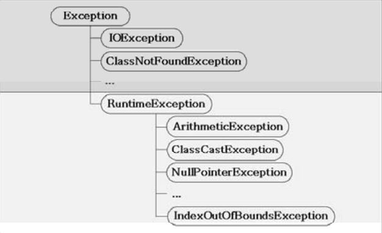

예외처리(exception handling)
===
프로그램 오류
---
- 프로그램이 실행 중 어떤 원인에 의해 오작동을 하거나 비정상적으로 종료되는 경우
- 발생시점에 따라 컴파일 에러(compile-time error)와 런타임 에러(runtime error)로 나눈다.
- 이 외에 의도한 것과 다르게 동작되는 것을 논리적 에러(logical error)라고 한다.
- 자바에서는 실행 시 발생할 수 있는 프로그램 오류를 '에러(error)'와 '예외(exception)', 두 가지로 구분하였다.
```
컴파일 에러 : 컴파일 시기에 발생하는 에러
런타임 에러 : 실행 시에 발생하는 에러
논리적 에러 : 실행은 되지만, 의도와 다르게 동작하는 것
```
```
에러(error)
메모리 부족(OutOfMemoryError)이나 스택오버플로우(StackOverflowError)와 같이 프로그램 코드에 의해서 수습될 수 없는 심각한 오류

예외(exception)
발생 하더라도 프로그램 코드에 의해서 수습될 수 있는 다소 미약한 오류
```

###### <br>
예외 클래스의 계층구조
---
- 모든 예외의 최고 조상은 Exception클래스이다.

**상속계층도 도식화**
<p align="center">

</p>

위 그림에서 볼 수 있듯이 예외 클래스들은 다음과 같이 두 그룹으로 나눠질 수 있다.
```
1. Exception클래스와 그 자손들(그림의 윗부분, RuntimeException과 자손들 제외)
2. RuntimeException클래스와 그 자손들(그림의 아랫부분)
```
>RuntimeException클래스들은 주로 프로그래머의 실수에 의해서 발생될 수 있는 예외들로 자바의 프로그래밍 요소들과 관계가 깊다.

>Exception클래스들은 주로 외부의 영향을 발생할 수 있는 것들로서, 프로그램의 사용자들의 동작에 의해 발생하는 경우가 많다.

###### <br>
예외처리 하기 try-catch문
---
예외처리(exception handling)의
- 정의 : 프로그램 실행 시 발생할 수 있는 예외에 대비한 코드를 작성하는 것
- 목적 : 프로그램의 비정상 종료를 막고, 정상적인 실행상태를 유지하는 것
>발생한 예외를 처리하지 못하면, 프로그램은 비정상적으로 종료되며, 처리되지 못한 예외(uncaught exception)는 JVM의 '예외처리기(UncaughtExceptionHandler)'가 받아서 예외의 원인을 화면에 출력한다.

**try-catch문**
```java
try {
    // 예외발생할 가능성이 있는 문장을 넣는다.
} catch (Exception1 e1) {
    // Exception1이 발생했을 경우, 이를 처리하기 위한 문장을 적는다.
} catch (Exception2 e2) {
    // Exception2가 발생했을 경우, 이를 처리하기 위한 문장을 적는다.
} catch (ExceptionN eN) {
    // ExceptionN가 발생했을 경우, 이를 처리하기 위한 문장을 적는다.
}
```
>하나의 try블럭 다음에는 여러 종류의 예외를 처리할 수 있도록 하나 이상의 catch블럭이 올 수 있으며, 이 중 발생한 예외의 종류와 일치하는 단 한 개의 catch블럭만 수행된다.

하나의 메서드 내에 여러개의 try-catch문이 사용될 수 있으며 try블럭 또는 catch블럭에 또다른 try-catch문이 포함될 수 있다.

```java
class ExceptionEx {
    public static void main(String[] arge) {
        int number = 100;
        int result = 0;

        for(int i = 0; i < 10; i++) {
            result = number / (int) (Math.random() * 10); // 7번째 라인
            System.out.println(result);
        }
    }
}
```
실행 결과

    20
    100
    java.lang.ArithmeticException: / by zero
        at ExceptionEx.main(ExceptionEx.java:7)

위의 예제는 변수 number에 저장되어 있는 값 100을 0~9사이의 임의의 정수로 나눈 결과를 출력하는 일을 10번 반복한다.
하지만 2번반복 후 에러가 발생 했는데, 결과에 나타난 메시지를 보면 예외의 발생원인과 위치를 알 수 있다.

예외 메시지를 보면 발생 예외는 'ArithmeticException'이고 이유는 정수를 0으로 나누려 했기 때문이다. 정수는 0으로 나누는 것을 금지되어 있다. 하지만 실수는 0으로 나누는 것이 금지되어 있지 않기 때문에 예외가 발생하지 않는다.

**예외 처리 코드**
```java
class ExceptionEx {
    public static void main(String[] arge) {
        int number = 100;
        int result = 0;

        for(int i = 0; i < 10; i++) {
            try {
                result = number / (int) (Math.random() * 10);
                System.out.println(result);
            } catch (ArithmeticException e) {
                System.out.println("0"); // 예외 발생시 실행되는 코드
            }
        
        }
    }
}
```

###### <br>
try-catch문에서의 흐름
---
- try블럭 내에서 예외가 발생한 경우
  1. 발생한 예외와 일치하는 catch블럭이 있는지 확인한다.
  2. 일치하는 catch블럭을 찾게 되면, 그 catch블럭 내의 문장들을 수행하고 전체 try-catch 문을 빠져나가서 그 다음 문장을 계속해서 수행한다. 만일 일치하는 catch블럭을 찾지 못하면, 예외는 처리되지 못한다.
- trye블럭 내에서 예외가 발생하지 않는 경우
  1. catch블럭을 거치지 않고 전체 try-catch문을 빠져나가서 수행을 계속한다.

```java
class ExceptionEx {
    System.out.println(1);
    System.out.println(2);
    try {
        System.out.println(3);
        System.out.println(4);
    } catch (Exception e) {
        System.out.println(5)
    }
    System.out.print(6);
}
```
실행결과

    1
    2
    3
    4
    6

위의 예외는 catch문이 실행되지 않기 때문에 5가 출력되지 않는다.

```java
class ExceptionEx {
    System.out.println(1);
    System.out.println(2);
    try {
        System.out.println(3);
        System.out.println(0/0);    // 고의로 ArithmeticException 발생
        System.out.println(4);
    } catch (Exception e) {
        System.out.println(5)
    }
    System.out.print(6);
}
```
실행결과

    1
    2
    3
    5
    6

위의 예제를 보면 1, 2, 3 을 출력한 후에 예외가 발생했기 때문에 4는 출력되지 않고 5, 6이 출력되었다.

try에서 예외가 발생하면, 예외가 발생한 위치 이후에 있는 try블럭의 문장들은 수행되지 않으므로, try블럭에 포함시킬 코드의 범위를 잘 선택해야 한다.

###### <br>
예외의 발생과 catch블럭
---
첫 번째 catch블럭부터 차례로 내려가면서 catch블럭의 괄호()내에 선언된 참조변수의 종류와 생성된 예외클래스의 인스턴스에 instanceof연산자를 이용해서 검사하게 되는데, 검사결과가 true인 catch블럭을 만날 때까지 검사는 계속된다.

검사 결과가 true인 catch블럭을 찾게 되면 블럭에 있는 문장들을 모두 수행한 후에 try-catch문을 빠져나가고 예외는 처리된다. 모든 예외 클래스는 Exception클래스의 자손이므로, catch블럭 괄호()에 Exception클래스 타입의 참조변수를 선언해 놓으면 어떤 종류의 예되가 발생하더라도 이 catch블럭에 의해 처리된다.

###### <br>
printStackTrace()와 getMessage()
---
- 예외 발생시 생성되는 예외 클래스의 인스턴스에는 발생한 예외에 대한 정보가 담겨있다.
- getMessage()와 printStackTrace()메서드를 통해 이 정보를 얻을 수 있다.
- catch블럭의 괄소()에 선언된 참조변수를 통해 이 인스턴스에 접근할 수 있다.
- 이 참조변수는 선언된 catch블럭 내에서만 사용이 가능하다.

```
- printStackTrace()
  예외 발생 당시의 호출스택(Call Stack)에 있었던 메서드의 정보와 예외 메시지를 화면에 출력한다.

- getMessage()
  발생한 예외클래스의 인스턴스에 저장된 메시지를 얻을 수 있다.
```

```java
class ExceptionEx {
    public static void main(String[] args) {
        System.out.println(1);
        System.out.println(2);
        try {
            System.out.println(3);
            System.out.println(0/0);
        } catch (ArithmeticException ae) {
            ae.printStackTrace();   // 참조변수를 통해 ArithmeticException인스턴스에 접근
            System.out.println("예외메시지 : " + ae.getMessage());
        }
        System.out.println(6);
    }
}
```
실행결과

    1
    2
    3
    java.lang.ArithmeticException: / by zero
        at ExceptionEx.main(ExceptionEx.java:7)
    예외메시지 : / by zero
    6

위의 예제 결과는 일반적으로 예외가 발생해 비정상적으로 종료되었을 때의 결과와 비슷하지만, 예외 메시지는 printStackTrace()와 getMessage()메서드에 의해 출력되었고, 예외는 try-catch문에 의해 처리되었으며 프로그램은 정상적으로 종료되었다.

이처럼 프로그램을 정상적으로 종료를 하는 동시에 예외의 발생원인을 알 수 있다.

###### <br>
멀티 catch블럭
---
- JDK1.7부터 여러 catch블럭에 '|'기호를 이용하여, 하나의 catch블럭으로 합칠 수 있게 되었다.
- 이를 멀티 catch블럭이라 한다.

```java
try {
    ...
} catch (ExceptionA | ExceptionB e) {
    e.printStackTrace();
}
```
만일 멀티 catch블럭으로 연결된 예외 클래스가 조상과 자손의 관계에 있다면 컴파일 에라가 발생한다.

###### <br>
예외 발생시키기
---
- throw키워드를 사용해서 프로그래머가 고의로 예외를 발생시킬 수 있다.

**예외 발생 방법**

    1. 먼저, 연산자 new를 이용해서 발생시키려는 예외 클래스의 객체를 생성
        Exception e = new Exception("고의로 발생");
    2. 키워드 throw를 이용해서 예외 발생
        throw e;

```java
class ExceptionEx {
    public static void main(String[] args) {
        try {
            throw new Exception("고의로 발생")  // 예외 발생
        } catch (Exception e) {
            System.out.println("에러메시지 : " + e.getMessage());
            e.printStackTrace();
        }
        System.out.println("프로그램 정상 종료");
    }
}
```
실행결과

    에러메시지 : 고의로 발생
    java.lang.Exception: 고의로 발생
        at ExceptionEx.main(ExceptionEx.java:3)
    프로그램 정상 종료

>인스턴스 생성시 생성자에 String을 넣어주면, 이 String이 Exception인스턴스에 메시지로 저장된다. 이 메시지는 getMessage()를 이용해서 얻을 수 있다.

###### <br>
메서드에 예외 선언하기
---
- 메서드의 선언부에 키워드 throws를 사용해서 메서드 내에서 발생할 수 있는 예외를 적어준다.
- 예외가 여러개일 경우 쉼표(,)로 구분한다.

```java
void method() throws Exception1, Exception2, ... ExceptionN {
    // code...
}
```

만일 모든예외의 최고조상인 Exception클래스를 메서드에 선언하면, 이 메서드는 모든 종류의 예외가 발생할 가능성이 있다는 뜻이다. 이렇게 예외를 선언하면, 이 예외뿐만 아니라 자손타입의 예외까지도 발생할 수 있다.

메서드의 선언부에 예외를 선언함으로써 메서드르 사용하려는 사람이 메서드의 선언부를 보았을 때, 이 메서드를 사용하기 위해서는 어떠한 예외들이 처리되어져야 하는지 쉽게 알 수 있다.

자바는 메서드를 작성할 때 메서드 내에서 발생할 가능성이 있는 예외를 메서드를 사용하는 쪽에서 이에 대한 처리를 강요한다.

###### <br>
finally블럭
---
- 예외의 발생여부에 상관없이 실행되어야 할 코드를 포함시킬 목적으로 사용
- try-catch문의 끝에 선택적으로 덧붙여 사용할 수 있다.
- try-catch-finally의 순서로 구성된다.

```java
try {
    // 예외가 발생할 가능성이 있는 문장
} catch (Exception e) {
    // 예외 처리를 위한 문장
} finally {
    // 예외 발생여부와 관게없이 항상 수행되어야 한느 문장
    // finally블럭은 try-catch문의 맨 마지막에 위치
}
```

```java
class FinallyTest {
    public static void main(String[] args) {
        try {
            startInstall();
            copyFiles();
            deleteTempFiles();      // 중복된 문장
        } catch (Exception e) {
            e.printStackTrace();
            deleteTempFiles();      // 중복된 문장
        }
    }

    static void startInstall() {    // 프로그램 설치에 필요한 준비를 하는 코드
        code ...
    }

    static void copyFiles() { }     // 파일을 복사하는 코드
    static void deleteTempFiles() { }   // 임시파일들을 삭제하는 코드
}
```
위 코드의 프로그램 설치에 사용된 임시파일을 삭제하는 메서드는 예외가 발생을 하던 하지 않던 실행 되는 코드이기 때문에 이런 중복되는 문장을 finally문에 써준다.
```java
try {
    startInstall();
    copyFiles();
} catch (Exception e) {
    e.printStackTrace();
} finally {
    deleteTempFiles();
}
```
try-catch-finally문을 사용해 중복된 코드를 finally문에 넣어줌으로써 코드가 간결해졌다.

```java
class FinallyTest {
    public static void main(String[] args) {
        FinallyTest.method1();
        System.out.println("method1() 의 수행을 마치고 main메서드로 돌아왔습니다.");
    }

    static void method1() {
        try {
            System.out.println("method1()이 호출되었습니다.");
            return;     // 현재 실행 중인 메서드를 종료
        } catch (Exception e) {
            e.printStackTrace();
        } finally {
            System.out.println("method1()의 finally블럭이 실행되었습니다.");
        }
    }
}
```
실행결과

    method1()이 호출되었습니다.
    method1()의 finally블럭이 실행되었습니다.
    method1()의 수행을 마치고 main메서드로 돌아왔습니다.

위의 결과를 보면 try블럭의 return문이 실행되는 경우에도 finally블럭의 문장들이 먼저 실행된 후에, 현재 실행중인 메서드를 종료한다.

이와 마찬가지로 catch블럭의 문장 수행중에 return문을 만나도 finally블럭의 문장들은 수행된다.

###### <br>
자동 자원 반환 - try-with-resources문
---
- JDK1.7부터 try-with-resources문이라는 try-catch문의 변형이 새로 추가되었다.
- 이 구문은 주로 입출력(I/O)과 관련이 많다.
- 주로 입출력에 사용되는 클래스 중에서는 사용한 후에 꼭 닫아 줘야 하는 것들이 있다. 그래야 사용했던 자원(resources)이 반환되기 때문이다.

```java
try {
    fis = new FileInputStream("score.dat");
    dis = new DataInputStream(fis);
} catch (IOException ie) {
    ie.printStackTrace();
} finally {
    try {
        if(dis != null)
            dis.close();
    } catch(IOException ie) {
        ie.printStackTrace();
    }
}
```
위의 코드는 DataInputStream을 사용해서 파일로부터 데이터를 읽는 코드인데, 데이터를 읽는 도중에 예외가 발생하더라도 DataInputStream이 닫히도록 finally블럭 안에 close()를 넣었다. 하지만 close()도 예외를 발생시킬 수 있기 때문에 finally블럭 안쪽에도 try-catch를 해주었다.

이럴경우 try-with-resource문을 사용한다.
```java
try(FileInputStream fis = new FileInputStream("score.dat");
    DataInputStream dis = new DataInputStream(fis)) {
        while(true) {
            score = dis.readInt();
            System.out.println(score);
            sum += score;
        }
    } catch (EOFException ie) {
        System.out.println("점수의 총합은 " + sum + "입니다.");
        ie.printStackTrace();
    }
```
try-with-resources문의 괄호()안에 객체를 생성하는 문장을 넣으면, 이 객체는 따로 close()를 호출하지 않아도 try블럭을 벗어나는 순간 자동적으로 close()가 호출된다.
그 다음에 catch블럭 또는 finally블럭이 수행된다.

>try블럭의 괄호()안에 변수를 선언하는 것도 가능하며, 선언된 변수는 try블럭 내에서만 사용할 수 있다.  
>괄호() 안에 두 문장 이상 넣을 경우 ';'로 구분한다.

이처럼 try-with-resources문에 의해 자동으로 객체를 close()가 호출될 수 있으려면, 클래스가 AutoCloseable이라는 인터페이스를 구현한 것이어야만 한다.
```java
public interface AutoCloseable {
    void close() throws Exception;
}
```

###### <br>
사용자 정의 예외 만들기
---
- 필요에 따라 프로그래머가 새로운 예외 클래스를 정의하여 사용할 수 있다.
- 보통 Exception클래스 또는 RuntimeExcpetion클래스로부터 상속받아 클래스를 만들지만, 필요에 따라서 알맞은 예외 클래스를 선택할 수 있다.

```java
class MyException extends Exception {
    MyException(String msg) {   // 문자열을 매개변수로 맏는 생성자
        super(msg); // 조상인 Exception클래스의 생성자 호출
    }
}
```

기존의 예외 클래스는 주로 Exception을 상속받아서 'checked예외'로 작성하는 경우가 많았지만, 요즘은 예외처리를 선택적으로 할 수 있도록 RuntimeException을 상속받아서 작성하는 쪽으로 바뀌어가고 있다. 'checked예외'는 반드시 예외처리를 해주어야 하기 때문에 예외처리가 불필요한 경우에도 try-catch문을 넣어서 코드가 복잡해지기 때문이다.

###### <br>
예외 던지기(exception re-throwing)
---
한 메서드에서 발생할 수 있는 예외가 여럿인 경우, 몇 개는 try-catch문을 통해서 메서드 내에서 자체적으로 처리하고, 나머지는 선언부에 지정하여 호출한 메서드에서 처리하도록 함으로써, 양쪽에서 나눠서 처리되도록 할 수 있다.

심지어는 단 하나의 예외에 대해서도 예외가 발생한 메서드와 호출한 메서드, 양쪽에서 처리하도록 할 수 있다.

**예외 던지기 처리 순서**

    1. 예외가 발생할 가능성이 있는 메서드에서 try-catch문을 사용해서 예외를 처리해 준다.
    2. catch문에서 필요한 작업을 행한 후에 throw문을 사용해서 예외를 다시 발생시킨다.
    3. 다시 발생한 예외는 이 메서드를 호출한 메서드에게 전달되고 호출한 메서드의 try-catch문에서 예외를 또 다시 처리한다.

이 방법은 하나의 예외에 대해서 예외가 발생한 메서드와 이를 호출한 메서드 양쪽 모두에서 처리해줘야 할 작업이 있을 때 사용된다. 이 때 주의할 점은 예외가 발생할 메서드에서는 try-catch문을 사용해서 예외처리를 해줌과 동시에 메서드의 선언부에 발생할 예외를 throws에 지정해줘야 한다는 것이다.

```java
class ExceptionEx {
    public static void main(String[] args) {
        try {
            method1();
        } catch (Exception e) {
            System.out.println("main메서드에서 예외가 처리되었습니다.");
        }
    }

    static void method1() throws Exception {
        try {
            throw new Exception();
        } catch (Exception e) {
            System.out.println("method1메서드에서 예외가 처리되었습니다.");
            throw e;  // 예외 다시 발생
        }
    }
}
```
실행결과

    method1메서드에서 예외가 처리되었습니다.
    main메서드에서 예외가 처리되었습니다.

method1()과 main메서드 양쪽의 catch블럭이 모두 수행되었음을 알 수 있다.

반환값이 있는 return문의 경우, catch블럭에도 return문이 있어야 한다. 예외가 발생했을 경우에도 값을 반환해야 하기 때문이다.

###### <br>
연결된 예외(chained exception)
---
- 한 예외가 다른 예외를 발생시킬 수도 있다.
- A가 예외B를 발생시켰다면, A를 B의 '원인 예외(cause exception)'라고 한다.
```java
try {
    startInstall();     // spaceException 발생
    copyFiles();
} catch (SpaceException e) {
    InstallException ie = new InstallException("설치중 예외발생"); // 예외 생성
    ie.initCause(e);    // InstallException의 원인 예외를 SpaceException으로 지정
    throw ie;           // InstallException을 발생시킨다.
} catch(MemoryException me) {
    code...
}
```
InstallException을 생성한 후에. initCause()로 SpaceException을 InstallException의 원인 예외로 등록한다. 그리고 throw로 예외를 실행시킨다.

initCause()는 Exception클래스의 조상인 Throwable클래스에 정의되어 있기 때문에 모든 예외에서 사용가능하다.

    Throwable initCause(Throwable cause)    지정한 예외를 원인 예외로 등록
    Throwable getCause()                    원인 예외를 반환

발생한 예외를 그냥 처리하면 되지만, 원인 예외로 등록해서 다시 예외를 발생시키는 이유는 여러가지 예외를 하나의 큰 분류의 예외로 묶어서 다루기 위해서이다.

또 다른 이유는 checked예외를 unchecked예외로 바꿀 수 있도록 하기 위해서이다.
checked예외로 예외처리를 강제한 이유는 프로그래밍 경험이 적은 사람도 보다 견고한 프로그램을 작성할 수 있도록 유도하기 위한 것이다.

**예제**
```java
class ChainedExceptionEx {
    public static void main(String[] args) {
        try {
            install();
        } catch(InstallException e) {
            e.printStackTrace();
        } catch(Exception e) {
            e.printStackTrace();
        }
    }

    static void install() throws InstallException {
        try {
            startInstall();     // 프로그램 설치에 필요한 준비를 한다.
            copyFiles();        // 파일들을 복사한다.
        } catch (SpaceException se) {
            InstallException ie = new InstallException("설치 중 예외발생");
            ie.initCause(se);
            throw ie;
        } catch (MemoryException me) {
            InstallException ie = new InstallException("설치 중 예외발생");
            ie.initCause(me);
            throw ie;
        } finally {
            deleteTempFiles();  // 프로그램 설치에 사용된 임시파일 제거
        }
    }
    
    static void startInstall() throws SpaceException, MemoryException {
        if(!enoughSpace()) {    // 충분한 설치 공간이 없으면...
            throw new SpaceException("설치할 공간이 부족합니다.");
        }

        if(!enoughMemory()) {   // 충분한 메모리가 없으면...
            throw new MemoryException("메모리가 부족합니다.");
            throw new RuntimeException(new MemoryException("메모리가 부족합니다."));
        }
    }

    static void copyFiles() { /* 파일을 복사하는 코드 */}
    static void deleteTempFiles() {/* 임시파일들을 삭제하는 코드 */}

    static boolean enoughSpace() {
        // 설치하는데 필요한 공간이 있는지 확인하는 코드
        return false;
    }

    static boolean enoughMemory() {
        // 설치하는데 필요한 메모리공간이 있는지 확인하는 코드
        return true;
    }
}

class InstallException extends Exception {
    InstallException(String msg) {
        super(msg);
    }
}

class SpaceException extends Exception {
    SpaceException(String msg) {
        super(msg);
    }
}

class MemoryException extends Exception {
    MemoryException(String msg) {
        super(msg);
    }
}
```
실행결과

    InstallException: 설치 중 예외 발생
        at ChainedExceptionEx.install(ChainedExceptionEx.java:17)
        at ChainedExceptionEx.main(ChainedExceptionEx.java:4)
    Caused by: SpaceException: 설치할 공간이 부족합니다.
        at ChainedExceptionEx.startInstall(ChainedExceptionEx.java:31)
        at ChainedExceptionEx.install(ChainedExceptionEx.java:14)
        ... 1 more
