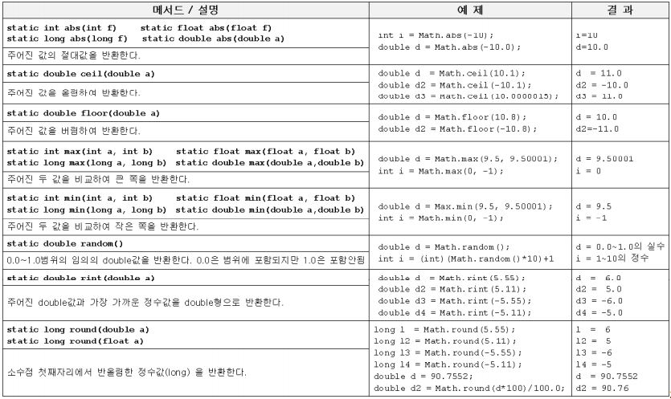
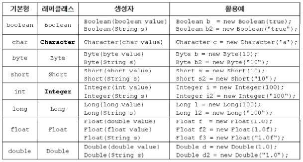
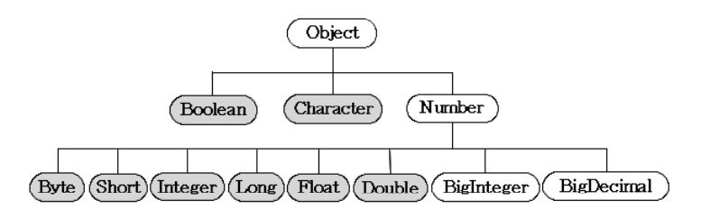

Math클래스
---
- 기본적인 수학계산에 유용한 메서드로 구성
- Math클래스의 메서드는 모두 static이며, 2개의 상수만 정의해 놓았다.
```java
public static final double E = 2.7182818284590452354;
public static final double PI = 3.14159265358979323846;
```

### **올림, 버림, 반올림**
```java
import static java.lang.Math.*;
import static java.lang.System.*;

class MathEx {
    public static void main(String[] args){
        double val = 90.7552;
        out.println("round(" + val + ")=" + round(val));    // 반올림

        val *= 100;
        out.println("round(" + val + ")=" + round(val));    // 반올림

        out.println("round(" + val + ")/100 =" + round(val)/100);    // 반올림
        out.println("round(" + val + ")/100.0 =" + round(val)/100.0);// 반올림
        out.println();
        out.printf("ceil(%3.1f)=%3.1f%n", 1.1, ceil(1.1));      // 올림
        out.printf("floor(%3.1f)=%3.1f%n", 1.5, floor(1.5));    // 버림
        out.printf("round(%3.1f)=%d%n", 1.1, round(1.1));       // 반올림
        out.printf("round(%3.1f)=%d%n", 1.5, round(1.5));       // 반올림
        out.printf("rint(%3.1f)=%f%n", 1.5, rint(1.5));         // 반올림
        out.printf("round(%3.1f)=%d%n", -1.5, round(-1.5));     // 반올림
        out.printf("rint(%3.1f)=%f%n", -1.5, rint(-1.5));       // 반올림
        out.printf("ceil(%3.1f)=%f%n", -1.5, ceil(-1.5));       // 올림
        out.printf("floor(%3.1f)=%f%n", -1.5, floor(-1.5));     // 버림
    }
}
```
실행결과

    ceil(1.1)=2.0
    floor(1.5)=1.0
    round(1.1)=1
    round(1.5)=2
    rint(1.5)=2.000000
    round(-1.5)=-1
    rint(-1.5)=-2.000000
    ceil(-1.5)=-1.000000
    floor(-1.5)=-2.000000

<br>

### **예외를 발생시키는 메서드**
- 메서드 이름에 'Exact'가 포함된 메서드들
- JDK1.8부터 새로 추가
- 정수형간의 연산에서 발생할 수 있는 오버를로우(overflow)를 감시하기 위한 것

```java
int addExact(int x, int y)      // x + y
int subtractExact(int x, int y) // x - y
int multiplyExact(int x, int y) // x * y
int incrementExact(int a)       // a++
int decrementExact(int a)       // a--
int negateExact(int a)          // -a
int toIntExact(long value)      // (int)value - int로의 형변환
```
위의 메서드 들은 결과를 반환하고, 오버플로우가 발생하면 예외(ArithmeticException)를 발생시킨다.

<br>

### **삼각함수와 지수, 로그**
```java
import static java.lang.Math.*;
import static java.lang.System.out;

class MathEx {
    public static void main(String[] args) {
        int x1 = 1, y1 = 1; // (1,1)
        int x2 = 2, y2 = 2; // (2,2)

        double c = sqrt(pow(x2 - x1, 2) + pow(y2 - y1, 2));
        double a = c * sin(PI / 4);
        double b = c * cos(PI / 4);
        // double b = c * cos(toRadians(45));

        out.printf("a=%f%n", a);
        out.printf("b=%f%n", b);
        out.printf("c=%f%n", c);
        out.printf("angle=%f rad%n", atan2(a, b));
        out.printf("angle=%f degree%n", atan2(a, b) * 180 / PI);
        out.printf("angle=%f degree%n", toDegrees(atan2(a, b)));
        out.printf("24 * log10(2)=%f%n", 24 * log10(2));
        out.printf("53 * log10(2)=%f%n%n", 53 * log10(2));
    }
}
```
실행결과

    a=1.000000
    b=1.000000
    c=1.414214
    angle=0.785398 rad
    angle=45.000000 degree
    angle=45.000000 degree

    24 * log10(2)=7.224720
    53 * log10(2)=15.954590

<br>

### **StrictMath클래스**
- Math클래스는 최대한의 성능을 얻기 위해 JVM이 설치된 OS의 메서드를 호출해서 사용한다.
- 부동소수점 계산의 경우, 반올림의 처리방법 설정이 OS마다 다를 수 있기 때문에 컴퓨터마다 결과가 다를 수 있다.
- 이러한 차이를 없애기 위해 성능은 다소 포기하는 대신, 어떤 OS에서 실행되어도 항상 같은 결과를 얻도록 Math클래스를 새로 작성한 것이 StrictMath클래스이다.

<br>

### **Math클래스의 메서드**
자주 쓰이는 메서드

<p align="center">

</p>

<br>

### **래퍼(wrapper) 클래스**
- 자바는 8개의 기본형을 객체로 다루지 않는데 이것 때문에 자바가 완전한 객체지향 언어가 아니라는 얘기를 듣는다.
- 때로는 매개변수로 객체를 요구할 때, 기본형 값이 아닌 객체로 저장해야할 때, 객체간의 비교가 필요할 때 등등 기본형 값들을 객체로 변환하여 작업을 수행해야 할때 래퍼(wrapper)클래스를 사용한다.

**래퍼 클래스**
<p align="center">

</p>

<br>

### **Number클래스**
- 이 클래스는 추상클래스로 내부적으로 숫자를 멤버변수로 갖는 랩퍼 클래스들의 조상이다.
- 기본형 중에서 숫자와 관련된 래퍼 클래스들은 모두 Number클래스의 자손이다.

**래퍼 클래스의 상속계층도**

<p align="center">

</p>

그 외에도 BigInteger는 long으로도 다룰 수 없는 큰 범위의 정수를, BigDecimal은 double로도 다룰 수 없는 큰 범위의 부동소수를 처리하기 위한 것으로 연산자의 역할을 대신하는 다양한 메서드를 제공한다.

**Number클래스의 실제 소스**
```java
public abstract class implements java.io.Serializable {
    public abstract int     intValue();
    public abstract long    longValue();
    public abstract float   floatValue();
    public abstract double  doubleValue();

    public byte byteValue() {
        return (byte)intValue();
    }

    public short shortValue() {
        return (short)intValue();
    }
}
```
>객체가 가지고 있는 값을 숫자와 관련된 기본형으로 변환하여 반환하는 메서드를 정의하고 있다.

<br>

### **문자열을 숫자로 변환하기**
```java
int     i1 = new Integer("100").intvalue(); // floatValue(), longValue(), ...
int     i2 = Integer.parseInt("100");       // 주로 이 방법을 사용.
Integer i3 = Integer.valueOf("100");
```
문자열 → 기본형
```java
byte    b = Byte.parseByte("100");
short   s = Short.parseShort("100");
int     i = Integer.parseInt("100");
long    l = Long.parseLong("100");
float   f = Float.parseFloat("3.14");
double  d = Double.parseDouble("3.14");
```
문자열 → 래퍼 클래스
```java
byte    b = Byte.valueOf("100");
short   s = Short.valueOf("100");
int     i = Integer.valueOf("100");
long    l = Long.pvalueOf("100");
float   f = Float.valueOf("3.14");
double  d = Double.valueOf("3.14");
```

>JDK1.5부터 도입된 '오토박싱(autoboxing)'기능 떄문에 반환값이 기본형일 때와 래퍼 클래스일 때가 차이가 없어졌다. 그래서 그냥 구별없이 valueOf()를 쓰는 것도 괜찮은 방법이다.  
단, 성능은 valueOf()가 조금 더 느리다.

<br>

### **오토박싱 & 언박싱(autoboxing & unboxing)**
JDK1.5이전에는 기본형과 참조형 간의 연산이 불가능했기 떄문에, 래퍼 클래스로 기본형을 객체로 만들어서 연산해야 했다.

이제는 기본형과 참조형 간의 덧셈이 가능하다.

자바언어의 규칙이 바뀐 것은 아니고, 컴파일러가 자동으로 변환하는 코드를 넣어주기 때문이다.

이 외에도 내부적으로 객체 배열을 가지고 있는 Vector클래스나 ArrayList클래스에 기본형 값을 저장해야할 때도 컴파일러가 자동적으로 코드를 추가해 준다.

기본형 값을 래퍼클래스의 객체로 자동 변환해주는 것을 '**오토박싱(autoboxing)**'이라 하고, 반대로 변환하는 것을 '**언박싱(unboxing)**'이라고 한다.

```java
class MathEx {
    public static void main(String[] args) {
        int i = 10;

        // 기본형을 참조형으로 형변환(형변환 생략가능)
        Integer intg = (Integer) i; // Integer intg = Integer.valueOf(i);
        Object obj = (Object) i; // Object obj = (Object)Integer.valueOf();

        Long lng = 100L; // Long lng = new Long(100L);

        int i2 = intg + 10; // 참조형과 기본형간의 연산 가능
        long l = intg + lng; // 참조형 간의 덧셈도 가능

        Integer intg2 = new Integer(20);
        int i3 = (int) intg2; // 참조형 기본형으로 형변환도 가능(형변환 생략가능)

        Integer intg3 = intg2 + i3;

        System.out.println("i = " + i);
        System.out.println("intg = " + intg);
        System.out.println("obj = " + obj);
        System.out.println("lng = " + lng);
        System.out.println("intg + 10 = " + i2);
        System.out.println("intg + lng = " + l);
        System.out.println("intg2 = " + intg2);
        System.out.println("i3 = " + i3);
        System.out.println("intg2 + i3 = " + intg3);
    }
}
```
실행결과

    i = 10
    intg = 10
    obj = 10
    lng = 100
    intg + 10 = 20
    intg + lng = 110
    intg2 = 20
    i3 = 20
    intg2 + i3 = 40

오토박싱(autoboxing)을 이용해서 기본형과 참조형 간의 형변환과 연산을 수행하는 예를 보여준다.

기본형과 참조형 간의 형변환도 가능하고, 참조형 간의 연산도 가능하다.