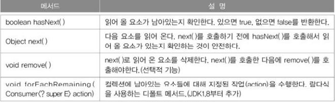
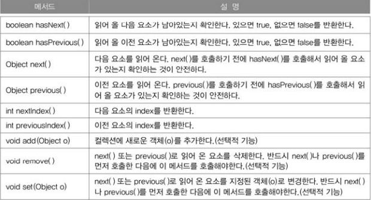
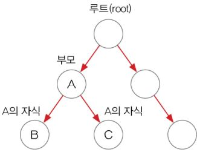
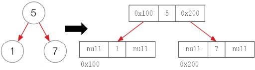
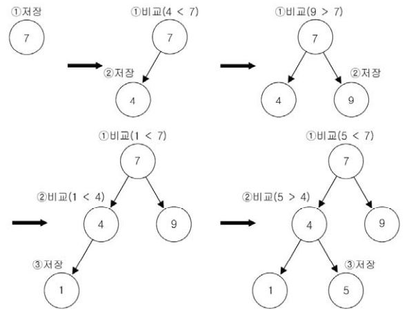
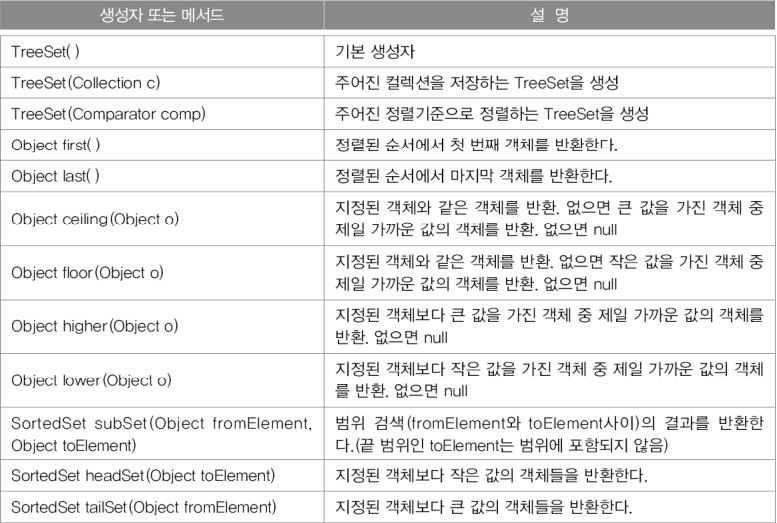

Iterator, ListIterator, Enumeration
---
- Iterator, ListIterator, Enumeration은 모두 컬렉션에 저장된 요소를 접근하는데 사용되는 인터페이스이다.
- Enumeration은 Iterator의 구버전
- ListIterator는 Iterator의 신버전

### **Iterator**
컬렉션에 저장된 각 요소에 접근하는 기능을 가진 Iterator인터페이스를 정의하고, Collection인터페이스에는 'Iterator(Iterator를 구현한 클래스의 인스턴스)'를 반환하는 iterator()를 정의하고 있다.

```java
public interface Iterator {
    boolean hasNext();
    Object next();
    void remove();
}

public interface Collection {
    ...
    public Iterator iterator();
    ...
}
```

interator()는 Collection인터페이스에 정의된 메서드이므로 Collection인터페이스의 자손인 List와 Set에도 포함되어 있다. 컬렉션 클래스에 대해 iterator()를 호출하여 Iterator를 얻은 다음 반복문, 주로 while문을 사용해서 컬렉션 클래스의 요소들을 읽어 올 수 있다.

|<center>메서드</center>|<center>설명</center>|
|:-|:-|
|boolean hasNext()|읽어 올 요소가 남아있는지 확인한다. 있으면 true, 없으면 false를 반환한다.|
|Object next()|다음 요소를 읽어 온다. next()를 호출하기 전에 hasNext()를 호출해서 읽어올 요소가 있는지 확인하는 것이 안전하다.|
|void remove()|next()로 읽어 온 요소를 삭제한다. next()를 호출한 다음에 remove()를 호출해야 한다.(선택정 기능)|

**Collection인터페이스를 구현한 컬렉션 클래스를 Iterator로 변환 및 출력**
```java
Collection c = new ArrayList();  // 다른 컬렉션으로 변경시 이 부분만 고치면 된다.
Iterator it = c.iterator();

while(it.hasNext()) {
    System.out.println(it.next());
}
```

Map인터페이스의 경우 키(Key)와 값(Value)을 쌍(pair)으로 저장하고 있기 때문에 iterator()를 직접 호출할 수 없고, 그 대신 keySet()이나 entrySet()과 같은 메서드를 통해 키와 값을 각각 따로 Set의 형태로 얻어 온 후에 다시 iterator()를 호출해야 Iterator를 얻을 수 있다.
```java
Map map = new HashMap();
Iterator it = map.enterySet().iterator();
```

**iterator활용 예제**
```java
import java.util.*;

class IteratorEx {
    public static void main(String[] args) {
        ArrayList list = new ArrayList();
        list.add("1");
        list.add("2");
        list.add("3");
        list.add("4");
        list.add("5");

        Iterator = it = list.iterator();

        while(it.hasNext()){
            Object obj = it.next();
            System.out.println(obj);
        }
    }
}
```
실행결과

    1
    2
    3
    4
    5

>List클래스들은 저장순서를 유지하기 때문에 읽어온 결과가 저장 순서와 동일하지만, Set클래스들은 요소간의 순서가 유지되지 않기 때문에 Iterator를 이용해서 저장된 요소들을 읽어 와도 처음에 저장된 순서와 같지 않다.

<br>

### **ListIterator와 Enumeration**
- Enumeration은 컬렉션 프레임웍이 만들어지기 이전에 사용하던 것.
- ListIterator는 Iterator를 상속받아서 기능을 추가한 것으로, 컬렉션의 요소에 접근할 때 Iterator는 단방향으로만 이동할 수 있지만, ListIterator는 양방향으로 이동이 가능하다. 단, List인터페이스를 구현한 컬렉션에서만 가능하다.

- **Iterator인터페이스의 메서드**
<p align="center">

</p>

- **ListIterator의 메서드**
<p align="center">

</p>

```java
import java.util;

class ListIteratorEx {
    public static void main(String[] args) {
        ArrayList list = new ArrayList();
        list.add("1");
        list.add("2");
        list.add("3");
        list.add("4");
        list.add("5");

        ListIterator it = list.listIterator();

        while(it.hasNext()) {
            System.out.print(it.next()); // 순방향으로 진행하면서 읽어온다.
        }
        System.out.println();
        while(it.hasPrevious()) {
            System.out.print(it.previous()); // 역방향으로 진행하면서 읽어온다.
        }
        System.out.println();
    }
}
```
실행결과

    12345
    54321

단방향으로만 이동하는 Iterator과는 달리 ListIterator는 양방향으로 이동하기 때문에 각 요소간의 이동이 자유롭다. 다만 이동하기 전에 반드시 hasNext()나 hasPrevious()를 호출해서 이동할 수 있는지 확인해야 한다.

ListIterator의 메서드 중 '선택정 기능(optional Operation)'이라고 표시된 것들은 반드시 구현하지 않아도 된다. 그렇다하더라도 인터페이스로부터 상속받는 메서드는 추상메서드라 메서드의 몸통(body)을 반듯이 만들어 주어야 하므로 단순히 ```public void remove(){};```와 같이 구현하는 것 보다
```java
public void remove() {
    throw new UnsupportedOperationExption();
}
```
이처럼 예외를 던져서 구현하지 않는 기능이라는 것을 메서드를 호출하는 쪽에 알리는 것이 좋다.

**remove()메서드 활용 예제**
```java
package day_22_01_21;

import java.util.*;

public class IteratorEx {
    public static void main(String[] args) {
        ArrayList original = new ArrayList();
        ArrayList copy1 = new ArrayList();
        ArrayList copy2 = new ArrayList();

        for (int i = 0; i < 10; i++) {
            original.add(i + "");
        }
        Iterator it = original.iterator();

        while (it.hasNext())
            copy1.add(it.next());

        System.out.println("= Original에서 copy1로 복사(copy) =");
        System.out.println("original:" + original);
        System.out.println("copy1:" + copy1);
        System.out.println();

        it = original.iterator(); // Iterator는 재사용이 안되므로, 다시 얻어와야 함.

        while (it.hasNext()) {
            copy2.add(it.next());
            it.remove();        // 값을 copy2에 넣고 바로 제거
        }

        System.out.println("= Original에서 copy2로 이동(move) =");
        System.out.println("original:" + original);
        System.out.println("copy2:" + copy2);
    }
}
```
**Iterator를 상속한 Itr클래스의 remove메서드 소스코드**
```java
private class Itr implements Iterator<E> {
    int cursor;       // 앞으로 읽어올 요소의 위치
    int lastRet = -1; // 마지막으로 읽어온 요소의 위치(index)
    int expectedModCount = modCount;

    public void remove() {
        if (lastRet < 0)    // lastRet이 0보다 작을경우(-1일 경우, next를 호출하지 않고 remove()가 호출된 경우)
            throw new IllegalStateException();  // 예외 발생!!!
        checkForComodification();

        try {
            ArrayList.this.remove(lastRet);
            cursor = lastRet;
            lastRet = -1;
            expectedModCount = modCount;
        } catch (IndexOutOfBoundsException ex) {
            throw new ConcurrentModificationException();
        }
    }
}
```
cursor는 앞으로 읽어올 요소의 위치를 저장하는데 사용되고, lastRet는 마지막으로 읽어온 요소의 위치(index)의 위치를 저장하는데 사용된다.

lastRet는 cursor보다 항상 1이 작은 값이 저장되고 remove()를 호출하면 이미 next()를 통해서 lastRet에 저장된 값의 위치에 있는 요소를 삭제하고 lastRet의 값을 -1로 초기화 한다.

만약 next()를 호출하지 않고 remove()를 호출하면 lastRet의 값은 -1이 되어 'IllegalStateException'이 발생한다. remove()는 next()로 읽어온 객체를 삭제하는 것이기 때문에 remove()를 호출하기 전에 반드시 next()가 호출된 상태이어야 한다.


###### <br>

Arrays
---
- Arrays클래스에는 배열을 다루는데 유용한 메서드가 정의되어 있다.

### **배열의 복사 - copyOf(), copyOfRange()**

    copyOf() - 배열의 전체를 복사해 새로운 배열을 만들어 반환
    
    copyOfRange() - 배열의 일부를 복사해 새로운 배열을 만들어 반환
                  - 지정된 범위의 끝은 포함되지 않는다.

**사용 예시**
```java
int[] arr = {0,1,2,3,4};
int[] arr2 = Arrays.copyOf(arr, arr.length);    // arr2 = {0,1,2,3,4}
int[] arr3 = Arrays.copyOf(arr, 3);             // arr3 = {0,1,2}
int[] arr4 = Arrays.copyOf(arr, 7);             // arr4 = {0,1,2,3,4,0,0}
int[] arr5 = Arrays.copyOfRange(arr, 2, 4);     // arr5 = {2,3} ← 4는 불필요
int[] arr6 = Arrays.copyOfRange(arr, 0, 7);     // arr6 = {0,1,2,3,4,0,0}
```

<br>

### **배열 채우기 - fill(), setAll()**

    fill() - 배열의 모든 요소를 지정된 값으로 채운다.

    setAll() - 배열을 채우는데 사용할 함수형 인터페이스를 매개변수로 받는다.
             - 매개변수를 함수형 인터페이스나 람다식으로 지정해야 한다.

**사용 예시**
```java
int[] arr = new int[5];
Arrays.fill(arr, 9);        // arr=[9,9,9,9,9]
Arrays.setAll(arr, () -> (int)(Math.random() * 5) + 1); // [1,5,2,1,4](랜덤한 값)
```
<br>

### **배열의 정렬과 검색 - sort(), binarySearch()**

    sort() - 배열을 정렬할 때 사용

    binarySearch() - 배열에 저장된 요소를 검색할 때 사용

binarySearch는 배열에서 지정된 값이 저장된 위치(index)를 찾아서 반환하는데, 반드시 배열이 정렬된 상태이어야 올바른 결과를 얻는다. 만일 검색한 값이 일치하는 요소들이 여러 개 있다면, 어떤 위치(index)가 반환될지 알 수 없다.

```java
int[] arr = {3,2,0,1,4};
int idx = Arrays.binarySearch(arr,2);       // idx =- 5 ← 잘못된 결과

Arrays.sort(arr);       // 배열 arr을 정렬한다.
System.out.println(Arrs.toString(arr));     // [0,1,2,3,4]
int idx = Arrays.binarySearch(arr,2);       // idx = 2 ← 올바른 결과
```
배열의 첫 번째 요소부터 순서대로 검색하는 것을 '**순차검색(linear search)**'이라고 하는데, 이 검색 방법은 배열이 정렬되어 있지 않아도 상관 없지만, 배열의 요소를 하나씩 비교하기 때문에 시간이 많이 걸린다.

반면에 '**이진검색(binary search)**'은 배열의 검색할 범위를 반복적으로 절반씩 줄여가면서 검색하기 때문에 검색속도가 상당히 빠르다. 단, 배열이 정렬되어 있는 경우에만 사용할 수 있다.

<br>

### **배열의 비교와 출력 - equals(), toString()**
- toString()
  - 배열의 모든 요소를 문자열로 편하게 출력할 수 있다.
  - toString은 일차원 배열에만 사용할 수 있고, 다차원 배열에는 deepToString()을 사용해야 한다.
  - deepToString()은 모든 요소를 재귀적으로 접근해서 문자열을 구성하므로 2차원 3차원 이상 배열도 가능하다.
  ```java
  int[] arr = {0,1,2,3,4};
  int[][] arr2D = {{11,12},{21,22}};
  System.out.println(Arrays.toString(arr)); //[0,1,2,3,4]
  System.out.println(Arrays.deepToString(arr2D));   //[[11,12],[21,22]]
  ```

* equals()
  * 두 배열에 저장된 모든 요소를 비교해서 같으면 true, 다르면 false를 반환한다.
  * equals()도 다차원 배열의 비교에는 deepEquals()를 사용해야한다.
  ```java
  String[][] str2D = new String[][]{{"aaa","bbb"}, {"AAA","BBB"}};
  String[][] str2D2 = new String[][]{{"aaa","bbb"}, {"AAA","BBB"}};
  System.out.println(Arrays.equals(str2D, str2D2));     // false
  System.out.println(Arrays.deepEquals(str2D,str2D2));  // true
  ```
<br>

### **배열을 List로 변환 - asList(Object... a)**
- 배열을 List에 담아서 반환한다.
- 매개변수 타입이 가변인수라서 배열 생성 없이 저장할 요소들만 나열하는 것도 가능하다.
  ```java
  List list = Arrays.asList(new Integer[]{1,2,3,4,5});  // list = [1,2,3,4,5]
  List list = Arrays.asList(1,2,3,4,5)  // list = [1,2,3,4,5]
  list.add(6);  // UnsupportedOperationException    예외 발생
  ```
- 한 가지 주의할 점은 asList()가 반환한 List의 크기를 변경할 수 없다는 것이다.
- 추가 또는 삭제가 불가능하다.

<br>

### **parallelXXX(), spliterator(), stream()**
- 해당 메서드들 외에도 'parallel'로 시작하는 이름의 메서드들이 있다.
- 이 메서드들은 보다 빠른 결과를 얻기 위해 여러 쓰레드가 작업을 나누어 처리하도록 한다.
- spliterator()는 여러 쓰레드가 처리할 수 있게 하나의 작업을 여러 작업으로 나누는 Spliterator를 반환한다.
- stream()은 컬렉션을 스트림으로 변환한다.

<br>

**전체 메서드 사용 예제**
```java
import java.util.Arrays;

class ArraysEx {
    public static void main(String[] args) {
        int[] arr = { 0, 1, 2, 3, 4 };
        int[][] arr2D = { { 11, 12, 13 }, { 21, 22, 23 } };

        System.out.println("arr=" + Arrays.toString(arr));
        System.out.println("arr2D=" + Arrays.deepToString(arr2D));

        int[] arr2 = Arrays.copyOf(arr, arr.length);
        int[] arr3 = Arrays.copyOf(arr, 3);
        int[] arr4 = Arrays.copyOf(arr, 7);
        int[] arr5 = Arrays.copyOfRange(arr, 2, 4);
        int[] arr6 = Arrays.copyOfRange(arr, 0, 7);

        System.out.println("arr2=" + Arrays.toString(arr2));
        System.out.println("arr3=" + Arrays.toString(arr3));
        System.out.println("arr4=" + Arrays.toString(arr4));
        System.out.println("arr5=" + Arrays.toString(arr5));
        System.out.println("arr6=" + Arrays.toString(arr6));

        int[] arr7 = new int[5];
        Arrays.fill(arr7, 9); // arr=[9,9,9,9,9]
        System.out.println("arr7=" + Arrays.toString(arr7));

        Arrays.setAll(arr7, i -> (int) (Math.random() * 6) + 1);
        System.out.println("arr7=" + Arrays.toString(arr7));

        for (int i : arr7) {
            char[] graph = new char[i];
            Arrays.fill(graph, '*');
            System.out.println(new String(graph));
        }

        String[][] str2D = new String[][] { { "aaa", "bbb" }, { "AAA", "BBB" } };
        String[][] str2D2 = new String[][] { { "aaa", "bbb" }, { "AAA", "BBB" } };

        System.out.println(Arrays.equals(str2D, str2D2)); // false
        System.out.println(Arrays.deepEquals(str2D, str2D2)); // true

        char[] chArr = { 'A', 'D', 'C', 'B', 'E' };

        System.out.println("chArr=" + Arrays.toString(chArr));
        System.out.println("index of B =" + Arrays.binarySearch(chArr, 'B'));
        System.out.println("= After sorting =");
        Arrays.sort(chArr);
        System.out.println("chArr=" + Arrays.toString(chArr));
        System.out.println("index of B =" + Arrays.binarySearch(chArr, 'B'));
    }
}
```
실행결과

    arr=[0, 1, 2, 3, 4]
    arr2D=[[11, 12, 13], [21, 22, 23]]
    arr2=[0, 1, 2, 3, 4]
    arr3=[0, 1, 2]
    arr4=[0, 1, 2, 3, 4, 0, 0]
    arr5=[2, 3]
    arr6=[0, 1, 2, 3, 4, 0, 0]
    arr7=[9, 9, 9, 9, 9]
    arr7=[5, 5, 1, 1, 3]
    *****5
    *****5
    *1
    *1
    ***3
    false
    true
    chArr=[A, D, C, B, E]
    index of B =-2  ←  정렬되지 않아서 잘못된 결과가 나왔음.
    = After sorting =
    chArr=[A, B, C, D, E]
    index of B =1  ←  정렬한 후라서 올바른 결과가 나왔음.

###### <br>

Comparator와 Comparable
---
- Arrays.sort()정렬은 Character클래스의 Comparable의 구현에 의해 정렬되었던 것이다.
- Comparator와 Comparable은 모두 인터페이스로 컬렉션을 정렬하는데 필요한 메서드를 정의하고 있다.
- Comparable은 Integer과 같은 wrapper클래스와 String, Date, File과 같이 같은 타입의 인스턴스끼리 서로 비교할 수 있는 클래스들이 구현하고 있다.
- 기본적으로 오름차순으로 정령되도록 구현되어 있다.
- Comparable을 구현한 클래스는 정렬이 가능하다는 것을 의미한다.

* **Comparator와 Comparable의 실제 소스**
```java
public interface Comparator {
    int compare(Object o1, Object o2);
    boolean equals(Object obj);
}

public interface Comparable {
    public int compareTo(Object o);
}
```
>Comparable은 java.lang패키지에 있고, Comparator는 java.util패키지에 있다.

위 코드의 compare()와 compareTo()는 선언형태와 이름이 약간 다를 뿐 두 객체를 비교한다면 같은 기능을 목적으로 고안된 것이다.

compareTo()의 반환값은 int이지만 실제로 비교하는 두 객체가 같으면 0, 비교하는 값보다 작으면 음수, 크면 양수를 반환하도록 구현해야 한다. compare()도 동일하다.

Comparable을 구현한 클래스들이 기본적으로 오름차순으로 정렬되어 있지만, 내림차순으로 정렬한다던가 아니면 다른 기준에 의해서 정렬되도록 하고 싶을 때 Comparator를 구현해서 정렬기준을 제공할 수 있다.

-**사용 예제**
```java
import java.util.*;

public class ComparaEx {
    public static void main(String[] args) {
        String[] strArr = { "cat", "Dog", "lion", "tiger" };

        Arrays.sort(strArr); // String의 Comparable구현에 의한 정렬 (오름차순)
        System.out.println("strArr=" + Arrays.toString(strArr));

        Arrays.sort(strArr, String.CASE_INSENSITIVE_ORDER); // 대소문자 구분안함(오름차순)
        System.out.println("strArr=" + Arrays.toString(strArr));

        Arrays.sort(strArr, new Descending()); // 역순 정렬
        System.out.println("strArr=" + Arrays.toString(strArr));
    }
}

class Descending implements Comparator {
    @Override
    public int compare(Object o1, Object o2) {
        if (o1 instanceof Comparable && o2 instanceof Comparable) {
            Comparable c1 = (Comparable) o1;
            Comparable c2 = (Comparable) o2;
            return c1.compareTo(c2) * -1; // -1을 곱해서 기본 정렬방식의 역으로 변경한다.
                                          // 또는 c2.compareTo(c1)와 같이 순서를 바꿔도 된다.
        }
        return -1;
    }
}
```
실행결과

    strArr=[Dog, cat, lion, tiger]
    strArr=[cat, Dog, lion, tiger]
    strArr=[tiger, lion, cat, Dog]

>문자열의 오름차순 정렬은 공백, 숫자, 대문자, 소문자의 순으로 정렬되는 것을 의미한다.  
정확히 얘기하면 문자의 유니코드의 순서가 작은 값에서부터 큰 값으로 정렬되는 것이다.

#### <br>

HashSet
---
- Set인터페이스를 구현한 가장 대표적인 컬렉션
- 새로운 요소를 추가할 때 이미 저장되어 있는 요소와 중복된 요소를 추가하려 하면 이 메서드들은 false를 반환함으로 써 중복된 요소이기 때문에 추가해 실패했다는 것을 알린다.

>저장순서를 유지하지 않고 만약 유지하고자 한다면 LinkedHashSet을 사용해야 한다.

- **HashSet의 메서드**

|<center>생성자 또는 메서드</center>|<center>설명</center>|
|:-|:-|
|HashSet()|HashSet객체를 생성한다.|
|HashSet(Collection c)|주어진 컬렉션을 포함하는 HashSet객체를 생성한다.|
|HashSet(int initialCapacity)|주어진 값을 초기용량으로하는 HashSet객체를 생성한다.|
|HashSet(int initialCapacity, float loadFactor)|초기용량과 load factor를 지정하는 생성자.|
|boolean add(Object c)|새로운 객체를 저장한다.|
|boolean addAll(Collection c)|주어진 컬렉현에 저장된 모든 객체들을 추가한다.(합집합)|
|void clear()|저장된 모든 객체를 삭제한다.|
|Object clone()|hashSet을 복제해서 반환한다.(얕은 복사)|
|boolean contains(Object o)|지정된 객체를 포함하고 있는지 알려준다.|
|boolean containsAll(Collection c)|주어진 컬렉션에 저장된 모든 객체들을 포함하고 있는지 알려준다.|
|boolean isEmpty()|HashSet이 비어있는지 알려준다.|
|Iterator iterator()|Iterator를 반환한다.|
|boolean remove(Object o)|지정된 객체를 HashSet에서 삭제한다.(성공하면 true, 실패하면 false)|
|boolean removeAll(Collection c)|주어진 컬렉션에 저장된 모든 객체와 동일한 것들을 모두 삭제한다(차집합)|
|boolean retainAll(Collection c)|주어진 컬렉션에 저장된 객체와 동일한 것만 남기고 삭제한다(교집합)|
|int size()|저장된 객체의 개수를 반환한다.|
|Object[] toArray()|저장된 객체들을 객체배열의 형태로 반환한다.|
|Object[] toArray(Object[] a)|저장된 객체들을 주어진 객체배열(a)에 담는다.|

>load factor는 컬렉션 클래스에 저장공간이 가득 차기 전에 미리 용량을 확보하기 위한 것으로 이 값을 0.8로 지정하면, 저장공간의 80%가 채워졌을 때 용량이 두배로 늘어난다. 기본값은 0.75이다.

**사용 예제**
```java
import java.util.*;

public class HashSetEx1 {
    public static void main(String[] args) {
        Object[] objArr = { "1", new Integer(1), "2", "2", "3", "3", "4", "4", "4" };
        Set set = new HashSet();

        for (int i = 0; i < objArr.length; i++) {
            set.add(objArr[i]); // hashSet에 objArr의 요소들을 저장한다.
        }

        System.out.println(set);
    }
}
```
실행결과

    [1, 1, 2, 3, 4]

결과에서 알 수 있듯이 중복된 값은 저장되지 않는다.

1이 두 번 출력된것은 하나는 String인스턴스이고 하나는 Integer인스턴스이기 때문이다.

**로또 번호 예제**
```java
import java.util.*;

class HashsetEx2 {
    public static void main(String[] args) {
        Set set = new HashSet<>();

        for (int i = 0; set.size() < 6; i++) {
            int num = (int) (Math.random() * 45) + 1;
            set.add(new Integer(num));
        }

        List list = new LinkedList(set);
        Collections.sort(list);
        System.out.println(list);
    }
}
```
실행결과

    [2, 15, 22, 26, 32, 36]

<br>

**두 인스턴스를 같은 것으로 인식 비교 예제**
```java
class HashSetEx3 {
    public static void main(String[] args) {
        HashSet set = new HashSet();

        set.add(new String("abc"));
        set.add(new String("abc"));
        set.add(new Person("David", 10));
        set.add(new Person("David", 10));

        System.out.println(set);
    }
}

class Person {
    String name;
    int age;

    Person(String name, int age) {
        this.name = name;
        this.age = age;
    }

    @Override
    public boolean equals(Object obj) {
        if (obj instanceof Person) {
            Person tmp = (Person) obj;
            return name.equals(tmp.name) && age == tmp.age;
        }

        return false;
    }

    public int hashCode() {
        return (name + age).hashCode();
    }

    @Override
    public String toString() {
        return name + ":" + age;
    }
}
```
실행결과

    [abc, David:10]

HashSet의 add메서드는 새로운 요소를 추가하기 전에 기존에 저장된 요소와 같은 것인지 판별하기 위해 추가하는 요소의 equals()와 hashCode()를 호출하기 때문에 equals()와 hashCode()를 목적에 맞게 오버라이딩 하였다.

만약 equals()와 hashCode()를 재정의 하지 않을 시 다른 것으로 인식하여 David:10이 두 번 출력된다.

<br>

※ 오버라이딩을 통해 작성된 hachCode()는 다음의 세가지 조건을 만족시켜야 한다.

    1. 실행 중인 애플리케이션 내의 동일한 객체에 대해서 여러 번 hashCode()를 호출해도 동일한 int값을 반환해야 한다. 하지만 실행시마다 동일한 int값을 반환할 필요는 없다.(단, equals메서드의 구현에 사용된 멤버변수의 값이 바뀌지 않았다고 가정한다.)

    2. equals메서드를 이용한 비교에 의해서 true를 얻은 두 객체에 대해 각각 hashCode()를 호출해서 얻은 결과는 반듯이 같아야 한다.

    3. equals메서드를 호출했을 때 false를 반환하는 두 객체는 hashCode() 호출에 대해 같은 int값을 반환하는 경우가 있어도 괜찮지만, 해싱(hashing)을 사용하는 컬렉션의 성능을 향상시키기 위해서 다른 int값을 반환하는 것이 좋다.

#### <br>

TreeSet
---
- 이진 검색 트리(binary search tree)라는 자료구조의 형태로 데이터를 저장하는 컬렉션 클래스이다.
- 이진 검색 트리는 정렬, 검색, 범위검색(range search)에 높은 성능을 보이는 자료구조이다.
- TreeSet은 이진 검색 트리의 성능을 향상시킨 'Red-Black tree'로 구현되어 있다.
- 중복된 데이터의 저장을 허용하지 않으며 정렬된 위치에 저장하므로 저장순서를 유지하지도 않는다.


이진 트리는 여러개의 노드(node)가 서로 연결된 구조로, 각 노드에 최대 2개의 노드를 연결할 수 있는 '루트(root)'라고 불리는 하나의 노드에서부터 시작해서 계속 확장해 나갈 수 있다.

- **이진 트리(binary tree) 예시**
<p align="center">

</p>

```java
class TreeNode {
    TreeNode left;      // 왼쪽 자식노드
    Object element;     // 객체를 저장하기 위한 참조변수
    TreeNode right;     // 오른쪽 자식노드
}
```

이진 검색 트리(binary search tree)는 부모노드의 왼쪽에는 부모노드의 값보다 작은 값의 자식노드를 오른쪽에는 큰 값의 자식노드를 저장하는 이진 트리이다.
<p align="center">

</p>

예를들어 이진검색트리에 7, 4, 9, 1, 5의 순서로 값을 저장한다고 하면 다음과 같은 순서로 진행된다.
<p align="center">

</p>

첫 번째로 저장되는 값은 루트가 되고, 두 번째 값은 트리의 루트부터 시작해서 값의 크기를 비교하면서 트리를 따라 내려간다. 작은 값은 왼쪽에 큰 값은 오른쪽에 저장한다.

이렇게 트리를 구성하면서, 왼쪽 마지막 레벨이 제일 작은 값이 되고 오른쪽 마지막 레벨의 값이 제일 큰 값이 된다.

하지만 컴퓨터는 알아서 값을 비교하지 못하기 때문에 사용자가 TreeSet에 Comparable을 구현하거나 아니면, TreeSet에게 Comparator를 제공해서 두 객체를 비교할 방법을 알려줘야 한다.

왼쪽 마지막 값 부터 오른쪽 값까지 '왼쪽노드 -> 부모노드 -> 오른쪽노드' 순으로 읽어오면 오름차순으로 정렬된 순서를 얻을 수 있다.

TreeSet은 이처럼 정렬된상태를 유지하기 때문에 단일 값 검색과 범위검색(range search), 예를 들면 3과7사이의 범위에 있는 값을 검색하는 것이 매우 빠르다.

**이진 검색 트리 정리**
- 모든 노드는 최대 두 개의 자식노드를 가질 수 있다.
- 왼쪽 자식노드의 값은 부모노드의 값보다 작고 오른쪽 자식노드의 값은 부모노드의 값보다 커야한다.
- 노드의 추가 삭제에 시간이 걸린다.(순차적으로 저장하지 않으므로)
- 검색(범위검색)과 정렬에 유리하다.
- 중복된 값을 저장하지 못한다.

* **주요 생성자와 메서드**
<p align="center">

</p>

**TreeSet 로또 예제**
```java
import java.util.*;

class TreeSetEx1 {
    public static void main(String[] args) {
        Set set = new TreeSet<>();

        for (int i = 0; set.size() < 6; i++) {
            int num = (int) (Math.random() * 45) + 1;
            set.add(num); // set.add(new Integer(num));
        }

        System.out.println(set);
    }
}
```
실행결과

    [10, 17, 19, 20, 31, 40]

>HashSet과 달리 정렬하는 코드가 빠져있는데, TreeSet은 저장할 때 이미 정렬하기 때문에 따로 정렬할 필요가 없다.

**subSet()을 이용한 범위검색 예제**
```java
import java.util.*;

class TreeSetEx2 {
    public static void main(String[] args) {
        TreeSet set = new TreeSet<>();

        String from = "b";
        String to = "d";

        set.add("abc");     set.add("alien");       set.add("bat");
        set.add("car");     set.add("Car");         set.add("disc");
        set.add("dance");   set.add("dZZZZ");       set.add("dzzzz");
        set.add("elephant");set.add("elevator");    set.add("fan");
        set.add("flower");

        System.out.println(set);

        System.out.println("range search : from " + from +" to " + to);
        System.out.println("result1 : " + set.subSet(from, to));
        System.out.println("result2 : " + set.subSet(from, to + "zzz"));
    }
}
```
실행결과

    [Car, abc, alien, bat, car, dZZZZ, dance, disc, dzzzz, elephant, elevator, fan, flower]
    range search : from b to d
    result1 : [bat, car]
    result2 : [bat, car, dZZZZ, dance, disc]

**```subSet(Object fromElement, Object toElement)```**<br>
범위 검색(fromElement와 toElement사이)의 결과를 반환한다.(fromInclusize가 true이면 시작값이 포함되고 toInclusive가 true면 끝값이 포함된다.)