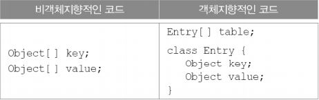
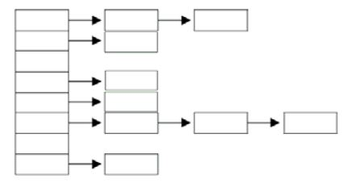
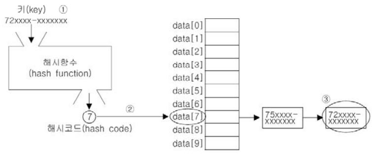
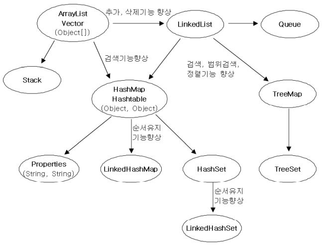

HashMap과 Hashtable
---
Hashtable과 HashMap의 관계는 Vector와 ArrayList의 관계같아서 Hashtable보다는 새로운 버전인 HashMap을 사용할 것을 권한다.

- HashMap은 Map을 구현했으므로 Map의 특징, 키(key)와 값(value)을 묶어서 하나의 데이터(entry)로 저장한다는 특징을 갖는다.
- 해싱(hashing)을 사용하여 많은 양의 데이터를 검색하는데 있어서 뛰어난 성능을 보인다.

* **HashMap실제소스**
```java
public class HashMap<K,V> extends AbstractMap<K,V>
    implements Map<K,V>, Cloneable, Serializable
{
    transient Node<K,V>[] table;
    :
    :
    static class Node<K,V> implements Map.Entry<K,V> {
        final int hash;
        final K key;
        V value;
        Node<K,V> next;
        :
        :
    }
}
```
HashMap은 Node라는 내부 클래스를 정의하고, 다시 Entry타입의 배열을 선언하고 있다.

키와 갓은 별개의 값이 아니라 서로 관련된 값이기 때문에 각각의 배열로 선언하기 보다는 하나의 클래스로 정의해서 하나의 배열로 다루는 것이 데이터의 무결성(integrity)적인 측면에서 더 바람직하기 때문이다.

<p align="center">

</p>

>Map.Entry는 Map인터페이스에 정의된 'static inner interface'이다.

키와 값을 각각 Object형태로 저장하기 때문에 어떠한 객체도 저장할 수 있지만 키는 주로 String을 대문자 또는 소문자로 통일해서 사용한다.

    키(key) - 컬렉션 내의 키(key) 중에서 유일해야 한다.
    값(value) - 키(key)와 달리 데이터의 중복을 허용한다.

- **HashMap의 생성자와 메서드**
<p align="center">

</p>

사용 예제
```java
import java.util.*;

class HashMapEx1 {
    public static void main(String[] args) {
        HashMap map = new HashMap<>();
        map.put("myId", "1234");
        map.put("asdf", "1111");
        map.put("asdf", "1234");

        Scanner s = new Scanner(System.in);

        while (true) {
            System.out.println("id와 password를 입력해주세요.");
            System.out.print("id : ");
            String id = s.nextLine();

            System.out.print("pw : ");
            String password = s.nextLine().trim();
            System.out.println();

            if (!map.containsKey(id)) {
                System.out.println("입력하신 id는 존재하지 않습니다. 다시 입력해주세요.");

                continue;
            }
            if (!(map.get(id)).equals(password)) {
                System.out.println("비밀번호가 일치하지 않습니다. 다시 입력해주세요.");
            } else {
                System.out.println("id와 비밀번호가 일치합니다.");
                break;
            }
        }
    }
}
```
실행결과

    입력하신 id는 존재하지 않습니다. 다시 입력해주세요.
    id와 password를 입력해주세요.
    id : asdf
    pw : 1111

    비밀번호가 일치하지 않습니다. 다시 입력해주세요.
    id와 password를 입력해주세요.
    id : asdf
    pw : 1234

    id와 비밀번호가 일치합니다.

```java
HashMap map = new HashMap<>();
    map.put("myId", "1234");
    map.put("asdf", "1111");
    map.put("asdf", "1234");
```
위의 코드처럼 HashMap에 데이터를 저장하면 실제 저장하는 데이터는 ("myId","1234)와 ("asdf","1234") 뿐이다. 그 이유는 중복된 키가 있기 때문이다.

새로 추가된 키인 'asdf'는 이미 존재하기 때문에 새로 추가되는 대신 기존의 값을 덮어썼다. 그래서 키'asdf'에 연결된 값은 '1234'가 된다.

>Hashtable은 키(key)나 값(value)으로 null을 허용하지만, HashMap은 허용하지 않는다.

**기본적인 메서드 사용 예제**
```java
import java.util.*;

class HashMapEx2 {
    public static void main(String[] args) {
        HashMap map = new HashMap<>();
        map.put("김자바", new Integer(100));
        map.put("이자바", new Integer(100));
        map.put("강자바", new Integer(80));
        map.put("안자바", new Integer(90));

        Set set = map.entrySet();
        Iterator it = set.iterator();

        while (it.hasNext()) {
            Map.Entry e = (Map.Entry) it.next();
            System.out.println("이름 : " + e.getKey() + ", 점수 : " + e.getValue());
        }

        set = map.keySet();
        System.out.println("참가자 명단 : " + set);

        Collection values = map.values();
        it = values.iterator();

        int total = 0;

        while (it.hasNext()) {
            Integer i = (Integer) it.next();
            total += i.intValue();
        }

        System.out.println("총점 : " + total);
        System.out.println("평균 : " + (float) total / set.size());
        System.out.println("최고점수 : " + Collections.max(values));
        System.out.println("최저점수 : " + Collections.min(values));
    }
}
```
실행결과

    이름 : 안자바, 점수 : 90
    이름 : 김자바, 점수 : 100
    이름 : 강자바, 점수 : 80
    이름 : 이자바, 점수 : 100
    참가자 명단 : [안자바, 김자바, 강자바, 이자바]
    총점 : 370
    평균 : 92.5
    최고점수 : 100
    최저점수 : 80

HashMap의 entrySet(), keySet(), values()메서드를 이용한 데이터를 저장하고 읽어오는 기본적인 예제이다.

<br>

**활용 예제**
```java
import java.util.*;

class HashMapEx3 {
    static HashMap<String, HashMap<String, String>> phoneBook = new HashMap<String, HashMap<String, String>>();

    public static void main(String[] args) {
        addPhoneNo("친구", "이자바", "010-111-1111");
        addPhoneNo("친구", "김자바", "010-222-2222");
        addPhoneNo("친구", "김자바", "010-333-3333");
        addPhoneNo("회사", "김대리", "010-444-4444");
        addPhoneNo("회사", "김대리", "010-555-5555");
        addPhoneNo("회사", "박대리", "010-666-6666");
        addPhoneNo("회사", "이과장", "010-777-7777");
        addPhoneNo("세탁", "010-888-8888");

        printList();
    }

    // 그룹에 전화번호 추가 메서드
    static void addPhoneNo(String groupName, String name, String tel) {
        addGroup(groupName);
        HashMap<String, String> group = phoneBook.get(groupName);
        group.put(tel, name); // 이름은 중복될 수 있으니 전화번호를 key로 한다.
    }

    // 그룹을 추가하는 메서드
    static void addGroup(String groupName) {
        if (!phoneBook.containsKey(groupName))
            phoneBook.put(groupName, new HashMap<String, String>());
    }

    // 그룹이 없는 경우 기타 그룹에 전화번호 추가 메서드
    static void addPhoneNo(String name, String tel) {
        addPhoneNo("기타", name, tel);
    }

    // 전화번호부 전체 출력 메서드
    static void printList() {
        Set<Map.Entry<String, HashMap<String, String>>> set = phoneBook.entrySet();
        Iterator<Map.Entry<String, HashMap<String, String>>> it = set.iterator();

        while (it.hasNext()) {
            Map.Entry<String, HashMap<String, String>> e = it.next();

            Set<Map.Entry<String, String>> subSet = e.getValue().entrySet();
            Iterator<Map.Entry<String, String>> subIt = subSet.iterator();

            System.out.println(" * " + e.getKey() + "[" + subSet.size() + "]");

            while (subIt.hasNext()) {
                Map.Entry<String, String> subE = subIt.next();
                String telNo = subE.getKey();
                String name = subE.getValue();
                System.out.println(name + " " + telNo);
            }
            System.out.println();
        }
    }
}
```
실행결과

     * 기타[1]
    세탁 010-888-8888

     * 친구[3]
    이자바 010-111-1111
    김자바 010-222-2222
    김자바 010-333-3333

     * 회사[4]
    이과장 010-777-7777
    김대리 010-444-4444
    김대리 010-555-5555
    박대리 010-666-6666

HashMap은 데이터를 키와 값 모두 Object타입으로 저장하기 때문에 HashMap의 값(value)으로 HashMap을 다시 저장할 수 있다.

### **해싱과 해시함수**
- 해싱이란 해시함수(hash function)을 이용해서 데이터를 해시테이블(hash table)에 저장하고 검색하는 기법을 말한다.
- 해시함수가 데이터가 저장되어 있는 곳을 알려 주기 때문에 다량의 데이터 중에서도 데이터를 바르게 찾을 수 있다.
- 해싱에서 사용하는 자료구조는 배열과 링크드리스트의 조합으로 되어있다.
- 해싱을 구현한 클래스 : HashSet, HashMap, Hashtable 등

* **배열과 링크드리스트의 조합**
<p align="center">

</p>

저장할 데이터의 키를 해시함수에 넣으면 배열의 한 요소를 얻게 되고, 다시 그곳에 연결되어 있는 링크드 리스트에 저장하게 된다.

* **HashMap에 저장된 데이터를 찾는 과정**
<p align="center">

</p>

1. 검색하고자 하는 값의 키로 해시함수를 호출한다.
2. 해시함수의 계산결과(해시코드)로 해당 값이 저장되어 있는 링크드 리스트를 찾는다.
3. 링크드 리스트에서 검색한 키와 일치하는 데이터를 찾는다.

링크드 리스트는 검색에 불리한 자료구조이기 때문에 링크드 리스트의 크기가 커질수록 검색속도가 떨어지게 된다.

반면에 배열은 배열의 크기가 커져도, 원하는 요소가 몇 번째에 있는 지만 알면 공식에 의해서 빠르게 원하는 값을 찾을 수 있다.

    배열의 인덱스가 n인 요소의 주소 = 배열의 시작주소 + type의 size * n

오히려 하나의 서랍에 데이터가 저장되어 있는 형태보다, 많은 서랍에 하나의 데이터만 저장되어 있는 형태가 더 빠른 검색결과를 얻을 수 있다.

하나의 링크드리스트에 최소한의 데이터만 저장되려면, 데이터의 크기를 고려해서 HashMap의 크기를 적절하게 지정해야 하고, 해시함수가 서로다른키에 대해서 중복된 해시코드의 반환을 최소화해야 한다.

해싱을 구현하는 과정에서 제일 중요한 것은 해시함수의 알고리즘이며, 해시함수의 알고리즘은 주어진키의 첫 번째 문자를 뽑아서 정수로 반환하기만 하면 되므로 아래와 같이 코드로 표현할 수 있다.

```java
int hashFunction(String key) {
    return Integer.parseInt(key.substring(0,1));
}
```
알고리즘이 간단한 만큼 성능은 좋지 않아서 서로 다른 키에 대해서 중복된 해시코드를 반환하는 경우가 많다.

실제로는 HashMap()과 같이 해싱을 고현한 컬렉션 클래스에서는Object클래스에 정의된 HashCode()를 해시함수로 사용한다. Object클래스에 정의된 HashCode()는 객체의 주소를 이용하는 알고리즘으로 해시코드를 만들어 내기 때문에 모든 객체에 대해 hashCode()를 호출한 결과가 서로 유일한 훌륭한 방법이다.

#### <br>

TreeMap
---
- 이진검색트리의 형태로 키와 값의 쌍으로 이루어진 데이터를 저장한다.
- 검색과 정렬에 적합한 컬렉션 클래스이다.
- 대부분의 경우 HashMap이 더 뛰어나지만, 범위검색이나 정렬이 필요한 경우 TreeMap을 사용하자.

* **TreeMap의 생성자와 메서드**

|<center>메서드</center>|<center>설명</center>|
|-|-|
|TreeMap()|TreeMap객체를 생성|
|TreeMap(Comparator c)|지정된 Comparator를 기준으로 정렬하는 TreeMap객체를 생성|
|TreeMap(Map m)|주어진 Map에 저장된 모든 요소를 포함하는 TreeMap을 생성
|TreeMap(SortedMap m)|주어진 SortedMap에 저장된 모든 요소를 포함하는 TreeMap을 생성|
|Object CeilingKey(Object Key)|지정된 key와 일치하거나 큰 것중 제일 작은 것의 키를 반환. 없으면 null을 반환|
|void clear()|저장된 모든객체 제거|
|Object clone()|현재 TreeMap을 복제해서 반환|
|boolean containsKey(Object key)|TreeMap에 지정된 키(key)가 포함되어 있는지 알려줌(포함되어 있으면 true)|
|boolean containsvalue(Object value)|TreeMap에 지정된 값(value)이 포함되어있는지 알려줌(포함되어 있으면 true)|
|Set entrySet()|TreeMap에 저장된 키와 값을 엔트리(키와 값의 결합)의 형태로 Set에 저장해서 반환|
|Object get(Object key)|지정된 키의 값을 반환|
|boolean isEmpty()|TreeMap이 비어있는지 알려준다.|
|Set keySet()|TreeMap에 저장된 모든 키가 저장된 Set을 반환|
|Map.Entry lastEntry()|TreeMap에 저장된 마지막 키(가장 큰 키)의 쌍을 반환
|Object lastKey()|TreeMap에 저장된 마지막 키(가증 큰 키)를 반환
|Map.Entry lowerEntry(Object key)|지정된 key보다 작은 키 중에서 제일 큰키의 쌍(Map.Entry)을 반환. 없으면 null을 반환|
|Object lowerKey(Object Key)|지정된 key보다 작은 키 중에서 제일 큰 키를 반환, 없으면 null을 반환
|Collection values()|TreeMap에 저장된 모든 값을 컬렉션의 형태로 반환|

**TreeMap 사용 예제**
```java
import java.util.*;

public class TreeMapEx {
    public static void main(String[] args) {
        String[] data = { "A", "K", "A", "K", "D", "K", "A", "K", "K", "K", "Z", "D" };

        TreeMap map = new TreeMap<>();

        for (int i = 0; i < data.length; i++) {
            if (map.containsKey(data[i])) {
                Integer value = (Integer) map.get(data[i]);
                map.put(data[i], new Integer(value.intValue() + 1));
            } else {
                map.put(data[i], new Integer(1));
            }
        }
        Iterator it = map.entrySet().iterator();

        System.out.println("= 기본정렬 =");
        while (it.hasNext()) {
            Map.Entry entry = (Map.Entry) it.next();
            int value = ((Integer) entry.getValue()).intValue();
            System.out.println(entry.getKey() + " : " + printBar('#', value) + " " + value);
        }
        System.out.println();

        // map을 ArrayList로 변환한 다음에 Collections.sort()로 정렬
        Set set = map.entrySet();
        List list = new ArrayList(set); // ArrayList(Collection c)

        // static void sort(List list, Comparator c)
        Collections.sort(list, new ValueComparator());

        it = list.iterator();

        System.out.println("= 값의 크기가 큰 순서로 정렬 =");
        while (it.hasNext()) {
            Map.Entry entry = (Map.Entry) it.next();
            int value = ((Integer) entry.getValue()).intValue();
            System.out.println(entry.getKey() + " : " + printBar('#', value) + " " + value);
        }

    }

    static class ValueComparator implements Comparator {
        @Override
        public int compare(Object o1, Object o2) {
            if (o1 instanceof Map.Entry && o2 instanceof Map.Entry) {
                Map.Entry e1 = (Map.Entry) o1;
                Map.Entry e2 = (Map.Entry) o2;

                int v1 = ((Integer) e1.getValue()).intValue();
                int v2 = ((Integer) e2.getValue()).intValue();

                return v2 - v1;
            }
            return -1;
        }
    }

    public static String printBar(char ch, int value) {
        char[] bar = new char[value];

        for (int i = 0; i < bar.length; i++) {
            bar[i] = ch;
        }
        return new String(bar);
    }
}
```
실행결과

    = 기본정렬 =
    A : ### 3
    D : ## 2
    K : ###### 6
    Z : # 1

    = 값의 크기가 큰 순서로 정렬 =
    K : ###### 6
    A : ### 3
    D : ## 2
    Z : # 1

TreeMap을 사용했기 때문에 결과가 오름차순으로 정렬되어 있는 것을 알 수 있다. 키가 String인스턴스이기 때문에 String클래스에 정의된 정렬기준에 의해서 정렬된 것이다.

그리고 Comparator를 구현한 클래스와 Collections.sort(List list, Comparator c)를 이용해서 값에 대한 내림차순으로 정렬하는 방법을 보여준다.

#### <br>

Propertis
---
- HashMap의 구버전인 Hashtable을 상속받아 구현한 것이다.
- Hashtable은 키와 값을(Object, Object)의 형태로 저장하는데 비해 Properties는 (String, String)의 형태로 저장하는 보다 단순화된 컬렉션 클래스이다.
- 주로 애플리케이션의 환경설정과 관련된 속성(property)을 저장하는데 사용
- 데이터를 파일로부터 읽고 쓰는 편리한 기능을 제공한다. 그래서 간단한 입출력은 Properties를 활용하면 몇줄의 코드로 쉽게 해결될 수 있다.

* **Properties의 생성자와 메서드**

|<center>메서드</center>|<center>설명</center>|
|-|-|
|Properties()|Properties객체를 생성한다.
|Properties(Properties defaults)|지정된 Properties에 저장된 목록을가진 Properties객체를 생성한다|
|String getProperty(String key)|지정된 키(key)의 값(value)을 반환한다.|
|String getProperty(String key, String defaultValue)|지정된 키(key)의 값(value)을 반환한다. 키를 못찾으면 defaultValue를 반환한다.|
|void list(PrintStream out)|지정된 PrintStream에 저장된 목록을 출력한다.|
|void list(PrintWriter out)|지정된 PrintWriter에 저장된 목록을 출력한다.|
|void load(InputStream inStream)|지정된 InputStream으로 부터목록을 읽어서 저장한다.|
|void load(Reader reader)|지정된 Reader으로부터 목록을 읽어서 저장한다.|
|Enumeration propertyNames()|목록의 모든키(key)가 담긴 Enumeration을 반환한다.|
|Object setProperty(String key, String value)|지정된 키와 값을 저장한다. 이미 존재하는 키면 새로운 값으로 바뀐다.
|void store(OutputStream out, string comments)|저장된 목록을 지정된 OutputStream에 출력(저장)한다.<br> comments는 목록에 대한 주석으로 저장된다.|
|void store(Writer writer, String comments)|저장된 목록을 지정된 Writer에 출력(저장)한다.<br> comments는 목록에 대한 주석으로 저장된다.|
|Set stringPropertyNames()|Propertyies에 저장되어 있는 모든 키(key)를 Set에 담아서 반환한다.|

**Properties 사용 예제**
```java
import java.util.*;

class PropertiesEx1 {
    public static void main(String[] args) {
        Properties prop = new Properties();

        // prop에 키와 값(key, value)를 저장한다.
        prop.setProperty("timeout", "30");
        prop.setProperty("language", "kr");
        prop.setProperty("size", "10");
        prop.setProperty("capacity", "10");

        // prop에 저장된 요소들을 Enumeration을 이용해서 출력한다.
        Enumeration e = prop.propertyNames();

        while (e.hasMoreElements()) {
            String element = (String) e.nextElement();
            System.out.println(element + "=" + prop.getProperty(element));
        }
        System.out.println();
        prop.setProperty("size", "20"); // size의 값을 20으로 변경한다.
        System.out.println("size=" + prop.getProperty("size"));
        System.out.println("capacity=" + prop.getProperty("capacity", "20"));
        System.out.println("loadfactor=" + prop.getProperty("loadfactor", "0.75"));

        System.out.println(prop); // prop에 저장된 요소들을 출력한다.
        prop.list(System.out); // prop에 저장된 요소들을 화면(System.out)에 출력한다.
    }
}
```
실행결과

    capacity=10
    size=10    
    timeout=30 
    language=kr

    size=20
    capacity=10
    loadfactor=0.75     <-- loadfactor라는 키가 없기 때문에 디폴트 값으로 정한 0.75가 출력
    {capacity=10, size=20, timeout=30, language=kr}
    -- listing properties --
    capacity=10
    size=20
    timeout=30
    language=kr

Properties의 기본적이 메서드를 이용해서 저장하고 읽어오고 출력하는 방법을 보여주는 간단한 예제이다.

#### <br>

Collections
---
- fill(), copy(), sort(), binarySearch() 등의 메서드를 제공한다.

### **컬렉션의 동기화**
멀티 쓰레드(multi-thread) 프로그래밍에서는 하나의 객체를 여러 쓰레드가 동시에 접근할 수 있기 때문에 데이터의 일관성(consistency)을 유지하기 위해서는 공유되는 객체에 동기화(synchronization)가 필요하다.

- Collections의 동기화 메서드
```java
    static Collection   synchronizedCollection(Collection c)
    static List         synchronizedList(List list)
    static Set          synchronizedSet(Set s)
    static Map          synchronizedMap(Map m)
    static SortedSet    synchronizedSorted(SortedSet s)
    static SortedMap    synchronizedSorted(SortedMap m)
```

사용 방법
```java
    List syncList = Collections.synchronizedList(new ArrayList(...));
```

### **변경불가 컬렉션 만들기**
컬렉션에 저장된 데이터를 보호하기 위해서 컬렉션을 변경할 수 없게, 즉 읽기전용으로 만들어야할 때가 있다. 주로 멀티 쓰레드 프로그래밍에서 여러 쓰레드가 하나의 컬렉션을 공유하다보면 데이터가 손상될 수 있는데, 이를 방지하려면 아래의 메서드를 이용하자.

```java
    static Collection   unmodifiableCollection(Collection c)
    static List         unmodifiableList(List list)
    static Set          unmodifiableSet(Set s)
    static Map          unmodifiableMap(Map m)
    static NavigableSet unmodifiableNavigableSet(NavigableSet s)
    static SortedSet    unmodifiableSorted(SortedSet s)
    static NavigableMap unmodifiableNavigableMap(NavigableMap m)
    static SortedMap    unmodifiableSorted(SortedMap m)
```

### **싱글톤 컬렉션 만들기**
단 하나의 객체만을 저장하는 컬렉션

```java
    static List singletonList(List list)
    static Set  singletonSet(Set s)
    static Map  singletonMap(Map m)
```
매개변수로 저장할 요소를 지정하면, 해당 요소를 저장하는 컬렉션을 반환한다. 그리고 반환된 컬렉션은 변경할 수 없다.

### **한 종류의 객체만 저장하는 컬렉션 만들기**
컬렉션에 모든 종류의 객체를 저장할 수 있다는 것은 장점이기도하고 단점이기도 하다.

대부분의 경우 한 종류의 객체를 저장하며, 컬렉션에 지정된 종류의 객체만 저장할 수 있도록 제한하고 싶을 때 해당 메서드를 사용한다.
```java
    static Collection   checkedCollection(Collection c, Class type)
    static List         checkedList(List list, Class type)
    static Set          checkedSet(Set s, Class type)
    static Map          checkedMap(Map m, Class keyType, Class valueType)
    static Queue        checkedQueue(Queue m, Class type)
    static NavigableSet checkedNavigableSet(NavigableSet s, Class type)
    static SortedSet    checkedSorted(SortedSet s, Class type)
    static NavigableMap checkedNavigableMap(NavigableMap m, Class keyType, Class valueType)
    static SortedMap    checkedSorted(SortedMap m, Class keyType, Class valueType)
```

    List list = new ArrayList();
    List checkedList = checkedList(list, String.class);     // String만 저장가능
    checkedList.add("abc");             // OK.
    checkedList.add(new Integer(3));    // 에러. ClassCastException 발생

>타입제한은 지테릭스(generics)로 간단히 처리할 수 있는데도 이런 메서드들을 제공하는 이유는 호환성 때문이다.


### **CollectionsEx 총 정리 예제**
```java
import java.util.*;
import static java.util.Collections.*;

public class Collections {
    public static void main(String[] args) {
        List list = new ArrayList();
        System.out.println(list);

        addAll(list, 1, 2, 3, 4, 5);
        System.out.println(list);

        rotate(list, 2); // 오른쪽으로 두 칸씩 이동
        System.out.println(list);

        swap(list, 0, 2); // 첫 번째와 세 번째를 교환(swap)
        System.out.println(list);

        shuffle(list); // 저장된 요소의 위치를 임의로 변경
        System.out.println(list);

        sort(list, reverseOrder()); // 역순 정렬 reverse(list);와 동일
        System.out.println(list);

        sort(list); // 정렬
        System.out.println(list);

        int idx = binarySearch(list, 3); // 3이 저장된 위치(index)를 반환
        System.out.println("index of 3 = " + idx);

        System.out.println("max=" + max(list));
        System.out.println("min=" + min(list));
        System.out.println("min=" + max(list, reverseOrder()));

        fill(list, 9); // list를 9로 채운다.
        System.out.println("list=" + list);

        // list와 같은 크기의 새로운 lsit를 생성하고 2로 채운다. 단, 결과는 변경불가
        List newList = nCopies(list.size(), 2);
        System.out.println("newList=" + newList);

        System.out.println(disjoint(list, newList)); // 공통요소가 없으면 true

        copy(list, newList);
        System.out.println("newList=" + newList);
        System.out.println("list=" + list);

        replaceAll(list, 2, 1);
        System.out.println("list=" + list);

        Enumeration e = enumeration(list);
        ArrayList list2 = list(e);

        System.out.println("list2=" + list2);
    }
}
```
실행결과

    []
    [1, 2, 3, 4, 5]
    [4, 5, 1, 2, 3]
    [1, 5, 4, 2, 3]
    [3, 2, 1, 4, 5]
    [5, 4, 3, 2, 1]
    [1, 2, 3, 4, 5]
    index of 3 = 2
    max=5
    min=1
    min=1
    list=[9, 9, 9, 9, 9]
    newList=[2, 2, 2, 2, 2]
    true
    newList=[2, 2, 2, 2, 2]
    list=[2, 2, 2, 2, 2]
    list=[1, 1, 1, 1, 1]
    list2=[1, 1, 1, 1, 1]

#### <br>

컬렉션 클래스 정리 & 요약
---
- **컬렉션 클래스간의 관계**
<p align="center">

</p>

- **컬렉션 클래스의 특징**

|<center>컬렉션</center>|<center>특 징</center>|
|-|-|
|ArrayList|배열기반, 데이터의 추가와 삭제에 불리, 순차적인 추가삭제는 제일 빠름. 임의의 요소에 대한 접근성(accessibility)에 뛰어남.|
|LinkedList|연결기반. 데이터의 추가와 삭제에 유리. 임의의 요소에 대한 접근성이 좋지 않다.|
|HashMap|배열과 연결이 결합된 형태. 추가, 삭제, 검색, 접근성이 모두 뛰어남. 검색에는 최고성능을 보임|
|TreeMap|연결기반. 졍렬과 검색(특히 범위검색)에 적합. 검색성능은 HashMap보다 떨어짐.|
|Stack|Vactor를 상속받아 구현|
|Properties|Hashtable을 상속받아 구현|
|HashSet|HashMap을 이용해서 구현|
|TreeSet|TreeMap을 이용해서 구현|
|LinkedHashMap<br>LinkedHashSet|HashMap과 HashSet에 저장순서유지기능을 추가|