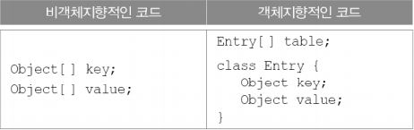
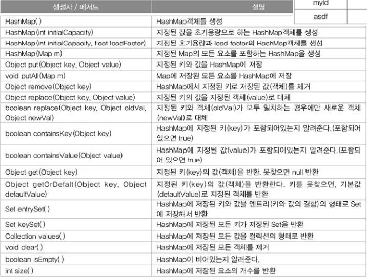

HashMap과 Hashtable
---
Hashtable과 HashMap의 관계는 Vector와 ArrayList의 관계같아서 Hashtable보다는 새로운 버전인 HashMap을 사용할 것을 권한다.

- HashMap은 Map을 구현했으므로 Map의 특징, 키(key)와 값(value)을 묶어서 하나의 데이터(entry)로 저장한다는 특징을 갖는다.
- 해싱(hashing)을 사용하여 많은 양의 데이터를 검색하는데 있어서 뛰어난 성능을 보인다.

* **HashMap실제소스**
```java
public class HashMap<K,V> extends AbstractMap<K,V>
    implements Map<K,V>, Cloneable, Serializable
{
    transient Node<K,V>[] table;
    :
    :
    static class Node<K,V> implements Map.Entry<K,V> {
        final int hash;
        final K key;
        V value;
        Node<K,V> next;
        :
        :
    }
}
```
HashMap은 Node라는 내부 클래스를 정의하고, 다시 Entry타입의 배열을 선언하고 있다.

키와 갓은 별개의 값이 아니라 서로 관련된 값이기 때문에 각각의 배열로 선언하기 보다는 하나의 클래스로 정의해서 하나의 배열로 다루는 것이 데이터의 무결성(integrity)적인 측면에서 더 바람직하기 때문이다.

<p align="center">

</p>

>Map.Entry는 Map인터페이스에 정의된 'static inner interface'이다.

키와 값을 각각 Object형태로 저장하기 때문에 어떠한 객체도 저장할 수 있지만 키는 주로 String을 대문자 또는 소문자로 통일해서 사용한다.

    키(key) - 컬렉션 내의 키(key) 중에서 유일해야 한다.
    값(value) - 키(key)와 달리 데이터의 중복을 허용한다.

- **HashMap의 생성자와 메서드**
<p align="center">

</p>

사용 예제
```java