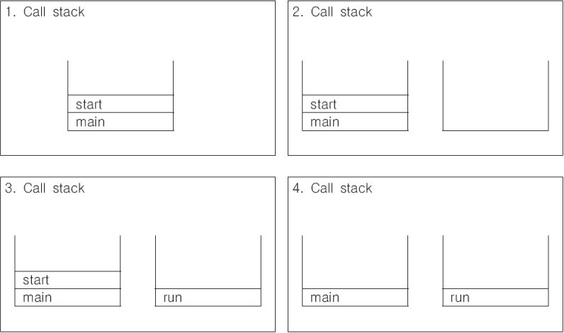
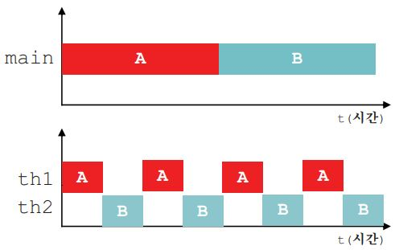
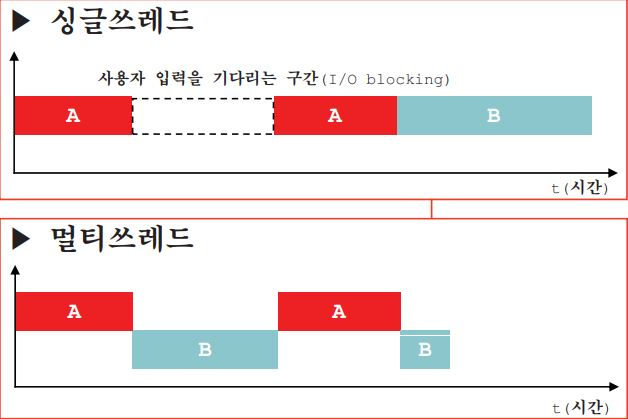
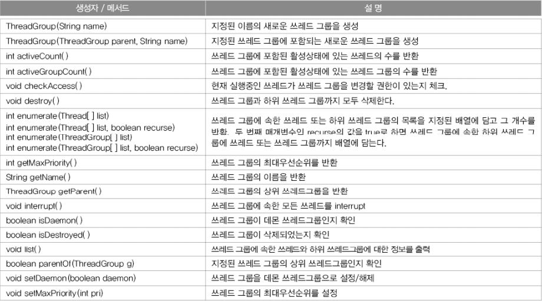
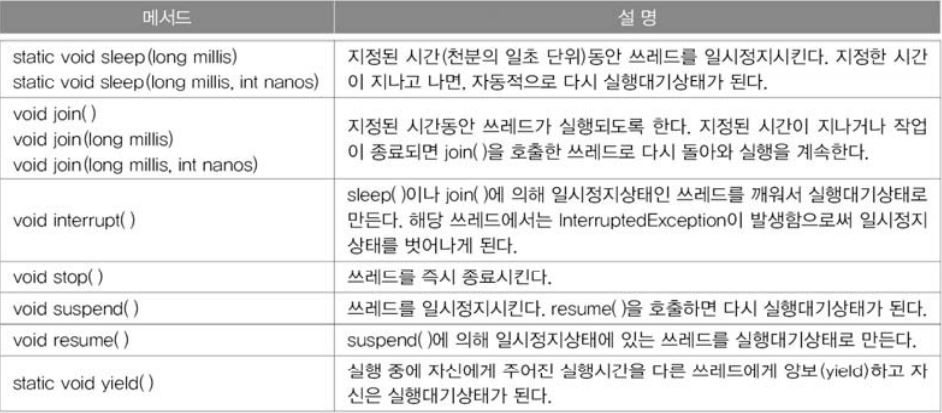
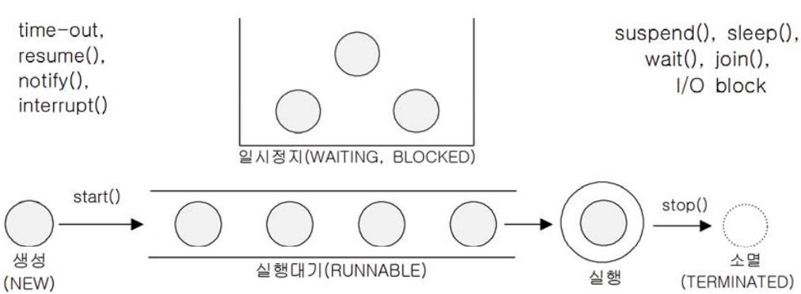
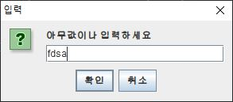

프로세스와 쓰레드
===
프로세스(porcess)란 '실행 중인 프로그램(program)'이다. 프로세스는 프로그램을 수행하는 데 필요한 데이터와 메모리 등의 자원 그리고 쓰레드로 구성되어 있으며 실제로 작업을 수행하는 것이 바로 쓰레드이다.

모든 프로세스에는 최소한 하나 이상의 쓰레드가 존재하며, 둘 이상의 쓰레드를 가진 프로세스를 '멀티쓰레드 프로세스(multi-threaded process)'라고 한다.

하나의 프로세스가 가질 수 있는 쓰레드의 개수는 제한되어 있지 않으나 쓰레드가 작업을 수행하는데 개별적인 메모리 공간(호출스택)을 필요로 하기 때문에 프로세스의 메모리 한계에 따라 생성할 수 있는 쓰레드의 수가 결정된다.

<br>

### **멀티태스킹과 멀티쓰레딩**
대부분의 OS는 멀티태스킹(multi-tasking, 다중작업)을 지원하기 때문에 여러 개의 프로세스가 동시에 실행될 수 있다. 이와 마찬가지로 멀티쓰레딩은 하나의 프로세스 내에서 여러 쓰레드가 동시에 작업을 수행하는 것이다.

CPU코어가 한 번에 단 하나의 작업만 수행할 수 있으므로, 실제로 동시에 처리되는 작업의 개수는 코어의 개수와 일치한다. 그러나 쓰레드의 수는 언제나 코어의 수보다 훨씬 많기 때문에 각 코어가 아주 짧은 시간동안 여러 작업을 번갈아 가며 수행함으로써 여러 작업들이 동시에 수행되는 것처럼 보이게 한다.

<br>

### **멀티쓰레딩 장단점**

    장점
    - CPU의 사용률을 향상시킨다.
    - 자원을 보다 효율적으로 사용할 수 있다.
    - 사용자에 대한 응답성이 향상된다.
    - 작업이 분리되어 코드가 간결해진다.

    단점
    - 멀티쓰레드 프로세스는 여러 쓰레드가 같은 프로세서 내에서 자원을 공유하면서  
    작업을 하기 때문에 발생할 수 있는 동기화(synchronization), 교착상태(deadlock)와  
    같은 문제가 발생할 수 있다.
>교착상태란 두 쓰레드가 자원을 점유한 상태에서 서로 상대편이 점여휸 자원을 사용하려고 기다리느라 진행이 멈춰있는 상태이다.

#### <br>

쓰레드의 구현과 실행
===
쓰레드를 구현하는 방법
- Thread클래스를 상속받는 방법
- Runnable인터페이스를 구현하는 방법

성능 등 별로 차이는 없지만 Thread클래스를 상속받으면 다른 클래스를 상속받을 수 없기 때문에, Runnable인터페이스를 구현하는 방법이 일반적이다.

Runnable인터페이스를  구현하는 방법은 재사용성(reusability)이 높고 코드의 일관성을 유지할 수 있다.

1. Thread클래스 상속
```java
class MyThread extends Thread {
    public void run() { /* 작업 내용 */ } // Thread클래스의 run()을 오버라이딩
}
```
2. Runnable인터페이스 구현
```java
class MyThread implements Runnable {
    public void run() { /* 작업 내용 */ } // Runnable인터페이스의 run()을 구현
}
```
>Runnable인터페이스는 오직 run()만 정의되어 있는 간단한 인터페이스이다.

**기본 사용 예제**
```java
class ThreadEx1 {
    public static void main(String[] args) {
        ThreadEx1_1 t1 = new ThreadEx1_1();

        Runnable r = new ThreadEx1_2();
        Thread t2 = new Thread(r);

        t1.start();
        t2.start();
    }
}

class ThreadEx1_1 extends Thread {
    @Override
    public void run() {
        for (int i = 0; i < 5; i++) {
            System.out.println(getName()); // 조상인 Thread의 getName()을 호출
        }
    }
}

class ThreadEx1_2 implements Runnable {
    @Override
    public void run() {
        for (int i = 0; i < 5; i++) {
            // Thread.currentThread() - 현재 실행중인 Thread를 반환한다.
            System.out.println(Thread.currentThread().getName());
        }
    }
}
```
실행결과

    Thread-0
    Thread-0
    Thread-0
    Thread-0
    Thread-0
    Thread-1
    Thread-1
    Thread-1
    Thread-1
    Thread-1

Runnable인터페이스를 구현한 경우, Runnable인터페이스를 구현한 클래스의 인스턴스를 생성한 다음, 이 인스턴스를 Thread클래스의 생성자의 매개변수로 제공해야 한다.

```java
public class Thread {
    private Runnable r; //Runnable을 구현한 클래스의 인스턴스를 참조하기 위한 변수
    public Thread(Runnable r) {
        this.r = r;
    }

    public void run() {
        if(r! = null)
            r.run();    //Runnable 인터페이스를 구현한 인스턴스의 run()을 호출
    }
}
```
위의 소스코드는 Thread.java를 이해하기 쉽게 수정한 것인데, 인스턴스변수로 Runnable타입의 변수 r을 선언해 놓고 생성자를 통해서 Runnable인터페이스를 구현한 인스턴스를 참조하도록 되어 있는 것을 확인 할 수 있다.

run()을 호출하면 참조변수 r을 통해서 Runnable인터페이스를 구현한 인스턴스의 run()이 호출된다. 이렇게 함으로써 상속을 통해 run()을 오버라이딩 하지 않고도 외부로부터 run()을 제공받을 수 있게 된다.

Runnable을 구현하면서 Thread클래스의 static메서드인 currentThread()를 호출하여 쓰레드에 대한 참조를 얻어 와야만 호출이 가능하다.

    static Thread currentThread()   현재 실행중인 쓰레드의 참조를 반환한다.
    String getName()                쓰레드의 이름을 반환

그리고 쓰레드의 이름은 생성자나 메서드를 통해서 지정 또는 변경할 수 있다.

    Thread(Runnable target, String name)
    Thread(String name)
    void setName(String name)

<br>

### **쓰레드의 실행 - start()**
쓰레드를 생성 후 start()를 호출해야 실행이 가능하다.
정확히는 start()가 호출되었다고 바로 실행되는 것이 아니라, 일단 실행대기 상태에 있다가 자신의 차례가 되어야 실행된다.

실행 대기중인 쓰레드가 하나도 없으면 곧바로 실행된다.
>쓰레드의 실행순서는 OS의 스케쥴러가 작성한 스케쥴에 의해 결정된다.

그리고 한번 실행이 종료된 쓰레드는 다시 실행할 수 없다. 즉, 하나의 쓰레드에 대해 start()가 한 번만 호출될 수 있다는 뜻이다.

만일 쓰레드의 작업을 한 번 더 수행해야 한다면 새로운 쓰레드를 생성한 다음에 start()를 호출해야 한다. 만약 하나의 쓰레드에 대해 start()를 두 번 이상 호출하면 실행시에 IllegalThreadStateException이 발생한다.
```java
ThreadEx1_1 t1 = new ThreadEx1_1();
t1.start();
t1 = new ThreadEx1_1(); // 다시 생성
t1.start(); // OK
```
#### <br>

start()와 run()
===
main메서드에서 run()을 호출하는 것은 생성된 쓰레드를 실행시키는 것이 아니라 단순히 클래스에 선언된 메서드를 호출하는 것일 뿐이다.

반면에 start()는 새로운 쓰레드가 작업을 실행하는데 필요한 호출스택(call stack)을 생성한 다음에 run()을 호출해서, 생성된 호출스택에 run()이 첫 번째로 올라가게 한다.

- **새로운 쓰레드를 생성하고 start()를 호출한 후 호출스택 변화**
<p align="center">

</p>

    1. main메서드에서 쓰레드의 start()를 호출한다.
    2. start()는 새로운 쓰레드를 생성하고, 쓰레드가 작업하는데 사용될 호출스택을 생성한다.
    3. 새로 생성된 호출스택에 run()이 호출되어, 쓰레드가 독립된 공간에서 작업을 수행한다.
    4. 이제는 호출스택이 2개이므로 스케줄러가 정한 순서에 의해서 번갈아 가면서 실행된다.

호출스택의 가장 위에 있는 메서드가 현재 실행 중인 메서드 이지만 위의 그림에서 처럼 쓰레드가 둘 이상일 때는 호출스택의 최상위에 있는 메서드일지라도 대기상태에 있을 수 있다.

스케줄러는 실행대기중인 쓰레드들의 우선순위를 고려하여 실행순서와 실행시간을 결정하고, 각 쓰레드들은 작성된 스케줄에 따라 자신의 순서가 되면 지정된 시간동안 작업을 수행한다.

<br>

### **main쓰레드**
main메서드의 작업을 수행하는 것도 쓰레드이다. 이를 main쓰레드 라고 한다.

지금까지는 main메서드가 수행을 마치면 프로그램이 종료되었으나, main메서드가 수행을 마쳤다하더라도 다른 쓰레드가 아직 작업을 마치지 않은 상태면 프로그램이 종료되지 않는다.

    실행중인 사용자 쓰레드가 하나도 없을 때 프로그램은 종료된다.

**메인과 따로 작동하는 Thread 확인 예제**
```java
class ThreadEx2 {
    public static void main(String[] args) {
        ThreadEx2_1 t1 = new ThreadEx2_1();
        t1.start();
    }
}

class ThreadEx2_1 extends Thread {
    public void run() {
        throwException();
    }

    public void throwException() {
        try {
            throw new Exception();
        } catch (Exception e) {
            e.printStackTrace();
        }
    }
}
```
실행결과

    java.lang.Exception
        at Ex_22_01_24.ThreadEx2_1.throwException(ThreadEx.java:52)
        at Ex_22_01_24.ThreadEx2_1.run(ThreadEx.java:47)

새로 생성한 쓰레드에서 고의로 예외를 발생시킨 후 예외 메시지를 보았다. 호출스택의 첫 번째 메서드가 main메서드가 아니라 run메서드인 것을 확인하자

한 쓰레드가 예외가 발생해서 종료되어도 다른 쓰레드의 실행에는 영향을 미치지 않는다. 위의 예외가 나올 시점에선 이미 main쓰레드가 종료되었다.

#### <br>

싱글쓰레드와 멀티쓰레드
===
두 개의 작업을하나의 쓰레드(th1)로 처리하는 경우와 두 개의 쓰레드(th1, th2)로 처리하는 경우를 가정해보자, 하나의 쓰레드로 두 작업을 처리하는 경우는 한 작업이 마친 후에 다른 작업을 시작하지만, 두 개의 쓰레드로 작업을 하는 경우에는 짧은 시간동안 2개의 쓰레드(th1, th2)가 번갈아 가면서 작업을 수행해서 동시에 두 작업이 처리되는 것과 같이 느끼게 한다.

- **싱글쓰레드와 멀티쓰레드의 비교(싱글코어)**
<p align="center">

</p>
위의 그래프에서 알 수 있듯이 두 작업의 수행시간은 거의 같다. 오히려 두 개의 쓰레드로 작업한 시간이 싱글쓰레드로 작업한 시간보다 더 걸리게 된다. 그 이유는 쓰레드간 작업 전환(context switching)에 시간이 걸리기 때문이다.

작업 전환을 할 때는 현재 진행 중인 작업의 상태를 저장하고 읽어 오는 시간이 소요된다. 참고로 쓰레드의 스위칭에 비해 프로세스의 스위칭이 더많은 정보를 저장해야하므로 더 많은 시간이 소요된다.

그래서 싱글 코어에서 단순히 CPU만을 사용하는 계산작업이라면 오히려 멀티쓰레드보다 싱클쓰레드로 프로그램이하는 것이 더 효율적이다.

```java
class ThreadEx4 {
    public static void main(String[] args) {
        long startTime = System.currentTimeMillis();

        for (int i = 0; i < 300; i++) {
            System.out.printf("%s", new String("-"));
        }
        System.out.println("소요시간1:" + (System.currentTimeMillis() - startTime));

        for (int i = 0; i < 300; i++) {
            System.out.printf("%s", new String("|"));
        }
        System.out.println("소요시간2:" + (System.currentTimeMillis() - startTime));
    }
}
```
실행결과

    ------------------------------------------------------------------------------소요시간1:28
    ||||||||||||||||||||||||||||||||||||||||||||||||||||||||||||||||||||||||||||||||||||||||||||||||||||||||||||||||||||||||||||||||||||||||||||||||||||||||||||||||||||||||||||||||||||||||||||||||||||||||||||||||||||||||||||||||||||||||||||||||||||||||||||||||||||||||||||||||||||||||||||||||||||||||||||소요시간2:40

```java
class ThreadEx5 {
    static long startTime = 0;

    public static void main(String[] args) {
        ThreadEx5_1 th1 = new ThreadEx5_1();
        th1.start();
        startTime = System.currentTimeMillis();

        for (int i = 0; i < 300; i++) {
            System.out.printf("%s", new String("-"));
        }
        System.out.print("소요시간1:" + (System.currentTimeMillis() - ThreadEx5.startTime));
    }
}

class ThreadEx5_1 extends Thread {
    public void run() {
        for (int i = 0; i < 300; i++) {
            System.out.printf("%s", new String("|"));
        }
        System.out.print("소요시간2:" + (System.currentTimeMillis() - ThreadEx5.startTime));
    }
}
```
실행결과

    ---|--||----------||||||||||||||--------------|--------------|||||||||||||-----||||||||||||||||||||||----------------------|||--------|||||||||-----------------|----------------|||||||||||||||||||||||-----------||||||||||||||||------------------||||-----||--------------------|||||||||||||||||||||||||||||||||||||||||||||||||||||||||||||||||||||||||||||||---------------------------|||||||||-|||||||||||||--------------------|||||||||||||||||||||||||||||||||||||||||||||-----------------------------|||||||||||||--------|||||||||||||||||||||||||||||--------------------------------------------------|소요시간1:43소요시간2:43

멀티쓰레드가 싱글쓰레드에 보다 약간 시간이 더 걸린 것을 볼 수 있고, 실행할 때마다 다른 결과를 얻을 수 있는데 그 이유는 실행중인 예제프로그램이 OS의 프로세스 스케줄러의 영향을 받기 때문이다.

프로세스가 프로세스 스케줄러에게 할당되는 실행시간이 일정하지 않고 쓰레드에게 할당되는 시간 역시 일정하지 않게 된다. 그래서 쓰레드가 이런 불확실성을 가지고 있다는 것을 염두해 두어야 한다.

두 쓰레드가 서로 다른 자원을 사용하는 작업의 경우 싱글쓰레드보다 멀티쓰레드 프로세스가 더 효율적이다. 예를 들면 사용자로부터 데이터를 입력받는 작업, 네트워크로 파일을 주고받는 작업, 프린터로 파일을 출력하는 작업과 같이 외부기기와의 입출력을 필요로 하는 경우가 이에 해당한다.

- **싱글쓰레드와 멀티쓰레드의 비교**
<p align="center">

</p>

만일 사용자로 부터 입력받는 작업과 화면에 출력하는 작업을 하나의 쓰레드로 처리하지 못하면 첫 번째 그래프처럼 사용자가 입력을 마칠 때까지 아무 일도 하지 못하고 기다리기만 해야 한다.

#### <br>

쓰레드의 우선순위
===
쓰레드는 우선순의(priority)라는 속성(멤버변수)을 갖고 있다. 이 우선순위의 값에 따라 쓰레드가 얻는 실행시간이 달라진다. 쓰레드가 수행하는 작업의 중요도에 따라 쓰레드의 우선순위를 서로 다르게 지정하여 특정 쓰레드가 더 많은 작업시간을 갖도록 할 수 있다.

### **쓰레드의 우선순위 지정하기**
- **쓰레드의 우선순위와 관련된 메서드와 상수**
```java
void setPriority(int newPriority)   // 쓰레드의 우선순위를 지정한값으로 변경한다.
int getPriority()                   // 쓰레드의 우선순위를 반환한다.

public stativ final int MAX_PRIORITY    = 10    // 최대우선순위
public stativ final int MIN_PRIORITY    = 1     // 최소우선순위
public stativ final int NORM_PRIORITY   = 5     // 보통우선순위
```
쓰레드가 가질 수 있는 우선순위 범위는 1~10이며 숫자가 높을수록 우선순위가 높다.

쓰레드의 우선순위는 쓰레드를 생성한 쓰레드로부터 상속받는다는 것이다.
>main메서드의 수행하는 쓰레드의 우선순위는 5이므로 main메서드내에서 생성하는 쓰레드의 우선순위는 자동적으로 5가 된다.

```java
class ThreadEx8 {
    public static void main(String[] args) {
        ThreadEx8_1 th1 = new ThreadEx8_1();
        ThreadEx8_2 th2 = new ThreadEx8_2();

        th2.setPriority(7);

        System.out.println("Priority of th1(-) : " + th1.getPriority());
        System.out.println("Priority of th2(|) : " + th2.getPriority());
        th1.start();
        th2.start();
    }
}

class ThreadEx8_1 extends Thread {
    @Override
    public void run() {
        for (int i = 0; i < 300; i++) {
            System.out.print("-");
            for (int j = 0; j < 10000000; j++)
                ;
        }
    }
}

class ThreadEx8_2 extends Thread {
    public void run() {
        for (int i = 0; i < 300; i++) {
            System.out.print("|");
            for (int j = 0; j < 10000000; j++)
                ;
        }
    }
}
```
실행결과

    -||-|-----------------------------------------------------------------------------------------------------------------------------------------------------------------------------------------------------------------------------------------------------------||||||-----------------------------------------------|||||||||||||||||||||||||||||||||||||||||||||||||||||||||||||||||||||||||||||||||||||||||||||||||||||||||||||||||||||||||||||||||||||||||||||||||||||||||||||||||||||||||||||||||||||||||||||||||||||||||||||||||||||||||||||||||||||||||||||||||||||||||||||||||||||||||||||||||||||||||||||||||||

th1과 th2모두 main메서드에서 생성하였기 때문에 main메서드를 실행하는 쓰레드의 우선순위인 5를 상속받았다. 그 다음에 th2.setPriority(7)로 th2의 우선순위를 7로 변경한 후 start()를 호출해서 쓰레드를 실행시켰다.

우선순위가 높아지면 한 번에 작업이 끝나버릴 수 있기 때문에 아무 일도 하지 않는 반복문을 추가하여 작업을 지연시켰다.

#### <br>

쓰레드 그룹(thread group)
===
- 서로 관련된 쓰레드를 그룹으로 다루기 위한 것
- 폴더에 관련된 파일들을 넣어서 관리하는 것 처럼 쓰레드 그룹을 묶어서 관리할 수 있다.
- 폴더 안에 폴더를 생성하듯이 쓰레드 그룹 안에 또다른 그룹을 포함 시킬 수 있다.
- 쓰레드 그룹은 보안상의 이유로 도입된 개념
- 자신이 속한 쓰레드 그룹이나 하위 쓰레드 그룹은 변경할 수 있지만 다른 쓰레드 그룹의 쓰레드를 변경할 수 없다

* **Thread Groupdml 생성자와 메서드**
<p align="center">

</p>

쓰레드를 쓰레드 그룹에 포함시키려면 Thread의 생성자를 이용해야한다.
```java
Thread(ThreadGroup group, String name)
Thread(ThreadGroup group, Runnable target)
Thread(ThreadGroup group, Runnable target, String name)
Thread(ThreadGroup group, Runnable target, String name, long stackSize)
```

모든 쓰레드는 반드시 쓰레드 그룹에 포함되어 있어야 하기 때문에, 위와 같이 쓰레드 그룹을 지정하는 생성자를 사용하지 않은 쓰레드는 기본적으로 자신을 생성한 쓰레드와 같은 그룹에 속하게 된다.

우리가 생성하는 모든 쓰레드 그룹은 main쓰레드 그룹의 하위 쓰레드 그룹이 되며, 쓰레드 그룹을 지정하지 않고 생성한 쓰레드는 자동적으로 main쓰레드 그룹에 속하게 된다.

    ThreadGroup getThreadGroup()    쓰레드 자신이 속한 쓰러드 그룹을 반환한다.
    void uncaughtException(Thread t, Throwable e) 쓰레드 그룹의 쓰레드가 처리되지 않은 예외에 의해 실행이 종료되었을 때, JVM에 의해 이 메서드가 자동적으로 호출된다.

```java
class ThreadEx9 {
    public static void main(String[] args) throws Exception {
        ThreadGroup main = Thread.currentThread().getThreadGroup();
        ThreadGroup grp1 = new ThreadGroup("Group1");
        ThreadGroup grp2 = new ThreadGroup("Group2");

        // ThreadGroup(ThreadGroup parent, String name)
        ThreadGroup subGrp1 = new ThreadGroup(grp1, "SubGroup1");

        grp1.setMaxPriority(3);

        Runnable r = new Runnable() {
            @Override
            public void run() {
                try {
                    Thread.sleep(1000); // 쓰레드를 1초간 멈춘다.
                } catch (InterruptedException e) {
                    // TODO: handle exception
                }
            }
        };
        // Thread(ThreadGroup tg, Runnable r, String name)
        new Thread(grp1, r, "th1").start();
        new Thread(subGrp1, r, "th2").start();
        new Thread(grp2, r, "th3").start();

        System.out.println(">>List of ThreadGroup : " + main.getName()
                + ", Active ThreadGroup: " + main.activeGroupCount()
                + ", Active Thread: " + main.activeCount());
        main.list();
    }
}
```
실행결과

    >>List of ThreadGroup : main, Active ThreadGroup: 3, Active Thread: 4
    java.lang.ThreadGroup[name=main,maxpri=10]
        Thread[main,5,main]
        java.lang.ThreadGroup[name=Group1,maxpri=3]
            Thread[th1,3,Group1]
            java.lang.ThreadGroup[name=SubGroup1,maxpri=3]
                Thread[th2,3,SubGroup1]
        java.lang.ThreadGroup[name=Group2,maxpri=10]
            Thread[th3,5,Group2]
쓰레드 그룹과 쓰레드를 생성하고 main.list()를 호출해서 main쓰레드 그룹의 정보를 출력하는 예제이다. 쓰레드 그룹에 대한 정보를 출력하기도 전에 쓰레드가 종료될 수 있으므로, sleep()을 호출하여 1초간 멈추게 하였다.

결과를 보면 스레드 그룹에 포함된 하위 쓰레드 그룹이나 쓰레드는 들여쓰기를 이용해서 구별되로록 하였음을 알 수 있다.

>쓰레드 그룹을 지정하지 않은 쓰레드는 자동적으로 main쓰레드 그룹에 속하게 된다.

#### <br>

데몬 쓰레드(deamon thread)
===
- 다른 일반 쓰레드(데몬 쓰레드가 아닌 쓰레드)의 작업을 돕는 보조적인 역할을 수행
- 일반 쓰레드가 모두 종료되면 데몬 쓰레드는 강제적으로 자동종료된다.
- 예로 가비지 컬렉터, 워드프로세서 자동저장, 화면자동갱신 등이 있다.

데몬 쓰레드는 무한루프와 조건문을 이용해서 실행 후 대기하고 있다가 특정 조건이 만족되면 작업을 수행하고 다시 대기하도록 작성한다.

쓰레드를 생성한 다음 실행하기 전에 setDaemon(true)를 호출하기만 하면된다. 그리고 데몬 쓰레드가 생성한 쓰레드는 자동적으로 데몬쓰레드가 된다

    boolean isDaemon()      쓰레드가 데몬 쓰레드인지 확인한다.
                            데몬 쓰레드이면 true반환
    
    void setDaemon(boolean on)  쓰레드를 데몬 쓰레드로 또는 사용자 쓰레드로 변경한다.
                                매개변수 on의 값을 true로 지정하면 데몬 쓰레드가 된다.

사용 예제
```java
class ThreadEx10 implements Runnable {
    static boolean autoSave = false;

    public static void main(String[] args) {
        Thread t = new Thread(new ThreadEx10());
        t.setDaemon(true); // 이 부분이 없으면 종료되지 않음
        t.start();

        for (int i = 1; i <= 10; i++) {
            try {
                Thread.sleep(1000);
            } catch (InterruptedException e) {
            }
            System.out.println(i);

            if (i == 5)
                autoSave = true;

        }
        System.out.println("프로그램을 종료합니다.");
    }

    @Override
    public void run() {
        while (true) {
            try {
                Thread.sleep(3 * 1000); // 3초마다
            } catch (InterruptedException e) {
            }
            // autoSave의 값이 true이면 autoSave()를 호출한다.
            if (autoSave) {
                autoSave();
            }
        }
    }

    private void autoSave() {
        System.out.println("작업파일이 자동저장되었습니다.");
    }
}
```
실행결과

    1
    2
    3
    4
    5
    작업파일이 자동저장되었습니다.
    6
    7
    8
    작업파일이 자동저장되었습니다.
    9
    10
    프로그램을 종료합니다.

3초마다 변수 autoSave의 값을 확인해서 그 값이 true이면, autoSave()를 호출하는 일을 무한히 반복하도록 쓰레드를 작성하였다. 만일 이 쓰레드를 데몬 쓰레드로 설정하지 않았다면, 이 프로그램은 강제종료하지 않는 한 무한히 반복될 것이다.

setDaemon메서드는 반드시 start()를 호출하기 전에 실행되어야한다. 그렇지 않으면 IllegalThreadStateException이 발생한다.


```java
class ThreadEx11 {
    public static void main(String[] args) {
        ThreadEx11_1 t1 = new ThreadEx11_1("Thread1");
        ThreadEx11_2 t2 = new ThreadEx11_2("Thread2");
        t1.start();
        t2.start();
    }
}

class ThreadEx11_1 extends Thread {
    ThreadEx11_1(String name) {
        super(name);
    }

    @Override
    public void run() {
        try {
            sleep(5 * 1000);
        } catch (InterruptedException e) {
        }
    }
}

class ThreadEx11_2 extends Thread {
    ThreadEx11_2(String name) {
        super(name);
    }

    @Override
    public void run() {
        Map map = getAllStackTraces();
        Iterator it = map.keySet().iterator();

        int x = 0;
        while (it.hasNext()) {
            Object obj = it.next();
            Thread t = (Thread) obj;
            StackTraceElement[] ste = (StackTraceElement[]) (map.get(obj));

            System.out.println("[" + ++x + "] name : " + t.getName() + ", group : " + t.getThreadGroup().getName()
                    + ", daemon : " + t.isDaemon());

            for (int i = 0; i < ste.length; i++) {
                System.out.println(ste[i]);
            }
            System.out.println();
        }
    }
}
```
실행결과

    [1] name : Reference Handler, group : system, daemon : true
    java.lang.Object.wait(Native Method)
    java.lang.Object.wait(Object.java:502)
    java.lang.ref.Reference.tryHandlePending(Reference.java:191)
    java.lang.ref.Reference$ReferenceHandler.run(Reference.java:153)

    [2] name : Finalizer, group : system, daemon : true
    java.lang.Object.wait(Native Method)
    java.lang.ref.ReferenceQueue.remove(ReferenceQueue.java:144)
    java.lang.ref.ReferenceQueue.remove(ReferenceQueue.java:165)
    java.lang.ref.Finalizer$FinalizerThread.run(Finalizer.java:216)

    [3] name : Thread2, group : main, daemon : false
    java.lang.Thread.dumpThreads(Native Method)
    java.lang.Thread.getAllStackTraces(Thread.java:1610)
    Ex_22_01_24.ThreadEx11_2.run(ThreadEx.java:243)

    [4] name : Attach Listener, group : system, daemon : true

    [5] name : Signal Dispatcher, group : system, daemon : true

    [6] name : Thread1, group : main, daemon : false
    java.lang.Thread.sleep(Native Method)
    Ex_22_01_24.ThreadEx11_1.run(ThreadEx.java:230)

현재 실행 중인 모든 쓰레드의 호출스택을 출력하는 예제이다.

getAllStackTraces()를 이용하여 실행 중 또는 대기상태, 작업이 완료되지 않은 모든 쓰레드의 호출스택을 출력할 수 있다.

#### <br>

쓰레드의 실행제어
===
효율적인 멀티 쓰레드 프로그램을 만들기 우해서는 보다 정교한 스케줄링을 통해 프로세스에게 주어진 자원과 시간을 여러 쓰레드가 낭비없이 잘 사용하도록 프로그래밍 해야 한다.

- **쓰레드의 스케줄링 메서드**
<p align="center">

</p>

- **쓰레드의 상태**

|<center>상태</center>|<center>설명</center>|
|-|-|
|NEW|쓰레드가 생성되고 아직 start()가 호출되지 않은 상태|
|RUNNABLE|실행 중 또는 실행 가능한 상태|
|BLOCKED|동기화블럭에 의해서 일시정지된 상태(lock이 풀릴때 까지 기다리는 상태)|
|WAITING,<br>TIMED_WAITING|쓰레드의 작업이 종료되지는 않았지만 실행가능하지 않은(unrunnable) 일시정지 상태. TIMED_WAITING은 일시정지시간이 지정된 경우를 의미한다.|
|TERMINATED|쓰레드의 작업이 종료된 상태|
>쓰레드의 상태는 Thread의 getState()메서드를 호출해서 확인할 수 있다.
<p align="center">

</p>

1. 쓰레드를 생성하고 start()를 호출하면 바로 실행되는 것이 아니라 실행 대기열에 저장되어 자신의 차례가 될 때까지 기다려야 한다.
2. 실행대기상태에 있다가 자신의 차례가 되면 실행상태가 된다.
3. 주어진 실행시간이 다되거나 yield()를 만나면 다시 실행대기상태가 되고 다음 차례의 쓰레드가 실행상태가 된다.
4. 실행중에 suspend(), sleep(), wait(), join(), I/O block에 의해 일시정지상태가 될 수 있다.
5. 지정된 일시정지 시간이 다 되거나(time-out), notify(), resume(), interrupt()가 호출되면 일시정지상태를 벗어나 다시 실행대기열에 저장되어 자신의 차례를 기다림
6. 실행을 모두 마치거나 stop()이 호출되면 쓰레드는 소멸된다.

<br>

### **sleep(long millis) - 일정시간동안 쓰레드를 멈춤**

    static void sleep(long millis)
    static void sleep(long millis, int nanos)

밀리세컨드(millis, 1000분의 일초)와 나노세컨드(nanos, 10억분의 일초)의 시간단위로 세밀하게 값을 지정할 수 있지만 어느 정도의 오차가 발생할 수 있다는 것을 염두해 둬야 한다.
>나노세컨드(nanos)로 지정할 수 있는 값의 범위는 0~999999이며, 999999나노세컨드는 약 1밀리세컨드이다.

sleep()에 의해 일시정지 상태가 된 쓰레드는 지정된 시간이 다 되거나 interrupt()가 호출되면(InterruptedException발생), 잠에서 깨어나 실행대기 상태가 된다.

그래서 호출할때는 항상 try-catch문으로 예외처리를 해줘야 한다.

**sleep() 사용 예제**
```java
class ThreadEx12 {
    public static void main(String[] args) {
        ThreadEx12_1 th1 = new ThreadEx12_1();
        ThreadEx12_2 th2 = new ThreadEx12_2();
        th1.start();
        th2.start();

        try {
            th1.sleep(2000);
        } catch (InterruptedException e) {
        }
        System.out.println("<<main 종료>>");
    }
}

class ThreadEx12_1 extends Thread {
    @Override
    public void run() {
        for (int i = 0; i < 300; i++)
            System.out.print("-");
        System.out.print("<<th1 종료>>");
    }
}

class ThreadEx12_2 extends Thread {
    @Override
    public void run() {
        for (int i = 0; i < 300; i++)
            System.out.print("|");
        System.out.print("<<th2 종료>>");
    }
}
```
실행결과

    --------------------------------------------------------------------------------------------------------------------------------------------------------------------------------------------------------------------------------------------------------------|||||||----------------------------------------------|||||||||||||||||||||||||||||||||||||||||||||||||||||||||||||||||||||||||||||||<<th1 종료>>||||||||||||||||||||||||||||||||||||||||||||||||||||||||||||||||||||||||||||||||||||||||||||||||||||||||||||||||||||||||||||||||||||||||||||||||||||||||||||||||||||||||||||||||||||||||||||||||||||||||||||||||||||||<<th2 종료>><<main 종료>>

th1에 sleep(2000)을 걸어 줬음에도 th1이 먼저 종료된 것을 볼 수 있다. 그 이유는 sleep()이 항상 현재 실행중인 쓰레드에 대해 작동하기 때문이다. th1.sleep(2000)을 호출하여도 실제로 영향을 받는 것은 main메서드를 실행하는 main쓰레드 뿐이다.

<br>

### **interrupt()와 interrupted() - 쓰레드의 작업을 취소한다.**
- 진행 중인 쓰레드의 작업이 끝나기 전에 취소시켜야 할때 사용한다.
- interrupt()는 쓰레드에게 작업을 멈추라고 '요청'한다.
- 단지 요청만 할 뿐 쓰레드를 강제로 종료시키지는 못한다.
- interrupt()는 쓰레드의 interrupted상태(인스턴스 변수)바꾸는 것 뿐이다.
- interrupted()는 쓰레드에 대해 interrupt()가 호출되었는지 알려준다.

```java
Thread th = new Thread();
th.start();
...
th.interrupt();     // 쓰레드 th에 interrupt()를 호출한다.

class MyThread extends Thread {
    public void run() {
        while(!interrupted()) { // interrupted()의 결과가 false인 동안 반복
            ...
        }
    }
}
```
    void interrupt()             쓰레드의 interrupted상태를 false에서 true로 변경
    boolean isInterrupted()      쓰레드의 interrupted상태를 반환.
    static boolean interrupted() 현재 쓰레드의 interrupted상태를 반환 후, false로 변경

쓰레드가 sleep(), wait(), join()에 의해 '일시정지 상태(WALTING)'에 있을 때, 해당 쓰레드에 대해 interrupt()를 호출하면 InterruptedException이 발생하고 쓰레드는 '실행대기 상태(RUNNABLE)'로 바뀐다.

```java
import javax.swing.JOptionPane;

class ThreadEx13 {
    public static void main(String[] args) throws Exception {
        ThreadEx13_1 th1 = new ThreadEx13_1();
        th1.start();
        String input = JOptionPane.showInputDialog("아무값이나 입력하세요");
        System.out.println("입력하신 값은 " + input + "입니다.");
        th1.interrupt(); // interrupt()를 호출하면, interrupted상태가 true가 된다.
        System.out.println("isInterrupted():" + th1.isInterrupted()); // true
    }
}

class ThreadEx13_1 extends Thread {
    @Override
    public void run() {
        int i = 10;

        while (i != 0 && !isInterrupted()) {
            System.out.println(i--);
            for (Long x = 0L; x < 2500000000L; x++)
                ; // 시간지연
        }
        System.out.println("카운트가 종료되었습니다.");
    }
}
```
실행결과
<p>

</p>

    10
    9
    8
    7
    입력하신 값은 fdsa입니다.
    isInterrupted():true
    카운트가 종료되었습니다.

사용자의 입력이 끝나자 interrupt()에 의해 카운트다운이 중간에 멈추었다.

<br>

### **suspend(), resume(), stop()**
이 메서드 들은 쓰레드의 실행을 제어하는 가장 손쉬운 방법이지만, 교착상태(deadlock)을 일으키기 쉽게 작성이되어있으므로 'deprecated'되어있고, 사용이 권장되지 않는다.

그냥 사용하지 말자...

    suspend()   쓰레드를 멈추게 한다.
    resume()    suspend()에 의해 정지된 쓰레드를 다시 실행대기 상태로 만든다.
    stop()      호출되는 즉시 쓰레드가 종료된다.

사용 예제
```java
class ThreadEx16 {
    public static void main(String[] args) {
        RunImplEx16 r1 = new RunImplEx16();
        RunImplEx16 r2 = new RunImplEx16();
        RunImplEx16 r3 = new RunImplEx16();
        Thread th1 = new Thread(r1, "*");
        Thread th2 = new Thread(r2, "**");
        Thread th3 = new Thread(r3, "***");
        th1.start();
        th2.start();
        th3.start();

        try {
            Thread.sleep(2000);
            r1.suspend();
            Thread.sleep(2000);
            r2.suspend();
            Thread.sleep(3000);
            r1.resume();
            Thread.sleep(3000);
            r1.stop();
            r2.stop();
            Thread.sleep(2000);
            r3.stop();
        } catch (InterruptedException e) {
        }
    }
}

class RunImplEx16 implements Runnable {
    volatile boolean suspended = false;
    volatile boolean stopped = false;

    @Override
    public void run() {
        while (!stopped) {
            if (!suspended) {
                System.out.println(Thread.currentThread().getName());
                try {
                    Thread.sleep(1000);
                } catch (InterruptedException e) {
                }
            }
        }
        System.out.println(Thread.currentThread().getName() + " - stopped");
    }

    public void suspend() {
        suspended = true;
    }

    public void resume() {
        suspended = false;
    }

    public void stop() {
        stopped = true;
    }
}
```
실행결과

    **
    ***
    *
    **
    ***
    *
    ***
    **
    **
    ***
    ***
    ***
    ***
    *
    ***
    *
    ***
    *
    ***
    ** - stopped
    * - stopped
    ***
    ***
    *** - stopped

stopped와 suspended라는 boolean타입의 두 변수를 인스턴스 변수로 선언하고, 이 변수를 사용해서 반복문과 조건문의 조건식을 작성한다. 그리고 이 변수의 값을 변경함으로써 쓰레드의 작업이 중지되었다가 재개되거나 종료되도록 할 수 있다.
```java
public void run() {
        while (!stopped) {      // stopped의 값이 false인 동안 반복한다.
            if (!suspended) {   // suspended의 값이 false일 때만 작업을 수행한다.
```

<br>

### **yield() - 다른 쓰레드에게 양보한다.**
- 자신에게 주어진 실행시간을 다음 차례의 쓰레드에게 양보(yield)한다.
- yield()와 interrupt()를 적절히 사용하면, 프로그램의 응답성을 높이고 보다 효율적인 실행이 가능하게 할 수 있다.

```java
class ThreadEx18 {
    public static void main(String[] args) {
        ThreadEx18_1 th1 = new ThreadEx18_1("*");
        ThreadEx18_1 th2 = new ThreadEx18_1("**");
        ThreadEx18_1 th3 = new ThreadEx18_1("***");
        th1.start();
        th2.start();
        th3.start();

        try {
            Thread.sleep(2000);
            th1.suspend();
            Thread.sleep(2000);
            th2.suspend();
            Thread.sleep(3000);
            th1.resume();
            Thread.sleep(3000);
            th1.stop();
            th2.stop();
            Thread.sleep(2000);
            th3.stop();
        } catch (InterruptedException e) {
        }
    }
}

class ThreadEx18_1 implements Runnable {
    boolean suspended = false;
    boolean stopped = false;

    Thread th;

    ThreadEx18_1(String name) {
        th = new Thread(this, name); // Thread(Runnable r, String name)
    }

    @Override
    public void run() {
        String name = th.getName();

        while (!stopped) {
            if (!suspended) {
                System.out.println(name);

                try {
                    Thread.sleep(1000);
                } catch (InterruptedException e) {
                    System.out.println(name + " - interrupted");
                }
            } else {
                Thread.yield();
            }
        }
        System.out.println(name + " - stopped");
    }

    public void suspend() {
        suspended = true;
        th.interrupt();
        System.out.println(th.getName() + " - interrupt() by suspend()");
    }

    public void stop() {
        stopped = true;
        th.interrupt();
        System.out.println(th.getName() + " - interrupt() by stop()");
    }

    public void resume() {
        suspended = true;
    }

    public void start() {
        th.start();
    }
}
```
실행결과

    *
    ***
    **
    *
    **
    ***
    *
    * - interrupt() by suspend()
    **
    ***
    * - interrupted
    ***
    **
    **
    ** - interrupt() by suspend()
    ***
    ** - interrupted
    ***
    ***
    ***
    ***
    ***
    * - interrupt() by stop()
    * - stopped
    ** - stopped
    ** - interrupt() by stop()
    ***
    ***
    *** - interrupt() by stop()
    *** - interrupted
    *** - stopped


>실행환경와 상황에 따라 실행결과가 위와 다를 수 있다.(해설 P.762)

<br>

### join() - **다른 쓰레드의 작업을 기다린다.**
쓰레드자신이 하던 작업을 잠시 멈추고 다른 쓰레드가 지정된 시간동안 작업을 수행하도록 할 때 join()을 사용한다.

    void join()
    void join(long millis)
    void join(long millis, int nanos)

시간을 지정하지 않으면, 해당 쓰레드가 작업을 모두 마칠 때까지 기다리게 된다. 작업 중 다른 쓰레드의 작업이 먼저 수행되어야할 필요가 있을 때 join()을 사용한다.

join()도 sleep()처럼 interrupt()에 의해 대기상태에서 벗어날 수 있으며, join()이 호출되는 부분을 try-catch문으로 감싸야 한다.

여러모로 sleep()과 유사한 점이 많지만 join()은 현재 쓰레드가 아닌 특정 쓰레드에 대해 동작하므로 static메서드가 아니라는 것이다.

```java
class ThreadEx19 {
    static long startTime = 0;

    public static void main(String[] args) {
        ThreadEx19_1 th1 = new ThreadEx19_1();
        ThreadEx19_2 th2 = new ThreadEx19_2();
        th1.start();
        th2.start();
        startTime = System.currentTimeMillis();

        try {
            th1.join(); // main쓰레드가 th1의 작업이 끝날 때까지 기다린다.
            th2.join(); // main쓰레드가 th2의 작업이 끝날 때까지 기다린다.
        } catch (InterruptedException e) {

        }
        System.out.print("소요시간:" + (System.currentTimeMillis() - ThreadEx19.startTime));
    }
}

class ThreadEx19_1 extends Thread {
    @Override
    public void run() {
        for (int i = 0; i < 300; i++) {
            System.out.print(new String("-"));
        }
    }
}

class ThreadEx19_2 extends Thread {
    @Override
    public void run() {
        for (int i = 0; i < 300; i++) {
            System.out.print(new String("|"));
        }
    }
}
```
실행결과

    ||||||||||||||||||||||||||||||----------------|||||||||||||||||||||||||||||||||||||||||||||||||||||||||-----------------------||||||||||||||||||||||||||||||||||||||||||||||||||||||-----------|||||||||||||||||||||||||||||||||||||||||||||||||||||||||||||||----------------------------------------------------|||||||||||-----|||||||||||||||||||||||||||||||||||||||||||||||||||||||||||||||||||||||||||||||||||||-------------------------------------------------------------------------------------------------------------------------------------------------------------------------------------------------소요시간:16

join()을 사용하지 않았으면 main쓰레드는 바로 종료되었겠지만, join()으로 쓰레드 th1과 th2의 작업을 마칠 때까지 main쓰레드가 기다리도록 했다.

```java
class ThreadEx20 {
    public static void main(String[] args) {
        ThreadEx20_1 gc = new ThreadEx20_1();
        gc.setDaemon(true);
        gc.start();

        int requiredMemory = 0;

        for (int i = 0; i < 20; i++) {
            requiredMemory = (int) (Math.random() * 10) * 20;

            // 필요한 메모리가 사용할 수 있는 양보다 크거나 전체 메모리의 60%이상을
            // 사용했을 경우 gc를 꺠운다.
            if (gc.freeMemory() < requiredMemory || gc.freeMemory() < gc.totalMemory() * 0.4) {
                gc.interrupt(); // 잠자고 있는 쓰레드 gc를 깨운다.
            }

            gc.usedMemory += requiredMemory;
            System.out.println("usedMemory:" + gc.usedMemory);
        }
    }
}

class ThreadEx20_1 extends Thread {
    final static int MAX_MEMORY = 1000;
    int usedMemory = 0;

    @Override
    public void run() {
        while (true) {
            try {
                Thread.sleep(10 * 1000); // 10초
            } catch (InterruptedException e) {
                System.out.println("Awaken by interrupt().");
            }

        }
    }

    public void gc() {
        usedMemory -= 300;
        if (usedMemory < 0)
            usedMemory = 0;
    }

    public int totalMemory() {
        return MAX_MEMORY;
    }

    public int freeMemory() {
        return MAX_MEMORY - usedMemory;
    }
}
```
실행결과

    usedMemory:0
    usedMemory:140
    usedMemory:300
    usedMemory:420
    usedMemory:540
    usedMemory:640
    usedMemory:740
    Awaken by interrupt().
    usedMemory:880
    Awaken by interrupt().
    usedMemory:1060
    Awaken by interrupt().
    usedMemory:1160
    Awaken by interrupt().
    usedMemory:1180
    Awaken by interrupt().
    usedMemory:1300
    Awaken by interrupt().
    usedMemory:1400
    Awaken by interrupt().
    usedMemory:1440
    Awaken by interrupt().
    usedMemory:1440
    Awaken by interrupt().
    usedMemory:1480
    Awaken by interrupt().
    usedMemory:1600
    Awaken by interrupt().
    usedMemory:1740
    Awaken by interrupt().
    usedMemory:1860
    Awaken by interrupt().
    usedMemory:1920
    Awaken by interrupt().

해당 예제는 JVM의 가비지컬렉터를 흉내 내어 간단히 구현해 보았다.