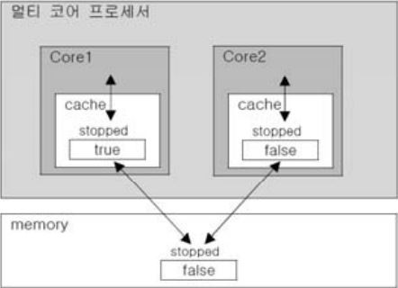

쓰레드의 동기화
===
싱글쓰레드 프로세스의 경우 별 문제가 없지만, 멀티쓰레드 프로세스의 경우 여러 쓰레드가 같은 프로세스 내의 자원을 공유해서 작업하기 때문에 서로의 작업에 영향을 주게된다.

이러한 일이 발생하는 것을 방지하기 위해서 한 쓰레드가 특정 작업을 끝마치기 전까지 다른 쓰레드에 의해 방해받지 않도록 하는 것이 필요하다. '임계 영역(critical section)'과 '잠금(락, lock)'이다.

공유 데이터를 사용하는 코드 영역을 **임계 영역**으로 지정해놓고, 공유 데이터(객체)가 가지고 있는 **lock**을 획득한 단 하나의 쓰레드만 이 영역 내의 코드를 수행할 수 있게 한다.

그리고 해당 쓰레드가 임계 영역 내의 모든 코드를 수행하고 벗어나서 lock을 반납해야만 다른 쓰레드가 반납된 lock을 획드하여 임계 영역의 코드를 수행할 수 있게 된다.

    한 쓰레드가 진행 중인 작업을 다른 쓰레드가 간섭하지 못하도록 막는 것을 '쓰레드 동기화(synchronization)'라고 한다.
    
    JDK1.5부터는 'java.util.locks'와 'java.util.concurrent.atomic'패키지를 통해서 다양한 방식으로 동기화를 구현할 수 있도록 지원하고 있다.

#### <br>

Synchronized를 이용한 동기화
---
해당 키워드는 임계영역을 설정하는데 사용된다.

1. 메서드 전체를 임계영역으로 지정
    ```java
    public synchronized void calcSum() {
        // ... 임계 영역(critical section)
    }
    ```
    메서드 앞에 synchronized를 붙이면 메서드 전체가 임계영역으로 설정된다. 쓰레드는 synchronized메서드가 호출되면 해당 메서드가 포함된 객체를 lock을 얻어 작업을 수행하다가 메서드가 종료되면 lock을 반환한다.

2. 특정 영역을 임계 영역으로 지정
    ```java
    synchronized(객체의 참조변수) {
        // ... 임계 영역(critical section)
    }
    ```
    메서드 내의 코드 일부를 블럭{ }으로 감싸고 블럭 앞에 'synchronized(참조변수)'를 붙이는 것인데, 이때 참조변수는 락을 걸고자하는 객체를 참조하는 것이어야 한다. 이 블럭을 synchronized블럭이라고 부른다.

    두 방법 모두 lock의 획득과 반납이 자동적으로 이루어지므로 우리가 임계 영역만 설정해 주면 된다.

```java
class ThreadEx21 {
    public static void main(String[] args) {
        Runnable r = new RunnableEx21();
        new Thread(r).start(); // ThreadGroup에 의해 참조되므로 gc대상이 아니다.
        new Thread(r).start(); // ThreadGroup에 의해 참조되므로 gc대상이 아니다.
    }
}

class Account {
    private int balance = 1000;

    public int getBalance() {
        return balance;
    }

    public void withdraw(int money) {
        if (balance >= money) {
            try {
                Thread.sleep(1000);
            } catch (InterruptedException e) {
            }
            balance -= money;
        }
    }
}

class RunnableEx21 implements Runnable {
    Account acc = new Account();

    @Override
    public void run() {
        while (acc.getBalance() > 0) {
            // 100, 200, 300중의 한 값을 임의로 선택해서 출금(withdraw)
            int money = (int) (Math.random() * 3 + 1) * 100;
            acc.withdraw(money);
            System.out.println("balance:" + acc.getBalance());
        }
    }
}
```
실행결과

    balance:700
    balance:700
    balance:600
    balance:600
    balance:300
    balance:200
    balance:100
    balance:-100
    balance:-200

은행계좌(account)에서 잔고(balance)를 확인하고 임의의 금액을 출금(withdraw)하는 예제이다.

잔고가 출금하려는 금액보다 큰 경우에만 출금하도록 되어 있는것을 확인할 수 있는데 실행결과를 보면 잔고가 음수인 것을 볼 수 있다.

그 이유는 한 쓰레드가 if문의 조건식을 통과하고 출금하기 바로 직전에 다른 쓰레드가 끼어들어서 출금을 먼저 했기 때문이다.

잔고를 확인하는 if문과 출금하는 문장은 하느이 임계영역으로 묶여져야 한다.

* 메서드 synchronized
```java
public synchronized void withdraw(int money) {
    if(balance>= money) {
        try {Thread.sleep(1000);} catch ( Exception e ) { }
        balance -= money;
    }
}
```
* synchronized 블럭
```java
public synchronized(this) void withdraw(int money) {
    synchronized(this)
    if(balance>= money) {
        try {Thread.sleep(1000);} catch ( Exception e ) { }
        balance -= money;
    }
}
```
한 쓰레드에 의해 먼저 withdraw()가 호출되면, 이 메서드가 종료되어 lock이 반납될 때까지 다른 쓰레드는 withdraw()를 호출하더라도 대기상태에 머물게 된다.

>둘 중 어느 쪽을 선택해도 같으니까 synchronized메서드로 하는 것이 낫다.

* 예제 ThreadEx21 synchronized 후 실행결과
```
balance:700
balance:500
balance:200
balance:100
balance:100
balance:0
balance:0
```

#### <br>

wait()과 notify()
---
synchronized로 동기화해서 공유 데이터를 보호하는 것 까지는 좋지만, 특정 쓰레드가 객체의 lock을 가진 상태로 오랜 시간을 보내지 않도록 하는 것도 중요하다.

동기화된 임계영역의 코드를 수행하다가 작업을 더 이상 진행할 상황이 아니면, 일단 wait()을 호출하여 쓰레드가 락을 반납하고 기다리게 한다. 그러면 다른 쓰레드가 락을 얻어 해당 객체에 대한 적업을 수행할 수 있게 된다.

나중에 작업을 진행할 수 있는 상황이 되면 notify()를 호출해서, 작업을 중단했던 쓰레드가 다시 락을 얻어 작업을 진행할 수 있다.

>wait()와 notify()는 특정 객체에 대한 것이므로 Object클래스에 정의되어있다

    void wait()
    void wait(long timeout)
    void wait(long timeout, int nanos)
    void notify()
    void notifyAll()


wait()은 notify() 또는 notifyAll()이 호출될 때까지 기다리지만, 매개변수가 있는 wait()은 지정된 시간동안만 기다린다.

    wait(), notify(), notifyAll()
     - Object에 정의되어 있다.
     - 동기화 블럭(synchronized블럭) 내에서만 사용할 수 있다.
     - 보다 효율적인 동기화를 가능하게 한다.

* **wait()와 notify()를 사용 하지 않은 예제**
```java
class ThreadWaitEx {
    public static void main(String[] args) throws Exception {
        Table table = new Table(); // 여러 쓰레드가 공유하는 객체

        new Thread(new Cook(table), "COOK1").start();
        new Thread(new Customer(table, "donut"), "CUST1").start();
        new Thread(new Customer(table, "burger"), "CUST2").start();

        Thread.sleep(100);
        System.exit(0);
    }
}

class Customer implements Runnable {
    private Table table;
    private String food;

    Customer(Table table, String food) {
        this.table = table;
        this.food = food;
    }

    @Override
    public void run() {
        while (true) {
            try {
                Thread.sleep(10);
            } catch (InterruptedException e) {
            }
            String name = Thread.currentThread().getName();

            table.remove(food);
            System.out.println(name + " ate a " + food);
        }
    }
}

class Cook implements Runnable {
    private Table table;

    Cook(Table table) {
        this.table = table;
    }

    @Override
    public void run() {
        while (true) {
            // 임의의 요리를 하나 선택해서 table에 추가한다.
            int idx = (int) (Math.random() * table.dishNum());
            table.add(table.dishNames[idx]);

            try {
                Thread.sleep(10);
            } catch (InterruptedException e) {
            }
        }
    }
}

class Table {
    String[] dishNames = { "donut", "donut", "burger" };
    final int MAX_FOOD = 6; // 테이블에 놓을 수 있는 최대 음식의 개수

    private ArrayList<String> dishes = new ArrayList<>();

    public synchronized void add(String dish) {
        while (dishes.size() > MAX_FOOD) {
            String name = Thread.currentThread().getName();
            System.out.println(name + " is waiting.");
            try {
                wait(); // COOK쓰레드를 기다리게 한다.
                Thread.sleep(500);
            } catch (InterruptedException e) {
            }
        }
        // 테이블에 음식이 가득 찼으면, 테이블에 음식을 추가하지 않는다.
        dishes.add(dish);
        notify(); // 기다리고 있는 CUST를 꺠우기 위함.
        System.out.println("Dishes:" + dishes.toString());
    }

    public void remove(String dishName) {
        synchronized (this) {
            String name = Thread.currentThread().getName();

            while (dishes.size() == 0) {
                System.out.println(name + " is waiting.");
                try {
                    wait(); // CUST쓰레드를 기다리게 한다.
                    Thread.sleep(500);
                } catch (InterruptedException e) {
                }
            }

            while (true) {
                for (int i = 0; i < dishes.size(); i++) {
                    if (dishName.equals(dishes.get(i))) {
                        dishes.remove(i);
                        notify(); // 잠자고 있는 COOK을 깨우기 위함
                        return;
                    }
                }
                try {
                    System.out.println(name + " is waiting.");
                    wait(); // 원하는 음식이 없는 CUST쓰레드를 기다리게 한다.
                    Thread.sleep(500);
                } catch (InterruptedException e) {
                }
            }
        }
    }

    public int dishNum() {
        return dishNames.length;
    }
}
```
실행결과

    Dishes:[donut]
    Dishes:[donut, burger]
    CUST1 ate a donut
    CUST2 ate a burger
    CUST1 is waiting.
    Dishes:[donut]
    CUST2 is waiting.

### <br>

* **wait()와 notify()를 사용 한 예제**

```java
class ThreadWaitEx {
    public static void main(String[] args) throws Exception {
        Table table = new Table(); // 여러 쓰레드가 공유하는 객체

        new Thread(new Cook(table), "COOK1").start();
        new Thread(new Customer(table, "donut"), "CUST1").start();
        new Thread(new Customer(table, "burger"), "CUST2").start();

        Thread.sleep(2000);
        System.exit(0);
    }
}

class Customer implements Runnable {
    private Table table;
    private String food;

    Customer(Table table, String food) {
        this.table = table;
        this.food = food;
    }

    @Override
    public void run() {
        while (true) {
            try {
                Thread.sleep(100);
            } catch (InterruptedException e) {
            }
            String name = Thread.currentThread().getName();

            table.remove(food);
            System.out.println(name + " ate a " + food);
        }
    }
}

class Cook implements Runnable {
    private Table table;

    Cook(Table table) {
        this.table = table;
    }

    @Override
    public void run() {
        while (true) {
            // 임의의 요리를 하나 선택해서 table에 추가한다.
            int idx = (int) (Math.random() * table.dishNum());
            table.add(table.dishNames[idx]);

            try {
                Thread.sleep(10);
            } catch (InterruptedException e) {
            }
        }
    }
}

class Table {
    String[] dishNames = { "donut", "donut", "burger" };
    final int MAX_FOOD = 6; // 테이블에 놓을 수 있는 최대 음식의 개수

    private ArrayList<String> dishes = new ArrayList<>();

    public synchronized void add(String dish) {
        while (dishes.size() >= MAX_FOOD) {
            String name = Thread.currentThread().getName();
            System.out.println(name + " is waiting.");
            try {
                wait(); // COOK쓰레드를 기다리게 한다.
                Thread.sleep(500);
            } catch (InterruptedException e) {
            }
        }
        // 테이블에 음식이 가득 찼으면, 테이블에 음식을 추가하지 않는다.
        dishes.add(dish);
        notify(); // 기다리고 있는 CUST를 꺠우기 위함.
        System.out.println("Dishes:" + dishes.toString());
    }

    public void remove(String dishName) {
        synchronized (this) {
            String name = Thread.currentThread().getName();

            while (dishes.size() == 0) {
                System.out.println(name + " is waiting.");
                try {
                    wait(); // CUST쓰레드를 기다리게 한다.
                    Thread.sleep(500);
                } catch (InterruptedException e) {
                }
            }

            while (true) {
                for (int i = 0; i < dishes.size(); i++) {
                    if (dishName.equals(dishes.get(i))) {
                        dishes.remove(i);
                        notify(); // 잠자고 있는 COOK을 깨우기 위함
                        return;
                    }
                }
                try {
                    System.out.println(name + " is waiting.");
                    wait(); // 원하는 음식이 없는 CUST쓰레드를 기다리게 한다.
                    Thread.sleep(500);
                } catch (InterruptedException e) {
                }
            }
        }
    }

    public int dishNum() {
        return dishNames.length;
    }
}
```
실행결과

    Dishes:[donut]
    Dishes:[donut, burger]
    Dishes:[donut, burger, donut]
    Dishes:[donut, burger, donut, burger]
    Dishes:[donut, burger, donut, burger, burger]
    Dishes:[donut, burger, donut, burger, burger, donut]
    COOK1 is waiting.
    CUST1 ate a donut
    Dishes:[burger, donut, burger, burger, donut, donut]
    CUST1 ate a donut
    CUST2 ate a burger
    Dishes:[burger, burger, donut, donut, burger]
    Dishes:[burger, burger, donut, donut, burger, donut]
    COOK1 is waiting.
    CUST1 ate a donut
    Dishes:[burger, burger, donut, burger, donut, donut]
    CUST2 ate a burger
    CUST1 ate a donut
    Dishes:[burger, burger, donut, donut, donut]
    Dishes:[burger, burger, donut, donut, donut, donut]
    COOK1 is waiting.
    CUST2 ate a burger
    Dishes:[burger, donut, donut, donut, donut, donut]
    CUST2 ate a burger
    CUST1 ate a donut
    Dishes:[donut, donut, donut, donut, donut]
    Dishes:[donut, donut, donut, donut, donut, burger]
    COOK1 is waiting.
    CUST1 ate a donut

#### <br>

Lock과 Condition을 이용한 동기화
---
- 'java.util.concurrent.locks'패키지가 제공하는 lock클래스들을 이용하여 동기화 한다.
- JDK1.5에 추가되었다.
- synchronized 동기화 만으로는 때로 같은 메서드 내에서만 lock을 걸 수 있다는 제약이 있어서 불편하다.
- 그럴때 lock클래스를 사용한다.

* **lock클래스의 종류**
    ```
    - ReentrantLock           재진입이 가능한 lock. 가장 일반적인 배타 lock
    - ReentrantReadWriteLock  읽기에는 공유적이고, 쓰기에는 배타적인 lock
    - StampedLock             ReentrantReadWriteLock에 난관적인 lock의 기능을 추가
    ```
>StampedLock은 JDK1.8부터 추가되었으며, 다른 lock과 달리 lock인터페이스를 구현하지 않았다.

StampedLock은 lock을 걸거나 해지할 때 '스탬프(long타입의 정수값)'를 사용하며, 읽기와 쓰기를 위한 lock외에 '낙관적 읽기 lock(optimistic reading lock)'이 추가된 것이다.

'낙관적 읽기 lock'은 쓰기 lock에 의해 바로 풀린다. 그래서 낙관적 읽기에 실패하면, 읽기 lock을 얻어서 다시 읽어 와야 한다.

**무조건 읽기 lock을 걸지 않고, 쓰기와 읽기가 충돌할 때만 쓰기가 끝난 후에 읽기 lock을 거는 것이다.**

* **StampedLock을 이용한 낙관적 읽기의 예**
```java
int getBalance() {
    long stamp = lock.tryOptimisticRead();  // 낙관적 읽기 lock을 건다.

    int curBalance = this.balance;  // 공유 데이터인 balance를 읽어온다.

    if(!lock.validate(stamp)) {     // 쓰기 lock에 의해 낙관적 읽기 lock이 풀렸는지 확인
    stamp = lock.readLock();        // lock이 풀렸으면, 읽기 lock을 얻으려고 기다린다.
    
    try {
        curBalance = this.balance;  // 공유 데이터를 다시 읽어온다.
    } finally {
        lock.unlockRead(stamp)      // 읽기 lock을 푼다.
    }

    return curBalance;  //낙관적 읽기 lock이 풀리지 않았으면 곧바로 읽어온 값을 반환
    }
}
```

<br>

### **ReentrantLock의 생성자**

    ReentrantLock()
    ReentrantLock(boolean fair)

생성자의 매개변수를 true로 주면, lock이 풀렸을 때 가장 오래 기다린 쓰레드가 lock을 획득할 수 있게 공정(fair)하게 처리한다.

그러나 공정하게 처리하려면 어떤 쓰레드가 가장 오래 기다렸는지 검증 과정을 거칠 수 밖에 없으므로 성능은 떨어진다.

    void lock()         lock을 잠근다.
    void unlock()       lock을 해지한다.
    boolean isLocked()  lock이 잠겼는지 확인한다.

```java
synchronized(lock) {
    // 임계 영역
}

lock.lock();
// 임계 영역
lock.unlock();
```
임계영역 내에서 예외가 발생하거나 return문으로 빠져 나가게 되면 lock이 풀리지 않을 수 있으므로 unlock()은 try-finally문으로 감싸는 것이 일반적이다.

    boolean tryLock()
    boolean tryLock(long timeout, TimeUnit unit) throws InterruptedException

lock()은 lock을 얻을 때까지 쓰레드를 블락(block)시키므로 쓰레드의 응답성이 나빠질 수 있다. 응답성이 중요한 경우, tryLock()을 이용해서 지정된 시간동안 lock을 얻지 못하면 다시 작업을 시도할 것인지 포기할 것인지를 사용자가 결정할 수 있게 하는 것이 좋다.

이 메서드는 InterruptedException을 발생시킬 수 있는데, 이것은 지정된 시간동안  lock을 얻으려고 기다리는 중에 interrupt()에 의해 작업을 취소될 수 있도록 코드를 작성할 수 있다는 뜻이다.

#### <br>

ReentrantLock과 Condition
---
Condition은 앞서 wait() & notify()예제에 요리사 쓰레드와 손님 쓰레드를 구분해서 통지하지 못한다는 단점을 해결하기 위한 것이다.
wait() & notify()로 쓰레드의 종류를 구분하지 않고, 공유 객체의 waiting pool에 같이 몰아넣은 대신, 손님 쓰레드를 위한 Condition과 요리사 쓰레드를 위한 Condition을 만들어서 각각의 waiting pool에서 따로 기다리도록 하면 문제는 해결된다.

Condition은 이미 생성된 lock으로부터 newCondition()을 호출해서 생성한다.

```java
private ReentrantLock lock = new ReentrantLock();   // Lock을 생성
// lock으로 condition을 생성
private Condition forCook = lock.newCondition();
private Condition forCust = lock.newCondition();
```
위의 두개의 코드를 생성하고, wait() & notify()대신 Condition의 await() & signal()을 사용하면 그걸로 끝이다.

|<center>Object</center>|<center>Condition</center>|
|-|-|
|void wait()|void await()<br>void awaitUninterruptibly()|
|void wait(long timeout)|boolean await(long time, TimeUnit unit)<br>long awaitNanos(long nanosTimeout)<br>boolean awaitUntil(Date deadline)|
|void notify()|void signal()|
|void notifyAll()|void signalAll()|

전에는 모든 쓰레드를 기다리게 할 때 wait()을 사용했는데, 이제는 wait()대신 forCook.await()과 forCust.await()을 사용함으로써 대기와 통지의 대상이 명확히 구분된다.

```java
import java.util.ArrayList;
import java.util.concurrent.locks.Condition;
import java.util.concurrent.locks.ReentrantLock;

public class ThreadWaitEx {
    public static void main(String[] args) throws Exception {
        Table table = new Table(); // 여러 쓰레드가 공유하는 객체

        new Thread(new Cook(table), "COOK1").start();
        new Thread(new Customer(table, "donut"), "CUST1").start();
        new Thread(new Customer(table, "burger"), "CUST2").start();

        Thread.sleep(2000);
        System.exit(0);
    }
}

class Customer implements Runnable {
    private Table table;
    private String food;

    Customer(Table table, String food) {
        this.table = table;
        this.food = food;
    }

    @Override
    public void run() {
        while (true) {
            try {
                Thread.sleep(100);
            } catch (InterruptedException e) {
            }
            String name = Thread.currentThread().getName();

            table.remove(food);
            System.out.println(name + " ate a " + food);
        }
    }
}

class Cook implements Runnable {
    private Table table;

    Cook(Table table) {
        this.table = table;
    }

    @Override
    public void run() {
        while (true) {
            // 임의의 요리를 하나 선택해서 table에 추가한다.
            int idx = (int) (Math.random() * table.dishNum());
            table.add(table.dishNames[idx]);

            try {
                Thread.sleep(10);
            } catch (InterruptedException e) {
            }
        }
    }
}

class Table {
    String[] dishNames = { "donut", "donut", "burger" };
    final int MAX_FOOD = 6; // 테이블에 놓을 수 있는 최대 음식의 개수

    private ArrayList<String> dishes = new ArrayList<>();

    private ReentrantLock lock = new ReentrantLock();
    private Condition forCook = lock.newCondition();
    private Condition forCust = lock.newCondition();

    public void add(String dish) {
        lock.lock();
        try {
            while (dishes.size() >= MAX_FOOD) {
                String name = Thread.currentThread().getName();
                System.out.println(name + " is waiting.");
                try {
                    forCook.await(); // COOK쓰레드를 기다리게 한다.
                    Thread.sleep(500);
                } catch (InterruptedException e) {
                }
            }
            // 테이블에 음식이 가득 찼으면, 테이블에 음식을 추가하지 않는다.
            dishes.add(dish);
            forCust.signal(); // 기다리고 있는 CUST를 꺠우기 위함.
            System.out.println("Dishes:" + dishes.toString());
        } finally {
            lock.unlock();
        }
    }

    public void remove(String dishName) {
        lock.lock();

        String name = Thread.currentThread().getName();
        try {
            while (dishes.size() == 0) {
                System.out.println(name + " is waiting.");
                try {
                    forCust.await(); // CUST쓰레드를 기다리게 한다.
                    Thread.sleep(500);
                } catch (InterruptedException e) {
                }
            }

            while (true) {
                for (int i = 0; i < dishes.size(); i++) {
                    if (dishName.equals(dishes.get(i))) {
                        dishes.remove(i);
                        forCook.signal(); // 잠자고 있는 COOK을 깨우기 위함
                        return;
                    }
                }
                try {
                    System.out.println(name + " is waiting.");
                    forCust.await(); // 원하는 음식이 없는 CUST쓰레드를 기다리게 한다.
                    Thread.sleep(500);
                } catch (InterruptedException e) {
                }
            }
        } finally {
            lock.unlock();
        }

    }

    public int dishNum() {
        return dishNames.length;
    }
}
```
실행결과

    Dishes:[burger]
    Dishes:[burger, burger]
    :
    :
    중간 생략
    :
    :
    Dishes:[burger, burger, donut, donut, donut, donut]
    COOK1 is waiting.
    CUST2 ate a burger
    CUST1 ate a donut
    Dishes:[burger, donut, donut, donut, donut]
    CUST2 ate a burger
    CUST1 ate a donut
    Dishes:[donut, donut, donut, donut]
    Dishes:[donut, donut, donut, donut, donut]
    Dishes:[donut, donut, donut, donut, donut, donut]
    COOK1 is waiting.
    CUST2 is waiting.
    CUST1 ate a donut

'기아현상'이나 '경쟁상태'가 개선되었다.

#### <br>

volatile
---
전에 suspend(), resume(), stop()을 할때 예제에서 volatile을 사용한 적이 있었다.

싱글코어프로세서가 장착된 컴퓨터에서는 해당 예제가 아무런 문제없이 실행욀 것이다. 그러나 멀티코어 프로세서에서는 코어마다 별도의 캐시를 가지고 있기 때문에 문제가 발생한다.

<p align="center">

</p>

코어는 메모리에서 읽어온 값을 캐시에 저장하고 캐시에서 값을 읽어서 작업한다. 다시 같은 값을 읽어올 때는 먼저 캐시에 있는지 확인하고 없을 때만 메모리에서 읽어온다.

그러다보니 도중에 메모리에 저장된 변수의 값이 변경되었는데도 캐시에 저장된 값이 갱신되지 않아서 메모리에 저장된 값이 다른 경우가 발생한다.

그래서 변수 stopped의 값이 바뀌었는데도 쓰레드가 멈추지 않고 계속 실행되는 것이다.

그러나 volatile을 붙이면, 코어가 변수의 값을 읽어올 때 캐시가 아닌 메모리에서 읽어오기 때문에 캐시와 메모리간의 값 불일치가 해결된다.
>volatile 대신 synchronized블럭을 사용해도 같은 효과를 얻을 수 있다.

<br>

### **volatile로 long과 double을 원자화**
JVM은 데이터를 4 byte(=32bit)단위로 처리한다. int와 int보다 작은 타입들은 한 번에, 단 하나의 명령어로 읽거나 쓰는 것이 가능하다.

하나의 명령어는 더이상 나눌 수 없는 최소의 작업단위이므로, 작업의 중간에 다른 쓰레드가 끼어들 틈이 없다.

그러나, long이나 double의 경우 크기가 8byte이기 때문에 변수의 값을 읽는 과정에서 다른 쓰레드가 끼어들 여지가 있다.

다른 쓰레드가 끼어들지 못하게 하려고 변수를 선언할 때 volatile을 붙이는 것이다.

    volatile long sharedVal;    // long타입의 변수를 원자화
    volatile double sharedVal;  // double타입의 변수를 원자화

원자화라는 것은 작업을 더 이상 나눌 수 없게 한다는 의미인데, synchronized블럭도 일종의 원자화라고 할 수 있다. 즉, synchronized블럭은 여러 문장을 원자화 함으로써 쓰레드의 동기화를 구현한 것이라고 보면 된다.

volatile은 변수의 읽거나 쓰기를 원자화 할 뿐, 동기화하는 것은 아니라는 점에 주의하자. 동기화가 필요할 땐 volatile을 쓸 수 없다.

#### <br>

fork & join 프레임웍
---
JDK1.7부터 'fork & join 프레임웍'이 추가되었고, 이 프레임웍은 하나의 작업을 작은 단위로 나눠서 여러 쓰레드가 동시에 처리하는 것을 쉽게 만들어 준다.

수행할 작업에 따라 RecursiveAction과 RecursiveTask 두 클래스 중에서 하나를 상속받아 구현해야한다.

    RecursiveAction 반환값이 없는 작업을 구현할 때 사용
    RecursiveTask   반환값이 있는 작업을 구현할 때 사용

**1부터 n까지의 합을 계산한 결과를 돌려주는 작업 예제**
```java
class SumTask extends RecursiveTask<Long> {
    long from, to;

    SumTask(long from, long t) {
        this.from = from;
        this.to = to;
    }

    public Long compute() {
        // 처리할 작업을 수행하기 위한 문장을 넣는다.
    }
}
```
그 다음에 쓰레드풀과 수행할 작업을 생성하고, invoke()로 작업을 시작한다. 쓰레드를 시작할 때 run()이 아닌 start()를 호출하는 것 처럼, fork & join프레임웍으로 수행할 작업도 compute()가 아닌 invoke()로 시작한다.

```java
ForkJoinPool pool = new ForkJoinPool(); // 쓰레드 풀을 생성
SumTask task = new SumTask(from, to);   // 수행할 작업을 생성

Long result = pool.invoke(task);        // invoke()를 호출해서 작업을 시작
```
ForkJoinPool은 fork & join프레임웍에서 제공하는 쓰레드 풀(thread pool)로, 지정된 수의 쓰레드를 생성해서 미리 만들어 놓고 반복해서 재사용할 수 있게 한다.

그리고 쓰레드를 반복해서 생성하지 않아도 된다는 장점과 너무 많은 쓰레드가 생성되어 성능이 저하되는 것을 막아준다는 장점이 있다.

>쓰레드 풀은 기본적으로 코어의 개수와 동일한 개수의 쓰레드를 생성한다.

<br>

### **compute()의 구현**

```java
public Long compute() {
    long size = to - from + 1;  // from ≤ i ≤ to

    if(size <= 5)       // 더할 숫자가 5개 이하면
        return sum();   // 숫자의 합을 반환. sum()은 from부터 to까지의 수를 더해서 반환
    
    // 범위를 반으로 나눠서 두 개의 작업을 생성
    long half = (from+to)/2;

    SumTask leftSum = new SumTask(from, half);
    SumTask rightSum = new SumTask(half+1, to);

    leftSum.fork();     // 작업(leftSum)을 작업 큐에 넣는다.

    return rightSum.compute() + leftSum.join();
}
```
실제 수행할 작업은 sum() 뿐이고 나머지는 수행할 작업의 범위를 반으로 나눠서 새로운 작업을 생성해서 실행시키기 위한 것이다. 작업의 범위를 어떻게 나눌 것인지만 정의해 주면 나머지는 항상 같은 패턴이다.

여기서는 지정된 범위를 절반을 나누어서 나눠진 범위의 합을 계산하기 위한 새로운 SumTask를 생성하는데, 이 과정은 작업이 더 이상 나눠질 수 없을 때까지, size의 값이 5보다 작거나 같을 때까지, 반복된다.

<p align="center">

</p>

1부터 8까지 숫자를 더하는 과정의 그림이다

이 그림에서는 작업 size가 2가 될 때까지 나눈다. compute()가 처음 호출되면, 더할 숫자의 범위를 반으로 나눠서 한 쪽에는 fork()를 호출해서 작업 큐에 저장한다.

하나의 쓰레드는 compute()를 재귀호출하면서 작업을 계속 반으로 나누고, 다른 쓰레드는 fork에 의해 추가된 작업을 수행한다.


<br>

### **다른 쓰레드의 작업 훔쳐오기**
fork()가 호출되어 작업 큐에 추가된 작업 역시, compute()에 의해 더 이상 나눌 수 없을 때까지 반복해서 나뉘고, 자신의 작업 큐가 비어있는 쓰레드는 다른 쓰레드의 작업 큐에서 작업을 가져와 수행한다. 이것을 작업 훔쳐오기(work stealing)라고 한다.

이 과정은 쓰레드풀에 의해 자동적으로 이루어진다.

<p align="center">

</p>

이런 과정을 통해 한 쓰레드에 작업이 몰리지 않고, 여러 쓰레드가 골고루 작업을 나누어 처리한다.

<br>

### **fork()와 join()**
- fork()는 작업을 쓰레드의 작업큐에 넣는 것
- 작업큐에 들어간 작업은 더 이상 나눌 수 없을 때까지 나뉜다.
- compute()로 나누고 fork()로 작업큐에 넣는 작업이 계속 반복된다.
- 나눠진 작업은 각 쓰레드가 골고루 나눠서 처리한다.
- 작업 결과는 join()을 호출해서 얻을 수 있다.

* **fork()와 join()의 차이**
    ```
    fork()  해당 작업을 쓰레드 풀의 작업 큐에 넣는다.
            비동기 메서드

    join()  해당 작업의 수행이 끝날 때까지 기다렸다가, 수행이 끝나면 그 결과를 반환한다.
            동기 메서드
    ```

비동기 메서드는 일반적인 메서드와 달리 메서드를 호출만 할 뿐, 그 결과를 기다리지 않는다. 그래서 fork()를 호출하면 결과를 기다리지 않고 다음 문장으로 넘어간다.

```java
public Long compute() {
    ...
    SumTask leftSum = new SumTask(from, half);
    SumTask rightSum = new SumTask(half+1, to);
    leftSum.fork();     // 비동기 메서드. 호출 후 결과를 기다리지 않는다.

    return rightSum.compute()+leftSum.join();   // 동기 메서드. 호출결과를 기다린다.
}
```

```java
import java.util.concurrent.ForkJoinPool;
import java.util.concurrent.RecursiveTask;

public class ForkJoinEx {
    static final ForkJoinPool pool = new ForkJoinPool();

    public static void main(String[] args) {
        long from = 1L, to = 100_000_000L;

        SumTask task = new SumTask(from, to);

        long start = System.currentTimeMillis(); // 시작시간 초기화
        Long result = pool.invoke(task);
        System.out.println("Elapsed time(4 Core):" + (System.currentTimeMillis() - start));

        System.out.printf("sum of %d ~ %d = %d", from, to, result);
        System.out.println();

        result = 0L;
        start = System.currentTimeMillis(); // 시작시간 초기화
        for (long i = from; i <= to; i++) {
            result += i;
        }

        System.out.println("Elapsed time(1 Core):" + (System.currentTimeMillis() - start));
        System.out.printf("sum of %d ~ %d = %d", from, to, result);
    }
}

class SumTask extends RecursiveTask<Long> {
    long from, to;

    SumTask(long from, long to) {
        this.from = from;
        this.to = to;
    }

    public Long compute() {
        long size = to - from + 1; // from ≤ i ≤ to

        if (size <= 5) // 더할 숫자가 5개 이하면
            return sum(); // 숫자의 합을 반환

        long half = (from + to) / 2;

        // 범위를 반으로 나눠서 두 개의 작업을 생성
        SumTask leftSum = new SumTask(from, half);
        SumTask rightSum = new SumTask(half + 1, to);

        leftSum.fork();

        return rightSum.compute() + leftSum.join();
    }

    long sum() {
        long tmp = 0L;

        for (long i = from; i <= to; i++)
            tmp += i;

        return tmp;
    }
}
```
실행결과

    Elapsed time(4 Core):409
    sum of 1 ~ 100000000 = 5000000050000000
    Elapsed time(1 Core):386
    sum of 1 ~ 100000000 = 5000000050000000

실행결과를 보면, fork & join프레임웍으로 계산한 결과보다 for문으로 계산한 결과가 시간이 덜 걸린 것을 알 수 있다.

항상 멀티쓰레드로 처리하는 것이 빠르다고 생각해서는 안 되고, 반드시 테스트해보고 이득이 있을 때만, 멀티쓰레드로 처리해야 한다.