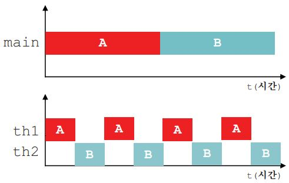

프로세스와 쓰레드
===
프로세스(porcess)란 '실행 중인 프로그램(program)'이다. 프로세스는 프로그램을 수행하는 데 필요한 데이터와 메모리 등의 자원 그리고 쓰레드로 구성되어 있으며 실제로 작업을 수행하는 것이 바로 쓰레드이다.

모든 프로세스에는 최소한 하나 이상의 쓰레드가 존재하며, 둘 이상의 쓰레드를 가진 프로세스를 '멀티쓰레드 프로세스(multi-threaded process)'라고 한다.

하나의 프로세스가 가질 수 있는 쓰레드의 개수는 제한되어 있지 않으나 쓰레드가 작업을 수행하는데 개별적인 메모리 공간(호출스택)을 필요로 하기 때문에 프로세스의 메모리 한계에 따라 생성할 수 있는 쓰레드의 수가 결정된다.

<br>

### **멀티태스킹과 멀티쓰레딩**
대부분의 OS는 멀티태스킹(multi-tasking, 다중작업)을 지원하기 때문에 여러 개의 프로세스가 동시에 실행될 수 있다. 이와 마찬가지로 멀티쓰레딩은 하나의 프로세스 내에서 여러 쓰레드가 동시에 작업을 수행하는 것이다.

CPU코어가 한 번에 단 하나의 작업만 수행할 수 있으므로, 실제로 동시에 처리되는 작업의 개수는 코어의 개수와 일치한다. 그러나 쓰레드의 수는 언제나 코어의 수보다 훨씬 많기 때문에 각 코어가 아주 짧은 시간동안 여러 작업을 번갈아 가며 수행함으로써 여러 작업들이 동시에 수행되는 것처럼 보이게 한다.

<br>

### **멀티쓰레딩 장단점**

    장점
    - CPU의 사용률을 향상시킨다.
    - 자원을 보다 효율적으로 사용할 수 있다.
    - 사용자에 대한 응답성이 향상된다.
    - 작업이 분리되어 코드가 간결해진다.

    단점
    - 멀티쓰레드 프로세스는 여러 쓰레드가 같은 프로세서 내에서 자원을 공유하면서 작업을 하기 때문에 발생할 수 있는 동기화(synchronization), 교착상태(deadlock)과 같은 문제가 발생할 수 있다.
>교착상태란 두 쓰레드가 자원을 점유한 상태에서 서로 상대편이 점여휸 자원을 사용하려고 기다리느라 진행이 멈춰있는 상태이다.

#### <br>

쓰레드의 구현과 실행
===
쓰레드를 구현하는 방법
- Thread클래스를 상속받는 방법
- Runnable인터페이스를 구현하는 방법

성능 등 별로 차이는 없지만 Thread클래스를 상속받으면 다른 클래스를 상속받을 수 없기 때문에, Runnable인터페이스를 구현하는 방법이 일반적이다.

Runnable인터페이스를  구현하는 방법은 재사용성(reusability)이 높고 코드의 일관성을 유지할 수 있다.

1. Thread클래스 상속
```java
class MyThread extends Thread {
    public void run() { /* 작업 내용 */ } // Thread클래스의 run()을 오버라이딩
}
```
2. Runnable인터페이스 구현
```java
class MyThread implements Runnable {
    public void run() { /* 작업 내용 */ } // Runnable인터페이스의 run()을 구현
}
```
>Runnable인터페이스는 오직 run()만 정의되어 있는 간단한 인터페이스이다.

**기본 사용 예제**
```java
class ThreadEx1 {
    public static void main(String[] args) {
        ThreadEx1_1 t1 = new ThreadEx1_1();

        Runnable r = new ThreadEx1_2();
        Thread t2 = new Thread(r);

        t1.start();
        t2.start();
    }
}

class ThreadEx1_1 extends Thread {
    @Override
    public void run() {
        for (int i = 0; i < 5; i++) {
            System.out.println(getName()); // 조상인 Thread의 getName()을 호출
        }
    }
}

class ThreadEx1_2 implements Runnable {
    @Override
    public void run() {
        for (int i = 0; i < 5; i++) {
            // Thread.currentThread() - 현재 실행중인 Thread를 반환한다.
            System.out.println(Thread.currentThread().getName());
        }
    }
}
```
실행결과

    Thread-0
    Thread-0
    Thread-0
    Thread-0
    Thread-0
    Thread-1
    Thread-1
    Thread-1
    Thread-1
    Thread-1

Runnable인터페이스를 구현한 경우, Runnable인터페이스를 구현한 클래스의 인스턴스를 생성한 다음, 이 인스턴스를 Thread클래스의 생성자의 매개변수로 제공해야 한다.

```java
public class Thread {
    private Runnable r; //Runnable을 구현한 클래스의 인스턴스를 참조하기 위한 변수
    public Thread(Runnable r) {
        this.r = r;
    }

    public void run() {
        if(r! = null)
            r.run();    //Runnable 인터페이스를 구현한 인스턴스의 run()을 호출
    }
}
```
위의 소스코드는 Thread.java를 이해하기 쉽게 수정한 것인데, 인스턴스변수로 Runnable타입의 변수 r을 선언해 놓고 생성자를 통해서 Runnable인터페이스를 구현한 인스턴스를 참조하도록 되어 있는 것을 확인 할 수 있다.

run()을 호출하면 참조변수 r을 통해서 Runnable인터페이스를 구현한 인스턴스의 run()이 호출된다. 이렇게 함으로써 상속을 통해 run()을 오버라이딩 하지 않고도 외부로부터 run()을 제공받을 수 있게 된다.

Runnable을 구현하면서 Thread클래스의 static메서드인 currentThread()를 호출하여 쓰레드에 대한 참조를 얻어 와야만 호출이 가능하다.

    static Thread currentThread()   현재 실행중인 쓰레드의 참조를 반환한다.
    String getName()                쓰레드의 이름을 반환

그리고 쓰레드의 이름은 생성자나 메서드를 통해서 지정 또는 변경할 수 있다.

    Thread(Runnable target, String name)
    Thread(String name)
    void setName(String name)

<br>

### **쓰레드의 실행 - start()**
쓰레드를 생성 후 start()를 호출해야 실행이 가능하다.
정확히는 start()가 호출되었다고 바로 실행되는 것이 아니라, 일단 실행대기 상태에 있다가 자신의 차례가 되어야 실행된다.

실행 대기중인 쓰레드가 하나도 없으면 곧바로 실행된다.
>쓰레드의 실행순서는 OS의 스케쥴러가 작성한 스케쥴에 의해 결정된다.

그리고 한번 실행이 종료된 쓰레드는 다시 실행할 수 없다. 즉, 하나의 쓰레드에 대해 start()가 한 번만 호출될 수 있다는 뜻이다.

만일 쓰레드의 작업을 한 번 더 수행해야 한다면 새로운 쓰레드를 생성한 다음에 start()를 호출해야 한다. 만약 하나의 쓰레드에 대해 start()를 두 번 이상 호출하면 실행시에 IllegalThreadStateException이 발생한다.
```java
ThreadEx1_1 t1 = new ThreadEx1_1();
t1.start();
t1 = new ThreadEx1_1(); // 다시 생성
t1.start(); // OK
```
#### <br>

start()와 run()
===
main메서드에서 run()을 호출하는 것은 생성된 쓰레드를 실행시키는 것이 아니라 단순히 클래스에 선언된 메서드를 호출하는 것일 뿐이다.

반면에 start()는 새로운 쓰레드가 작업을 실행하는데 필요한 호출스택(call stack)을 생성한 다음에 run()을 호출해서, 생성된 호출스택에 run()이 첫 번째로 올라가게 한다.

- **새로운 쓰레드를 생성하고 start()를 호출한 후 호출스택 변화**
<p align="center">

</p>

    1. main메서드에서 쓰레드의 start()를 호출한다.
    2. start()는 새로운 쓰레드를 생성하고, 쓰레드가 작업하는데 사용될 호출스택을 생성한다.
    3. 새로 생성된 호출스택에 run()이 호출되어, 쓰레드가 독립된 공간에서 작업을 수행한다.
    4. 이제는 호출스택이 2개이므로 스케줄러가 정한 순서에 의해서 번갈아 가면서 실행된다.

호출스택의 가장 위에 있는 메서드가 현재 실행 중인 메서드 이지만 위의 그림에서 처럼 쓰레드가 둘 이상일 때는 호출스택의 최상위에 있는 메서드일지라도 대기상태에 있을 수 있다.

스케줄러는 실행대기중인 쓰레드들의 우선순위를 고려하여 실행순서와 실행시간을 결정하고, 각 쓰레드들은 작성된 스케줄에 따라 자신의 순서가 되면 지정된 시간동안 작업을 수행한다.

<br>

### **main쓰레드**
main메서드의 작업을 수행하는 것도 쓰레드이다. 이를 main쓰레드 라고 한다.

지금까지는 main메서드가 수행을 마치면 프로그램이 종료되었으나, main메서드가 수행을 마쳤다하더라도 다른 쓰레드가 아직 작업을 마치지 않은 상태면 프로그램이 종료되지 않는다.

    실행중인 사용자 쓰레드가 하나도 없을 때 프로그램은 종료된다.

**메인과 따로 작동하는 Thread 확인 예제**
```java
class ThreadEx2 {
    public static void main(String[] args) {
        ThreadEx2_1 t1 = new ThreadEx2_1();
        t1.start();
    }
}

class ThreadEx2_1 extends Thread {
    public void run() {
        throwException();
    }

    public void throwException() {
        try {
            throw new Exception();
        } catch (Exception e) {
            e.printStackTrace();
        }
    }
}
```
실행결과

    java.lang.Exception
        at Ex_22_01_24.ThreadEx2_1.throwException(ThreadEx.java:52)
        at Ex_22_01_24.ThreadEx2_1.run(ThreadEx.java:47)

새로 생성한 쓰레드에서 고의로 예외를 발생시킨 후 예외 메시지를 보았다. 호출스택의 첫 번째 메서드가 main메서드가 아니라 run메서드인 것을 확인하자

한 쓰레드가 예외가 발생해서 종료되어도 다른 쓰레드의 실행에는 영향을 미치지 않는다. 위의 예외가 나올 시점에선 이미 main쓰레드가 종료되었다.

#### <br>

싱글쓰레드와 멀티쓰레드
===
두 개의 작업을하나의 쓰레드(th1)로 처리하는 경우와 두 개의 쓰레드(th1, th2)로 처리하는 경우를 가정해보자, 하나의 쓰레드로 두 작업을 처리하는 경우는 한 작업이 마친 후에 다른 작업을 시작하지만, 두 개의 쓰레드로 작업을 하는 경우에는 짧은 시간동안 2개의 쓰레드(th1, th2)가 번갈아 가면서 작업을 수행해서 동시에 두 작업이 처리되는 것과 같이 느끼게 한다.

- **싱글쓰레드와 멀티쓰레드의 비교(싱글코어)**
<p align="center">

</p>
위의 그래프에서 알 수 있듯이 두 작업의 수행시간은 거의 같다. 오히려 두 개의 쓰레드로 작업한 시간이 싱글쓰레드로 작업한 시간보다 더 걸리게 된다. 그 이유는 쓰레드간 작업 전환(context switching)에 시간이 걸리기 때문이다.

작업 전환을 할 때는 현재 진행 중인 작업의 상태를 저장하고 읽어 오는 시간이 소요된다. 참고로 쓰레드의 스위칭에 비해 프로세스의 스위칭이 더많은 정보를 저장해야하므로 더 많은 시간이 소요된다.

그래서 싱글 코어에서 단순히 CPU만을 사용하는 계산작업이라면 오히려 멀티쓰레드보다 싱클쓰레드로 프로그램이하는 것이 더 효율적이다.

```java
class ThreadEx4 {
    public static void main(String[] args) {
        long startTime = System.currentTimeMillis();

        for (int i = 0; i < 300; i++) {
            System.out.printf("%s", new String("-"));
        }
        System.out.println("소요시간1:" + (System.currentTimeMillis() - startTime));

        for (int i = 0; i < 300; i++) {
            System.out.printf("%s", new String("|"));
        }
        System.out.println("소요시간2:" + (System.currentTimeMillis() - startTime));
    }
}
```
실행결과

    ------------------------------------------------------------------------------소요시간1:28
    ||||||||||||||||||||||||||||||||||||||||||||||||||||||||||||||||||||||||||||||||||||||||||||||||||||||||||||||||||||||||||||||||||||||||||||||||||||||||||||||||||||||||||||||||||||||||||||||||||||||||||||||||||||||||||||||||||||||||||||||||||||||||||||||||||||||||||||||||||||||||||||||||||||||||||||소요시간2:40

```java
class ThreadEx5 {
    static long startTime = 0;

    public static void main(String[] args) {
        ThreadEx5_1 th1 = new ThreadEx5_1();
        th1.start();
        startTime = System.currentTimeMillis();

        for (int i = 0; i < 300; i++) {
            System.out.printf("%s", new String("-"));
        }
        System.out.print("소요시간1:" + (System.currentTimeMillis() - ThreadEx5.startTime));
    }
}

class ThreadEx5_1 extends Thread {
    public void run() {
        for (int i = 0; i < 300; i++) {
            System.out.printf("%s", new String("|"));
        }
        System.out.print("소요시간2:" + (System.currentTimeMillis() - ThreadEx5.startTime));
    }
}
```
실행결과

    ---|--||----------||||||||||||||--------------|--------------|||||||||||||-----||||||||||||||||||||||----------------------|||--------|||||||||-----------------|----------------|||||||||||||||||||||||-----------||||||||||||||||------------------||||-----||--------------------|||||||||||||||||||||||||||||||||||||||||||||||||||||||||||||||||||||||||||||||---------------------------|||||||||-|||||||||||||--------------------|||||||||||||||||||||||||||||||||||||||||||||-----------------------------|||||||||||||--------|||||||||||||||||||||||||||||--------------------------------------------------|소요시간1:43소요시간2:43

멀티쓰레드가 싱글쓰레드에 보다 약간 시간이 더 걸린 것을 볼 수 있고, 실행할 때마다 다른 결과를 얻을 수 있는데 그 이유는 실행중인 예제프로그램이 OS의 프로세스 스케줄러의 영향을 받기 때문이다.

프로세스가 프로세스 스케줄러에게 할당되는 실행시간이 일정하지 않고 쓰레드에게 할당되는 시간 역시 일정하지 않게 된다. 그래서 쓰레드가 이런 불확실성을 가지고 있다는 것을 염두해 두어야 한다.

두 쓰레드가 서로 다른 자원을 사용하는 작업의 경우 싱글쓰레드보다 멀티쓰레드 프로세스가 더 효율적이다. 예를 들면 사용자로부터 데이터를 입력받는 작업, 네트워크로 파일을 주고받는 작업, 프린터로 파일을 출력하는 작업과 같이 외부기기와의 입출력을 필요로 하는 경우가 이에 해당한다.