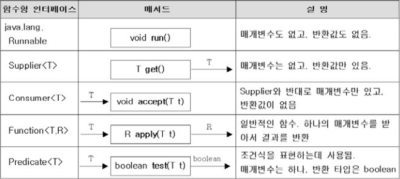
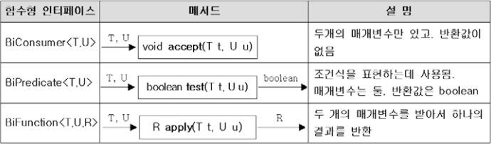
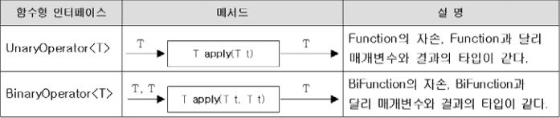
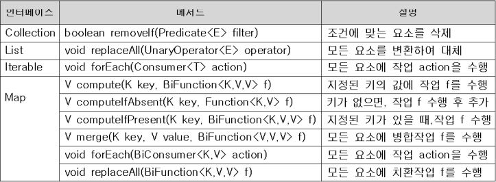
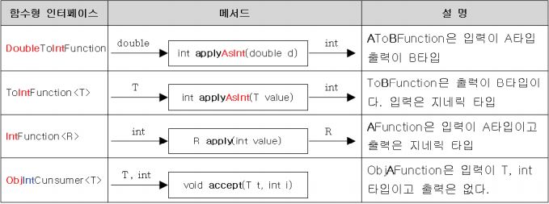
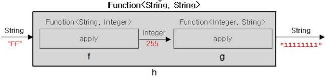
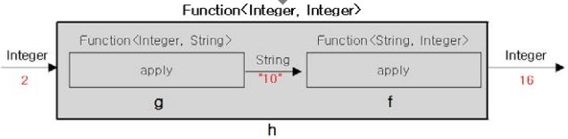
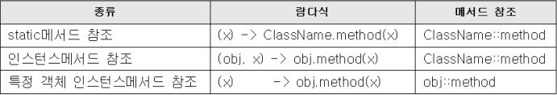

람다식
===
- JDK1.8부터 추가되었다.
- 람다식의 도입으로 인해, 객체지향언어인 동시에 함수형 언어가 되었다.
- 기존의 자바를 거의 변경하지 않고도 함수형 언어의 장점을 잘 접목시키는데 성공했다.

#### <br>

람다식이란?
---
- 메서드를 하나의 '식(expression)'으로 표현한 것이다. 
- 함수를 간략하면서도 명확한 식으로 표현할 수 있게 해준다.
- 메서드를 람다식으로 표현하면 메서드의 이름과 반환값이 없어진다.
- '익명 함수(anonymous function)'이라고도 한다.

```java
int[] arr = new int[5];
Arrays.setAll(arr, (i) -> (int)(Math.random() * 5) + 1)
```
위의 람다식이 하는 일을 일반 메서드로 표현하면 다음과 같다.
```java
int method() {
    return (int) (Math.random() * 5) + 1;
}
```

#### <br>

람다식 작성하기
---
람다식은 '익명 함수'답게 메서드에서 이름과 반환타입을 제거하고 매개변수 선언부와 몸통{} 사이에 '->'를 추가한다.

    반환타입 메서드이름 (매개변수) {
        문장
    }

    반환타입(사라짐) 메서드이름(사라짐) (매개변수) -> {
        문장
    }

두 값중 큰 값을 반환하는 메서드 max를 람다식으로 표현

    (int a, int b) -> {
        return a > b ? a : b;
    }

람다식에 선언된 매개변수의 타입은 추론이 가능한 경우는 생략할 수 있다. 반환타입이 없는 이유도 항상 추론이 가능하기 때문이다.

    (int a, int b) -> a > b ? a : b;
    (a, b) -> a > b ? a : b;

아래와 같이 선언된 매개변수가 하나뿐인 경우에는 괄호()를 생략할 수 있다. 단, 매개변수 타입이 있으면 생략할 수 없다.

    a -> a * a

마찬가지로 괄호{} 안의 문장이 하나일 때는 괄호{}를 생략할 수 있다. 이 때 문장의 끝에 ';'을 붙이지 않아야 한다는 것에 주의하자.

    (String name, int i) -> System.out.println(name + "=" + i)

그러나 괄호 안의 문장이 return문일 경우 괄호{}를 생략할 수 없다

    (int a, int b) -> { return a > b ? a : b; }


* **메서드를 람다식으로 변환한 예**

``` java
int max(int a, int b){
    return a > b ? a : b;
}

(a, b) -> a > b ? a : b;
```
```java
void printVar(String name, int i) {
    System.out.println(name+"=" + i)
}

(name, i) -> System.out.println(name+"=" + i)
```
```java
int aquar(int x) {
    return x * x;
}

x -> x * x;
```
```java
int roll() {
    return (int) (Math.random() * 6);
}

() -> ((int) (Math.random() * 6))
```
```java
int sumArr(int[] arr) {
    int sum = 0;
    for(int i : arr)
        sum += i;
    
    return sum;
}

arr -> {
    int sum = 0
    for(int i : arr)
        sum += i;
    
    return sum;
}
```

#### <br>

함수형 인터페이스(Functional Interface)
---
람다식은 익명 클래스의 객체와 동등하다.

- 익명 객체의 메서드를 호출하는 방법

```java
타입 f = (int a, int b) -> a > b ? a : b;
```

참조변수 f의 타입은 참조형이기 때문에 클래스 또는 인터페이스가 가능하다. 그리고 **람다식과 동등한 메서드가 정의**되어 있는 것이어야 한다.

```java
interface MyFunction {
    public abstract int max(int a, int b);
}
```
위의 인터페이스를 구현한 익명 클래스의 객체는 다음과 같이 생성할 수 있다.
```java
    MyFunction f = Myfunction() {
        public int max(int a, int b) {
            return a > b ? a : b;
        }
    };

    int big = f.max(5, 3) // 익명 객체의 메서드를 호출
```
MyFunction인터페이스에 정의된 메서드 max()는 예제의 람다식과 선언부가 일치한다.

그래서 위 코드의 익명 객체를 람다식으로 아래와 같이 대체 가능하다.
```java
MyFunction f = (int a, int b) -> a > b ? a : b // 익명 객체를 람다식으로 대체
int big = f.max(5,3); // 익명 객체의 메서드를 호출
```
이처럼 익명 객체를 람다식으로 대체가 가능한 이유는, 람다식도 실제로는 익명 객체이고, MyFunction인터페이스를 구현한 익명 객체의 메서드 max()와 람다식의 매개변수의 타입과 개수 그리고 반환값이 일치하기 때문이다.

하나의 메서드가 선언된 인터페이스를 정의해서 람다식을 다루는 것은 기존의 자바의 규칙들을 어기지 않으면서도 자연스럽다.

그래서 인터페이스를 통해 람다식을 다루기로 결정되었으며, 람다식을 다루기 위한 인터페이스를 '함수형 인터페이스(functional interface)'라고 부르기로 했다.
```java
@FunctionalInterface
interface MyFunction {  // 함수형 인터페이스 정의
    public abstract int max(int a, int b);
}
```
단, 함수형 인터페이스에는 오직 하나의 추상 메서드만 정의되어 있어야 한다는 제약이 있다. 그래야 람다식과 인터페이스 메서드가 1:1로 연결될 수 있기 때문이다.

반면에 static메서드와 default메서드의 개수에는 제약이 없다.

>'@FunctionalInterface'를 붙이면, 컴파일러가 함수형 인터페이스를 올바르게 정의하였는지 확인해주므로 꼭 붙이도록 하자.

```java
List<String> list = Arrays.asList("abc","aaa","bbb","ddd","aaa");
Collections.sort(list, new Comparator<String>() {
    public int compare(String s1, String s2) {
        return s2.compareTo(s1);
    }
});
```
위의 코드를 람다식으로 고쳐보면
```java
List<String> list = Arrays.asList("abc","aaa","bbb","ddd","aaa");
Collections.sort(list, (s1, s2) -> s2.compareTo(s1))
```

<br>

### **함수형 인터페이스 타입의 매개변수와 반환타입**
```java
@FunctionalInterface
interface MyFunction {
    void myMethod();
}
```
함수형 인터페이스가 위와 같이 정의되어 있을 때, 메서드의 매개변수가 MyFunction타입이면, 이 메서드를 호출할 때 람다식을 참조하는 참조변수를 매개변수로 지정해야 한다는 뜻이다.
```java
void aMethod(MyFunction f) {    // 매개변수의 타입이 함수형 인터페이스
    f.myMethod();               // MyFunction에 정의된 메서드 호출
}

...

MyFunction f = () -> System.out.println("myMethod()");
aMethod(f);
```
또는 참조변수 없이 아래와 같이 직접 람다식을 매개변수로 지정하는 것도 가능하다.

    aMethod(() -> System.out.println("myMothod()"));    람다식을 매개변수로 저장

메서드의 반환타입이 함수형 인터페이스타입이라면, 이 함수형 인터페이스의 추상메서드와 동등한 람다식을 가리키는 참조변수를 반환하거나 람다식을 직접 반환할 수 있다.

```java
MyFunction myMethod() {
    MyFunction f = () -> {};
    return f;           // 이 줄과 윗 줄을 한 줄로 줄이면, return () -> {};
}
```

람다식을 참조변수로 다룰 수 있다는 것은 메서드를 통해 변수처럼 람다식을 주고받을 수 있다는 뜻이다. 사실상 메서드가 아니라 객체를 주고받는 것이라 근본적으로 달라진 것은 아무것도 없지만, 람다식 덕분에 예전보다 코드가 더 간결하고 이해하기 쉬워졌다.

예제
```java
@FunctionalInterface
interface MyFunction {
    void run(); // public abstract void run();
}

class LambdaEx1 {
    static void execute(MyFunction f) { // 매개변수의 타입이 MyFunction인 메서드
        f.run();
    }

    static MyFunction getMyFunction() {
        MyFunction f = () -> System.out.println("f3.run()");
        return f;
    }

    public static void main(String[] args) {
        // 람다식으로 MyFunction의 run() 구현
        MyFunction f1 = () -> System.out.println("f1.run()");

        MyFunction f2 = new MyFunction() { // 익명클래스로 run()을 구현
            public void run() { // public을 반드시 붙여야 함
                System.out.println("f2.run()");
            }
        };

        MyFunction f3 = getMyFunction();

        f1.run();
        f2.run();
        f3.run();

        execute(f1);
        execute(() -> System.out.println("run()"));
    }

}
```
실행화면

    f1.run()
    f2.run()
    f3.run()
    f1.run()
    run()

<br>

### **람다식의 타입과 형변환**
함수형 인터페이스로 람다식을 참조할 수 있는 것일 뿐, 람다식의 타입이 함수형 인터페이스의 타입과 일치하는 것은 아니다. 람다식은 익명 객체이고 익명 객체는 타입이 없다.

람다식은 이름이 없을 뿐 분명히 객체인데도, Object타입으로 형변환 할 수 없다. 람다식은 오직 함수형 인터페이스로만 형변환이 가능하다.

굳이 Object타입으로 형변환하려면, 먼저 함수형 인터페이스로 변환해야 한다.

    Object obj = (Object) (MyFunction) (() -> {});
    String str = ((Object) (MyFunction) (() -> {})).toString();

예제
```java
@FunctionalInterface
interface MyFunction{
    void  myMethod();   // public abstract void myMethod();
}

public class LambdaEx2 {
    public static void main(String[] args) {
        MyFunction f = () -> {};    // MyFunction f = (MyFunction)( () -> {});
        Object obj = (MyFunction)( () -> {}); // Object타입으로 형변환이 생략됨
        String str = ((Object)(MyFunction)(() -> {})).toString();

        System.out.println(f);
        System.out.println(obj);
        System.out.println(str);

        System.out.println((MyFunction) (() -> {}));
        System.out.println(((Object)(MyFunction)(()-> {})).toString());
    }
}
```
실행결과

    Ex_22_01_25_Lambda.LambdaEx2$$Lambda$1/471910020@3e3abc88
    Ex_22_01_25_Lambda.LambdaEx2$$Lambda$2/303563356@6ce253f1
    Ex_22_01_25_Lambda.LambdaEx2$$Lambda$3/135721597@87aac27
    Ex_22_01_25_Lambda.LambdaEx2$$Lambda$4/1406718218@e9e54c2
    Ex_22_01_25_Lambda.LambdaEx2$$Lambda$5/1705736037@1b28cdfa
<br>

    컴파일러가 람다식의 타입을 어떤 형식으로 만들어내는지 알 수 있다. 일반적인 익명 객체라면, 객체의 타입이 '외부클래스이름$번호'와 같은 형식으로 타입이 결정되었으 텐데, 람다식의 타입은 '외부클래스이름$$Lambda$번호'와 같은 형식으로 되어 있는 것을 확인 할 수 있다.

### **외부 변수를 참조하는 람다식**
람다식도 익명클래스의 인스턴스이므로 람다식에서 외부에 선언된 변수에 접근하는 규칙은 앞서 익명 클래스에서 배운 것과 동일하다.

**P.409 7-35예제 람다식을 사용해서 변경한 예제**
```java
@FunctionalInterface
interface MyFunction {
    void myMethod(); // public abstract void myMethod();
}

class Outer {
    int val = 10; // Outer.this.val

    class Inner {
        int val = 20; // this.val

        void method(int i) { // void method(final int i){
            int val = 30; // final int val = 30;
            // i = 10; // 에러. 상수의 값을 변경할 수 없음

            MyFunction f = () -> {
                System.out.println("             i :" + i);
                System.out.println("           val :" + val);
                System.out.println("      this.val :" + ++this.val);
                System.out.println("Outer.this.val :" + ++Outer.this.val);
            };
            f.myMethod();
        }
    }
}

class LambdaEx3 {
    public static void main(String[] args) {
        Outer outer = new Outer();
        Outer.Inner inner = outer.new Inner();
        inner.method(100);
    }
}
```
실행결과

                 i :100
               val :30
          this.val :21
    Outer.this.val :11

람다식 내에서 참조하는 지역변수는 final이 붙지 않았어도 상수로 간주된다. 람다식 내에서 지역변수 i와 val을 참조하고 있으므로 람다식 내에서나 다른 어느 곳에서도 이 변수들의 값을 변경하는 일은 허용되지 않는다.

#### <br>

java.util.function패키지
---
대부분의 메서드는 타입이 비슷하고, 매개변수가 없거나 한개 또는 두 개, 반환 값은 없거나 한개. 게다가 지네릭 메서드로 정의하면 매개변수나 반환 타입이 달라도 문제가 되지 않는다.

그래서 java.util.function패키지에 일반적으로 자주 쓰이는 형식의 메서드를 함수형 인터페이스로 미리 정의해 놓았다. 

매번 새로운 함수형 인터페이스를 정의하지 말고, 가능하면 이 패키지의 인터페이스를 사용하는 것이 좋다.

- **java.util.function패키지의 주요 함수형 인터페이스**
<p align="center">

</p>

매개변수와 반환값의 유무에 따라 4개의 함수형 인터페이스가 정의되어 있고, Function의 변형으로 Predicate가 있는데, 반환값이 boolean이라는 것만 제외하면 Function과 동일하다. Predicate는 조건식을 함수로 표현하는데 사용된다.
>타입 문자 'T'는 'Type'을, 'R'은 'Return Type'을 의미한다.

<br>

### **조건식의 표현에 사용되는 Predicate**
Predicate는 조건식을 람다식으로 표현하는데 사용된다.

```java
Predicate<Stirng> isEmptyStr = s -> s.length() == 0;
String s = "";

if(isEmptyStr.test(s))  // if(s.length() == 0)
    System.out.println("This is an empty String.");
```

### **매개변수가 두 개인 함수형 인터페이스**
매개변수 개수가 2개인 함수형 인터페이스는 이름 앞에 접두사 'Bi'가 붙는다.

<p align="center">

</p>

>Supplier는 매개변수는 없고 반환만 존재하는데, 메서드는 두 개의 값을 반환할 수 없으므로 BiSupplier가 없는 것이다.

만일 두 개 이상의 매개변수를 갖는 함수형 인터페이스가 필요하다면 직접 만들어서 써야한다. 만일 3개의 매개변수를 갖는 함수형 인터페이스를 선언한다면 다음과 같을 것이다.

```java
@FunctionalInterface
interface TriFunction<T,U,V,R> {
    R apply(T t, U u, V v);
}
```

<br>

### **UnaryOperator와 BinaryOperator**
Function의 또 다른 변형으로 매개변수의 타입과 반환타입의 타입이 모두 일치한다는 점만 제외하고는 Function고 같다.

<p align="center">

</p>

```java
@FunctionalInterface
public interface UnaryOperator<T> extends Function<T,T> {
    static <T> UnaryOperator<T> identify() {
        return t -> t;
    }
}
```
```java
@FunctionalInterface
public interface Function<T,R> {
    R apply(T t);
    ...
}
```

<br>

### **컬렉션 프레임웍과 함수형 인터페이스**
컬렉션 프레임웍의 인터페이스에 다수의 디폴트 메서드가 추가되었는데, 그 중의 일부는 함수형 인터페이스를 사용한다.

<p align="center">

</p>

Map인터페이스에 있는 'compute'로 시작하는 메서드들은 맵의 value를 변환하는 일을 하고 marge()는 Map을 병합하는 일을 한다.

**컬렉션프레임웍 예제**
```java
class LambdaEx4 {
    public static void main(String[] args) {
        ArrayList<Integer> list = new ArrayList<>();
        for (int i = 0; i < 10; i++) {
            list.add(i);
        }

        // list의 모든 요소를 출력
        list.forEach(i -> System.out.print(i + ", "));
        System.out.println();

        // list에서 2 또는 3의 배수를 제거한다.
        list.removeIf(x -> x % 2 == 0 || x % 3 == 0);
        System.out.println(list);

        list.replaceAll(i -> i * 10);
        System.out.println(list);

        Map<String, String> map = new HashMap<>();
        map.put("1", "1");
        map.put("2", "2");
        map.put("3", "3");
        map.put("4", "4");
        map.put("5", "5");

        // map의 모든 요소를 {k, v}의 형식으로 출력
        map.forEach((k, v) -> System.out.print("{" + k + "," + v + "},"));
        System.out.println();
    }
}
```
실행예제

    0, 1, 2, 3, 4, 5, 6, 7, 8, 9, 
    [1, 5, 7]
    [10, 50, 70]
    {1,1},{2,2},{3,3},{4,4},{5,5},

<br>

**앞에서 설명한 함수형 인터페이스 사용 예제**
```java
class LambdaEx5 {
    public static void main(String[] args) {
        Supplier<Integer> s = () -> (int) (Math.random() * 100) + 1;
        Consumer<Integer> c = i -> System.out.print(i + ", ");
        Predicate<Integer> p = i -> i % 2 == 0;
        Function<Integer, Integer> f = i -> i / 10 * 10; // i의 1의자리를 없앤다.
        List<Integer> list = new ArrayList<>();
        makeRandomList(s, list);
        System.out.println(list);
        printEvenNum(p, c, list);
        List<Integer> newList = doSomthing(f, list);
        System.out.println(newList);
    }

    static <T> List<T> doSomthing(Function<T, T> f, List<T> list) {
        List<T> newList = new ArrayList<T>(list.size());

        for (T i : list) {
            newList.add(f.apply(i));
        }

        return newList;
    }

    static <T> void printEvenNum(Predicate<T> p, Consumer<T> c, List<T> list) {
        System.out.print("[");
        for (T i : list) {
            if (p.test(i))
                c.accept(i);
        }
        System.out.println("]");
    }

    static <T> void makeRandomList(Supplier<T> s, List<T> list) {
        for (int i = 0; i < 10; i++) {
            list.add(s.get());
        }
    }
}
```
실행결과

    [39, 37, 50, 99, 3, 21, 10, 90, 86, 27]
    [50, 10, 90, 86, ]
    [30, 30, 50, 90, 0, 20, 10, 90, 80, 20]

<br>

### **기본형을 사용하는 함수형 인터페이스**
기본형 타입의 값을 처리할 때도 래퍼(wrapper)클래스를 사용해왔다. 그러나 기본형 대신 래퍼클래스를 사용하는 것은 당연히 비효율적이다. 그래서 보다 효율적으로 처리할 수 있도록 기본형을 사용하는 함수형 인터페이스들이 제공된다.

<p align="center">

</p>

```java
class LambdaEx6 {
    public static void main(String[] args) {
        IntSupplier s = () -> (int) (Math.random() * 100) + 1;
        IntConsumer c = i -> System.out.print(i + ", ");
        IntPredicate p = i -> i % 2 == 0;
        IntUnaryOperator op = i -> i / 10 * 10; // i의 일자리를 없앤다.

        int[] arr = new int[10];

        makeRandomList(s, arr);
        System.out.println(Arrays.toString(arr));
        printEvenNum(p, c, arr);
        int[] newArr = doSomthing(op, arr);
        System.out.println(Arrays.toString(newArr));
    }

    static void makeRandomList(IntSupplier s, int[] arr) {
        for (int i = 0; i < arr.length; i++) {
            arr[i] = s.getAsInt(); // get() 이 아니라 getAsInt()임에 주의
        }
    }

    static void printEvenNum(IntPredicate p, IntConsumer c, int[] arr) {
        System.out.print("[");
        for (int i : arr) {
            if (p.test(i))
                c.accept(i);
        }
        System.out.println("]");
    }

    static int[] doSomthing(IntUnaryOperator op, int[] arr) {
        int[] newArr = new int[arr.length];

        for (int i = 0; i < newArr.length; i++) {
            newArr[i] = op.applyAsInt(arr[i]); // apply가 아님에 주의
        }
        return newArr;
    }
}
```
실행결과

    [71, 60, 27, 2, 61, 12, 84, 89, 51, 54]
    [60, 2, 12, 84, 54, ]
    [70, 60, 20, 0, 60, 10, 80, 80, 50, 50]

#### <br>

Function의 합성과 Predicate의 결합
---
java.util.function패키지의함수형 인터페이스에는 추상메서드 외에도 디폴트 메서드와 static 메서드가 정의되어 있다. Function과 Predicate에 정의된 메서드에 대해서만 살펴보아도 다른 함수형 인터페이스의 메서드도 유사하기 때문에 이 두 함수형 인터페이스에 대한 설명만으로 충분히 응용이 가능하다.

```java
Function
default <V> Function<T, V> andThen(Function<? super R, ? extends V> after)
default <V> Function<V, R> compose(Function<? super V, ? extends T> before)
static  <T> Function<T, T> identity()

Predicate
default Predicate<T>        and(Predicate<? super T> other)
default Predicate<T>        or(Predicate<? super T> other)
default Predicate<T>        negate()
static <T> </T>Predicate<T> isEqual(Object targetRef)
```

<br>

### **Function의 합성**
- 두 람다식을 합성해서 새로운 람다식을 만들 수 있다.
- 함수 f, g가 있을 때, f.andThen(g)는 함수 f를 먼저 적용하고 f.compose(g)는 그 반대이다.

문자열을 숫자로 변환하는 함수 f와 숫자를 2진 문자열로 변환하는 함수 g를 andThen()으로 합성하여 새로운 함수 h를 만들어낼 수 있다.

```java
Function<String, Integer> f = (s) -> Integer.parseInt(s, 16);
Function<Integer, String> g = (i) -> Integer.toBinaryString(i);
Function<String, String> h = f.andThen(g);
```
<p align="center">

</p>

함수 h의 지네릭 타입이 '<String, String>' 이다. 즉, String을 입력받아서 String을 결과로 반환한다. 예를 들어 함수 h열에 문자열 "FF"를 입력하면, 결과로 "11111111"을 얻는다.

<br>

이번엔 compose()를 이용해서 두 함수를 반대의 순서로 합성해보자

```java
Function<Integer, String> g = (i) -> Integer.toBinaryString(i);
Function<String, Integer> f = (s) -> Integer.parseInt(s, 16);
Function<String, String> h = f.andThen(g);
```
<p align="center">

</p>

이전과 달리 함수 h의 지네릭 타입이 '<Integer, Integer>'이다. 함수 h에 숫자 2를 입력하면 결과로 16을 얻는다.
>함수 f는 "10"을 16진수로 인식하기 때문에 16을 결과로 얻는다.

<br>

그리고 identity()는 함수를 적용하기 이전과 이후가 동일한 '항등 함수'가 필요할 때 사용한다.

<br>

### **Predicate의 결합**
여러 조건식을 논리 연산자인 &&, ||, ! 으로 연결해서 하나의 식을구성할 수 있는 것처럼, 여러 predicate를 and(), or(), negate()로 연결해서 하나의 새로운 Predicate로 결합할 수 있다.

```java
Predicate<Integer> p = i -> i < 100;
Predicate<Integer> q = i -> i < 200;
Predicate<Integer> r = i -> i%2 == 0;
Predicate<Integer> notP = p.negate();   // i >= 100

// 100 <= i && (i < 200 || i%2 ==0)
Predicate<Integer> all = notP.and(q.or(r));
System.out.println(all.test(150));
```
이처럼 여러 조건식을 하나로 합칠 수 있다. 아래와 같이 람다식을 직접 넣어도 된다.
```java
Predicate<Integer> all = notP.and(i -> i < 200).or(i -> i%2 == 0);
```
>Predicate의 끝에 negate()를 붙이면 조건식 전체가 부정이 된다.

그리고 static 메서드인 isEqual()은 두 대상을 비교하는 Pridicate를 만들 때 사용한다.

먼저, isEqual()의 매개변수로 비교대상을 하나 지정하고, 또 다른 비교대상은 test()의 매개변수로 지정한다.
```java
Predicate<String> p = Predicate.isEqual(str1);
boolean result = p.test(str2);  // str1과 str2가 같은지 비교하여 결과를 반환

boolean result = Predicate.isEqual(str1).test(str2);

```java
class LambdaEx7 {
    public static void main(String[] args) {
        Function<String, Integer> f = (s) -> Integer.parseInt(s, 16);
        Function<Integer, String> g = (i) -> Integer.toBinaryString(i);

        Function<String, String> h = f.andThen(g);
        Function<Integer, Integer> h2 = f.compose(g);

        System.out.println(h.apply("FF")); // "FF" -> 255 -> "11111111"
        System.out.println(h2.apply(2)); // 2 -> "10" -> 16

        Function<String, String> f2 = x -> x; // 항등 함수(identity function)
        System.out.println(f2.apply("AAA")); // AAA가 그대로 출력됨

        Predicate<Integer> p = i -> i < 100;
        Predicate<Integer> q = i -> i < 200;
        Predicate<Integer> r = i -> i % 2 == 0;
        Predicate<Integer> notP = p.negate(); // i >= 100

        // 100 <= i && (i < 200 || i%2 ==0)
        Predicate<Integer> all = notP.and(q.or(r));
        System.out.println(all.test(150));

        String str1 = "abc";
        String str2 = "abc";

        // str1과 str2가 같은지 비교한 결과를 반환
        Predicate<String> p2 = Predicate.isEqual(str1);
        boolean result = p2.test(str2);
        System.out.println(result);
    }
}
```
실행결과

    11111111
    16
    AAA
    true
    true

#### <br>

메서드 참조
---
람다식이 하나의 메서드만 호출하는 경우에는 '메서드 참조(method reference)'라는 방법으로 람다식을 간략히 할 수 있다. 예를 들어 문자열을 정수로 변환하는 람다식은 아래와 같다.

    Function<String, Integer> f = (String s) -> Integer.parseInt(s);

이 람다식을 메서드로 표현하면 아래와 같다.

```java
Integer wrapper(String s) {     // 이 메서드의 이름은 의미 없다.
    return Integer.parseInt(s);
}
```
이 wrapper메서드는 별로 하는 일이 없다. 그저 값을 받아서 Integer.parseInt()에게 넘겨주는 일만 할 뿐이다. 차라리 Integer.parseInt()를 직접 호출하는 것이 낫다.

    Function<String, Integer> f = (String s) -> Integer.parsInt(s);

    Function<String, Integer> f = Integer::parseInt;    // 메서드 참조

위 메서드 참조에서 람다식의 일부가 생략되었지만, 컴파일러는 우변의 parseInt메서드의 선언부로부터, 또는 좌변의 Function인터페이스에 지정된 지네릭 타입으로부터 생략된 부분을 알 수 있다.

    BiFunction<Stirng, String, Boolean> f = (s1, s2) -> s1.equals(s2);
    
    BiFunction<String, String, Boolean> f = String::equals; //메서드 참조

위의 코드에서 매개변수 s1과 s2를 생략해버리고 나면 equals만 남는데, 두 개의 String을 받아서 boolean을 반환하는 equals라는 이름의 메서드는 다른 클래스에도 존재할 수 있기 때문에 equals앞에 클래스 이름은 반듯이 필요하다.

메서드 참조를 사용할 수 있는 경우가 한가지 더 있는데, 이미 생성된 객체의 메서드를 참다식에서 사용한 경우에는 클래스 이름 대신 그 객체의 참조변수를 적어줘야 한다.

    MyClass obj = new MyClass();
    Function<String, boolean> f = (x) -> obj.equals(x); // 람다식
    Function<String, boolean> f2 = obj::equals;         // 메서드 참조

- 정리
<p align="center">

</p>

    하나의 메서드만 호출하는 람다식은
            '클래스이름::메서드이름'또는 '참조변수::메서드이름'으로 바꿀수 있다.

<br>

### **생성자의 메서드 참조**
생성자를 호출하는 람다식도 메서드 참조로 변환할 수 있다.

    Supplier<MyClass> s = () -> new MyClass();  // 람다식
    Supplier<MyClass> s = MyClass::new;         // 메서드 참조

매개변수가 있는 생성자라면, 매개변수의 개수에 따라 알맞은 함수형 인터페이스를 사용하면 된다. 필요하다면 함수형 인터페이스를 새로 정의해야 한다.

    Function<MyClass> f = (i) -> new MyClass(i);    // 람다식
    Function<MyClass> f2 = MyClass::new;            // 메서드참조

    BiFunction<Integer, String, MyClass> bf = (i, s) -> new MyClass(i, s);
    BiFunction<Integer, String, MyClass> bf2 = MyClass::new;  // 메서드 참조

배열을 생성할 경우엔 아래와 같이 하면 된다.

    Function<Integer, int[]> f = x -> new int[x];   // 람다식
    Function<Integer, int[]> f2 = int[]::new;       // 메서드 참조

메서드참조는 람다식을 static변수처럼 다룰 수 있게 해준다. 메서드 참조는 코드를 간략히 하는데 유용해서 많이 사용된다.