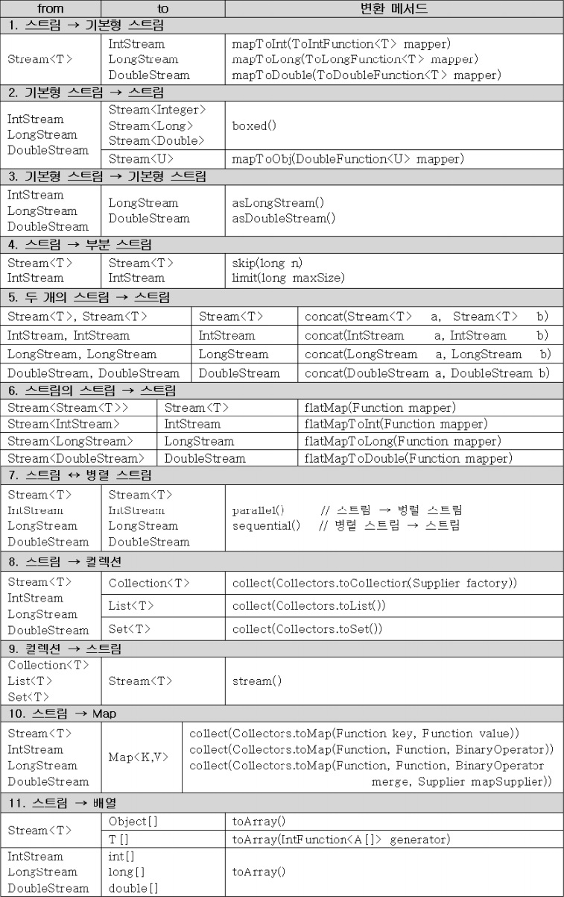

스트림의 최종 연산
---
최종 연산은 스트림의 요소를 소모해서 결과를 만들어낸다. 그래서 최종 연산후에는 스트림이 닫히게 되고 더이상 사용할 수 없다.

최종연산의 결과는 단일 값이거나, 배열 또는 컬렉션일 수 있다.

<br>

### **forEach()**
- peek()와 달리 스트림의 요소를 소모하는 최종연산이다. 반환타입이 void이므로 스트림의 요소를 출력하는 용도로 많이 사용된다.

```java
void forEach(Consumer<? super T> action)
```

<br>

### **조건검사 - allMatch(), anyMatch(), noneMatch(), findeAny()**

스트림의 요소에 대해 지정된 조건에 모든 요소가 일치하는 지 , 일부가 일치하는지 아니면, 어떤 요소도 일치하지 않는지 확인하는데 사용할 수 있는 메서드들

모두 매개변수 predicate를 요구하며, 연산결과로 boolean을 반한다.

    boolean allMatch(Predicate<? supaer T> predicate)
    boolean anyMatch(Predicate<? supaer T> predicate)
    boolean noneMatch(Predicate<? supaer T> predicate)

이외에도 스트림의 요소 중에서 조건에 일치하는 첫 번째 것을 반환하는 findFirst()가 있는데, 주로 filter()와 함께 사용되어 조건에 맞는 스트림의 요소가 있는지 확인하는데 사용된다.

병렬 스트림의 경우 findFirst()대신 findAny()를 사용해야 한다.
```java
Optional<Student> stu = stuStream.filter(s->s.getTotalScore()<=100).findFirst();
Optional<Student> stu = parallelStream.filter(s->s.getTotalScore()<=100).findAny();
```

findAny()와 findFirst()의 반환타입은 Optional\<T>이며, 스트림의 요소가 없을 때는 비어있는 Optional객체를 반환한다.

<br>

### **통계 - count(), sum(), average(), max(), min()**
통계정보를 얻을 수 있는 메서드들이다. 그러나 기본형 스트림이 아닌 경우에는 통계와 관련된 메서드들이 **아래의 3개 뿐**이다.

    long        count()
    Optional<T> max(Comparator<? super T> comparator)
    Optional<T> min(Comparator<? super T> comparator)

대부분의 경우 기본형 스트림으로 변환하거나, 앞으로 배울 reduce(), collect()를 사용해서 통계 정보를 얻는다.

<br>

### **리듀싱 - reduce()**

스트림의 요소를 줄여가면서 연산을 수행하고 최종결과를 반환.

처음 두 요소를 가지고 연산한 결과를 가지고 그 다음 요소와 연산한다.

스트림의 모든 요소를 소모하게 되면 그 결과를 반환한다.

    Optional<T> reduce(BinaryOperator<T> accumulator)

앞에서 배운 최종 연산 count(), sum()등은 내부적으로 모두 reduce()를 이용해서 작성된 것이다.
```java
int count = intStream.reduce(0, (a,b) -> a + 1);                       // count()
int sum   = intStreem.reduce(0, (a,b) -> a + b);                       // sum()
int max   = intStream.reduce(Integer.MIN_VALUE, (a, b) -> a>b ? a:b);  // max()
int max   = intStream.reduce(Integer.MIN_VALUE, (a, b) -> a<b ? a:b);  // min()
```

max()와 min()의 경우, 초기값이 필요없으므로 Optional\<T>를 반환하는 매개변수 하나짜리 reduce()를 사용하는 것이 낫다. 단, intStream의 타입이 IntStream인 경우 OptionalInt를 사용해야 한다. Stream\<T>와 달리 IntStream에 정의된 reduce()를 이용해서 아래와 같이 작성된 것이다.
```java
OptionalInt max = intStream.reduce((a,b) -> a > b ? a : b);     // max()
OptionalInt max = intStream.reduce((a,b) -> a < b ? a : b);     // min()
```

OptionalInt에 저장된 값을 꺼내려면 아래와 같이 하면 된다.

    int maxValue = max.getAsInt();  // OptionalInt에 저장된 값을 maxValue에 저장

>reduce()를 선언시에 그냥 초기값(identity)과 어떤 연산(Binary Operator)으로 스트림의 요소를 줄여갈 것인가만 결정하면 된다.

<br>

**reduce 예제**
```java
import java.util.*;
import java.util.stream.*;

class StremaEx5 {
    public static void main(String[] args) {
        String[] strArr = {
                "Inheritance", "Java", "Lambda", "stream",
                "OptionalDouble", "IntStream", "count", "sum"
        };

        Stream.of(strArr).forEach(System.out::println);

        boolean noEmptyStr = Stream.of(strArr).noneMatch(s -> s.length() == 0);
        Optional<String> sWord = Stream.of(strArr)
                .filter(s -> s.charAt(0) == 's').findFirst();

        System.out.println("noEmptyStr=" + noEmptyStr);
        System.out.println("sWord=" + sWord.get());

        // Stream<String[]>을 IntStream으로 변환
        IntStream intStream1 = Stream.of(strArr).mapToInt(String::length);
        IntStream intStream2 = Stream.of(strArr).mapToInt(String::length);
        IntStream intStream3 = Stream.of(strArr).mapToInt(String::length);
        IntStream intStream4 = Stream.of(strArr).mapToInt(String::length);

        int count = intStream1.reduce(0, (a, b) -> a + 1);
        int sum = intStream2.reduce(0, (a, b) -> a + b);

        OptionalInt max = intStream3.reduce(Integer::max);
        OptionalInt min = intStream4.reduce(Integer::min);

        System.out.println("count=" + count);
        System.out.println("sum=" + sum);
        System.out.println("max=" + max.getAsInt());
        System.out.println("min=" + min.getAsInt());
    }
}
```
실행결과

    Inheritance
    Java
    Lambda
    stream
    OptionalDouble
    IntStream
    count
    sum
    noEmptyStr=true
    sWord=stream
    count=8
    sum=58
    max=14
    min=3

#### <br>

collect()
---

스트림의 최조 연산중 가장 복잡하면서도 유용하게 활용될 수 있다.

collect()가 스트림의 요소를 수집하려면, 어떻게 수집할 것인가에 대한 방법이 정의되어 있어야 하는데, 이 방법을 정의한 것이 바로 컬렉터(collector)이다.

컬렉터는 Collector인터페이스를 구현한 것으로, 직접 구현할 수도 있고 미리 작성된 Collecters클래스에 다양한 종류의 컬렉터를 반환하는 static메서드를 가지고 많은 일들을 할 수 있다.

    collect()   스트림의 최종연산, 매개변수로 컬렉터를 필요로 한다.
    Collector   인터페이스, 컬렉터는 이 인터페이스를 구현해야한다.
    Collectores 클래스, static메서드로 미리 작성된 컬렉터를 제공한다.

collect()는 매개변수의 타입이 Collector인데, 매개변수가 Collector인터페이스를 구현한 클래스의 객체이어야 한다는 뜻이다.

    Object collect(Collector collector) // Collector를 구현한 클래스의 객체를 매개변수로
    Object collect(Supplier supplier, BiConsumer accumulator, BiConsumer combiner)

매개변수가 3개나 정의된 collect()는 잘 사용되진 않지만, Collertor인터페이스를 구현하지 않고 간단히 람다식으로 수집할 때 사용하며 편리하다.

<br>

### **스트림을 컬렉션과 배열로 변환 - toList(), toSet(), toMap(), toCollection(), toArray()**

스트림의 모든 요소를 컬렉션에 수집하려면, toList()와 같은 메서드를 사용하면 된다. List나 Set이 아닌 특정 컬렉션을 지정하려면 toCollection()에 해당 컬렉션의 생성자 참조를 매개변수로 넣어주면 된다.
```java
List<String> names = stuStream.map(Student::getName)
                                .collect(Collectors.toList());
ArrayList<String> list = names.Stream()
                    .collect(Collectors.toCollection(ArrayList::new));

// Map
Map<String,String> map = personStream
                    .collect(Collectors.toMap(p->p.getRegId(), p-p));
```
Map은 키와 값의 쌍으로 저장해야하므로 객체의 어떤 필드를 키로 사용할지와 값으로 사용할지를 지정해줘야 한다.

위의 Map문장은 요소의 타입이 Person인 스트림에서 사람의 주민번호(regId)를 키로 하고, 값으로 Person객체를 그대로 저장한다.
>항등함수를 의미하는 람다식 'p->p' 대신 Function.identity()를 쓸 수도 있다.

<br>

### **통계 - counting(), summingInt(), averageingInt(), maxBy(), minBy()**
최종연산들이 제공하는 통계 정보를 collect()로 똑같이 얻을 수 있다. collect()를 사용하지 않아도 통계정보를 얻을 수 있지만, 나중에 groupingBy()메서드 와 함께 사용할 때 필요하기 때문에 알아야 한다.

아래의 코드는 Collectors클래스가 static import 되어있다고 가정하자.

**사용법 예제**
```java
long count = stuStream.count();
long count = stuStream.collect(counting()); //Collectors.counting()

long totalScore = stuStream.mapToInt(Strudent::getTotalScore).sum();
long totalScore = stuStream.collect(summingInt(Student::getTotalScore));

OptionalInt topScore = studentStream.mapToInt(Student::getTotalScore).max();
Optional<Student> topStudent = stuStream
                    .max(Comparator.comparingInt(Student::getTotalScore));
Optional<Student> topStudent = stuStream
            .collect(maxBy(comparator.comparingInt(Student::getTotalScore)));

IntSummaryStatistics stat = stuStream
                    .mapToInt(Student::getTotalScore).summaryStatistics();
IntSummaryStatistics stat = stuStream
                    .collect(summarizingInt(Student::getTotalScore));
```

<br>

### **리듀싱 - reducing()**
IntStream에는 매개변수 3개짜리 collect()만 정의되어 있으므로 boxed()를 통해 IntStream을 Stream\<Integer>로 변환해야 매개변수 1개짜리 collect()를 쓸 수 있다.

```java
IntStream intStream = new Random().ints(1,46).distinct().limit(6);

OptionalInt       max = intStream.reduce(Integer::max);
Optional<Integer> max = intStream.boxed().collect(reducing(Integer::max));

long sum = intStream.reduce(0, (a,b) -> a + b);
long sum = intStream.boxed().collect(reduceing(0, (a,b) -> a + b));

int grandTotal = stuStream.map(Student::getTotalScore).reduce(0, Integer::sum);
int grandTotal = stuStream.collect(reducing(0,studeng::getTotalScore, Integer::sum));
```

<br>

### 문자열 결합 - joining()
문자열 스트림의 모든 요소를 하나의 문자열로 연결해서 반환한다.

구분자를 지정해줄 수도 있고, 접두사와 접미사도 지정가능하다.

스트림의 요소가 String이나 StringBuffer처럼 CharSequence의 자손인 경우에만 결합이 가능하므로 스트림의 요소가 문자열이 아닌 경우에는 먼저 map()을 이용해서 스트림의 요소를 문자열로 변환해야 한다.

    String studentNames = stuStream.map(Student::getName).collect(joining());
    String studentNames = stuStream.map(Student::getName).collect(joining(","));
    String studentNames = stuStream.map(student::getName).collect(joining(",","[", "]"));

**collect() 예제**
```java
import java.util.*;
import java.util.stream.*;
import static java.util.stream.Collectors.*;

class StreamEx6 {
    public static void main(String[] args) {
        Student[] stuArr = {
                new Student("이자바", 3, 300),
                new Student("김자바", 1, 200),
                new Student("안자바", 2, 100),
                new Student("박자바", 2, 150),
                new Student("소자바", 1, 200),
                new Student("나자바", 3, 290),
                new Student("김자바", 3, 180)
        };

        // 학생 이름만 뽑아서 List에 저장
        List<String> names = Stream.of(stuArr).map(Student::getName)
                .collect(Collectors.toList());
        System.out.println(names);

        // 스트림을 배열로 변환
        Student[] stuArr2 = Stream.of(stuArr).toArray(Student[]::new);

        for (Student s : stuArr2)
            System.out.println(s);

        long count = Stream.of(stuArr).collect(counting());
        long totalScore = Stream.of(stuArr)
                .collect(summingInt(Student::getTotalScore));
        System.out.println("count=" + count);
        System.out.println("totalScore=" + totalScore);

        totalScore = Stream.of(stuArr)
                .collect(reducing(0, Student::getTotalScore, Integer::sum));
        System.out.println("totalScore=" + totalScore);

        Optional<Student> topStudent = Stream.of(stuArr)
                .collect(maxBy(Comparator.comparingInt(Student::getTotalScore)));
        System.out.println("topStudent=" + topStudent.get());

        IntSummaryStatistics stat = Stream.of(stuArr)
                .collect(summarizingInt(Student::getTotalScore));

        System.out.println(stat);

        String stuNames = Stream.of(stuArr).map(Student::getName)
                .collect(joining(",", "{", "}"));

        System.out.println(stuNames);
    }
}

class Student implements Comparable<Student> {
    String name;
    int ban;
    int totalScore;

    Student(String name, int ban, int totalScore) {
        this.name = name;
        this.ban = ban;
        this.totalScore = totalScore;
    }

    @Override
    public String toString() {
        return String.format("[%s, %d, %d]", name, ban, totalScore).toString();
    }

    String getName() { return name; }
    int getBan() { return ban; }
    int getTotalScore() { return totalScore; }

    @Override
    public int compareTo(Student s) {
        return s.totalScore - this.totalScore;
    }
}
```
실행결과

    [이자바, 김자바, 안자바, 박자바, 소자바, 나자바, 김자바]
    [이자바, 3, 300]
    [김자바, 1, 200]
    [안자바, 2, 100]
    [박자바, 2, 150]
    [소자바, 1, 200]
    [나자바, 3, 290]
    [김자바, 3, 180]
    count=7
    totalScore=1420
    totalScore=1420
    topStudent=[이자바, 3, 300]
    IntSummaryStatistics{count=7, sum=1420, min=100, average=202.857143, max=300}
    {이자바,김자바,안자바,박자바,소자바,나자바,김자바}

<br>

### **그룹화와 분할 - groupingBy(), partitioningBy()**
- 그룹화는 스트림의 요소를 특정 기준으로 그룹화하는 것을 의미
- 분할은 스트림의 요소를 두 가지, 지정된 조건에 일치하는 그룹과 일치하지 않는 그룹으로의 분할을 의미
- groupingBy()는 스트림의 요소를 Function으로, partitioningBy()는 Predicate로 분류한다.
```java
Collector groupingBy(Function classifier)
Collector groupingBy(Function classifier, Collector downstream)
Collector groupingBy(Function classifier, Supplier mapFactory, Collector downstream)
Collector partitioningBy(Predicate predicate)
Collector partitioningBy(Predicate predicate, Collector downstream)
```
>그룹화와 분할의 결과는 Map에 담겨 반환된다.

예시에 사용될 Student클래스
```java
class Student{
    String name;    // 이름
    boolean inMale; // 성별
    int hak;        // 학년
    int ban;        // 반
    int score;      // 점수

    Student(String name, boolean inMale, int hak, int ban, int score) {
        this.name = name;
        this.isMale = isMale;
        this.hak = hak;
        this.ban = ban;
        this.score = score;
    }

    String  getName()   { return name; }
    boolean isMale()    { return isMale; }
    int     getHak()    { return hak; }
    int     getBan()    { return ban; }
    int     getScore()  { return score; }

    public String toString() {
        return String.format("[%s, %s, %d학년 %d반, %3d점]",
            name, isMale ? "남":"여", hak, ban, score);
    }

    enum Level { HIGH, MID, LOW }   // 성적을 상, 중, 하 세 단계로 분류
}
```
스트림 stuStream 요소
```java
Stream<Student> stuStream = Stream.of(
    new Student("나자바", true,  1, 1, 300),
    new Student("김지미", false, 1, 1, 250),
    new Student("김자바", true,  1, 1, 200),
    new Student("이지미", false, 1, 2, 150),
    new Student("남자바", true,  1, 2, 100),
    new Student("안지미", false, 1, 2,  50),
    new Student("황지미", false, 1, 3, 100),
    new Student("강지미", false, 1, 3, 150),
    new Student("이자바", true,  1, 3, 200),

    new Student("나자바", true,  2, 1, 300),
    new Student("김지미", false, 2, 1, 250),
    new Student("김자바", true,  2, 1, 200),
    new Student("이지미", false, 2, 2, 150),
    new Student("남자바", true,  2, 2, 100),
    new Student("안지미", false, 2, 2,  50),
    new Student("황지미", false, 2, 3, 100),
    new Student("강지미", false, 2, 3, 150),
    new Student("이자바", true,  2, 3, 200));
```

<br>

### **partitioningBy()에 의한 분류**
학생들을 성별로 나누어 List에 담기
```java
// 1. 기본 분할
Map<Boolean, List<Student>> stuBySex = stuStream
        .collect(partitioningBy(Student::isMale));  // 학생들을 성별로 분할

List<Student> maleStudent   = stuBySex.get(true);   // Map에서 남학생 목록을 얻는다.
List<Student> femaleStudent = stuBySex.get(false);  // Map에서 여학생 목록을 얻는다.
```
counting()을 추가해 학생 수 구하기
```java
// 2. 기본 분할 + 통계 정보
Map<Boolean, Long> stuNumBySex = stuStream
        .collect(partitioningBy(Studetn::isMale, counting()));

System.out.println("남학생 수 :" + stuNumBySex.get(true));  // 남학생 수 :8
System.out.println("여학생 수 :" + stuNumBySex.get(false)); // 여학생 수 :10
```
>counting()대신 summingLong()을 사용하면, 남학생과 여학생의 총점을 구할 수 있다.

<br>

남학생과 여학생의 1등 구하기
```java
Map<Boolean, Optional<Student>> topScoreBySex = stuStream
        .collect(
            partitioningBy(Student::isMale,
                maxBy(comparingInt(Student::getScore))
            )
        );
System.out.println("남학생 1등 :"+ topScoreBySex.get(true));
System.out.println("여학생 1등 :"+ topScoreBySex.get(false));
// 남학생 1등 :Optional[[나바자, 남, 1, 1, 300]]
// 여학생 1등 :Optional[[김지미, 여, 1, 1, 250]]
```

예제
```java
import static java.util.stream.Collectors.*;
import static java.util.Comparator.*;

import java.util.*;
import java.util.stream.*;

public class StreamEx7 {
    public static void main(String[] args) {
        Student[] stuArr = {
                new Student("나자바", true, 1, 1, 300),
                new Student("김지미", false, 1, 1, 250),
                new Student("김자바", true, 1, 1, 200),
                new Student("이지미", false, 1, 2, 150),
                new Student("남자바", true, 1, 2, 100),
                new Student("안지미", false, 1, 2, 50),
                new Student("황지미", false, 1, 3, 100),
                new Student("강지미", false, 1, 3, 150),
                new Student("이자바", true, 1, 3, 200),

                new Student("나자바", true, 2, 1, 300),
                new Student("김지미", false, 2, 1, 250),
                new Student("김자바", true, 2, 1, 200),
                new Student("이지미", false, 2, 2, 150),
                new Student("남자바", true, 2, 2, 100),
                new Student("안지미", false, 2, 2, 50),
                new Student("황지미", false, 2, 3, 100),
                new Student("강지미", false, 2, 3, 150),
                new Student("이자바", true, 2, 3, 200)
        };

        System.out.println("1. 단순분할(성별로 분할)");
        Map<Boolean, List<Student>> stuBySex = Stream.of(stuArr)
                .collect(partitioningBy(Student::isMale));

        List<Student> maleStudent = stuBySex.get(true);
        List<Student> femaleStudent = stuBySex.get(false);

        for (Student s : maleStudent)
            System.out.println(s);

        for (Student s : femaleStudent) {
            System.out.println(s);
        }

        System.out.printf("\n2. 단순분할 + 통계(성별 학생수)\n");
        Map<Boolean, Long> stuNumBySex = Stream.of(stuArr)
                .collect(partitioningBy(Student::isMale, counting()));
        System.out.println("남학생 수 :" + stuNumBySex.get(true));
        System.out.println("여학생 수 :" + stuNumBySex.get(false));

        System.out.printf("\n3. 단순분할 + 통계(성별 1등)\n");
        Map<Boolean, Optional<Student>> topScoreBySex = Stream.of(stuArr)
                .collect(partitioningBy(Student::isMale,
                        maxBy(comparingInt(Student::getScore))));
        System.out.println("남학생 1등 :" + topScoreBySex.get(true));
        System.out.println("여학생 1등 :" + topScoreBySex.get(false));

        Map<Boolean, Student> topScoreBySex2 = Stream.of(stuArr)
                .collect(partitioningBy(Student::isMale,
                        collectingAndThen(
                                maxBy(comparing(Student::getScore)), Optional::get)));
        System.out.println("남학생 1등 :" + topScoreBySex2.get(true));
        System.out.println("여학생 1등 :" + topScoreBySex2.get(false));

        System.out.printf("\n4. 다중분할(성별 불합격자, 100점이하)\n");
        Map<Boolean, Map<Boolean, List<Student>>> failedStuBySex = Stream.of(stuArr)
                .collect(partitioningBy(Student::isMale,
                        partitioningBy(s -> s.getScore() <= 100)));

        List<Student> failedMaleStu = failedStuBySex.get(true).get(true);
        List<Student> failedFemaleStu = failedStuBySex.get(false).get(false);

        for (Student s : failedMaleStu)
            System.out.println(s);
        for (Student s : failedFemaleStu)
            System.out.println(s);
    }

}

class Student {
    String name;
    boolean isMale; // 성별
    int hak; // 학년
    int ban; // 반
    int score;

    Student(String name, boolean isMale, int hak, int ban, int score) {
        this.name = name;
        this.isMale = isMale;
        this.hak = hak;
        this.ban = ban;
        this.score = score;
    }

    public String getName() {return name;}
    boolean isMale() {return isMale;}
    public int getHak() {return hak;}
    public int getBan() {return ban;}
    public int getScore() {return score;}

    @Override
    public String toString() {
        return String.format("[%s, %s, %d학년 %d반, %3d점]",
                name, isMale ? "남" : "여", hak, ban, score);
    }

    // groupingBy()에서 사용
    enum Level {
        HIGH, MID, LOW
    } // 성적을 상, 중, 하 세 단계로 분류
}
```
실행결과

    1. 단순분할(성별로 분할)
    [나자바, 남, 1학년 1반, 300점]
    [김자바, 남, 1학년 1반, 200점]
    [남자바, 남, 1학년 2반, 100점]
    [이자바, 남, 1학년 3반, 200점]
    [나자바, 남, 2학년 1반, 300점]
    [김자바, 남, 2학년 1반, 200점]
    [남자바, 남, 2학년 2반, 100점]
    [이자바, 남, 2학년 3반, 200점]
    [김지미, 여, 1학년 1반, 250점]
    [이지미, 여, 1학년 2반, 150점]
    [안지미, 여, 1학년 2반,  50점]
    [황지미, 여, 1학년 3반, 100점]
    [강지미, 여, 1학년 3반, 150점]
    [김지미, 여, 2학년 1반, 250점]
    [이지미, 여, 2학년 2반, 150점]
    [안지미, 여, 2학년 2반,  50점]
    [황지미, 여, 2학년 3반, 100점]
    [강지미, 여, 2학년 3반, 150점]

    1. 단순분할 + 통계(성별 학생수)
    남학생 수 :8
    여학생 수 :10

    1. 단순분할 + 통계(성별 1등)
    남학생 1등 :Optional[[나자바, 남, 1학년 1반, 300점]]
    여학생 1등 :Optional[[김지미, 여, 1학년 1반, 250점]]
    남학생 1등 :[나자바, 남, 1학년 1반, 300점]
    여학생 1등 :[김지미, 여, 1학년 1반, 250점]

    1. 다중분할(성별 불합격자, 100점이하)
    [남자바, 남, 1학년 2반, 100점]
    [남자바, 남, 2학년 2반, 100점]
    [김지미, 여, 1학년 1반, 250점]
    [이지미, 여, 1학년 2반, 150점]
    [강지미, 여, 1학년 3반, 150점]
    [김지미, 여, 2학년 1반, 250점]
    [이지미, 여, 2학년 2반, 150점]
    [강지미, 여, 2학년 3반, 150점]

<br>

### **groupingBy()에 의한 분류**
일단 간단히 stuStream을 반 별로 그룹지어 Map에 저장하면 아래와 같은 코드가 된다.

    Map<Integer, List<Student>> stuByBan = stuStream
        .collect(groupingBy(Student::getBan));

groupingBy()로 그룹화를 하면 기본적으로 List\<T>에 담는다.

만일 원한다면, toList()대신 toSet()이나 toCollection(HashSet::new)을 사용할 수도 있다. 단, Map의 지네릭 타입도 적절히 변경해줘야 한다.

예제
```java
import static java.util.Comparator.*;
import static java.util.stream.Collectors.*;

import java.util.*;
import java.util.stream.Stream;

public class StreamEx8 {
    public static void main(String[] args) {
        Student[] stuArr = {
                new Student("나자바", true, 1, 1, 300),
                new Student("김지미", false, 1, 1, 250),
                new Student("김자바", true, 1, 1, 200),
                new Student("이지미", false, 1, 2, 150),
                new Student("남자바", true, 1, 2, 100),
                new Student("안지미", false, 1, 2, 50),
                new Student("황지미", false, 1, 3, 100),
                new Student("강지미", false, 1, 3, 150),
                new Student("이자바", true, 1, 3, 200),

                new Student("나자바", true, 2, 1, 300),
                new Student("김지미", false, 2, 1, 250),
                new Student("김자바", true, 2, 1, 200),
                new Student("이지미", false, 2, 2, 150),
                new Student("남자바", true, 2, 2, 100),
                new Student("안지미", false, 2, 2, 50),
                new Student("황지미", false, 2, 3, 100),
                new Student("강지미", false, 2, 3, 150),
                new Student("이자바", true, 2, 3, 200)
        };

        System.out.printf("1. 단순그룹화(반별로 그룹화)\n");
        Map<Integer, List<Student>> stuByBan = Stream.of(stuArr)
                .collect(groupingBy(Student::getBan));

        for (List<Student> ban : stuByBan.values()) {
            for (Student s : ban) {
                System.out.println(s);
            }
        }

        System.out.printf("\n2. 단순그룹화(성적별로 그룹화)\n");
        Map<Student.Level, List<Student>> stuByLevel = Stream.of(stuArr)
                .collect(groupingBy(s -> {
                    if (s.getScore() >= 200)
                        return Student.Level.HIGH;
                    else if (s.getScore() >= 100)
                        return Student.Level.MID;
                    else
                        return Student.Level.LOW;
                }));

        TreeSet<Student.Level> keySet = new TreeSet<>(stuByLevel.keySet());

        for (Student.Level key : keySet) {
            System.out.println("[" + key + "]");

            for (Student s : stuByLevel.get(key)) {
                System.out.println(s);
            }
            System.out.println();
        }

        System.out.printf("\n3. 단순그룹화 + 통계(성적별 학생수)\n");
        Map<Student.Level, Long> stuCntByLevel = Stream.of(stuArr)
                .collect(groupingBy(s -> {
                    if (s.getScore() >= 200)
                        return Student.Level.HIGH;
                    else if (s.getScore() >= 100)
                        return Student.Level.MID;
                    else
                        return Student.Level.LOW;
                }, counting()));

        for (Student.Level key : stuCntByLevel.keySet()) {
            System.out.printf("[%s] - %d명, ", key, stuCntByLevel.get(key));
        }
        System.out.println();
        /*
         * for(List<Student> level : stuByLevel.values()){
         * System.out.println();
         * for (Student s : level) {
         * System.out.println(s);
         * }
         * }
         * }
         */
        System.out.printf("\n4. 다중그룹화(학년별, 반별)");
        Map<Integer, Map<Integer, List<Student>>> stuByHakAndBan = Stream.of(stuArr)
                .collect(groupingBy(Student::getHak,
                        groupingBy(Student::getBan)));

        for (Map<Integer, List<Student>> hak : stuByHakAndBan.values()) {
            for (List<Student> ban : hak.values()) {
                System.out.println();
                for (Student s : ban) {
                    System.out.println(s);
                }
            }
        }

        System.out.printf("\n5. 다중그룹화 + 통계(학년별, 반별 1등)\n");
        Map<Integer, Map<Integer, Student>> topStuByHakAndBan = Stream.of(stuArr)
                .collect(groupingBy(Student::getHak,
                        groupingBy(Student::getBan,
                                collectingAndThen(
                                        maxBy(comparing(Student::getScore)),
                                        Optional::get))));

        for (Map<Integer, Student> ban : topStuByHakAndBan.values()) {
            for (Student s : ban.values()) {
                System.out.println(s);
            }
        }

        System.out.printf("\n6. 다중그룹화 + 통계(학년별, 반별 성적그룹)\n");
        Map<String, Set<Student.Level>> stuByScoreGroup = Stream.of(stuArr)
                .collect(groupingBy(s -> s.getHak() + "-" + s.getBan(),
                        mapping(s -> {
                            if (s.getScore() >= 200)
                                return Student.Level.HIGH;
                            else if (s.getScore() >= 100)
                                return Student.Level.MID;
                            else
                                return Student.Level.LOW;
                        }, toSet())));

        Set<String> keySet2 = stuByScoreGroup.keySet();

        for (String key : keySet2) {
            System.out.println("[" + key + "]" + stuByScoreGroup.get(key));
        }
    }
}

class Student {
    String name;
    boolean isMale; // 성별
    int hak; // 학년
    int ban; // 반
    int score;

    Student(String name, boolean isMale, int hak, int ban, int score) {
        this.name = name;
        this.isMale = isMale;
        this.hak = hak;
        this.ban = ban;
        this.score = score;
    }

    public String getName() {
        return name;
    }

    boolean isMale() {
        return isMale;
    }

    public int getHak() {
        return hak;
    }

    public int getBan() {
        return ban;
    }

    public int getScore() {
        return score;
    }

    @Override
    public String toString() {
        return String.format("[%s, %s, %d학년 %d반, %3d점]",
                name, isMale ? "남" : "여", hak, ban, score);
    }

    // groupingBy()에서 사용
    enum Level {
        HIGH, MID, LOW
    } // 성적을 상, 중, 하 세 단계로 분류
}
```
실행결과

    1. 단순그룹화(반별로 그룹화)
    [나자바, 남, 1학년 1반, 300점]
    [김지미, 여, 1학년 1반, 250점]
    [김자바, 남, 1학년 1반, 200점]
    [나자바, 남, 2학년 1반, 300점]
    [김지미, 여, 2학년 1반, 250점]
    [김자바, 남, 2학년 1반, 200점]
    [이지미, 여, 1학년 2반, 150점]
    [남자바, 남, 1학년 2반, 100점]
    [안지미, 여, 1학년 2반,  50점]
    [이지미, 여, 2학년 2반, 150점]
    [남자바, 남, 2학년 2반, 100점]
    [안지미, 여, 2학년 2반,  50점]
    [황지미, 여, 1학년 3반, 100점]
    [강지미, 여, 1학년 3반, 150점]
    [이자바, 남, 1학년 3반, 200점]
    [황지미, 여, 2학년 3반, 100점]
    [강지미, 여, 2학년 3반, 150점]
    [이자바, 남, 2학년 3반, 200점]

    2. 단순그룹화(성적별로 그룹화)
    [HIGH]
    [나자바, 남, 1학년 1반, 300점]
    [김지미, 여, 1학년 1반, 250점]
    [김자바, 남, 1학년 1반, 200점]
    [이자바, 남, 1학년 3반, 200점]
    [나자바, 남, 2학년 1반, 300점]
    [김지미, 여, 2학년 1반, 250점]
    [김자바, 남, 2학년 1반, 200점]
    [이자바, 남, 2학년 3반, 200점]

    [MID]
    [이지미, 여, 1학년 2반, 150점]
    [남자바, 남, 1학년 2반, 100점]
    [황지미, 여, 1학년 3반, 100점]
    [강지미, 여, 1학년 3반, 150점]
    [이지미, 여, 2학년 2반, 150점]
    [남자바, 남, 2학년 2반, 100점]
    [황지미, 여, 2학년 3반, 100점]
    [강지미, 여, 2학년 3반, 150점]

    [LOW]
    [안지미, 여, 1학년 2반,  50점]
    [안지미, 여, 2학년 2반,  50점]


    3. 단순그룹화 + 통계(성적별 학생수)
    [HIGH] - 8명, [MID] - 8명, [LOW] - 2명,

    4. 다중그룹화(학년별, 반별)
    [나자바, 남, 1학년 1반, 300점]
    [김지미, 여, 1학년 1반, 250점]
    [김자바, 남, 1학년 1반, 200점]

    [이지미, 여, 1학년 2반, 150점]
    [남자바, 남, 1학년 2반, 100점]
    [안지미, 여, 1학년 2반,  50점]

    [황지미, 여, 1학년 3반, 100점]
    [강지미, 여, 1학년 3반, 150점]
    [이자바, 남, 1학년 3반, 200점]

    [나자바, 남, 2학년 1반, 300점]
    [김지미, 여, 2학년 1반, 250점]
    [김자바, 남, 2학년 1반, 200점]

    [이지미, 여, 2학년 2반, 150점]
    [남자바, 남, 2학년 2반, 100점]
    [안지미, 여, 2학년 2반,  50점]

    [황지미, 여, 2학년 3반, 100점]
    [강지미, 여, 2학년 3반, 150점]
    [이자바, 남, 2학년 3반, 200점]

    5. 다중그룹화 + 통계(학년별, 반별 1등)
    [나자바, 남, 1학년 1반, 300점]
    [이지미, 여, 1학년 2반, 150점]
    [이자바, 남, 1학년 3반, 200점]
    [나자바, 남, 2학년 1반, 300점]
    [이지미, 여, 2학년 2반, 150점]
    [이자바, 남, 2학년 3반, 200점]

    6. 다중그룹화 + 통계(학년별, 반별 성적그룹)
    [1-1][HIGH]
    [2-1][HIGH]
    [1-2][MID, LOW]
    [2-2][MID, LOW]
    [1-3][HIGH, MID]
    [2-3][HIGH, MID]

#### <br>

Collector구현하기
---
Collector인터페이스는 다음과 같이 정의되어 있다.
```java
public interface Collector<T, A, R> {
    Supplier<A>         supplier();
    BiConsumer<A, T>    accumulator();
    BinaryOperator<A>   combiner();
    Function<A, R>      finisher();

    Set <Characteristics> characteristics();    // 컬렉터의 특성이 담긴 Set을 반환
    ...
}
```
직접 구현해야 하는 것은 위의 5개의 메서드이지만, characteristics()를 제외하면 모드 반환타입이 함수형 인터페이스이다. 즉, 4개의 람다식을 작성하면 되는 것이다.

    supplier()      작업 결과를 저장할 공간을 제공
    accumulator()   스트림의 요소를 수집(collect)할 방법을 제공
    combiner()      두 저장공간을 병합할 방법을 제공(병렬 스트림)
    finisher()      결과를 최종적으로 변환할 방법을 제공
>finisher()는 작업결과를 변환하는 일을 하는데 변환이 필요없다면, 항등 함수인 Function.identity()를 반환하면 된다.
```java
public Function finisher() {
    return Function.identity(); // 항등 함수를 반환. return x -> x;와 동일
}
```

characteristics()는 컬렉터가 수행하는 작업의 속성에 대한 정보를 제공하기 위한 것이다.

    Characteristics.CONCURRENT      병렬로 처리할 수 있는 작업
    Characteristics.UNORDERED       스트림의 요소의 순서가 유지될 필요가 없는 작업
    Characteristics.IDENTITY_FINISH finisher()가 항등 함수인 작업

위 3가지 속성중 해당하는 것을 Set에 담아서 반환하도록 구현 한다.
```java
public Set<Characteristics> characteristics() {
    return Collections.unmodifiableSet(EnumSet.of(
        Collector.Characteristics.CONCURRENT,
        Collector.Characteristics.UNORDERED
    ));
}
```
만일 아무 속성도 지정하고 싶지 않으면 emptySet()을 반환한다.
```java
Set(Characteristics) characteristics() {
    return Collections.emptySet();  // 지정할 특성이 없는 경우 비어있는 Set을 반환
}
```

Collector 예제
```java
import java.util.*;
import java.util.function.*;
import java.util.stream.*;

public class CollectorEx {
    public static void main(String[] args) {
        String[] strArr = { "aaa", "bbb", "ccc" };
        Stream<String> strStream = Stream.of(strArr);

        String result = strStream.collect(new ConcatCollector());

        System.out.println(Arrays.toString(strArr));
        System.out.println("result=" + result);
    }
}

class ConcatCollector implements Collector<String, StringBuilder, String> {
    @Override
    public Supplier<StringBuilder> supplier() {
        return () -> new StringBuilder();
        // return StringBuilder::new;
    }

    @Override
    public BiConsumer<StringBuilder, String> accumulator() {
        return (sb, s) -> sb.append(s);
        // return StringBuilder:;append;
    }

    @Override
    public Function<StringBuilder, String> finisher() {
        return sb -> sb.toString();
        // return StringBuilder::toString;
    }

    @Override
    public BinaryOperator<StringBuilder> combiner() {
        return (sb, sb2) -> sb.append(sb2);
        // return StringBuilder::append;
    }

    @Override
    public Set<Characteristics> characteristics() {
        return Collections.emptySet();
    }
}
```
실행결과

    [aaa, bbb, ccc]
    result=aaabbbccc

#### <br>

스트림의 변환
---
<p align="center">

</p>