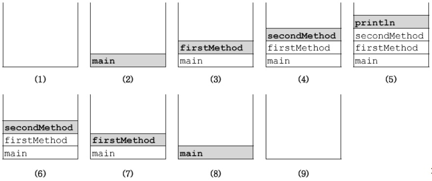

JVM의 메모리 구조
---
응용프로그램 실행 시 JVM은 시스템으로부터 프로그램을 수행하는데 필요한 메모리를 할당받고 JVM은 이 메모리를 용도에 따라 여러 영역(method area, call stack, heap, 등)으로 나누어 관리한다.

<p align="center">

</p>

**1. 메서드 영역(method area)**
   - 프로그램 실행 중 어떤 클래스가 사용되면, JVM은 해당 클래스의 클래스파일(*.class)을 읽어서 분석하여 클래스에 대한정보(클래스데이터)를 이곳에 저장한다. 이 때, 그 클래스의 클래스변수도 이 영역에 함께 생성된다.

**2. 힙(heap)**
   - 인스턴스, 인스턴스 변수가 생성되는 공간.
   - 프로그램 실행 중 생성되는 인스턴스는 모두 이곳에 생성된다.

**3. 호출스택(call stack 또는 execution stack)**
   - 메서드의 작업에 필요한 메모리 공간을 제공
   - 메서드 호출 시, 호출스택에 호출된 메서드를 위한 메모리가 할당
   - 이 메모리는 메서드가 작업을 수행하는 동안 지역변수들과 연산의 중간결과 등을 저장하는데 사용
   - 메서드가 작업을 마치면 할당되었던 메모리공간 반환

**호출스택의 특징**
- 메서드가 호출되면 수행에 필요한 만큼의 메모리를 스택에 할당 받는다
- 메서드가 수행을 마치고 나면 사용했던 메모리를 반환하고 스택에서 제거된다.
- 호출스택의 제일 위에 있는 메서드가 현재 실행 중인 메서드이다.
- 아래에 있는 메서드가 바로 위의 메서드를 호출한 메서드이다.

```java
class CallStackTest {
    public static void main(String[] args) {
        firstMethod();
    }

    static void firstMethod(){
        secondMethod();
    }

    static void secondMethod(){
        System.out.println("secondMethod()");
    }
}
```
**예제 실행 시 호출스택의 변화**
<p align="center">

</p>

#### <br>
기본형 매개변수와 참조형 매개변수
---
메서드 호출 시 매개변수의 타입이 기본형(primitive type)일 때는 기본형 값이 복사가되고, 참조형(reference type)일 경우 인스턴스 주소가 복사된다.

기본형으로 선언하면 단순히 저장된 값만 얻지만, 참조형으로 선언하면 값이 저장된 곳의 주소를 알 수 있기 때문에 값을 읽어오는 것은 물론이고, 변경하는 것도 가능하다.

- 기본형 : 변수의 값을 읽기만 할 수 있다.(read only)
- 참조형 : 변수의 값을 읽고 변경할 수 있다.(read & write)

```java
class Data { int x; }

class PrimitiveParamEx {
    public static void main(String[] args) {
        Data d = new Data();
        d.x = 10;
        System.out.println("main() : x = " + d.x);
        
        changeP(d.x);
        System.out.println("After changeP(d.x)");
        System.out.println("main() : x = " + x);

        changeR(d);
        System.out.println("After changeP(d)");
        System.out.println("main() : x = " + x);
    }

    static void changeP(int x) {  // 기본형 변수
        x = 1000;
        System.out.println("changeP() : x = " + x);
    }

    static void changeR(Data x) {  // 참조형 변수
        x = 1000;
        System.out.println("changeR() : x = " + x);
    }
}
```
실행결과

    main() : x = 10
    changeP() : x = 1000
    After changeP(d.x)
    main() : x = 10
    changeR() : x = 1000
    After changeR(d)
    main() : x = 1000

>changeP()메서드를 호출시에는 d.x의 값이 변경된 것이 아니라, changP메서드의 매개변수 x의 값이 변경된 것이다.
>
>changeR()메서드를 호출시에는 매개변수가 참조형이라서 주소를 넘겨주었기 때문에 값을 읽어오는 것 뿐만 아니라 변경하는 것도 가능하다.

**참조변수를 다루는 여러가지 예제**
```java
class ReferenceParamEx {
    public static void main(String[] args) {
        int[] arr = {3,2,1,6,5,4};

        printArr(arr);  // 배열의 모든 요소 출력
        sortArr(arr);   // 정렬
        printArr(arr);  // 정렬 후 결과 출력
        System.out.println("sum=" + sumArr(arr));   // 배열의 총합을 출력
    }

    static void printArr(int[] arr) {       // 배열의 모든 요소 출력
        System.out.println("[");

        for(int i : arr) {
            System.out.print(i+",");
        }
        System.out.println("]");
    }

    static int sumArr(int[] arr) {          // 배열의 총합 반환
        int sum = 0;

        for(int i : arr) {
            sum += i;
        }
        return sum;
    }

    static void sortArr(int[] arr) {        // 오름차순 정렬
        for(int i = 0; i < arr.length - 1; i++) {
            for(int j = 0; j < arr.length - 1 - i; j++) {
                if(arr[j] > arr[j + 1]) {
                    int tmp = arr[j];
                    arr[j] = arr[j + 1];
                    arr[j + 1] = tmp;
                }
            }
        }
    }
}
```
실행결과
```
[3,2,1,6,5,4,]
[1,2,3,4,5,6,]
sum=21
```

#### <br>
참조형 반환타입
---
매개변수 뿐만 아니라 반환타입도 참조형이 될 수 있다.
```java
class Data { int x; }

class ReferenceReturnEx {
    public static void main(String[] args) {
        Data d = new Data();
        d.x = 10;

        Data d2 = copy(d);
        System.out.println("d.x = " + d.x);
        System.out.println("d2.x = " + d2.x);
    }

    static Data copy(Data d) {
        Data tmp = new Data();
        tmp.x = d.x;

        return tmp;
    }
}
```
실행결과

    d.x = 10;
    d2.x = 10;

main함수에서 생성한 d객체를 copy메서드의 매개변수로 줘서 copy메서드 내부의 tmp객체의 tmp.x의 값을 d.x로 설정해 주었다. 이로서 d.x와 tmp.x의 값은 같아진 것이다. 반환한 tmp의 값을 d2에 저장하였기 때문에 d.x의 값과 d2.x의 값이 같은 것이다.
>반환타입이 '참조형'이라는 것은 메서드가 '객체의 주소'를 반환한다는 것을의미한다.

#### <br>
참조형 반환타입
---
메서드 내부에서 메서드 자신을 다시 호출하는 것을 '재귀호출(recursive call)'이라 하고, 재귀호출을 하는 메서드를 '재귀 메서드'라 한다.
```java
void method() {
    method();
}
```
>호출된 메서드는 '값에 의한 호출(call by value)'을 통해, 원래의 값이 아닌 복사된 값으로 작업하기 때문에 호출한 메서드와 관계없이 독립적인 작업수행이 가능하다.
```java
void method(int n) {
    while(n != 0) {
        System.out.println(n--);
    }
}
```
>첫 번째 예제처럼 재귀호출뿐이라면, 무한반복을 해버린다. 무한반복문에 조건문이 필수인 것 처럼, 재귀호출도 조건문이 필수적으로 따라다닌다.

>반복문은 그저 같은 문장을 반복해서 수행하는 것이지만, 메서드를 호출하는 것은 매개변수 복사와 종료 후 복귀할 주소저장 이 추가로 필요하기 때문에 반복문보다 재귀호출의 수행시간이 더 오래 걸린다.

**Factorial예제**
```java
class FactorialTest {
    public static void main(String args[]) {
        int result = factorial(4);

        System.out.println(result);
    }

    static int factorial(int n) {
        int result = 0;

        if(n == 1) {
            result = 1;
        } else {
            result = n * factorial (n-1);   // 자신을 호출
        }

        return result;
    }
}
```
실행결과

    24

>n==4일 경우  
else로 들어가 factorial(3)을 호출한다  
n==3일 경우  
else로 들어가 factorial(2)을 호출한다  
n==2일 경우  
else로 들어가 factorial(1)을 호출한다  
n==1일 경우  
result 1로 리턴하고  
1 x 2를 리턴하고  
2 x 3을 리턴하고  
6 x 4를 리턴하면  
결과는 24가 나온다.

#### <br>
클래스 메서드(static메서드)와 인스턴스 메서드
---
- 메서드 앞에 static이 븥어있으면 클래스메서드이고 붙어있지 않으면 인스턴스 메서드이다.
- 클래스 메서드도 클래스변수처럼, 객체를 생성하지 않고도 '클래스이름.메서드이름(매개변수)'와 같은 식으로 호출이 가능하다.
- 인스턴스 메서드는 인스턴스 변수와 관련된 작업을 하는, 즉 메서드의 작업을 수행하는데 인스턴스 변수를 필요로 하는 메서드이다.
- 인스턴스와 관게없는(인스턴스 변수나 인스턴스 메서드를 사용하지 않는)메서드를 클래스 메서드(static메서드)로 정의한다.

**1. 클래스를 설계할 때 , 맴버변수 중 모든 인스턴스에 공통으로 사용하는 것에 static을 붙인다.**
- 생성된 각 인스턴스는 서로 독립적이기 때문에 각 인스턴스의 변수는 서로 다른 값을 유지한다. 그러나 모든 인스턴스에서 같은 값이 유지되어야 하는 변수는 static을 붙여서 클래스변수로 정의해야 한다.

**2. 클래스 변수(static변수)는 인스턴스를 생성하지 않아도 사용할 수 있다.**
- static이 붙은 변수(클래스 변수)는 클래스가 메모리에 올라갈 때 이미 자동적으로 생성되기 때문이다.

**3. 클래스 메서드(static메서드)는 인스턴스 변수를 사용할 수 없다.**
- 클래스 메서드는 인스턴스 생성 없이 호출가능하므로 클래스 메서드가 호출되었을 때 인스턴스가 존재하지 않을 수도 있다. 그래서 클래스 메서드에서 인스턴스변수의 사용을 금지한다. 반면에 인스턴스변수나 인스턴스메서드에서는 static이 붙은 멤버들을 사용하는 것이 언제나 가능하다.

**4. 메서드 내에서 인스턴스 변수를 사용하지 않는다면, static을 붙으는 것을 고려한다.**
- 메서드의 작업내용 중에서 인스턴스변수를 필요로 하지 않는다면 static을 붙이는 것이 좋다. 메서드 호출시간이 짧아지므로 성능이 향상된다. 인스턴스메서드는 실행 시 호출되어야 할 메서드를 찾는 과정이 추가적으로 필요하기 때문에 시간이 더 걸린다.

>클래스의 멤버변수 중 모든 인스턴스에 공통된 값을 유지해야 하는 것이 있는지 살펴보고 있으면, static을 붙여준다.
>
>작성한 메서드 중에서 인스턴스 변수나 인스턴스 메서드를 사용하지 않는 메서드에 static을 붙일 것을 고려한다.


#### <br>
클래스 멤버와 인스턴스 멤버간의 참조와 호출
---
같은 클래스에 속한 멤버들 간에는 별도의 인스턴스를 생성하지 않고도 서로 참조 또는 호출이 가능하다. 하지만 **클래스멤버가 인스턴스멤버를 참조 또는 호출할 경우에는 인스턴스를 생성**해야 한다.

클래스멤버가 존재하는 시점에 인스턴스멤버가 존재하지 않을 수도 있기 때문이다.

```java
class TestClass{
    void instanceMethod() {}        // 인스턴스메서드
    static void staticMethod() {}   // static메서드

    void instanceMethod2() {
        instanceMethod2();
        staticMethod();
    }

    static void staticMethod2() {   // static메서드 에서
        instanceMethod();           // 에러!! 인스턴스 메서드를 바로 호출할 수 없다.
        staticMethod();
    }
}
```
static메서드는 인스턴스메서드를 호출할 수 없다.

>인스턴스멤버간의 호출은 문제가 없다. 하나의 인스턴스멤버가 존재 한다는 것은 인스턴스가 이미 생성되어있다는 것을 의미하며, 즉 다른 인스턴스멤버들도 모두 존재하기 때문이다.

###### <br>
오버로딩(overloading)
===
오버로딩이란?
---
메서드도 변수와 마찬가지로 같은 클래스 내에서 서로 구별될 수 있어야 하기 때문에 각기 다른 이름을 가져야 한다. 그러나 자바에서는 한 클래스 내에 이미 사용하려는 이름과 같은 이름을 가진 메서드가 있더라고 매개변수의 개수 또는 타입이 다르면, 같은 이름을 사용해서 메서드를 정의할 수 있다.

#### <br>
오버로딩의 조건
---
- 매서드 이름이 같아야 한다.
- 매개변수의 개수 또는 타입이 달라야 한다.
- 반환 타입은 오버로딩을 구현하는데 아무런 영향을 주지 못한다.

#### <br>
오버로딩의 예
---
가장 대표적인 예로 println()메서드가 있다. println()메서드는 괄호안에 값만 지정해주면 화면에 출력하는 메서드가 아니라, 실제로는 매개변수로 지정하는 값의 타입에 따라서 호출되는 println메서드가 달라진다.

PrintStream클래스에는 어떤 종류의 매개변수를 지정해도 출력할 수 있도록 아래와 같이 10개의 오버로딩된 println메서드를 정의해 놓고 있다.
```java
void println()
void println(boolean x)
void println(char x)
void println(char[] x)
void println(double x)
void println(float x)
void println(int x)
void println(long x)
void println(Object x)
void println(String x)
```
println메서드를 호출하면 위의 오버로딩된 메서드들 중의 하나가 선택되어 실행되는 것이다.

#### <br>
가변인자(varargs)와 오버로딩
---
기존에 메서드의 배개변수 개수가 고정적이었으나 JDK1.5 부터 동적으로 지정해 줄 수 있게 되었으며, 이 기능을 '가변인자(variable arguments)'라고 한다.

가변인자는 '타입... 변수명'과 같은 형식으로 선언하며, PrintStream클래스의 printf()가 대표적인 예이다.

가변인자 외에도 매개변수가 더 있다면, 가변인자를 매개변수 중에서 제일 마지막에 선언해야 한다.
```java
String concatenate(String s1, String s2) { code... }
String concatenate(String s1, String s2, String s3) { code... }
```
>**이럴 경우 가변인자를 사용하면 하나로 간단히 대체할 수 있다.**
```java
String concatenate(String... str) { code... }

System.out.println(concatenate());
System.out.println(concatenate("a"));
System.out.println(concatenate("a", "b"));
System.out.println(concatenate(new String[]{"A", "B"}));
```
이와 같이 인자의 개수를 가변적으로 할 수 있고, 심지어 인자가 아예 없어도 되고 배열도 인자가 될 수 있다.

>가변인자는 내부적으로 배열을 이용하고 있다. 그래서 가변인자가 선언된 메서드를 호출할 때마다 배열이 새로 생성된다. 가변인자가 편리하긴 하지만, 별거 아닌거에도 매번 사용하면 효율이 매우 떨어지니 꼭 필요한 경우에만 가변인자를 사용하자.

```java
public static void main(String[] args) {
        String[] strArr = { "100", "200", "300" };

        System.out.println(con("", "100", "200", "300"));
    }

    static String con(String del, String... args) {
        String result = "";

        for (String str : args) {
            result += str + del;
        }
        return result;
    }

    static String con(String... args) {
        return con("", args);
    }
```
>위의 두 메서드는 별 문제가 없어보이지만 위의 예제를 컴파일 해보면 아래와 같은 에러가 생긴다

<p align="center">

</p>

>에러의 내용을 보면 두 오버로딩 된 메서드가 구분되지 않아서 발생하는 것임을 알 수 있다. 가변인자를 선언한 메서드를 오버로딩하면, 메서드를 호출했을 때 이와 같이 구별되지 못하는 경우가 발생하기 쉽기 때문에 가능하면 가변인자를 이용한 메서드는 오버로딩하지 않는 것이 좋다.

###### <br>
생성자(Constructor)
===
생성자란?
---
인스턴스가 생성될 때 호출되는 '인스턴스 초기화 메서드'이다. 따라서 인스턴스 변수의 초기화 작업에 주로 사용되며, 인스턴스 생성 시에 실행되어야 할 작업을 위해서도 사용된다.

메서드처럼 클래스 내에 선언되며, 구조도 메서드와 유사하지만 리턴값이 없고 메서드 선언부에 이름 외에는 아무것도 적지 않는다.

    조건  
    1. 생성자의 이름은 클래스의 이름과 같아야 한다.
    2. 생성자는 리턴 값이 없다.

**정의**
```java
class ClassName {

    ClassName(타입 변수명, 타입 변수명, ...) {  // 매개변수가 없어도됨
        // 수행 코드
        // code...
        // 주로 인스턴스 변수의 초기화 코드를 적음
    }
}
```
**수행 과정**
1. 연산자 new에 의해서 메모리(heap)에 클래스의 인스턴스가 생성된다.
2. 생성자가 호출되어 수행된다
3. 연산자 new의 결과로, 생성된 인스턴스의 주소가 반환되어 참조변수 c에 저장된다.

>지금까지 인스턴스를 생성하기위해 사용해왔던 '클래스이름()'이 바로 생성자 였던 것이다.

#### <br>
기본 생성자(default constructor)
---
모든 클래스에는 반드시 하나 이상의 생성자가 정의되어 있어야 한다.

생성자를 정의하지 않고 인스턴스를 생성할 수 있었던 이유는 컴파일러가 '기본 생성자'를 제공해 주기 때문이다.

특별히 인스턴스 초기화 작업이 요구되지 않는다면 생성자를 정의하지 않고 컴파일러가 제공하는 기본 생성자를 사용하는 것도 좋다.

```java
class Data1{
    int value;
}

class Data2{
    int value;

    Data2(int x) {
        value = x;
    }
}

class ConstructorTest {
    public static void main(String[] args){
        Data d1 = new Data1();
        Data d2 = new Data2();          // compile error발생
    }
}
```
위의 예제를 실행해 보면 Data1의 인스턴스 생성에는 문제가 없는데 Data2에 에러가 발생한다. 그 이유는 Data1에는 정의되어 있는 생성자가 하나도 없으므로 컴파일러가 기본 생성자를 추가해주었지만, Data2에는 이미 생성자 Data2(int x)가 정의되어 있으므로 기본 생성자가 추가되지 않았기 때문이다.

이 코드의 에러를 잡기 위해선 new Data()에 인자값을 넣어주거나, 클래스 Data2에 생성자 Data2()를 추가로 정의해주면된다.

>기본 생성자가 컴파일러에 의해서 추가되는 경우는 클래스에 정의된 생성자가 하나도 없을 때 뿐이다.

#### <br>
매개변수가 있는 생성자
---
인스턴스마다 각기 다른값으로 초기화되어야하는 경우가 많기 때문에 매개변수를 사용한 초기화는 매우 유용하다.

**예제**
```java
class Car {
    String color;
    String gearType;
    int door;

    Car() { }       // 생성자
    Car(String c, String g, int d) {    // 생성자
        color = c;
        gearType = g;
        door = d;
    }
}
```
Car인스턴스를 생성할 때, 생성자가 없다면, 객체 생성 후 일일히 초기화 해줘야 하지만, 생성자를 사용한다면 생성과 동시에 원하는 값으로 초기화가 가능해진다.</br>
매개변수를 갖는 생성자를 사용하는 것이 코드를 보다 간결하고 직관적이게 만든다.

#### <br>
생성자에서 다른 생성자 호출하기 - this(), this
---
같은 클래스의 멤버들 간에 서로 호출할 수 있는 것처럼 생성자 간에도 서로 호출이 가능하다
- 생성자의 이름으로 클래스이름 대신 this를 사용한다.
- 한 생성자에서 다른 생성자를 호출할 때는 반드시 첫 줄에만 호출이 가능하다.

>생성자에서 다른 생성자를 첫 줄에서만 호출이 가능하도록 한 이유는 생성자 내에서 초기화 작업도중에 다른 생성자를 호출하게 되면, 호출된 다른 생성자 내에서도 멤버변수들의 값을 초기화 할 것이므로 다른 생성자를 호출하기 이전에 초기화 작업이 무의미해질 수 있기 때문이다.

**에제**
```java
class Car {
    String color;
    String gearType;
    int door;

    Car() {
        this("white", "auto", 4);   // Car(String c, String g, int d) 호출
    }
    Car(String color) {
        this(color, "auto", 4);     // Car(String c, String g, int d) 호출
    }
    Car(String c, String g, int d) { 
        this.color = c;
        this.gearType = g;
        this.door = d;
    }
}

class CarTest {
    public static void main(String[] args) {
        Car c1 = new Car();
        Car c2 = new Car("blue");

        System.out.println("c1의 color=" + c1.color + ", gearType=" + c1.gearType + ", door=" + c1.door);
        System.out.println("c2의 color=" + c2.color + ", gearType=" + c2.gearType + ", door=" + c2.door);
    }
}
```
실행결과

    c1의 color=white, gearType=auto, door=4
    c2의 color=blue, gearType=auto, door=4

위의 코드처럼 생성자간 호출에는 생성자의 이름 대신 this를 사용해야 하므로 'Car'대신 'this'를 사용했다

- this<br>
  인스턴스 자신을 가리키는 참조변수, 인스턴스의 주소가 저장되어 있다. 모든 인스턴스메서드에 지경변수로 숨겨진 채로 존재한다.

- this(), this(매개변수)<br>
  생성자, 같은 클래스의 다른 생성자를 호출할 때 사용한다.

#### <br>
생성자를 이용한 인스턴스의 복사
---
