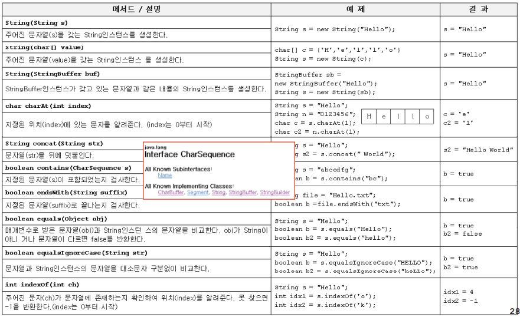
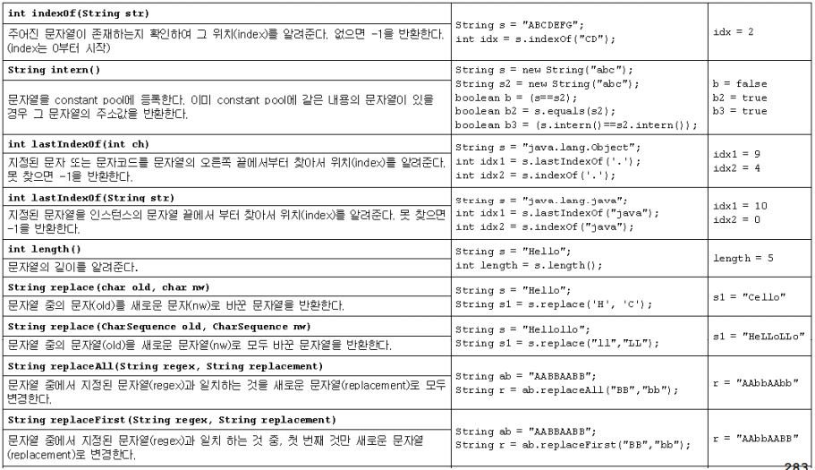
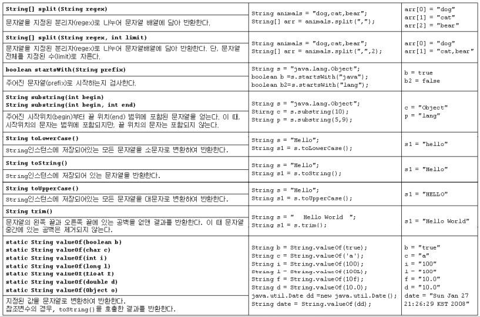
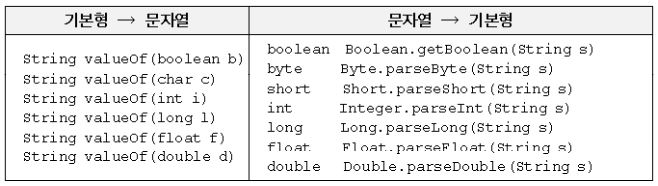
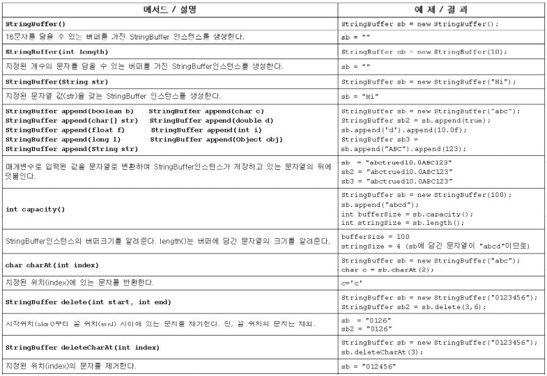
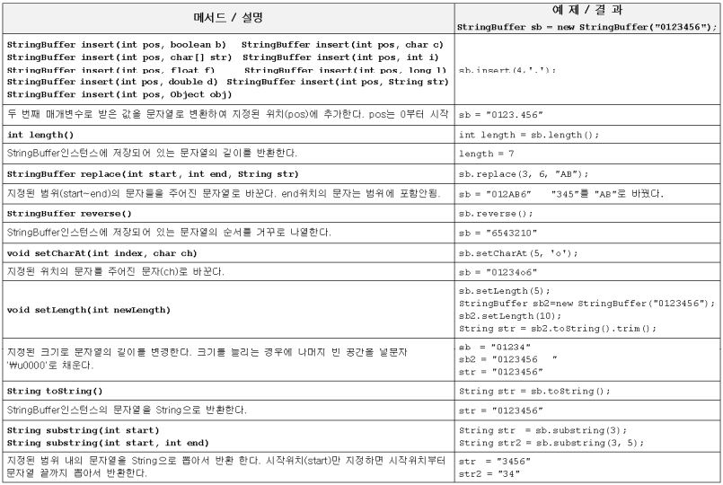

java.lang패키지
===
- java.lang패키지는 자바프로그래밍에 가장 기본이 되는 클래스들을 포함하고 있다.
- import문 없이도 사용할 수 있게 되어 있다.

Object클래스
---
Object클래스는 모든 클랫의 최고 조상이기 때문에 Object클래스의 멤버들은 모든 클래스에서 바로 사용 가능하다.

|<center>Object클래스의 메서드</center>|<center>설명</center>|
|:-|:-|
|protected Object clone()|객체 자신의 복사본을 반환한다|
|public boolean equals(Object obj)|객체 자신와, 객체 obj가 같은 객체인지 알려준다.(같으면 true)|
|protected void finalize()|객체가 소멸될 때 가비지 컬렉터에 의해 자동적으로 호출된다. 이 때 수행되어야하는 코드가 있을 때 오버라이딩 한다.(거의 사용안함)|
|public Class getClass()|객체 자신의 클래스 정보를 담고 있는 Class인스턴스를 반환한다.|
|public int hashCode()|객체 자신의 해시코드를 반환한다.|
|public String toString()|객체 자신의 정보를 문자열로 반환한다.|
|public void notify()|객체 자신을 사용하려고 기다리는 쓰레드를 하나만 깨운다.|
|public void notifyAll()|객체 자신을 사용하려고 기다리는 모든 쓰레드를 깨운다.|
|public void wait()<br>public void wait(long timeout)<br>public void wait(long timeout, int nanos)|다른 쓰레드가 notify()나 notifyAll()을 호출할 때까지 현재 쓰레드를 무한히 또는 지정된 시간(timeout, nanos)동안 기다리게 한다.(timeout은 천 분의 1초, nanos는 10<sup>9</sup>분의 1초|

<br>

### **equals(Object obj)**
매개변수로 객체의 참조변수를 받아서 비교하여 그 결과를 boolean값으로 알려 주는 역할을 한다.

```java
public boolean equals(Object obj){
    return (this==obj);
}
```
위의 코드는 두 객체의 같고 다름을 참조변수의 '**값**'으로 판단한다. 그렇기 때문에 서로 다른 두 객체를 equals메서드로 비교하면 항상 false를 결과로 얻게 된다.

**equals() 에제**
```java
class EqualsEx {
    public static void main(String[] args) {
        Value v1 = new Value(10);
        Value v2 = new Value(10);

        if(v1.equals(v2))
            System.out.println("v1과 v2는 같습니다.");
        else
            System.out.println("v1과 v2는 다릅니다.");
        
        v2 = v1;

        if(v1.equals(v2))
            System.out.println("v1과 v2는 같습니다.");
        else
            System.out.println("v1과 v2는 다릅니다.");
    }
}

class Value {
    int Value;

    Value(int value) {
        this.value = value;
    }
}
```
실행결과

    v1과 v2는 다릅니다.
    v1과 v2는 같습니다.

**equals() 오버라이딩 예제**
```java
class EqualsEx {
    public static void main(String[] args) {
        Person p1 = new Person(8011081111222L);
        Person p2 = new Person(8011081111222L);

        if (p1 == p2) {
            System.out.println("p1과 p2는 같은 사람입니다.");
        } else {
            System.out.println("p1과 p2는 다른 사람입니다.");
        }

        if (p1.equals(p2)) {
            System.out.println("p1과 p2는 같은 사람입니다.");
        } else {
            System.out.println("p1과 p2는 다른 사람입니다.");
        }
    }
}

class Person {
    long id;

    @Override
    public boolean equals(Object obj) {
        if (obj instanceof Person)
            return id == ((Person) obj).id;
        else
            return false;
    }

    Person(long id) {
        this.id = id;
    }
}
```
실행결과

    p1과 p2는 다른 사람입니다.
    p1과 p2는 같은 사람입니다.

<br>

### **hashCode()**
- 이 메서드는 해싱(hashing)기법에사용되는 '해시함수(hash function)'을 구현한 것이다.
- 해싱은 데이터관리기법 중 하나인데 다량의 데이터를 저장하고 검색하는 데 유용하다.
- 찾고자하는 값을 입력하면, 그 값이 저장된 위치를 알려주는 해시코드를 반환한다.

앞서 살펴본 것과 같이 클래스 인스턴스변수 값으로 객체의 같고 다름을판단해야 하는 경우라면 equals메서드 뿐 만아니라 hashCode메서드도 적절히 오버라이딩 해야한다.

같은 객체라면 hashCode메서드를 호출했을 때의 결과값인 해시코드도 같아야 하기 때문이다.

```java
class Test {
    public static void main(String[] args) {
        String str1 = new String("abc");
        String str2 = new String("abc");

        System.out.println(str1.equals(str2));
        System.out.println(str1.hashCode());
        System.out.println(str2.hashCode());
        System.out.println(System.identityHashCode(str1));
        System.out.println(System.identityHashCode(str2));
    }
}
```
실행결과

    true
    96354
    96354
    705927765
    366712642

hashCode메서드는 문자열의 내용이 같은 str1과 str2에 대해 항상 동일한 해시코드값을 얻는다. 반면에 System.identityHashCode(Object x)는 객체의 주소값으로 해시코드를 생성하기 때문에 모든 객체에 대해 항상 다른 해시코드값을 반환한다.

그러므로 str1과 str2는 값은 같지만 서로 다른 객체라는 것을 알 수 있다.

<br>

### **toString()**
- 이 메서드는 인스턴스에 대한 정보를 문자열로 제공할 목적으로 정의한 것
- 대부분의 경우 인스턴스 변수에 저장된 값들을 문자열로 표현한다는 뜻이다.

```java
class Card {
    String kind;
    int number;

    Card() {
        this("SPADE", 1);
    }
    Card(String kind, int number) {
        this.kind = kind;
        this.number = number;
    }
}

class CardToString {
    public static void main(String[] args) {
        Card c1 = new Card();
        Card c2 = new Card();

        System.out.println(c1.toString());
        System.out.println(c2.toString());
    }
}
```
실행결과

    Card@19e0bfd
    Card@139a55

Card클래스에서 Object클래스로부터 상속받은 toString()을 오버라이딩하지 않았기 때문에 Card인스턴스에 toString()을 호출하면, Object클래스의 toString()이 호출된다.

그래서 위의 결과는 클래스이름과 해시코드가 출력되었다.

```java
class ToStringTest {
    public static void main(String[] args) {
        String str = new String("KOREA");
        Date today = new Date();

        System.out.println(str);
        System.out.println(str.toString());

        System.out.println(today);
        System.out.println(today.toString());
    }
}
```
실행결과

    KOREA
    KOREA
    Sun Jan 16 18:34:42 KST 2022
    Sun Jan 16 18:34:42 KST 2022

위의 결과를 보면 해시코드 대신 다른 결과가 출력되었다.

String과 Data클래스의 경우 문자열과, Date인스턴스가 갖고 있는 날짜와 시간을 문자열로 변환하여 반환하도록 오버라이딩 되어있다.

이처럼 toString()은 일반적으로 인스턴스나 클래스에 대한 정보 또는 인스턴스 변수들의 값을문자열로변환하여 반환하도록 오버라이딩되는 것이 보통이다.

<br>

### **clone()**
- 자신을 복제하여 새로운 인스턴스 생성
- Cloneable인터페이스를 구현한 클래스에서만 clone()을 호출할 수 있다.
- Object클래스에 정의된 clone()은 단순히 인스턴스변수의 값만 복사하기 때문에 참조타입의 인스턴스 변수가 있는 클래스는 완전한 인스턴스 복제가 이루어지지 않는다.

예를들어 배열의 경우, 복제된 인스턴스도 같은 배열의 주소를 갖기 때문에 복제된 인스턴스의 작업이 원래의 인스턴스에 영향을 미치게 된다.

```java
class Point implements Cloneable {
    int x, y;

    Point(int x, int y) {
        this.x = x;
        this.y = y;
    }

    @Override
    public String toString() {
        return "x=" + x + ", y=" + y;
    }

    @Override
    protected Object clone() {
        Object obj = null;

        try {
            obj = super.clone();    // clone()은 반드시 예외처리를 해주어야 한다.
        } catch (CloneNotSupportedException e) { }
        return obj;
    }
}

class CloneEx {
    public static void main(String[] args) {
        Point original = new Point(3, 5);
        Point copy = (Point)original.clone();   //복제(clone)해서 새로운 객체 생성
        System.out.println(original);
        System.out.println(copy);
    }
}
```
clone()을 사용하려면 먼저 복제할 클래스가 Cloneable인터페이스를 구현해야 하고, 오버라이딩하면서 접근 제어자를 protected에서 public으로 변경해야 한다. 그래야 상속관계가 없는 다른 클래스에서 clone()을 호출 할 수 있다.

>Cloneable인스턴스를 구현한 클래스의 인스턴스만 clone()을 통한 복제가 가능한 이유는 인스턴스의 데이터를 보호하기 위해서이다.  
Cloneable인터페이스가 구현되어 있다는 것은 클래스 작성자가 복제를 허용한다는 의미이다.

<br>

### 공변 반환타입
- JDK1.5부터 '공변 반환타입(coveriant return type)'이라는 것이 추가되었다.
- 오버라이딩할 때 조상 메서드의 반환타입을 자손 클래스의 타입으로 변경을 허용하는 것이다.

```java
public Point clone() {      // 반환 타입을 Ojbect에서 Point로 변경
    Object obj = null;
    try {
        obj = super.clone();
    } catch(CloneNotSupportedException e) {}
    return (Point)obj;      // Point타입으로 형변환한다.
}
```
위의 코드는 clone()의 반환타입을 Object에서 Point로 변경하였다. 즉 조상의 타입에서 자손의 타입으로 변경한 것이다. 그리고 return문에 Point타입으로 캐스팅도 추가하였다.

>이처럼 '공변 반환타입'을 사용하면, 조상의 타입이 아닌, 실제로 반환되는 자손 객체의 타입으로 반환할 수 있어서 번거로운 형변환이 줄어든다는 장점이 있다.

<br>

### 얕은 복사와 깊은 복사
- **얕은 복사(shallow copy)**<br>
    clone()은 단순히 객체에 저장된 값을 그대로 복제할 뿐, 객체가 참조하고 있는 객체까지 복제하지는 않는다. 기본형 배열인 경우에는 문제가 없지만, 객체배열을 clone()으로 복제를 하는 경우에는 원본과 복제본이 같은 객체를 공유하므로 완전한 복제라고 보기 어렵다.

- **깊은 복사(deep copy)**<br>
반면에 깊은 복사는 원본이 참조하고 있는 객체까지 복제하며, 깊은 복사에서는 원본과 복사본이 서로 다른 객체를 참조하기 때문에 원본의 변경이 복사본에 영향을 미치지 않는다.

```java
class Circle implements Cloneable {
    Point p; // 원점
    double r; // 반지름

    Circle(Point p, double r) {
        this.p = p;
        this.r = r;
    }

    public Circle shallowCopy() { // 얕은 복사
        Object obj = null;

        try {
            obj = super.clone();
        } catch (CloneNotSupportedException e) {
        }
        return (Circle) obj;
    }

    public Circle deepCopy() { // 깊은 복사
        Object obj = null;

        try {
            obj = super.clone();
        } catch (CloneNotSupportedException e) {
        }
        Circle c = (Circle) obj;

        c.p = new Point(this.p.x, this.p.y);

        return c;
    }

    @Override
    public String toString() {
        return "[p=" + p + ", r=" + r + "]";
    }
}

class Point {
    int x, y;

    Point(int x, int y) {
        this.x = x;
        this.y = y;
    }

    @Override
    public String toString() {
        return "x=" + x + ", y=" + y;
    }
}

class ShallowDeepCopy {
    public static void main(String[] args) {
        Circle c1 = new Circle(new Point(1, 1), 2.0);
        Circle c2 = c1.shallowCopy();
        Circle c3 = c1.deepCopy();

        System.out.println("c1=" + c1);
        System.out.println("c2=" + c2);
        System.out.println("c3=" + c3);

        c1.p.x = 9;
        c1.p.y = 9;
        System.out.println("= c1의 변경 후 =");
        System.out.println("c1=" + c1);
        System.out.println("c2=" + c2);
        System.out.println("c3=" + c3);
    }
}
```
실행결과

    c1=[p=x=1, y=1, r=2.0]
    c2=[p=x=1, y=1, r=2.0]
    c3=[p=x=1, y=1, r=2.0]
    = c1의 변경 후 =
    c1=[p=x=9, y=9, r=2.0]
    c2=[p=x=9, y=9, r=2.0]
    c3=[p=x=1, y=1, r=2.0]

<br>

### **getClass()**
- 자신이 속한 클래스의 Class객체를 반환하는 메서드, Class객체는 이름이 'Class'인 클래스의 객체이다
- Class객체는 클래스의 모든 정보를 담고 있으며, 클래스당 1개만 존재한다.
- 클래스 파일이 '클래스로더(ClassLoader)'에 의해서 메모리에 올라갈 때, 자동으로 생성된다.
- 파일 형태로 저장되어 있는 클래스를 읽어서 Class클래스에 정의된 형식으로 변환한다.

<br>

### **Class객체를 얻는 방법**
클래스의 정보가 필요할 때, 먼저 Class객체에 대한 참조를 얻어 와야 하는데, 해당 Class객체에 대한 참조를 얻는 방법은 여러 가지가 있다.
```java
Class cObj = new Test().getClass();  // 생성된 객체로 부터 얻는 방법
Class cObj = Test.class;             // 클래스 리터럴(*.class)로 부터 얻는 방법
Class cObj = Class.forName("Test");  // 클래스 이름으로 부터 얻는 방법
```
특히 forName()은 특정 클래스 파일, 예를 들어 데이터베이스 드라이버를 메모리에 올릴 때 주로 사용한다.

Class객체를 이용하면 클래스에 정의된 멤버의 이름이나 개수 등, 클래스에 대한 모든 정보를 얻을 수 있기 때문에 Class객체를 통해 객체를 생성하고 메서드를 호출하는 등 보다 동적인 코드를 작성할 수 있다.

```java
Test t = new Test();                // new연산자를 이용해서 객체 생성
Test t = Test.class.getInstance();  // Class객체를 이용해서 객체 생성
```

#### <br>
String클래스
---
### **변경 불가능한 클래스**
- 문자열을 저장하기 위해서 문자형 배열 참조변수(char[]) value를 인스턴스 변수로 정의해 놓고 있다.
- 인스턴스 생성시 생성자의 매개변수로 입력받은 문자열은 이 인스턴스변수(value)에 문자형 배열로 저장되는 것이다.

```java
public final class String implements java.io.Serializabel, Comparable {
    private char[] value;
    ...
}
```
한번 생성된 String인스턴스가 갖고 있는 문자열은 읽어 올 수만 있고, 변경할 수는 없다.

예를들어 '+'연산자를 이용해서 문자열을 결합하는 경우 인스턴스 내의 문자열이 바뀌는 것이 아니라 새로운 문자열이 담긴 String인스턴스가 생성되는 것이다.

이처럼 문자열을 결합하는 것은 매 연산 시 마다 새로운 문자열을 가진 String인스턴스가 생성되어 메모리공간을 차지하므로 문자열간의 결합이나 추출등 문자열을 다루는 작업이 많이 필요한 경우에는 **StringBuffer클래스**를 사용하는 것이 좋다.

<br>

### **문자열의 비교**
- 리터럴을 지정하는 방법
```java
String str1 = "abc";    // 문자열 리터럴 "abc"의 주소가 str1에 저장됨
String str2 = "abc";    // 문자열 리터럴 "abc"의 주소가 str1에 저장됨
```
- String클래스의 생성자를 사용해서 만드는 방법
```java
String str3 = new String("abc");    // 새로운 String 인스턴스를 생성
String str4 = new String("abc");    // 새로운 String 인스턴스를 생성
```
생성자를 이용한 경우 new연산자에 의해서 메모리할당이 이루어지기 때문에 항상 새로운 String인스턴스가 생성된다. 그러나 문자열 리터럴은 이미 존재하는 것을 재사용 한다.
```java
class StringEx {
    public static void main(String[] args) {
        String str1 = "abc";
        String str2 = "abc";
        System.out.println("String str1 = \"abc\";");
        System.out.println("String str2 = \"abc\";");

        System.out.println("str1 == str2 ? " + (str1 == str2));
        System.out.println("str1.equals(str2) ? " + str1.equals(str2));
        System.out.println();

        String str3 = new String("\"abc\"");
        String str4 = new String("\"abc\"");

        System.out.println("String str3 = new String(\"abc\");");
        System.out.println("String str4 = new String(\"abc\");");

        System.out.println("str3 == str4 ? " + (str3 == str4));
        System.out.println("str3.equals(str4) ? " + str3.equals(str4));
    }
}
```
실행결과

    String str1 = "abc";
    String str2 = "abc";
    str1 == str2 ? true
    str1.equals(str2) ? true

    String str3 = new String("abc");
    String str4 = new String("abc");
    str3 == str4 ? false
    str3.equals(str4) ? true

각 String인스턴스의 주소를 등가비교연산자'=='로 비교했을 때는 결과가 다르다.

<br>

### **문자열 리터럴**
자바 소스파일에 포함된 모든 문자열 리터럴은 컴파일 시에 클래스 파일에 저장된다. 이 때 같은 내용의 문자열 리터럴은 한번만 저장된다. 문자열 리터럴도 String인스턴스이고, 한번 생성하면 내용을 변경할 수 없으니 하나의 인스턴스를 공유하면 되기 때문이다.

```java
class StringEx {
    public static void main(String[] args) {
        String s1 = "AAA";
        String s2 = "AAA";
        String s3 = "AAA";
        String s4 = "BBB";

        System.out.println(s1 == s2);
        System.out.println(s2 == s3);
        System.out.println(s3 == s4);
    }
}
```
실행결과

    true
    true
    false

String타입의 변수를 등가비교연산자'=='로 비교하면 해당 변수의 주소를 비교한다. 위의 결과를보면 s1, s2, s3는 같은 주소를 공유하고 있다는 것을 알 수 있다.

클래스 파일에는 소스파일에 포함된 모든 리터럴의 목록이 있다. 해당 클래스 파일이 클래스 로더에 의해 메모리에 올라갈 때, 이 리터럴의 목록에 있는 리터럴들이 JVM내에 있는 '상수 저장소(constant pool)'에 저장된다. 이떄 이곳에 "AAA"와 같은 문자열 리터럴이 자동적으로 생성되어 저장되는 것이다.

<br>

### **String클래스의 생성자와 메서드**

**자주 사용되는 String클래스 내에 정의된 생성자와 메서드 목록**
<p align="center"">

</p>
<p align="center">

</p>
<p align="center">

</p>

<br>

### **join()과 StringJoiner**
- 여러 문자열 사이에 구분자를 넣어 결합힌다.
- 구분자로 문자열을 자르는 split()과 반대의 작업을 한다.

```java
String animals = "dog,cat,bear";
String[] arr = animals.split(",");  // 문자열을 ','구분자로 나ㅝ서 배열에 저장
String str = String.join("-", arr); // 배열의 문자열을 '-'로 구분해서 결합
System.out.println(str);            // dog-cat-baer
```

java.util.StringJiner클래스를 사용해서 문자열을 결합할 수도 있다.

```java
import java.util.StringJoiner;

class StringEx{
    public static void main(String[] agrs) {
        String animals = "dog,cat,bear";
        String[] arr = animals.split(",");

        System.out.println(String.join("-", arr));

        StringJoiner sj = new StringJoiner("/","(",")");
        for(String s : arr)
            sj.add(s.toUpperCase());

        System.out.println(sj.toString());
    }
}
```
실행결과

    dog-cat-bear
    (dog/cat/bear)

<br>

### **유니코드의 보충문자**
String클래스의 생성자와 메서드 표의 메서드 중에 매개변수의 타입이 char인 것들이 있고, int인 것들도 있다. 문자를 다루는 메서드이지만 매개변수 타입이 int인 이유는 확장된 유니코드를 다루기 위해서이다.

유니코드는 원래 2byte, 즉 16비트 문자체계인데, 이걸로도 모자라서 20비트로 확장하게 되었다. 그래서 하나의 문자를 char타입으로 다루지 못하고, int타입으로 다룰 수밖에 없다.

확장에 의해 새로 추가된 문자들을 '보충 문자(supplementary characters)'라고 하는데, String클래스의 메서드 중에서는 보충 문자를 지원하는것이 있고 지원하지 않는 것도 있다.

이들을 구별하는 방법은 매개변수가 'int ch'인 것들은 보충문자를 지원하는 것이고, 'char ch'인 것들은 지원하지 않는 것들이다.

<br>

### **문자 인코딩 변환**
- getBytes(String charsetName)을 사용하면, 문자열의 문자 인코딩을 다른 인코딩으로 변경할 수 있다.
- 자바가 UTF-16을 사용하지만, 문자열 리터럴에 포함되는 문자들은 OS의 인코딩을사용한다.

>한글 윈도우즈의 경우 문자 인코딩으로 CP949를 사용하며, UTF-8로 변경하려면, 아래와 같이 한다.

```java
byte[] utf8_str = "가".getBytes("UTF-8");   // 문자열을 UTF-8로 변경
String str = new String(utf8_str, "UTF-8"); // byte배열을 문자열로 변환
```

서로 다른 문자 인코딩을 사용하는 컴퓨터 간에 데이터를 주고받을 때는 적절한 문자 인코딩이 필요하다.

<br>

### **String.format()**
- format()은 형식화된 문자열을 만들어내는 간단한 방법이다. printf()하고 사용법이 완전히 동일하다.
```java
String str = String.format("%d 더하기 %d는 %d입니다", 3, 5, 3+5);
System.out.println(str);  // 3 더하기 5는 8입니다.
```

<br>

### **기본형 값을 String으로 변환**
- 숫자로 이루어진 문자열을 숫자로, 또는 그 반대로 변환하는 경우가 자주 있다.
- 숫자에 빈 문자열""을 더해주기만 하면 되지만, 성능향상이 필요한 경우 valueOf()를 쓰자.

```java
int i = 100;
String str1 = i + "";
String str2 = String.valueOf(i);
```

<br>

### **String을 기본형 값으로 변환**
- valueOf()를 사용하거나 parseInt() 사용.
```java
int i = Integer.parseInt("100");    // "100"을 100으로 변환하는 방법1
int i = Integer.valueOf("100");     // "100"을 100으로 변환하는 방법2
```

valueOf()는 메서드 내부에서 그저 parseInt(String s)를 호출할 뿐이므로, 두 메서드는 반환 타입만 다르지 같은 메서드이다.

**기본형과 문자열간의 형변환 방법 정리**
<p align="center">

</p>

#### <br>
StringBuffer클래스와 StringBuilder클래스
---
- String클래스는 인스턴스를 생성할 때 지정된 문자열을 변경할 수 없지만 StringBuffer클래스는 변경이 가능하다.
- 내부적으로 문자열 편집을 위한 버퍼(buffer)를 가지고 있으며, StringBuffer인스턴스를 생성할 때 그 크기를 지정할 수 있다.
```java
public final class StringBuffer implements java.io.Serializable {
    private char[] value;
    ...
}
```

<br>

### **StringBuffer의 생성자**
- 인스턴스 생성시, 적절한 길이의 char배열이 생성
- 이 배열은 문자열을 저장하고 편집하기 위한 공간(buffer)으로 사용

StringBuffer인스턴스를 생성할 때는 생성자 StringBuffer(int length)를 사용해서 StringBuffer인스턴스에 저장될 문자열의 길이를 고려하여 충분히 여유있는 크기로 지정하는 것이 좋다.

```java
public StringBuffer(int length) {
    value = new char[length];
    shared = false;
}
public StringBuffer() {
    this(16);       // 버퍼의 크기를 지정하지 않으면 버퍼의 크기는 16이 된다.
}
public StringBuffer(String str) {
    this(str.length() + 16);    // 지정한 문자열의 길이보다 16이 더 크게 버퍼를 생성한다.
    append(str);
}
```
버퍼의 크기를 지정해주지 않으면 16개의 문자를 저장할 수 있는 크기의 버퍼를 생성한다.

<br>

### **StringBuffer의 변경**
String과 달리 StringBuffer는 내용을 변경할 수 있다.
```java
StringBuffer sb = new StringBuffer("abc");
sb.append("123");   // sb의 내용 뒤에 "123"을 추가한다.

StringBuffer sb2 = sb.append("ZZ"); // sb의 내용뒤에 "ZZ"를 추가한다.
System.out.println(sb);     // abc123ZZ
System.out.println(sb2);    // abc123ZZ
```
append()는 반환타입이 StringBuffer인데 자신의 주소를 반환한다. 그래서 아래와 같은 문장이 수행되면, sb에 새로운 문자열이 추가되고 sb자신의 주소를 반환하여 sb2에는 sb의 주소가 저장된다.

<br>

### **StringBuffer의 비교**
StringBuffer클래스는 equals메서드를 오버라이딩 하지 않아서 StringBuffer클래스의 equals메서드를 사용해도 등가연산자(==)로 비교한 것과 같은 결과를 얻는다.

반면에 toString()은 오버라이딩되어 있어서 StringBuffer인스턴스에 toString()을 호출하면 ㄷ마고있는 문자열을 String으로 반환한다.

그래서 StringBuffer인스턴스에 담긴 문자열을 비교하기 위해서는 toString()을 호출하여 String인스턴스를 얻은 후 여기에 equals메서드를 사용해서 비교해야 한다.

```java
class StringBufferEx {
    public static void main(String[] agrs) {
        StringBuffer sb1 = new StringBuffer("abc");
        StringBuffer sb2 = new StringBuffer("abc");

        System.out.println("sb1 == sb2 ? " + (sb1 == sb2));
        System.out.println("sb1.equals(sb2) ? " + sb1.equals(sb2));

        // StringBuffer의 내용을 String으로 변환한다.
        String s1 = sb1.toString();
        String s2 = sb2.toString();

        System.out.println("s1.equals(s2)" + s1.equals(s2));
    }
}
```
실행결과

    sb1 == sb2 ? false
    sb1.equals(sb2) ? false
    s1.equals(s2)true

<br>

### **StringBuffer클래스의 생성자와 메서드**
- StringBuffer클래스 역시 문자열을 다루기 위한 것이기 때문에 String클래스와 유사한 메서드를 많이 가지고 있다. StringBuffer는 추가, 변경, 삭제와 같이 저장된 내용을 변경할 수 있는 메서드들이 추가로 제공된다.

<p align="center">

</p>

<p align="center">

</p>

<br>

### **StringBuilder란?**
- 멀티쓰레드에 안전(thread safe)하도록 동기화되어 있다.
- StringBuffer와 완전히 똑같은 기능으로 작성되어 있다.

>StringBuffer도 충분히 성능이 좋기 때문에 성능향상이 반드시 필요한 경우를 제외하고는 기존에 작성한 코드에서 StringBuffer를 StringBuilder로 굳이 바꿀 필요는 없다.