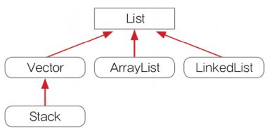
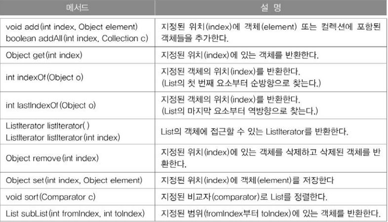
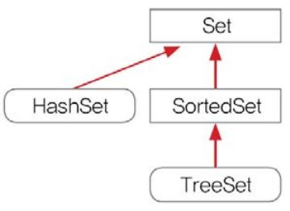
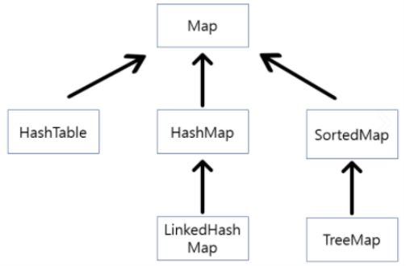
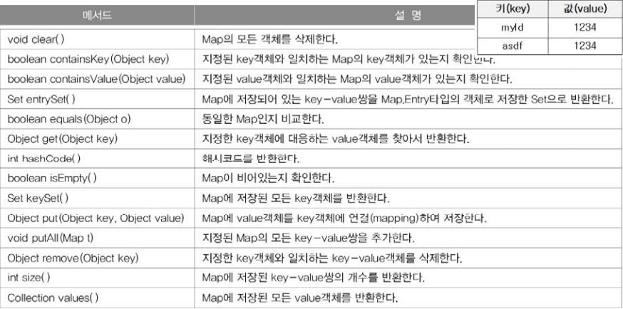
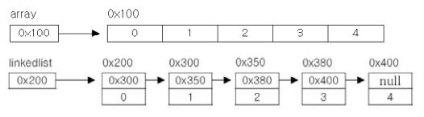
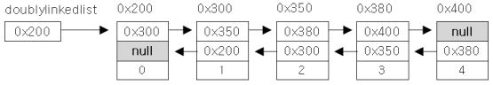

컬렉션 프레임웍(Collections Framework)
===
- 데이터 군을 저장하는 클래스들을 표준화한 설계
- 컬렉션(Collection)은 다수의 데이터, 즉 데이터 그룹을, 프레임웍은 표준화된 프로그래밍 방식을 의미한다.

###### <br>
컬렉션 프레임웍의 핵심 인터페이스
---
컬렉션데이터 그룹을 크게 3가지 타입이 존재한다고 인식하고 각 컬렉션을 다루는데 필요한 기능을 가진 3개의 인터페이스를 정의하였다.

<p align="center">

</p>

<br>

List와 Set을 구현한 컬렉션 클래스들은 서로 많은 공통부분이 있어서 Collection인터페이스로 재정의 할 수 있었지만 Map인터페이스는 이들과 전혀 다른 형태로 컬렉션을 다루기 때문에 같은 상속 계층도에 포함되지 못했다.

<br>

|인터페이스|<center>특징</center>|
|:-:|-|
|**List**|순서가 있는 데이터의 집합, 데이터 중복을 허용한다.<br>ex) 대기자 명단<br>**구현클래스 : ArrayList, LinkedList, Stack, Vector 등**|
|**Set**|순서를 유지하는 않는 데이터의 집합, 데이터의 중복을 허용하지 않는다.<br>ex) 양의 정수집합, 소수의 집합<br>**구현클래스 : HashSet, TreeSet 등**|
|**Map**|키(Key)와 값(Value)의 쌍(pair)으로 이루어진 데이터의 집합<br>순서는 유지되지 않으며, 키는 중복을 허용하지 않고, 값은 중복을 허용한다.<br>ex) 우편번호, 지역번호(전화번호)<br>**구현클래스 : HashMap, TreeMap, Hashtable, Properties 등**|

<br>

### **Collection인터페이스**
List와 Set의 조상인 Collection 인터페이스에는 다음과 같은 메서드들이 정의되어 있다.

- **Collection인터페이스에 정의된 메서드**
<p align="center">

</p>

Collection인터페이스는 컬렉션 클래스에 저장된 데이터를 읽고, 추가하고 삭제하는 등 컬렉션을 다루는데 가장 기본적인 메서드들을 정의하고 있다.

<br>

### **List인터페이스**
List인터페이스는 **중복을 허용**하면서 저장순서가 유지되는 컬렉션을 구현하는데 사용된다.

- **List의 상속계층도**
<p align="center">

</p>

<br>

- **List인터페이스 메서드**
<p align="center">

</p>

<br>

### **Set인터페이스**
중복을 허용하지 않고 저장순서가 유지되지 않는 컬렉션 클래스를 구현하는데 사용된다.

- **Set의 상속계층도**
<p align="center">

</p>

※ Set의 메서드는 Collection인터페이스와 동일하다.

<br>

### **Map인터페이스**
키(Key)와 값(value)을 하나의 쌍으로 묶어서 저장하는 컬렉션 클래스를 구현하는 데 사용된다. 키는 중복될 수 없지만 값은 중복을 허용한다.

기존에 저장된 데이터와 중복된 키와 값을 저장하면 기존의 값은 없어지고 마지막에 저장된 값이 남게된다.

- **Map의 상속계층도**
<p align="center">

</p>

- **Map의 인터페이스 메서드**
<p align="center">

</p>

<br>

Map의 메서드중 keySet()과 values()를 보면 각각 반환 타입이 다르다.

keySet메서드는 Map에 저장된 모든 Key를 반환한다. Key는 중복을 허용하지 않기 때문에 Set타입이고, values()는 Map에 저장된 모든 value를 반환하는데 value는 중복을 허용하기 때문에 Collection타입으로 반환 된다.

<br>

### **Map.Entry인터페이스**

Map인터페이스의 내부 인터페이스이다. 내부 클래스와 같이 인터페이스도 인터페이스 안쪽에 인터페이스를 정의하는 내부 인터페이스(inner interface)를 정의하는 것이 가능하다.

Map에 저장되는 key-value쌍을 다루기 위해 내부적으로 Entey인터페이스를 정의해 놓았다.

```java
public interface Map {
    ...
    public static interface Entry {
        Object getKey();
        Object getValue();
        Object setValue(Object value);
        boolean equals(Object o)
        int hashCode();
        ...             // JDK8.0부터 추가된 메서드는 생략
    }
}
```
- **Map.Entry인터페이스의 메서드

|<center>메서드</center>|<center>설명</center>|
|-|-|
|boolean equals(Object o)|동일한 Entry인지 비교한다.|
|Object getKey()|Entry의 key객체를 반환한다.|
|Object getValue()|Entry의 value객체를 반환한다.|
|int hashCode()|Entry의 해시코드를 반환한다.|
|Object setValue(Object value)|Entry의 value객체를 지정된 객체로 바꾼다.|

###### <br>

ArrayList
---
- ArrayList는 List인터페이스를 구현하기 때문에 데이터의 저장순서가 유지되고 중복을 허용한다는 특징을 갖는다.
- 기존의 Vector를 개선한 것으로 Vector와 구현원리와 기능적인 측면에서 동일하다고 할 수 있다.

```java
public class ArrayList extends AbstractList
  implements List, RandomAccess, Cloneable, java.io.Serializable {
    ...
    transient Object[] elementData; // Object배열
    ...
}
```
위의 코드는 ArrayList의 일부인데 ArrayList는 elementData라는 이름의 Object배열을 멤버변수로 선언하고 있다. 선언된 배열의 타입이 모든 객체의 최고조상인 Object이기 때문에 모든 종류의 객체를 담을 수 있다.

- **ArrayList의 생성자와 메서드**

|<center>메서드</center>|<center>설명</center>|
|-|-|
|ArrayList()|크기가 10인 ArrayList를 생성|
|ArrayList (Collection c)|주어진 컬렉션이 저장된 ArrayList를 생성|
|ArrayList (int initialCapacity)|지정된 초기용량을 갖는 ArrayList를 생성|
|boolean add (Object o)|ArrayList의 마지막에 객체를 추가. 성공하면 true|
|void add (int index, Object element)|지정된 위치(index)에 객체를 저장|
|boolean addAll(Collection c)|주어진 컬렉션의 모든 객체를 저장한다.|
|boolean addAll(int index, Collection c)|지정된 위치부터 주어진 컬렉션의 모든 객체를 저장한다.|
|void clear()|ArrayList를 완전히 비운다.|
|Object clone()|ArrayList를 복제한다.|
|boolean contains (Object o)|지정된 객체 (0)가 ArrayList에 포함되어 있는지 확인|
|void ensureCapacity (int minCapacity)|ArrayList의 용량이 최소한 minCapacity가 되도록 한다.|
|Object get (int index)|지정된 위치(index)에 저장된 객체를 반환한다.|
|int indexOf(Object o)|지정된 객체가 저장된 위치를 찾아 반환한다.|
|boolean isEmpty()|ArrayList가 비어있는지 확인한다.|
|Iterator iterator()|ArrayList의 lterator 객체를 반환|
|int lastIndexOf(Object o)|객체(o)가 저장된 위치를 끝부터 역방향으로 검색해서 반환|
|ListIterator listIterator()|ArrayList의 ListIterator를 반환|
|ListIterator listIterator(int index)|ArrayList의 지정된 위치부터 시작하는 ListIterator를 반환|
|Object remove (int index)|지정된 위치 (index)에 있는 객체를 제거한다.|
|boolean remove (Object o)|지정한 객체를 제거한다. (성공하면 true, 실패하면 false)|
|boolean removeAII (Collection c)|지정한 컬렉션에 저장된 것과 동일한 객체들을 ArrayList에서 제거한다.|
|boolean retainAll (Collection c)|ArrayList에 저장된 객체 중에서 주어진 컬렉션과 공통된 만을 남기고 나머지는 삭제한다.|
|Object set(int index, Object element)|주어진 객체 (element)를 지정된 위치 (index) 에 저장한다.|
|int size()|ArrayList에 저장된 객체의 개수를 반환한다.|
|void sort(Comparator c)|지정된 정렬기준 (c)으로 ArrayList를 정렬|
|List subList(int fromIndex, int toIndex)|fromIndex부터 toIndex 사이에 저장된 객체를 반환한다.|
|Object[] toArray()|ArrayList에 저장된 모든 객체들을 객체배열로 반환한다.|
|Object[] toArray(Object[] a)|ArrayList에 저장된 모든 객체들을 객체배열 a에 담아 반환한다.|
|void trim ToSize()|용량을 크기에 맞게 줄인다. (빈 공간을 없앤다.)|

<br>

**사용 예제**
```java
import java.util.*;

class ArrayListEx {
    public static void main(String[] args) {
        ArrayList list1 = new ArrayList(10);
        list1.add(new Integer(5));
        list1.add(new Integer(4));
        list1.add(new Integer(2));
        list1.add(new Integer(0));
        list1.add(new Integer(1));
        list1.add(new Integer(3));

        ArrayList list2 = new ArrayList(list1.subList(1, 4));
        print(list1, list2);

        Collections.sort(list1); // list1과 list2를 정렬한다.
        Collections.sort(list2); // Collections.sort(List 1)
        print(list1, list2);

        System.out.println("list1.containsAll(list2):" + list1.containsAll(list2));

        list2.add("B");
        list2.add("C");

        list2.add(2, "A");
        print(list1, list2);

        list2.add(2, "A");
        print(list1, list2);

        // list1에서 list2와 겹치는 부분만 남기고 나머지는 삭제한다.
        System.out.println("list1.retainAll(list2):" + list1.retainAll(list2));

        print(list1, list2);

        // list2에서 list1에 포함된 객체들을 삭제한다.
        for (int i = list2.size() - 1; i >= 0; i--) {
            if (list1.contains(list2.get(i)))
                list2.remove(i);
        }
        print(list1, list2);
    }

    static void print(ArrayList list1, ArrayList list2) {
        System.out.println("list1:" + list1);
        System.out.println("list2:" + list2);
        System.out.println();
    }
}
```
실행결과

    list1:[5, 4, 2, 0, 1, 3]
    list2:[4, 2, 0]

    list1:[0, 1, 2, 3, 4, 5]	← Collections.sort(List l)를 이용해서 정렬하였다.
    list2:[0, 2, 4]

    list1.containsAll(list2):true	← list1이 list2의 모든 요소를 포함하고 있을 때만 true
    list1:[0, 1, 2, 3, 4, 5]
    list2:[0, 2, A, 4, B, C]	← add(Object obj)를 이용해서 새로운 객체를 저장하였다.

    list1:[0, 1, 2, 3, 4, 5]
    list2:[0, 2, A, A, 4, B, C]	← set(int index, Object obj)를 이용해서 다른 객체로 변경

    list1.retainAll(list2):true	← retainAll에 의해 list1에 변화가 있었으므로 true를 반환
    list1:[0, 2, 4]     ← list2와의 공통요소 이외에는 모두 삭제되었다(변화가 있었다.)
    list2:[0, 2, A, A, 4, B, C]

    list1:[0, 2, 4]
    list2:[A, A, B, C]

**Vector의 용량(capacity)과 크기(size)예제**
```java
import java.util.*;

class VectorEx {
    public static void main(String[] args) {
        Vector v = new Vector(5); // 용량이(capacity)이 5인 Vector를 생성
        v.add("1");
        v.add("2");
        v.add("3");
        print(v);

        v.trimToSize();         // 빈공간을 없앤다.(용량과 크기가 같아진다.)
        System.out.println();
        print(v);

        v.ensureCapacity(6);    // v의 capacity가 최소한 6이 되도록한다.
                                // 만일 v의 capacity가 6이상이라면 아무일도 일어나지 않는다
        System.out.println();
        print(v);

        v.setSize(7);           // v의 size가 7이 되도록 한다.
                                // 만일 v의 capacity가 부족할 경우 자동적으로
                                // 기존 크기보다 2배의 크기로 증가된다.
        System.out.println();
        print(v);

        v.clear();              // v의 모든 요소를 삭제한다
        System.out.println();
        print(v);
    }

    public static void print(Vector v) {
        System.out.println(v);
        System.out.println("size :" + v.size());
        System.out.println("capacity :" + v.capacity());
    }
}
```
실행결과

    [1, 2, 3]
    size :3
    capacity :5

    [1, 2, 3]
    size :3
    capacity :3

    [1, 2, 3]
    size :3
    capacity :6

    [1, 2, 3, null, null, null, null]
    size :7
    capacity :12

    []
    size :0
    capacity :12

###### <br>
LinkedList
---
**배열의 장점**
- 가장 기본적인 형태의 자료구조로 구조가 간단하며 사용하기 쉽다.
- 데이터를 읽어오는데 걸리는 시간(접근시간, access time)이 가장 빠르다.

**배열의 단점**
- 크기를 변경할 수 없다.
- 비순차적인 데이터의 추가 또는 삭제에 시간이 많이 걸린다.

이러한 배열의 단점을 보완하기 위해서 링크드 리스트(linked list)라는 자료구조가 고안되었다.

배열은 연속적으로 존재하지만 링크드 리스트는 불연속적으로 존재하는 데이터를 서로 연결(link)한 형태로 구성되어 있다.

- **배열과 링크드 리스트**
<p align="center">

</p>

위 그림에서 알 수 있듯이 링크드 리스트의 요소(node)들은 자신과 연결된 다음 요소에 대한 참조(주소값)와 데이터로 구성되어 있다.

```java
class Node {
    Node   next;    // 다음 요소의 주소를 저장
    Object obj;     // 데이터를 저장
}
```
- 링크드 리스트에서 데이터를 삭제하고자 할때는 삭제하려고 하는 요소의 이전요소가 다음 요소를 참조하도록 변경하기만 하면 된다. 배열처럼 데이터를 이동하기 위해 복사하는 과정이 없기 때문에 처리속도가 매우 빠르다.
- 새로운 데이터를 추가할 때는 새로운 요소를 생성한 다음 추가하고자 하는 위치의 이전요소의 참조를 새로운 요소에 대한 참조로 변경해주고, 새로운 요소가 그 다음 요소를 참조하도록 변경하기만 하면 된다.

링크드 리스트는 이동방향이 단방향이기 때문에 다음 요소에 대한 접근은 쉬웠지만 이전요소에 대한 접근은 어렵다. 이 점을 보완한 것이 더블 링크드 리스트(이중 연결리스트, doubly linked list)이다.

더블 링크드 리스트는 다음 요소에 대한 참조뿐 아니라 이전 요소에 대한 참조가 가능하도록 했다

```java
class Node{
    Node next;      // 다음 요소의 주소
    Node previous;  // 이전 요소의 주소
    Object obj;     // 데이터를 저장
}
```
- **더블 링크드 리스트(doubly-linked list)**
<p align="center">

</p>

더블 링크드 리스트의 접근성을 보다 향상시킨 것이 '더블 써큘러 링크드 리스트(이중 원형 연결리스트, doubly circular linked list)'인데, 단순히 더블 링크드 리스트의 첫 번째 요소와 마지막 요소를 서로 연결시킨 것이다.

- **LinkedList의 생성자와 메서드**

|<center>생성자 또는 메서드</center>|<center>설명</center>|
|-|-|
|LinkedList()|LinkedList 객체를 생성|
|LinkedList(Collection c)|주어진 컬렉션을 포함하는 LinkedList객체를 생성|
|boolean add(Object o)|지정된 객체(o)를 LinkedList의 끝에 추가, 저장에 성공하면 true, 실패하면 false|
|void add(int index, Object element)|지정된 위치(index)에 객체(element)를 추가|
|boolean addAll(Collection c)|주어진 컬렉션에 포함된 모든 요소를 LinkedList의 끝에 추가한다. 성공하면 true, 실패하면 false|
|boolean addAll(int index, Collection c)|지정된 위치(index)에 주어진 컬렉션에 포함된 모든 요소를 추가, 성공하면 true, 실패하면 false|
|void clear()|LinkedList의 모든 요소를 삭제|
|boolean contains(Object o)|지정된 객체가 LinkedList에 포함되었는지 알려줌|
|boolean containsAll(Collection c)|지정된 컬렉션의 모든 요소가 포함되었는지 알려줌|
|Object get(int index)|지정된 위치(index)의 객체를 반환|
|int indexOf(Object o)|지정된 객체가 저장된 위치(앞에서 몇 번째)를 반환|
|boolean isEmpty()|LinkedList가 비어있는지 알려준다. 비어있으면 true|
|Iterator iterator()|Iterator를 반환한다.|
|int lastIndexOf(Object o)|지정된 객체의 위치(index)를 반환(끝부터 역순검색)|
|ListIterator listIterator()|ListIterator를 반환한다.|
|ListIterator listIterator(int index)|지정된 위치에서부터 시작하는 ListIterator를 반환|
|Object remove(int index)|지정된 위치(index)의 객체를 LinkedList에서 제거|
|boolean remove(Object o)|지정된 객체를 LinkedList에서 제거, 성공하면 true, 실패하면 false|
|boolean removeAll(Collection c)|지정된 컬렉션의 요소와 일치하는 요소를 모두 삭제|
|boolean retainAll (Collection c)|지정된 컬렉션의 모든 요소가 포함되어 있는지 확인|
|Object set (int index, Object element)|지정된 위치 (index)의 객체를 주어진 객체로 바꿈|
|int size()|LinkedList에 저장된 객체의 수를 반환|
|List subList(int fromIndex, int toIndex)|LinkedList의 일부를 List로 반환|
|Object[] toArray()|LinkedList에 저장된 객체를 배열로 반환|
|Object[] toArray(Object[] a)|LinkedList에 저장된 객체를 주어진 배열에 저장하여 반환|
|Object element()|LinkedList의 첫 번째 요소를 반환|
|boolean offer(Object o)|지정된 객체 (o)를 LinkedList의 끝에 추가, 성공하면 true, 실패하면 false|
|Object peek()|LinkedList의 첫 번째 요소를 반환|
|Object poll()|LinkedList의 첫 번째 요소를 반환, LinkedList에서는 제거된다.|
|Object remove()|LinkedList의 첫 번째 요소를 제거|
|void addFirst(Object o)|LinkedList의 맨 앞에 객체(o)를 추가|
|void addLast(Object o)|LinkedList의 맨 끝에 객체(o)를 추가|
|Iterator descendingIterator)|역순으로 조회하기 위한 Descendinglterator를 반환|
|Object getFirst()|LinkedList의 첫번째 요소를 반환|
|Object getLast()|LinkedList의 마지막 요소를 반환|
|boolean offerFirst(Object o)|LinkedList의 맨 앞에 객체(o)를 추가. 성공하면, true|
|boolean offerLast(Object o)|LinkedList의 맨 끝에 객체(o)를 추가 성공하면, true|
|Object peekFirst()|LinkedList의 첫번째 요소를 반환|
|Object peekLast()|LinkedList의 마지막 요소를 반환|
|Object pollFirst()|LinkedList의 첫번째 요소를 반환하면서 제거|
|Object pollLast()|LinkedList의 마지막 요소를 반환하면서 제거|
|Object pop()|removeFirst()와 동일|
|void push(Object o)|addFirst()와 동일|
|Object removeFirst()|LinkedList의 첫번쨰 요소를 제거
|Object removeLast()|LinkedList의 마지막 요소를 제거
|boolean removeFirstOccurrence(Object o)|LinkedList에서 첫번째로 일치하는 객체를 제거
|boolean removeLastOccurrence(Object o)|LinkedList에서 마지막으로 일치하는 객체를 제거