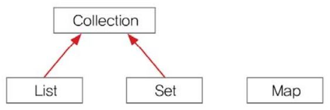
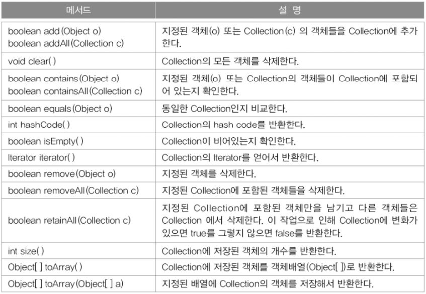

컬렉션 프레임웍(Collections Framework)
===
- 데이터 군을 저장하는 클래스들을 표준화한 설계
- 컬렉션(Collection)은 다수의 데이터, 즉 데이터 그룹을, 프레임웍은 표준화된 프로그래밍 방식을 의미한다.

######  
컬렉션 프레임웍의 핵심 인터페이스
---
컬렉션데이터 그룹을 크게 3가지 타입이 존재한다고 인식하고 각 컬렉션을 다루는데 필요한 기능을 가진 3개의 인터페이스를 정의하였다.

**컬렉션 프레임웍의 핵심 인터페이스간의 상속계층도**

 

List와 Set을 구현한 컬렉션 클래스들은 서로 많은 공통부분이 있어서 Collection인터페이스로 재정의 할 수 있었지만 Map인터페이스는 이들과 전혀 다른 형태로 컬렉션을 다루기 때문에 같은 상속 계층도에 포함되지 못했다.

 

|인터페이스|
특징
|
|:-:|:-|
|**List**|순서가 있는 데이터의 집합, 데이터 중복을 허용한다. ex) 대기자 명단 **구현클래스 : ArrayList, LinkedList, Stack, Vector 등**|
|**Set**|순서를 유지하는 않는 데이터의 집합, 데이터의 중복을 허용하지 않는다. ex) 양의 정수집합, 소수의 집합 **구현클래스 : HashSet, TreeSet 등**|
|**Map**|키(Key)와 값(Value)의 쌍(pair)으로 이루어진 데이터의 집합 순서는 유지되지 않으며, 키는 중복을 허용하지 않고, 값은 중복을 허용한다. ex) 우편번호, 지역번호(전화번호) **구현클래스 : HashMap, TreeMap, Hashtable, Properties 등**|

 

### **Collection인터페이스**
 

**Collection인터페이스에 정의된 메서드**

