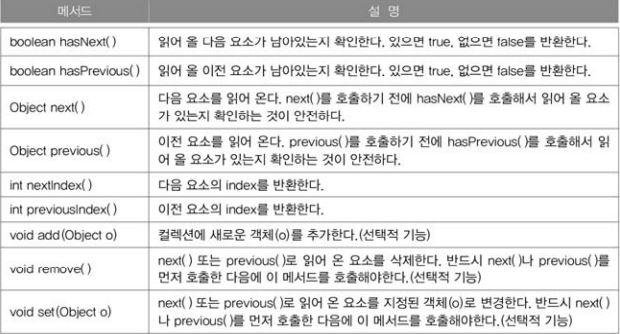

Iterator, ListIterator, Enumeration
---
- Iterator, ListIterator, Enumeration은 모두 컬렉션에 저장된 요소를 접근하는데 사용되는 인터페이스이다.
- Enumeration은 Iterator의 구버전
- ListIterator는 Iterator의 신버전

### **Iterator**
컬렉션에 저장된 각 요소에 접근하는 기능을 가진 Iterator인터페이스를 정의하고, Collection인터페이스에는 'Iterator(Iterator를 구현한 클래스의 인스턴스)'를 반환하는 iterator()를 정의하고 있다.

```java
public interface Iterator {
    boolean hasNext();
    Object next();
    void remove();
}

public interface Collection {
    ...
    public Iterator iterator();
    ...
}
```

interator()는 Collection인터페이스에 정의된 메서드이므로 Collection인터페이스의 자손인 List와 Set에도 포함되어 있다. 컬렉션 클래스에 대해 iterator()를 호출하여 Iterator를 얻은 다음 반복문, 주로 while문을 사용해서 컬렉션 클래스의 요소들을 읽어 올 수 있다.

|<center>메서드</center>|<center>설명</center>|
|:-|:-|
|boolean hasNext()|읽어 올 요소가 남아있는지 확인한다. 있으면 true, 없으면 false를 반환한다.|
|Object next()|다음 요소를 읽어 온다. next()를 호출하기 전에 hasNext()를 호출해서 읽어올 요소가 있는지 확인하는 것이 안전하다.|
|void remove()|next()로 읽어 온 요소를 삭제한다. next()를 호출한 다음에 remove()를 호출해야 한다.(선택정 기능)|

**Collection인터페이스를 구현한 컬렉션 클래스를 Iterator로 변환 및 출력**
```java
Collection c = new ArrayList();  // 다른 컬렉션으로 변경시 이 부분만 고치면 된다.
Iterator it = c.iterator();

while(it.hasNext()) {
    System.out.println(it.next());
}
```

Map인터페이스의 경우 키(Key)와 값(Value)을 쌍(pair)으로 저장하고 있기 때문에 iterator()를 직접 호출할 수 없고, 그 대신 keySet()이나 entrySet()과 같은 메서드를 통해 키와 값을 각각 따로 Set의 형태로 얻어 온 후에 다시 iterator()를 호출해야 Iterator를 얻을 수 있다.
```java
Map map = new HashMap();
Iterator it = map.enterySet().iterator();
```

**iterator활용 예제**
```java
import java.util.*;

class IteratorEx {
    public static void main(String[] args) {
        ArrayList list = new ArrayList();
        list.add("1");
        list.add("2");
        list.add("3");
        list.add("4");
        list.add("5");

        Iterator = it = list.iterator();

        while(it.hasNext()){
            Object obj = it.next();
            System.out.println(obj);
        }
    }
}
```
실행결과

    1
    2
    3
    4
    5

>List클래스들은 저장순서를 유지하기 때문에 읽어온 결과가 저장 순서와 동일하지만, Set클래스들은 요소간의 순서가 유지되지 않기 때문에 Iterator를 이용해서 저장된 요소들을 읽어 와도 처음에 저장된 순서와 같지 않다.

<br>

### **ListIterator와 Enumeration**
- Enumeration은 컬렉션 프레임웍이 만들어지기 이전에 사용하던 것.
- ListIterator는 Iterator를 상속받아서 기능을 추가한 것으로, 컬렉션의 요소에 접근할 때 Iterator는 단방향으로만 이동할 수 있지만, ListIterator는 양방향으로 이동이 가능하다. 단, List인터페이스를 구현한 컬렉션에서만 가능하다.

- **Iterator인터페이스의 메서드**
<p align="center">

</p>

- **ListIterator의 메서드**
<p align="center">

</p>

```java
import java.util;

class ListIteratorEx {
    public static void main(String[] args) {
        ArrayList list = new ArrayList();
        list.add("1");
        list.add("2");
        list.add("3");
        list.add("4");
        list.add("5");

        ListIterator it = list.listIterator();

        while(it.hasNext()) {
            System.out.print(it.next()); // 순방향으로 진행하면서 읽어온다.
        }
        System.out.println();
        while(it.hasPrevious()) {
            System.out.print(it.previous()); // 역방향으로 진행하면서 읽어온다.
        }
        System.out.println();
    }
}
```
실행결과

    12345
    54321

단방향으로만 이동하는 Iterator과는 달리 ListIterator는 양방향으로 이동하기 때문에 각 요소간의 이동이 자유롭다. 다만 이동하기 전에 반드시 hasNext()나 hasPrevious()를 호출해서 이동할 수 있는지 확인해야 한다.

ListIterator의 메서드 중 '선택정 기능(optional Operation)'이라고 표시된 것들은 반드시 구현하지 않아도 된다. 그렇다하더라도 인터페이스로부터 상속받는 메서드는 추상메서드라 메서드의 몸통(body)을 반듯이 만들어 주어야 하므로 단순히 ```public void remove(){};```와 같이 구현하는 것 보다
```java
public void remove() {
    throw new UnsupportedOperationExption();
}
```
이처럼 예외를 던져서 구현하지 않는 기능이라는 것을 메서드를 호출하는 쪽에 알리는 것이 좋다.

**remove()메서드 활용 예제**
```java
package day_22_01_21;

import java.util.*;

public class IteratorEx {
    public static void main(String[] args) {
        ArrayList original = new ArrayList();
        ArrayList copy1 = new ArrayList();
        ArrayList copy2 = new ArrayList();

        for (int i = 0; i < 10; i++) {
            original.add(i + "");
        }
        Iterator it = original.iterator();

        while (it.hasNext())
            copy1.add(it.next());

        System.out.println("= Original에서 copy1로 복사(copy) =");
        System.out.println("original:" + original);
        System.out.println("copy1:" + copy1);
        System.out.println();

        it = original.iterator(); // Iterator는 재사용이 안되므로, 다시 얻어와야 함.

        while (it.hasNext()) {
            copy2.add(it.next());
            it.remove();        // 값을 copy2에 넣고 바로 제거
        }

        System.out.println("= Original에서 copy2로 이동(move) =");
        System.out.println("original:" + original);
        System.out.println("copy2:" + copy2);
    }
}
```
**Iterator를 상속한 Itr클래스의 remove메서드 소스코드**
```java
private class Itr implements Iterator<E> {
    int cursor;       // 앞으로 읽어올 요소의 위치
    int lastRet = -1; // 마지막으로 읽어온 요소의 위치(index)
    int expectedModCount = modCount;

    public void remove() {
        if (lastRet < 0)    // lastRet이 0보다 작을경우(-1일 경우, next를 호출하지 않고 remove()가 호출된 경우)
            throw new IllegalStateException();  // 예외 발생!!!
        checkForComodification();

        try {
            ArrayList.this.remove(lastRet);
            cursor = lastRet;
            lastRet = -1;
            expectedModCount = modCount;
        } catch (IndexOutOfBoundsException ex) {
            throw new ConcurrentModificationException();
        }
    }
}
```
cursor는 앞으로 읽어올 요소의 위치를 저장하는데 사용되고, lastRet는 마지막으로 읽어온 요소의 위치(index)의 위치를 저장하는데 사용된다.

lastRet는 cursor보다 항상 1이 작은 값이 저장되고 remove()를 호출하면 이미 next()를 통해서 lastRet에 저장된 값의 위치에 있는 요소를 삭제하고 lastRet의 값을 -1로 초기화 한다.

만약 next()를 호출하지 않고 remove()를 호출하면 lastRet의 값은 -1이 되어 'IllegalStateException'이 발생한다. remove()는 next()로 읽어온 객체를 삭제하는 것이기 때문에 remove()를 호출하기 전에 반드시 next()가 호출된 상태이어야 한다.


###### <br>

Arrays
---
- Arrays클래스에는 배열을 다루는데 유용한 메서드가 정의되어 있다.

### **배열의 복사 - copyOf(), copyOfRange()**

    copyOf() - 배열의 전체를 복사해 새로운 배열을 만들어 반환
    
    copyOfRange() - 배열의 일부를 복사해 새로운 배열을 만들어 반환
                  - 지정된 범위의 끝은 포함되지 않는다.

**사용 예시**
```java
int[] arr = {0,1,2,3,4};
int[] arr2 = Arrays.copyOf(arr, arr.length);    // arr2 = {0,1,2,3,4}
int[] arr3 = Arrays.copyOf(arr, 3);             // arr3 = {0,1,2}
int[] arr4 = Arrays.copyOf(arr, 7);             // arr4 = {0,1,2,3,4,0,0}
int[] arr5 = Arrays.copyOfRange(arr, 2, 4);     // arr5 = {2,3} ← 4는 불필요
int[] arr6 = Arrays.copyOfRange(arr, 0, 7);     // arr6 = {0,1,2,3,4,0,0}
```

<br>

### **배열 채우기 - fill(), setAll()**

    fill() - 배열의 모든 요소를 지정된 값으로 채운다.

    setAll() - 배열을 채우는데 사용할 함수형 인터페이스를 매개변수로 받는다.
             - 매개변수를 함수형 인터페이스나 람다식으로 지정해야 한다.

**사용 예시**
```java
int[] arr = new int[5];
Arrays.fill(arr, 9);        // arr=[9,9,9,9,9]
Arrays.setAll(arr, () -> (int)(Math.random() * 5) + 1); // [1,5,2,1,4](랜덤한 값)
```
<br>

### **배열의 정렬과 검색 - sort(), binarySearch()**

    sort() - 배열을 정렬할 때 사용

    binarySearch() - 배열에 저장된 요소를 검색할 때 사용

binarySearch는 배열에서 지정된 값이 저장된 위치(index)를 찾아서 반환하는데, 반드시 배열이 정렬된 상태이어야 올바른 결과를 얻는다. 만일 검색한 값이 일치하는 요소들이 여러 개 있다면, 어떤 위치(index)가 반환될지 알 수 없다.

```java
int[] arr = {3,2,0,1,4};
int idx = Arrays.binarySearch(arr,2);       // idx =- 5 ← 잘못된 결과

Arrays.sort(arr);       // 배열 arr을 정렬한다.
System.out.println(Arrs.toString(arr));     // [0,1,2,3,4]
int idx = Arrays.binarySearch(arr,2);       // idx = 2 ← 올바른 결과
```
배열의 첫 번째 요소부터 순서대로 검색하는 것을 '**순차검색(linear search)**'이라고 하는데, 이 검색 방법은 배열이 정렬되어 있지 않아도 상관 없지만, 배열의 요소를 하나씩 비교하기 때문에 시간이 많이 걸린다.

반면에 '**이진검색(binary search)**'은 배열의 검색할 범위를 반복적으로 절반씩 줄여가면서 검색하기 때문에 검색속도가 상당히 빠르다. 단, 배열이 정렬되어 있는 경우에만 사용할 수 있다.

<br>

### **배열의 비교와 출력 - equals(), toString()**
- toString()
  - 배열의 모든 요소를 문자열로 편하게 출력할 수 있다.
  - toString은 일차원 배열에만 사용할 수 있고, 다차원 배열에는 deepToString()을 사용해야 한다.
  - deepToString()은 모든 요소를 재귀적으로 접근해서 문자열을 구성하므로 2차원 3차원 이상 배열도 가능하다.
  ```java
  int[] arr = {0,1,2,3,4};
  int[][] arr2D = {{11,12},{21,22}};
  System.out.println(Arrays.toString(arr)); //[0,1,2,3,4]
  System.out.println(Arrays.deepToString(arr2D));   //[[11,12],[21,22]]
  ```

* equals()
  * 두 배열에 저장된 모든 요소를 비교해서 같으면 true, 다르면 false를 반환한다.
  * equals()도 다차원 배열의 비교에는 deepEquals()를 사용해야한다.
  ```java
  String[][] str2D = new String[][]{{"aaa","bbb"}, {"AAA","BBB"}};
  String[][] str2D2 = new String[][]{{"aaa","bbb"}, {"AAA","BBB"}};
  System.out.println(Arrays.equals(str2D, str2D2));     // false
  System.out.println(Arrays.deepEquals(str2D,str2D2));  // true
  ```
<br>

### **배열을 List로 변환 - asList(Object... a)**
- 배열을 List에 담아서 반환한다.
- 매개변수 타입이 가변인수라서 배열 생성 없이 저장할 요소들만 나열하는 것도 가능하다.
  ```java
  List list = Arrays.asList(new Integer[]{1,2,3,4,5});  // list = [1,2,3,4,5]
  List list = Arrays.asList(1,2,3,4,5)  // list = [1,2,3,4,5]
  list.add(6);  // UnsupportedOperationException    예외 발생
  ```
- 한 가지 주의할 점은 asList()가 반환한 List의 크기를 변경할 수 없다는 것이다.
- 추가 또는 삭제가 불가능하다.

<br>

### **parallelXXX(), spliterator(), stream()**
- 해당 메서드들 외에도 'parallel'로 시작하는 이름의 메서드들이 있다.
- 이 메서드들은 보다 빠른 결과를 얻기 위해 여러 쓰레드가 작업을 나누어 처리하도록 한다.
- spliterator()는 여러 쓰레드가 처리할 수 있게 하나의 작업을 여러 작업으로 나누는 Spliterator를 반환한다.
- stream()은 컬렉션을 스트림으로 변환한다.

<br>

**전체 메서드 사용 예제**
```java
import java.lang.reflect.Array;
import java.util.Arrays;

class ArraysEx {
    public static void main(String[] args) {
        int[] arr = { 0, 1, 2, 3, 4 };
        int[][] arr2D = { { 11, 12, 13 }, { 21, 22, 23 } };

        System.out.println("arr=" + Arrays.toString(arr));
        System.out.println("arr2D=" + Arrays.deepToString(arr2D));

        int[] arr2 = Arrays.copyOf(arr, arr.length);
        int[] arr3 = Arrays.copyOf(arr, 3);
        int[] arr4 = Arrays.copyOf(arr, 7);
        int[] arr5 = Arrays.copyOfRange(arr, 2, 4);
        int[] arr6 = Arrays.copyOfRange(arr, 0, 7);

        System.out.println("arr2=" + Arrays.toString(arr2));
        System.out.println("arr3=" + Arrays.toString(arr3));
        System.out.println("arr4=" + Arrays.toString(arr4));
        System.out.println("arr5=" + Arrays.toString(arr5));
        System.out.println("arr6=" + Arrays.toString(arr6));

        int[] arr7 = new int[5];
        Arrays.fill(arr7, 9); // arr=[9,9,9,9,9]
        System.out.println("arr7=" + Arrays.toString(arr7));

        Arrays.setAll(arr7, i -> (int) (Math.random() * 6) + 1);
        System.out.println("arr7=" + Arrays.toString(arr7));

        for (int i : arr7) {
            char[] graph = new char[i];
            Arrays.fill(graph, '*');
            System.out.println(new String(graph));
        }

        String[][] str2D = new String[][] { { "aaa", "bbb" }, { "AAA", "BBB" } };
        String[][] str2D2 = new String[][] { { "aaa", "bbb" }, { "AAA", "BBB" } };

        System.out.println(Arrays.equals(str2D, str2D2)); // false
        System.out.println(Arrays.deepEquals(str2D, str2D2)); // true

        char[] chArr = { 'A', 'D', 'C', 'B', 'E' };

        System.out.println("chArr=" + Arrays.toString(chArr));
        System.out.println("index of B =" + Arrays.binarySearch(chArr, 'B'));
        System.out.println("= After sorting =");
        Arrays.sort(chArr);
        System.out.println("chArr=" + Arrays.toString(chArr));
        System.out.println("index of B =" + Arrays.binarySearch(chArr, 'B'));
    }
}
```
실행결과

    arr=[0, 1, 2, 3, 4]
    arr2D=[[11, 12, 13], [21, 22, 23]]
    arr2=[0, 1, 2, 3, 4]
    arr3=[0, 1, 2]
    arr4=[0, 1, 2, 3, 4, 0, 0]
    arr5=[2, 3]
    arr6=[0, 1, 2, 3, 4, 0, 0]
    arr7=[9, 9, 9, 9, 9]
    arr7=[5, 5, 1, 1, 3]
    *****5
    *****5
    *1
    *1
    ***3
    false
    true
    chArr=[A, D, C, B, E]
    index of B =-2  ←  정렬되지 않아서 잘못된 결과가 나왔음.
    = After sorting =
    chArr=[A, B, C, D, E]
    index of B =1  ←  정렬한 후라서 올바른 결과가 나왔음.