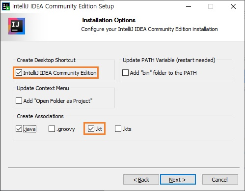
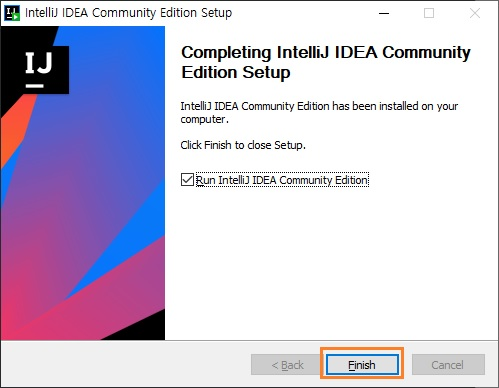
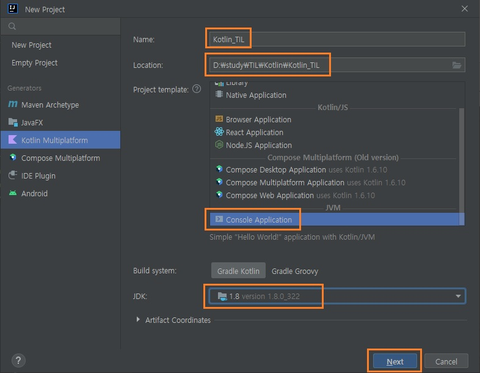
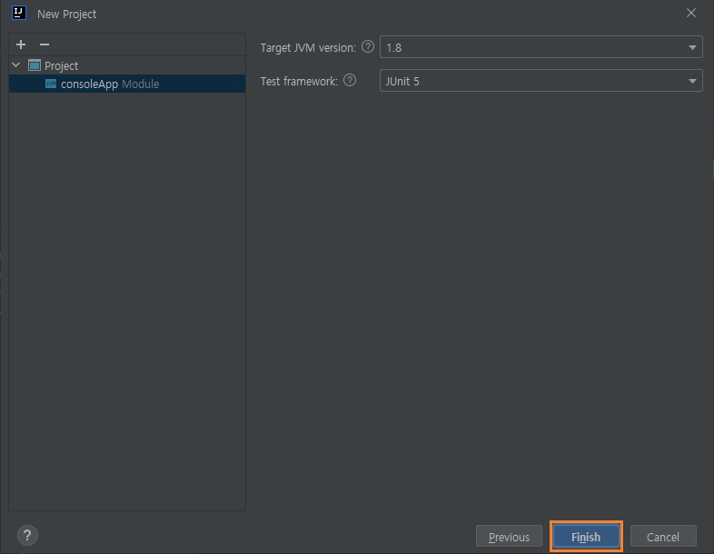
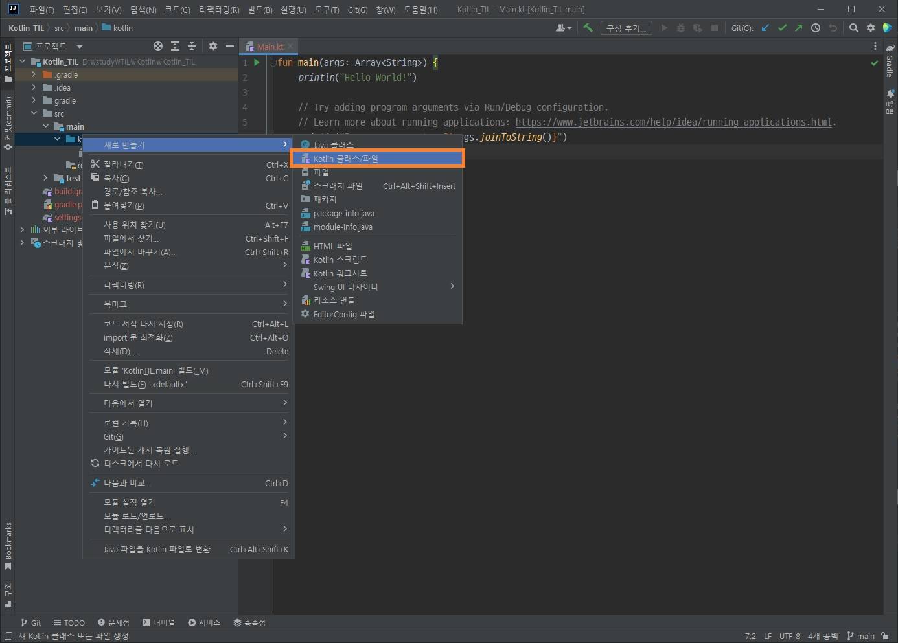
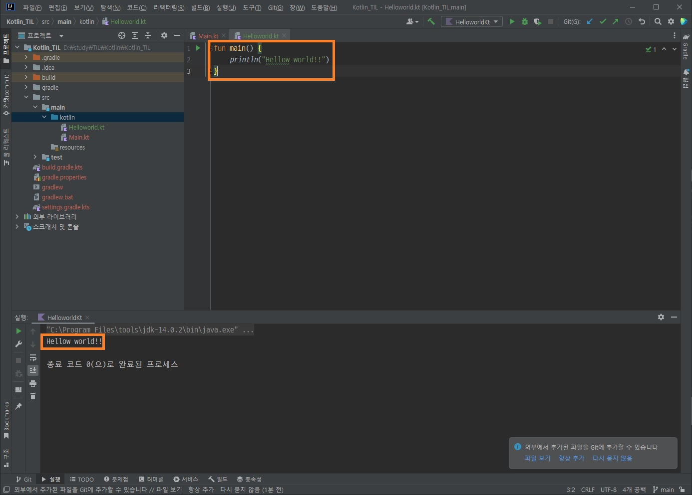

코틀린 시작하기
==
실습 환경 구축
--
### IntelliJ IDEA 설치하기
[IntelliJ 다운로드 사이트](https://www.jetbrains.com/ko-kr/idea/download/#section=windows)
<p>

[](https://www.jetbrains.com/ko-kr/idea/download/#section=windows)

</p>

프로그램 실행 후 다음 화면 뜰때까지 next
<p></p>
<p></p>
<p></p>
<p></p>
<p></p>
<p></p>
<p></p>
위와 같이 입력 후 <code>Ctrl</code> + ``` Shift ``` + ``` f10 ```