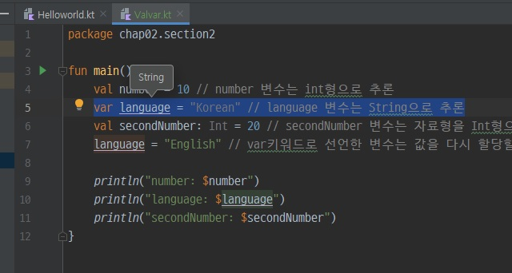

변수와 자료형, 연산자
==
변수와 자료형
--
### 변수를 선언하고 자료형 추론하기
- 변수는 val, var라는 키워드를 이용하여 선언할 수 있다.
- **val**로 변수를 선언하면 최초로 지정한 변수의 값으로 초기화하고 더 이상 바꿀 수 없는 읽기 전용 변수가 된다.(자바의 final)
- **var**로 변수를 선언하면 최초로 지정한 변수의 초깃값이 있더라도 값을 바꿀 수 있다.
> ※ val로 변수를 선언해 놓고 변경해야 할 때 var로 바꾸는 방법을 권장(오류 발생 확률이 낮아짐)

<br>

- **변수 선언 예시**
```kotlin
val username: String = "LHS"
val username = "LHS" // 코틀린이 자료형을 추론하여 username의 자료형을 String으로 결정
```
    val: 선언 키워드
    username: 변수 이름
    String: 자료형
    "LHS": 값
> ※ 코틀린은 자료형을 지정하지 않고 변수를 선언하면 변수에 할당된 값("LHS")을 보고 알아서 자료형을 지정할 수 있다. 이것을 **'자료형을 추론한다'** 라고한다.
>
>단, 자료형을 지정하지 않은 변수는 반드시 자료형을 추론할 값을 지정해야 한다.(자료형이 없으면 초기값 필수)
```kotlin
var username // 자료형을 지정하지 않은 변수는 사용할 수 없음
```

- val과 var변수 선언 및 할당하기(ValVar.kt)
```kotlin
package chap02.section2

fun main() {
    val number = 10 // number 변수는 int형으로 추론
    var language = "Korean" // language 변수는 String으로 추론
    val secondNumber: Int = 20 // secondNumber 변수는 자료형을 Int형으로 명시적으로 지정
    language = "English" // var키워드로 선언한 변수는 값을 다시 할당할 수 있음

    println("number: $number")
    println("language: $language")
    println("secondNumber: $secondNumber")
}
```
- 실행 결과
```
number: 10
language: English
secondNumber: 20
```

> ※ 자료형을 지정하지 않은 변수 language를 클릭해 입력 커서를 놓고 Ctrl + Shift + P를 눌러보자. 추론된 자료형을 볼 수 있다.
> 

- 변수 명명 규칙
```
- 변수 이름은 123abc와 같이 숫자로 시작하면 안 된다.
- 변수 이름에는 while, if와 같이 코틀린에서 사용되는 키워드는 쓸 수 없다.
- 변수 이름은 의미 있는 단어를 사용하여 만드는 것이 좋다.
- 여러 단어를 사용하여 변수 이름을 지을 때 카멜 표기법을 사용하는 것이 좋다.
```
<br>

### 자료형 알아보기
- 코틀린의 자료형은 참조형 자료형만을 사용한다.
- 참조형으로 선언한 변수는 성능 최적화를 위해 코틀린 컴파일러에서 다시 기본형으로 대체된다.
- 컴파일 과정을 거치며 기본형으로 바뀌기 때문에 성능에는 차이가 없다.

<br>

- **정수 자료형**
```kotlin
val num01 = 127         // Int 형으로 추론
val num02 = -32142      // Int 형으로 추론
val num03 = 2147483647  // Int 형으로 추론
val num04 = 9223372036854775807 // Int의 범위를 벗어났기 때문에 Long형으로 추론

val num05 = 123L    // 접미사 L을 사용하여 Long형으로 추론
val num06 = 0x0f    // 접두사 0x를 사용하여 16진수 표기가 사용된 Int형으로 추론
val num07 = 0b00001011  // 접두사 0b를 사용하여 2진수 표기가 사용된 Int형으로 추론
```
> ※ 보통 숫자 값은 Int형으로 추론되기 때문에 만일 좀 더 작은 범위의 정수 자료형인 Byte나 Short를 사용하기 위해서는 직접 자료형을 명시 해야 한다.
> ```kotlin
> val num08: Byte = 127 // 명시적으로 자료형을 Byte로 지정
> val num09 = 32767     // 명시적으로 지정하지 않으면 Short범위의 값도 Int형으로 추론
> val num10: Short = 32767  // 명시적으로 자료형을 Short로 지정
> ```
<br>

- **음의 부호를 사용하지 않는 정수 자료형**
> 부호가 없는 자료형은 코틀린 1.3버전에서 실험적으로 도입한 기능이다.   
> 코틀린이 업데이트되면 이 자료형은 변경될 수 있음.

<table>
    <tr align="center">
        <th>형식</th>
        <th>자료형</th>
        <th>크기</th>
        <th>값의 범위</th>
    </tr>
    <tr align="center">
        <td rowspan="4">부호 없는 <br>정수자료형</td>
        <td>ULong</td>
        <td>8바이트(64비트)</td>
        <td>0 ~ 2<sup>64</sup>-1</td>
    </tr>
    <tr align="center">
        <td>UInt</td>
        <td>4바이트(32비트)</td>
        <td>0 ~ 2<sup>32</sup>-1</td>
    </tr>
    <tr align="center">
        <td>UShort</td>
        <td>2바이트(16비트)</td>
        <td>0 ~ 2<sup>16</sup>-1(0 ~ 65,535)</td>
    </tr>
    <tr align="center">
        <td>UByte</td>
        <td>1바이트(8비트)</td>
        <td>0 ~ 2<sup>8</sup>-1(0 ~ 255)</td>
    </tr>
</table>

```kotlin
val uint: UInt = 153u
val ushort: UShort = 65535u
val ulong: ULong = 46322342uL
val ubyte: UByte = 255u
```

> ※ **언더스코어 자릿값 구분**   
> 변수에 값이 너무 길어서 읽기 어려울 때 언더스코어(_)를 사용하여 단위를 구분 해준다.   
> 언더스코어(_)는 값에 영향을 주지 않는다.   
> ```kotlin
> val number = 1_000_000
> val cardNum = 1234_1234_1234_1234L
> val hexVal = 0xab_cd_ef_12
> val bytes = 0b1101_0010
> ```
> 