프로젝트 생성
===
- **Perspective 변경**
  <p>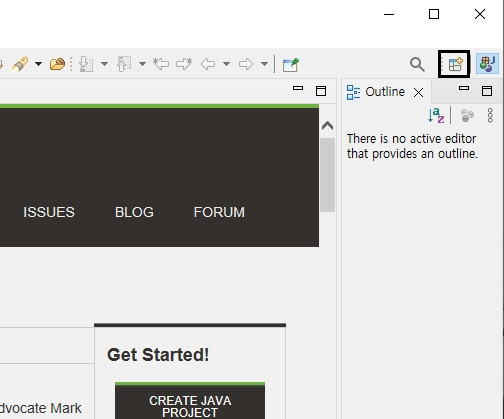</p>
  <p>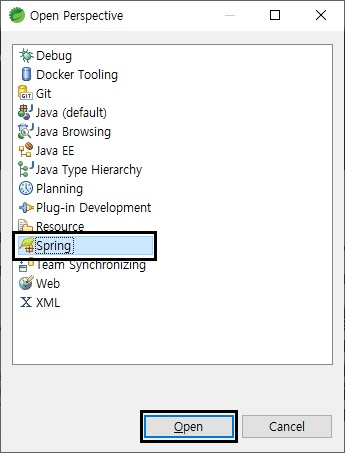</p>

- **Spring Legacy 프로젝트 생성**
  <p>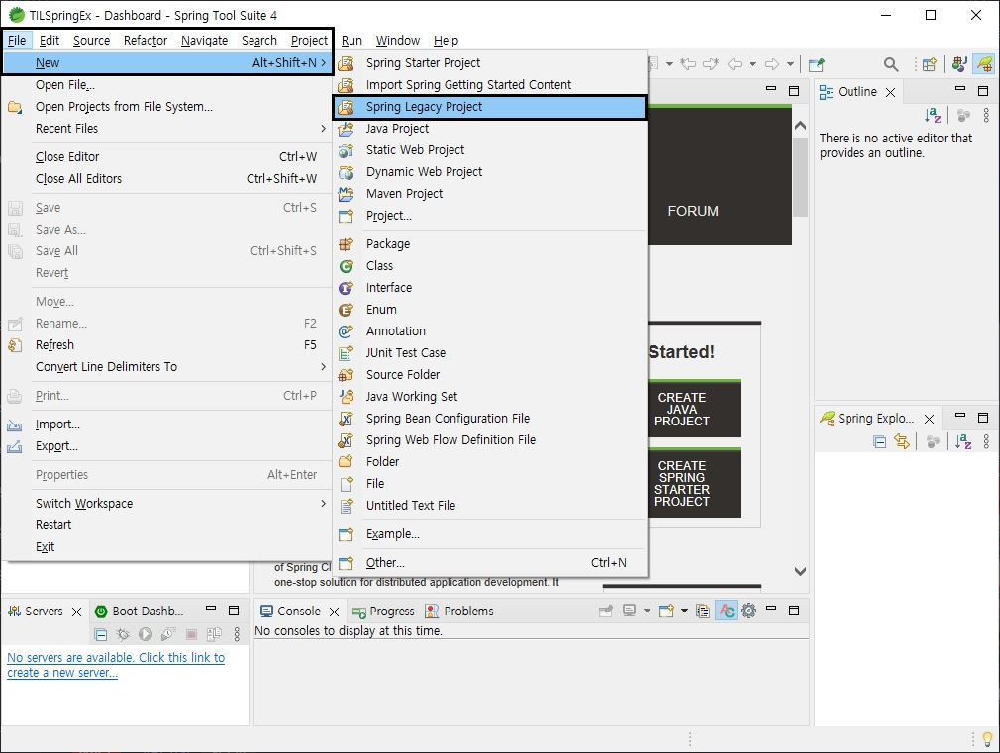</p>
  플젝 이름 설정
  <p>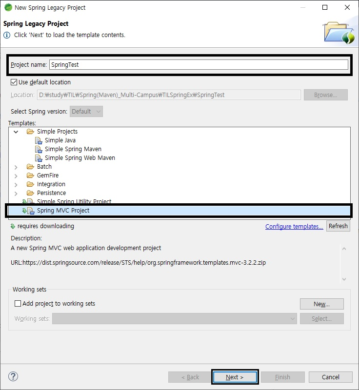</p>
  <p>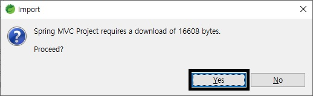</p>
  <p>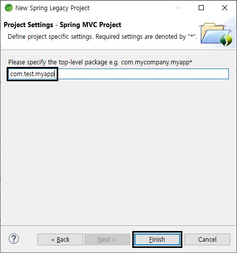</p>

<br>

에러 및 메이븐 버전 세팅
---
- **log4j.xml에러**
  
  src/main/resources/log4j.xml파일을 열고 아래와 같이 수정해 준다.
  <p>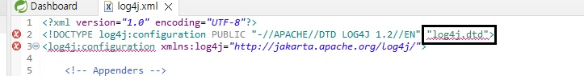</p>
  위의 log4j.dtd부분을 아래의 아래처럼 수정해 준다.
  
  ```xml
  <!DOCTYPE log4j:configuration PUBLIC "-//APACHE//DTD LOG4J 1.2//EN" "log4j.dtd">
  ```

- **web.xml에러**

  src/main/webapp/WEB-INF/web.xml 파일을 열고 아래와 같이 수정해 준다.
  <p>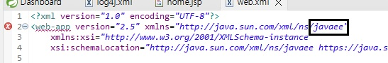</p>

  javaee의 j를 대문자로 바꿔준다 (**Javaee**)
  ```xml
  <web-app version="2.5" xmlns="http://java.sun.com/xml/ns/Javaee"
  ```

- **java 및 Maven 버전 변경**

  porm.xml파일을 열어준다
  <p>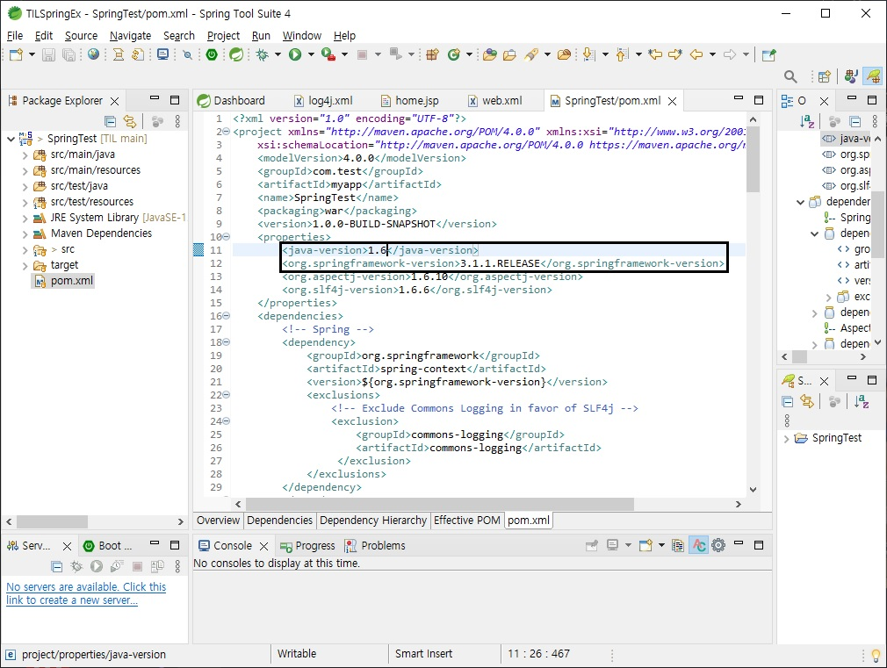</p>
  java-version태그의 값을 현재 사용중인 jdk의 버전으로 바꿔준다
  
  <br>
  
  org.springframework-version 태그
  1. [메이븐 저장소](https://mvnrepository.com/) 사이트에 접속한다.
  2. Spring을 검색한다.<p>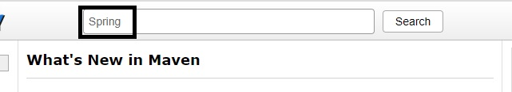</p>
  3. Spring Context클릭 <p>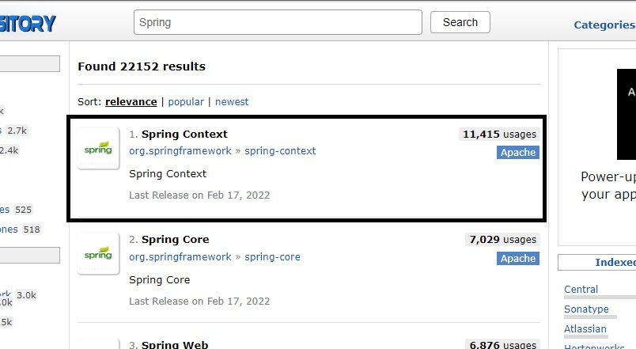</p>
  4. 사용할 버전을 확인한다. <p>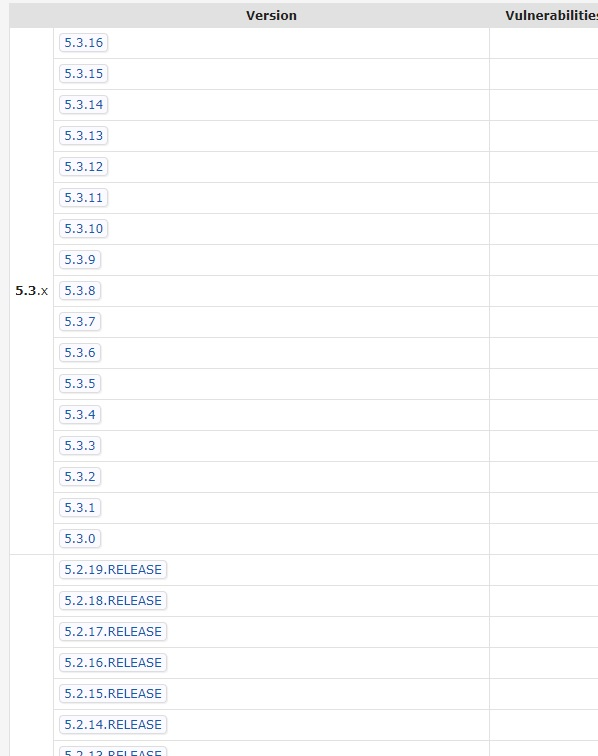</p>
  5. 사용할 버전을 org.springframework-version태그에 입력한다.
  >내가 적용한 java 및 Maven version<p>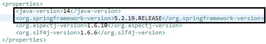</p>

<br>

Tomcat 서버 생성
---
- No servers are available. Click this link to create a new server... 클릭<p>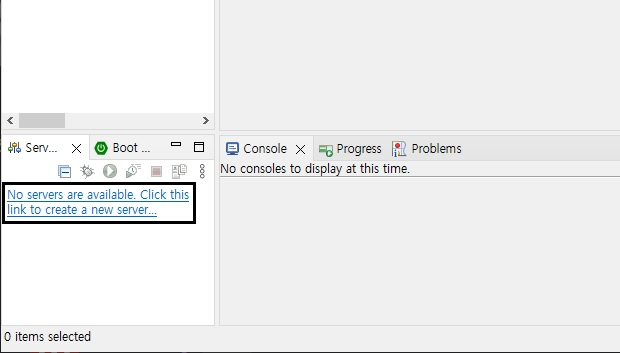</p>
  <p>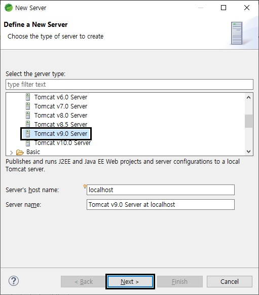</p>
  <br>

  Tomcat 서버 경로 설정 및 jdk선택 후 next<p>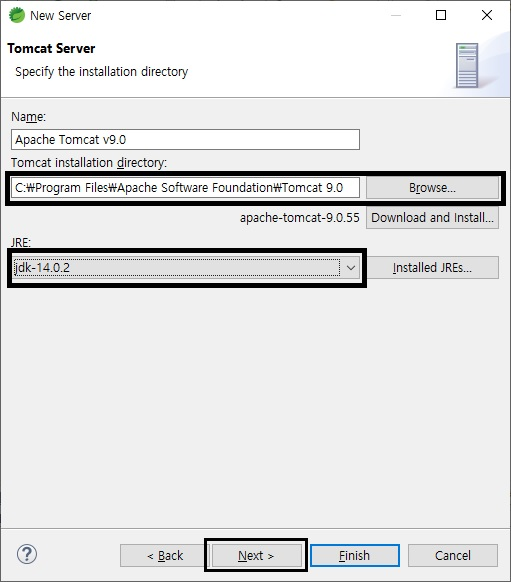</p>
  <br>

  실행할 프로젝트를 서버에 추가<p>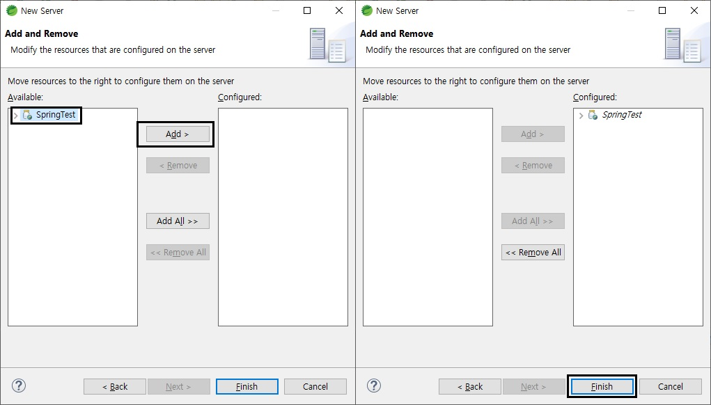</p>

<br>

프로젝트 실행
---
<p>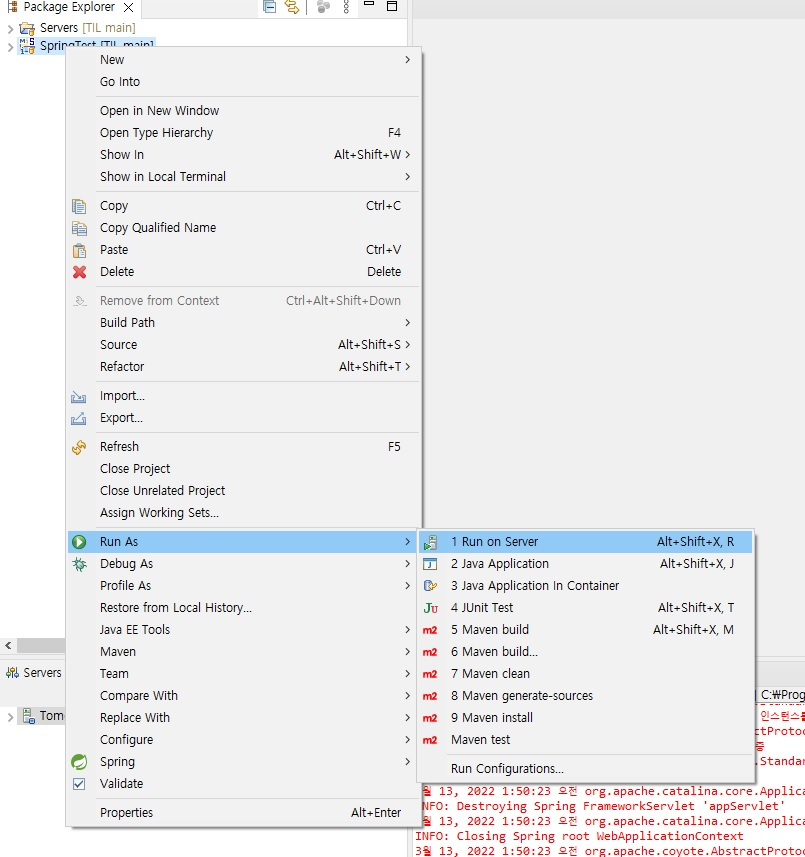</p>
<p>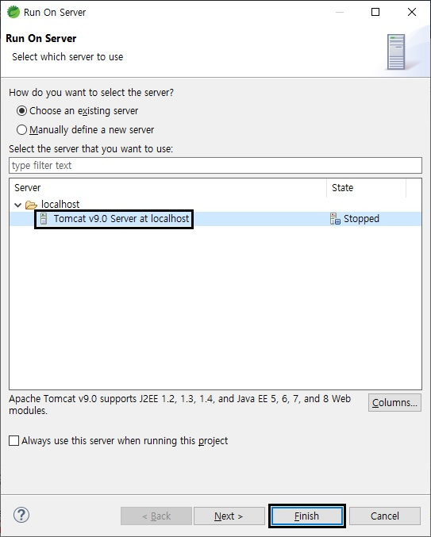</p>
<p>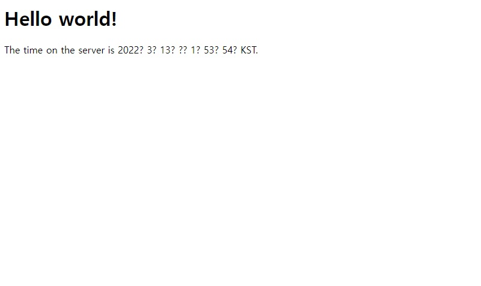</p>

브라우저에 '**http://localhost:(설정한 포트 번호)/myapp/**' 입력시 위 화면이 잘 뜨면 프로젝트 생성 및 실행 성공