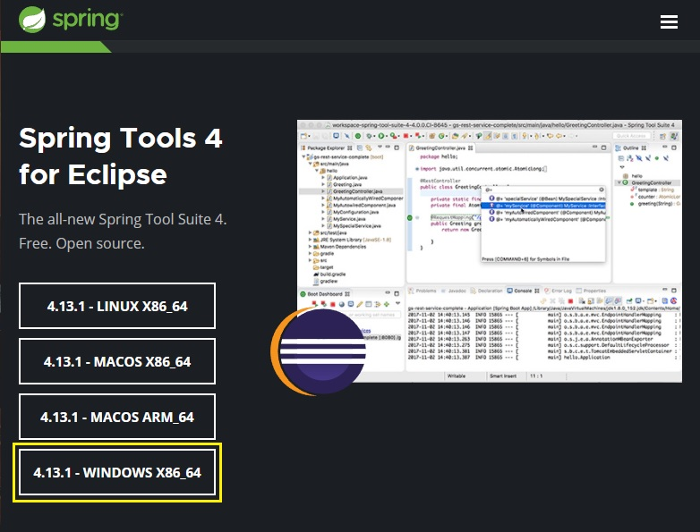
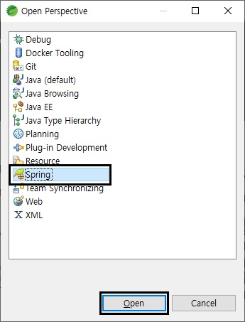
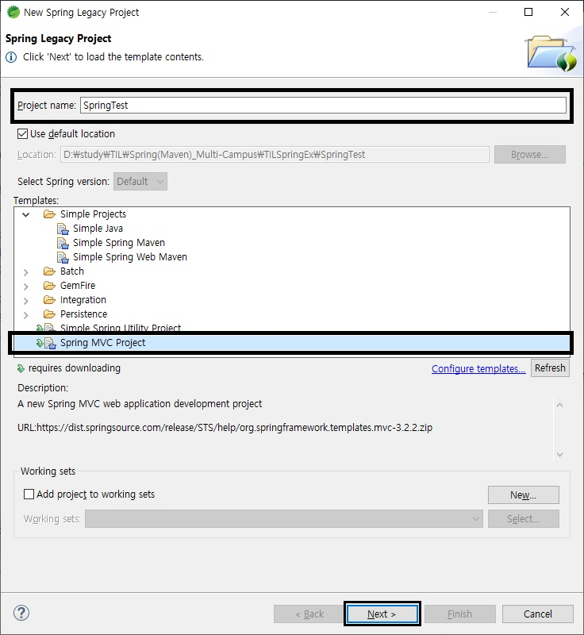
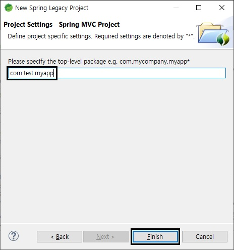

Spring 설치 및 세팅
===
STS(Spring Tool Suite) 설치
---
URL - [spring.io/tools](https://spring.io/tools)
- 위의 사이트에 접속해서 STS_jar파일 설치

<p align="center">

<p>

- 설치한 jar파일 오른쪽 클릭해서 압축풀기<br>


- 내부의 contents.zip 압축풀기<br>


- 압축 푼 폴더 내부의 **SpringToolSuite4.ini** JDK 및 경로 변경<br>

<br>
설정 후 STS실행

- 워크스페이스 경로 설정<br>
<br>
설정 후 Launch

<br>

개발환경 세팅
---
- Marketplace에서 Spring Tools 및 Web Developer Tools 설치
  - **Spring Tools 설치**<br>
    상단 탭 [Help]클릭 -> Eclipse Marketplace 클릭 -> spring 검색 -> spring install<br>
    
    
     클릭 후 ㄱㄷ<br>
    
    <br>
    100%될 때까지 ㄱㄷ <br>
    100%되면 알림창이 뜨고 Restart Now클릭<br>
    

  - **Web Developer Tools 설치**<br>
    Marketplace -> web developer 검색<br>
    
    클릭 후 ㄱㄷ
    
    <br>
    100%될 때까지 기다린 후 알림창 Rstart Now뜨면 클릭

<br>

프로젝트 생성
---
- **Perspective 변경**
  <p></p>
  <p></p>

- **Spring Legacy 프로젝트 생성**
  <p></p>
  플젝 이름 설정
  <p></p>
  <p></p>
  <p></p>

<br>

에러 및 메이븐 버전 세팅
---
- **log4j.xml에러**
  
  src/main/resources/log4j.xml파일을 열고 아래와 같이 수정해 준다.
  <p></p>
  위의 log4j.dtd부분을 아래의 아래처럼 수정해 준다.
  
  ```xml
  <!DOCTYPE log4j:configuration PUBLIC "-//APACHE//DTD LOG4J 1.2//EN" "log4j.dtd">

- **web.xml에러**
  sdfadfsa
