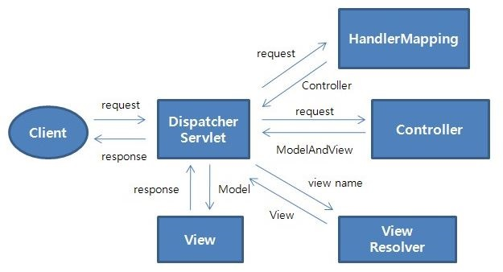

MVC
===
MVC2 패턴 : 스프링이 제공하는 웹 어플리케이션 구축 전용 MVC 프레임워크
- M(Model)
  - 비즈니스 규칙을 표현
  - 어플리케이션의 정보나 데이터, DB등을 말함
- V(View)
  - 페이지(프레젠테이션)을 표현
  - 사용자에게 보여지는 화면, UI를 말함
  - 모델로부터 정보를 얻고 표시함
- C(Controller)
  - 위 두가지를 분리하기 위하여 양측 사이에 배치된 인터페이스
  - 데이터와 비즈니스 로직 사이에 상호 동작을 관리
  - 모델과 뷰를 통제
  - MVC패턴에서 View와 Model이 직접적인 상호 소통을 하지 않도록 관리한다.

 

Spring MVC2 패턴
---
|Component|설명|
|:-|:-|
|DispathcerServlet|클라이언트의 요청을 받는다. Front Controller, 웹요청과 응답의 Life Cycle을 주관한다.|
|HandlerMapping|DispathcerServlet에게 URL이나 parameter정보 등을 참고하여 어떤 컨트롤러가 처리할지 결정한다.|
|Controller|비지니스 로직을 수행하고 결과 데이터를 ModelAndView에 반영한다.|
|ModelAndView|Controller가 수행한 결과를 반영하는 Model 데이터 객체와 이동할 페이지 정보(또는 View객체)로 이루어져 있다.|
|ViewResolver|어떤 View를 선택할지 결정한다.|
|View|결과 데이터인 Model객체를 display한다.(브라우저 페이지)|

- Spring MVC 흐름도

  1. Client의 요청이 들어오면 DispatchServlet이 가장 먼저 요청을 받는다.
  2. HandlerMapping이 요청에 해당하는 Controller를 return한다.
  3. Controller는 비지니스 로직을 수행(호출)하고 결과 데이터를 ModelAndView에 반영하여 return한다.
  4. ViewResolver는 view name을 받아 해당하는 View 객체를 return한다.
  5. View는 Model 객체를 받아 rendering한다.